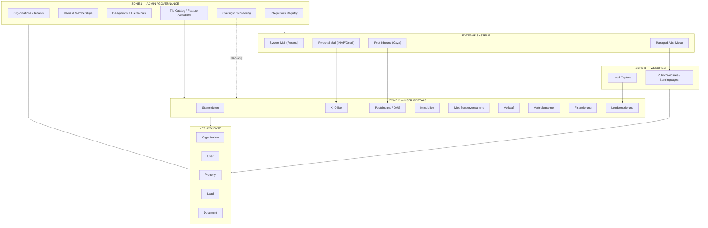

# A1 — SYSTEM OVERVIEW

**Version:** A1_SystemOverview_v1.0  
**Status:** FROZEN  
**Changelog:** Resend arrow corrected (Z1_INT --> EXT); Oversight read-only link added (Z1_OVS -.-> Z2).

---

## Beschreibung

Dieses Diagramm zeigt die Gesamtarchitektur von „System of a Town" mit dem 3-Zonen-Modell:
- **Zone 1:** Admin / Governance / Source of Truth
- **Zone 2:** User Portals (9 Module, Kachel-basiert)
- **Zone 3:** Websites (Public / Lead-first)

Kernobjekte (Organization, User, Property, Lead, Document) sind zonenübergreifend gültig.

---

## Mermaid Flowchart

---

## Architektur-Regeln

1. **Zone 1** nutzt KEINE Zone-2-Module (strikte Trennung)
2. **Zone 2** Module arbeiten auf Kernobjekten, sind funktional isoliert
3. **Zone 3** ist read-/lead-first, Leads fließen nach Zone 2
4. **Integrationen** werden durch Zone 1 Registry gesteuert (Z1 → EXT)
5. **Oversight** hat nur Lesezugriff auf Zone 2 Daten
