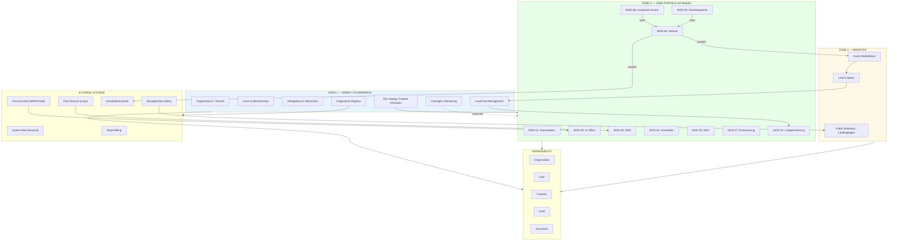

# A1 — SYSTEM OVERVIEW

**Version:** A1_SystemOverview_v2.0  
**Status:** FROZEN  
**Changelog:** v2.0 — 10-Modul-Architektur; Kaufy (mit y) korrigiert; MOD-08 Investment-Suche neu; MOD-09/10 renummeriert.

---

## Beschreibung

Dieses Diagramm zeigt die Gesamtarchitektur von „System of a Town" mit dem 3-Zonen-Modell:
- **Zone 1:** Admin / Governance / Source of Truth
- **Zone 2:** User Portals (10 Module, Kachel-basiert)
- **Zone 3:** Websites (Public / Lead-first)

Kernobjekte (Organization, User, Property, Lead, Document) sind zonenübergreifend gültig.

---

## Mermaid Flowchart

---

## Modulübersicht (10 Module)

### Sichtbarkeitsmatrix

| Registrierung | Sichtbare Module |
|---------------|------------------|
| **SoT** (System of a Town) | MOD-01 bis MOD-08 |
| **Kaufy** (Marktplatz) | MOD-01 bis MOD-10 |

### Modulkatalog

| MOD | Name | Typ | Route-Prefix |
|-----|------|-----|--------------|
| 01 | Stammdaten | Core | `/portal/stammdaten` |
| 02 | KI Office | Core | `/portal/office` |
| 03 | DMS | Core | `/portal/dms` |
| 04 | Immobilien | Core | `/portal/immobilien` |
| 05 | MSV | Freemium | `/portal/msv` |
| 06 | Verkauf | Standard | `/portal/verkauf` |
| 07 | Finanzierung | Standard | `/portal/finanzierung` |
| 08 | Investment-Suche / Ankauf | Standard | `/portal/investments` |
| 09 | Vertriebspartner | Addon | `/portal/vertriebspartner` |
| 10 | Leadgenerierung | Addon | `/portal/leads` |

---

## Architektur-Regeln

1. **Zone 1** nutzt KEINE Zone-2-Module (strikte Trennung)
2. **Zone 2** Module arbeiten auf Kernobjekten, sind funktional isoliert
3. **Zone 3** ist read-/lead-first, Leads fließen via Zone 1 Pool nach Zone 2
4. **Integrationen** werden durch Zone 1 Registry gesteuert (Z1 → EXT)
5. **Oversight** hat nur Lesezugriff auf Zone 2 Daten
6. **Kaufy** ist KEIN Modulname — es ist eine Marke/Source/Channel

---

## Markenlogik (FROZEN)

| Marke | Zone | Verwendung |
|-------|------|------------|
| **System of a Town (SoT)** | Zone 1 + 2 | Verwaltungssoftware |
| **Kaufy** (mit y) | Zone 3 + Channel | Marktplatz-Marke, Source in MOD-06/08 |
| **Miety** | Andockpunkt | Mieter-App (Phase 2) |

---

*Dieses Dokument ist die verbindliche Systemübersicht für die 10-Modul-Architektur.*
