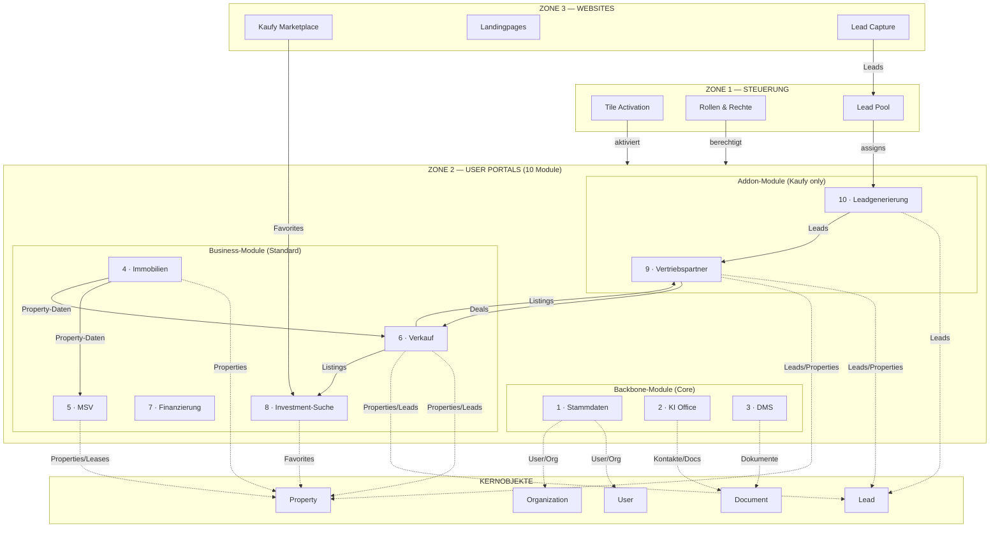

# A3 — ZONE 2: USER PORTALS & MODULE

**Version:** A3_Zone2_ModuleStructure_v2.0  
**Status:** FROZEN  
**Bezug:** A1_SystemOverview_v2.0 (FROZEN), A2_Zone1_Admin_Governance_v2.0 (FROZEN)  
**Changelog:** v2.0 — 10 Module statt 9; MOD-08 Investment-Suche neu; MOD-09/10 renummeriert; Kaufy-Korrektur.

---

## Beschreibung

Zone 2 ist die **operative Ebene** von „System of a Town". Sie enthält alle geschäftlichen Workflows und User-Interaktionen. Die 10 Module sind kachelbasiert, pro Tenant aktivierbar und funktional voneinander isoliert.

**Grundprinzipien:**
- Module arbeiten auf Kernobjekten (Organization, User, Property, Lead, Document)
- Rollen und Berechtigungen kommen aus Zone 1
- Keine eigene Governance, keine ID-Generierung, keine Integrations-Registry
- Cross-Modul-Kommunikation nur über definierte Interfaces

---

## A) Modul-Übersicht (10 Module)

### Sichtbarkeitsmatrix (FROZEN)

| Registrierung | Sichtbare Module | Zielgruppe |
|---------------|------------------|------------|
| **SoT** (System of a Town) | MOD-01 bis MOD-08 | Vermieter, Portfoliohalter |
| **Kaufy** (Marktplatz) | MOD-01 bis MOD-10 | Kapitalanlageberater, Vertriebe, Aufteiler |

### Modulkatalog

| Nr | Modul | Zweck | Typ | Sichtbarkeit | Route-Prefix |
|----|-------|-------|-----|--------------|--------------|
| 01 | **Stammdaten** | Profil, Billing, Sicherheit | Core | Alle | `/portal/stammdaten` |
| 02 | **KI Office** | AI-Briefgenerator, persönliche Mail | Core | Alle | `/portal/office` |
| 03 | **DMS** | Dokumenten-Inbound, Archiv | Core | Alle | `/portal/dms` |
| 04 | **Immobilien** | Property-Stammdaten (SoT) | Core | Alle | `/portal/immobilien` |
| 05 | **MSV** | Mietverwaltung, Mieterportal | Freemium | Alle | `/portal/msv` |
| 06 | **Verkauf** | Listings, Publishing, Verkaufsprozess | Standard | Alle | `/portal/verkauf` |
| 07 | **Finanzierung** | Finance Packages, Handoff | Standard | Alle | `/portal/finanzierung` |
| 08 | **Investment-Suche** | Multi-Source-Suche, Favoriten, Simulation | Standard | Alle | `/portal/investments` |
| 09 | **Vertriebspartner** | Partner-Suite: Katalog, Beratung, Netzwerk | Addon | Kaufy | `/portal/vertriebspartner` |
| 10 | **Leadgenerierung** | Lead/Deal-Pipeline | Addon | Kaufy | `/portal/leads` |

---

## B) Modulstruktur (1 Hauptkachel + 4 Unterpunkte)

### Modul 1: Stammdaten (`/portal/stammdaten`)

**Zweck:** Benutzerprofil, Firmendaten, Payment-Setup, Sicherheitseinstellungen

| Kachel | Name | Beschreibung |
|--------|------|--------------|
| **Haupt** | Dashboard | Profilübersicht, Onboarding-Status |
| Sub 1 | Profil | Persönliche Kontaktdaten |
| Sub 2 | Organisation | Firmendaten, Team |
| Sub 3 | Abrechnung | Billing, Invoices, Plan |
| Sub 4 | Sicherheit | Passwort, Sessions, 2FA |

---

### Modul 2: KI Office (`/portal/office`)

**Zweck:** AI-gestützte Produktivität, Briefgenerator, persönliche Kommunikation

| Kachel | Name | Beschreibung |
|--------|------|--------------|
| **Haupt** | Dashboard | Übersicht, Armstrong KI-Stripe |
| Sub 1 | Chat | KI-Assistent |
| Sub 2 | Briefe | AI-gestützte Dokumentenerstellung |
| Sub 3 | Vorlagen | Templates |
| Sub 4 | Historie | Kommunikations-Log |

---

### Modul 3: DMS (`/portal/dms`)

**Zweck:** Zentraler Dokumenten-Inbound, Archivierung, Bibliothek

| Kachel | Name | Beschreibung |
|--------|------|--------------|
| **Haupt** | Dashboard | Übersicht, KPIs |
| Sub 1 | Dokumente | Storage Vault |
| Sub 2 | Eingang | Posteingang (Caya) |
| Sub 3 | Freigaben | Data Rooms |
| Sub 4 | Archiv | Archivierte Docs |

---

### Modul 4: Immobilien (`/portal/immobilien`)

**Zweck:** Property-Stammdaten als Single Source of Truth

| Kachel | Name | Beschreibung |
|--------|------|--------------|
| **Haupt** | Dashboard | Portfolio-Übersicht |
| Sub 1 | Objekte | Property-Liste |
| Sub 2 | Einheiten | Units pro Objekt |
| Sub 3 | Finanzierung | Darlehen, Zinsbindung |
| Sub 4 | Dokumente | Property-bezogene Dokumente |

---

### Modul 5: MSV (`/portal/msv`)

**Zweck:** Mietverhältnisse, Mieterportal, Zahlungen

| Kachel | Name | Beschreibung |
|--------|------|--------------|
| **Haupt** | Dashboard | Miet-Übersicht |
| Sub 1 | Mietverträge | Lease-Verwaltung |
| Sub 2 | Mieter | Mieter-Kontakte |
| Sub 3 | Zahlungen | Mieteingänge |
| Sub 4 | Kommunikation | Mieter-Korrespondenz |

---

### Modul 6: Verkauf (`/portal/verkauf`)

**Zweck:** Listings, Verkaufsmandate, Publishing, Verkaufsprozess

| Kachel | Name | Beschreibung |
|--------|------|--------------|
| **Haupt** | Dashboard | Sales-KPIs |
| Sub 1 | Objekte | Listing-Liste |
| Sub 2 | Aktivitäten | Timeline |
| Sub 3 | Anfragen | Inquiry-Management |
| Sub 4 | Vorgänge | Reservations + Transactions |

**Publishing Channels:** Kaufy, Scout24, Kleinanzeigen, Partner-Netzwerk

---

### Modul 7: Finanzierung (`/portal/finanzierung`)

**Zweck:** Finance Packages, Selbstauskunft, Bank-Handoff

| Kachel | Name | Beschreibung |
|--------|------|--------------|
| **Haupt** | Dashboard | Finanzierungs-Übersicht |
| Sub 1 | Pakete | Finance Packages |
| Sub 2 | Dokumente | Unterlagen-Sammlung |
| Sub 3 | Handoff | Export zu Future Room |
| Sub 4 | Status | Tracking |

---

### Modul 8: Investment-Suche / Ankauf (`/portal/investments`)

**Zweck:** Multi-Source Investment-Suche, Favoriten, Portfolio-Simulation

| Kachel | Name | Beschreibung |
|--------|------|--------------|
| **Haupt** | Dashboard | Investment-KPIs |
| Sub 1 | Suche | Multi-Source-Suche |
| Sub 2 | Favoriten | Watchlist (inkl. Kaufy-Sync) |
| Sub 3 | Mandat | Buy-Side Betreuung (Placeholder) |
| Sub 4 | Simulation | Portfolio-Impact |

**Sources:** SoT-Verkauf, Kaufy (Marke), Extern

**WICHTIG:** Kaufy ist hier ein Source/Channel, KEIN Modulname.

---

### Modul 9: Vertriebspartner (`/portal/vertriebspartner`) — ADDON

**Zweck:** Vollständiges Partner-Modul für Kapitalanlageberater

| Kachel | Route | UI-Label | Beschreibung |
|--------|-------|----------|--------------|
| **Haupt** | `/` | Dashboard | Partner-KPIs |
| Sub 1 | `/pipeline` | **Objektkatalog** | Partner-sichtbare Listings |
| Sub 2 | `/auswahl` | **Meine Auswahl** | Partner-Shortlist |
| Sub 3 | `/beratung` | Beratung | Investment Engine |
| Sub 4 | `/team` | **Netzwerk** | Team, Provisionen, Compliance |

**Route-Label-Aliase:**
- `/pipeline` → UI: "Objektkatalog"
- `/team` → UI: "Netzwerk"

**Scope:** Vollständiges Partner-Modul (NICHT auf "nur Objektkatalog" reduzieren)

---

### Modul 10: Leadgenerierung (`/portal/leads`) — ADDON

**Zweck:** Lead/Deal-Pipeline für Partner

| Kachel | Name | Beschreibung |
|--------|------|--------------|
| **Haupt** | Dashboard | Lead-KPIs |
| Sub 1 | Inbox | Zugewiesene Leads |
| Sub 2 | Pipeline | Deal-Kanban |
| Sub 3 | Quellen | Lead-Quellen |
| Sub 4 | Reports | Konversions-Reports |

**Vorstufe:** Zone 1 Lead Pool (Admin qualifiziert/verteilt)

**Lead-Split:** 1/3 Platform : 2/3 Partner (bei Pool-Leads)

---

## C) Mermaid-Diagramm: A3_Zone2_Modules (10 Module)

---

## D) Architektur-Regeln

1. **Isolation:** Module teilen keine UI-Komponenten oder Business-Logik
2. **Kernobjekte:** Alle Module arbeiten auf denselben Kernobjekten (keine Duplikate)
3. **Rollen:** Berechtigungsprüfung erfolgt bei jedem Zugriff (Zone 1 ist Source of Truth)
4. **Cross-Modul:** Kommunikation nur über definierte Interfaces (Property-ID, Lead-ID etc.)
5. **Aktivierung:** Module erscheinen nur, wenn per `tenant_tile_activation` freigeschaltet
6. **Sichtbarkeit:** MOD-09/10 nur für Kaufy-Registrierte sichtbar

---

## E) Markenlogik (FROZEN)

| Marke | Erlaubt als |
|-------|-------------|
| **Kaufy** (mit y) | Source/Channel-Name, Tab-Label, Website-Marke |
| **Kaufy** | ❌ NICHT als Modulname erlaubt |

**Beispiele:**
- ✅ "Auf Kaufy veröffentlichen" (Channel-Name in MOD-06)
- ✅ "Kaufy" Tab in MOD-08 Investment-Suche (Source-Filter)
- ❌ "MOD-08 Kaufy" (verboten)

---

*Dieses Dokument ist die verbindliche Zone-2-Modulstruktur für die 10-Modul-Architektur.*
