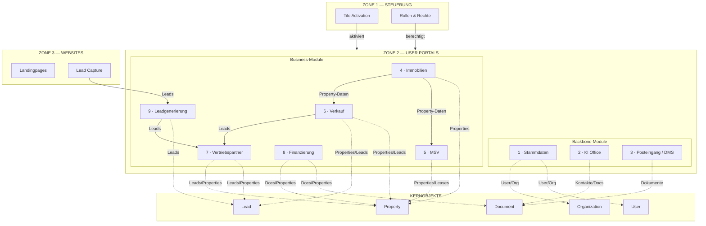

# A3 — ZONE 2: USER PORTALS & MODULE

**Version:** A3_Zone2_ModuleStructure_v1.0  
**Status:** DRAFT  
**Changelog:** Initial draft — 9 Module, 45 Sub-Routes, Mermaid-Diagramm.

---

## Beschreibung

Zone 2 ist die **operative Ebene** von „System of a Town". Sie enthält alle geschäftlichen Workflows und User-Interaktionen. Die 9 Module sind kachelbasiert, pro Tenant aktivierbar und funktional voneinander isoliert.

**Grundprinzipien:**
- Module arbeiten auf Kernobjekten (Organization, User, Property, Lead, Document)
- Rollen und Berechtigungen kommen aus Zone 1
- Keine eigene Governance, keine ID-Generierung, keine Integrations-Registry
- Cross-Modul-Kommunikation nur über definierte Interfaces

---

## A) Modul-Übersicht

| Nr | Modul | Zweck | Primäre Zielgruppe | Kernobjekte | Explizit NICHT |
|----|-------|-------|-------------------|-------------|----------------|
| 1 | **Stammdaten** | Profilverwaltung, Onboarding, Payment-Setup | Alle User | User, Organization | Keine Business-Logik |
| 2 | **KI Office** | Produktivität, AI-Briefgenerator, persönliche Mail | Interne Ops, Admins | Contact, Document | Kein DMS-Archiv |
| 3 | **Posteingang / DMS** | Dokumenten-Inbound (Caya, Upload, Email), Bibliothek | Alle User | Document, Inbound Item | Keine Briefgenerierung |
| 4 | **Immobilien** | Property-Stammdaten, Source of Truth | Eigentümer, Admins | Property, Unit | Keine Mietverwaltung |
| 5 | **MSV** | Miet-Sonderverwaltung, Mieterportal | Vermieter, Mieter | Unit, Lease, Contact | Kein Verkauf |
| 6 | **Verkauf** | Listings, Mandate, Verkaufsprozess | Verkäufer, Admins | Property, Lead | Keine Finanzierung |
| 7 | **Vertriebspartner** | Pipeline, Matching, Provisionen | Partner, Sub-Partner | Lead, Property, Contact | Keine Eigentümer-Aktionen |
| 8 | **Finanzierung** | Finance Packages, Selbstauskunft, Handoff | Käufer, Berater | Finance Package, Document | Keine Bank-Integration |
| 9 | **Leadgenerierung** | Kampagnen, Lead-Routing, Zone 3-Anbindung | Marketing, Admins | Lead, Campaign | Keine Qualifizierung |

---

## B) Modulstruktur (1 Hauptkachel + 4 Unterpunkte)

### Modul 1: Stammdaten

**Zweck:** Benutzerprofil, Firmendaten, Payment-Setup, Sicherheitseinstellungen

| Kachel | Name | Beschreibung | User-Aktionen |
|--------|------|--------------|---------------|
| **Haupt** | Dashboard | Profilübersicht, Onboarding-Status | Status prüfen, Profil vervollständigen |
| Sub 1 | Profil | Persönliche Kontaktdaten | Name, Adresse bearbeiten |
| Sub 2 | Firma | Firmendaten, Steuernummer | Firmenprofil pflegen |
| Sub 3 | Payment | Bankdaten, Zahlungsmethoden | Zahlungsdaten hinterlegen |
| Sub 4 | Sicherheit | Passwort, Sessions, 2FA | Passwort ändern, Sessions verwalten |

**Scope:**
- ✅ In-Scope: Profilverwaltung, Onboarding, Billing-Info
- ❌ Out-of-Scope: Business-Workflows, Immobilien-Daten

---

### Modul 2: KI Office

**Zweck:** AI-gestützte Produktivität, Briefgenerator, persönliche Kommunikation

| Kachel | Name | Beschreibung | User-Aktionen |
|--------|------|--------------|---------------|
| **Haupt** | Dashboard | Übersicht Tasks, letzte Aktivitäten | Schnellzugriff auf häufige Aktionen |
| Sub 1 | Briefgenerator | AI-gestützte Dokumentenerstellung | Brief erstellen, Vorlage wählen, versenden |
| Sub 2 | E-Mail | Persönliche IMAP/Gmail-Anbindung | E-Mails lesen, schreiben, archivieren |
| Sub 3 | Kontakte | Persönliche Kontaktverwaltung | Kontakt anlegen, suchen, verknüpfen |
| Sub 4 | Kalender | Termine und Erinnerungen | Termin erstellen, Erinnerung setzen |

**Scope:**
- ✅ In-Scope: AI-Briefe, persönliche Mail, Produktivität
- ❌ Out-of-Scope: DMS-Archiv, System-Mail (Resend)

---

### Modul 3: Posteingang / DMS

**Zweck:** Zentraler Dokumenten-Inbound, Archivierung, Bibliothek

| Kachel | Name | Beschreibung | User-Aktionen |
|--------|------|--------------|---------------|
| **Haupt** | Inbox | Unverarbeitete Dokumente | Dokument sichten, zuordnen |
| Sub 1 | Caya | Post-Digitalisierung | Caya-Dokumente prüfen, routen |
| Sub 2 | Upload | Manueller Dokumenten-Upload | Datei hochladen, kategorisieren |
| Sub 3 | E-Mail-Inbound | Resend-Attachment-Ingestion | Mail-Anhänge prüfen, zuordnen |
| Sub 4 | Bibliothek | Archivierte Dokumente | Suchen, filtern, herunterladen |

**Scope:**
- ✅ In-Scope: Inbound-Verarbeitung, Archiv, Suche
- ❌ Out-of-Scope: Briefgenerierung, Outbound-Versand

---

### Modul 4: Immobilien

**Zweck:** Property-Stammdaten als Single Source of Truth

| Kachel | Name | Beschreibung | User-Aktionen |
|--------|------|--------------|---------------|
| **Haupt** | Portfolio | Übersicht aller Immobilien | Liste ansehen, filtern, sortieren |
| Sub 1 | Objektdaten | Stammdaten, Grundbuch | Property bearbeiten, Details pflegen |
| Sub 2 | Einheiten | Wohnungen/Gewerbe je Objekt | Unit anlegen, bearbeiten |
| Sub 3 | Finanzierung | Darlehen, Zinsbindung | Finanzierungsdaten pflegen |
| Sub 4 | Dokumente | Property-bezogene Dokumente | Dokumente hochladen, verknüpfen |

**Scope:**
- ✅ In-Scope: Property CRUD, Units, Grundbuchdaten
- ❌ Out-of-Scope: Mietverwaltung, Verkaufsprozess

---

### Modul 5: Miet-Sonderverwaltung (MSV)

**Zweck:** Mietverhältnisse, Mieterportal, Nebenkosten

| Kachel | Name | Beschreibung | User-Aktionen |
|--------|------|--------------|---------------|
| **Haupt** | Dashboard | Übersicht aktive Mietverhältnisse | Status prüfen, Alerts sehen |
| Sub 1 | Mietverträge | Lease-Verwaltung | Vertrag anlegen, kündigen |
| Sub 2 | Mieter | Mieter-Kontakte, Einladungen | Mieter einladen, Kontakt verwalten |
| Sub 3 | Nebenkosten | Abrechnungen, Vorauszahlungen | Abrechnung erstellen, prüfen |
| Sub 4 | Zählerstände | Verbrauchsdaten | Zählerstand erfassen, Historie |

**Scope:**
- ✅ In-Scope: Leases, Mieterportal, Nebenkosten
- ❌ Out-of-Scope: Verkauf, Property-Stammdaten

---

### Modul 6: Verkauf

**Zweck:** Listings, Verkaufsmandate, Verkaufsprozess

| Kachel | Name | Beschreibung | User-Aktionen |
|--------|------|--------------|---------------|
| **Haupt** | Dashboard | Aktive Verkaufsobjekte | Übersicht, Status prüfen |
| Sub 1 | Listings | Öffentliche Angebote | Listing erstellen, bearbeiten |
| Sub 2 | Mandate | Verkaufsaufträge | Mandat anlegen, Status tracken |
| Sub 3 | Exposés | Verkaufsunterlagen | Exposé generieren, versenden |
| Sub 4 | Reservierungen | Kaufinteresse, Reservierungen | Reservierung anlegen, bestätigen |

**Scope:**
- ✅ In-Scope: Listings, Mandate, Verkaufsprozess
- ❌ Out-of-Scope: Finanzierung, Mietverwaltung

---

### Modul 7: Vertriebspartner

**Zweck:** Partner-Pipeline, Matching, Provisionen

| Kachel | Name | Beschreibung | User-Aktionen |
|--------|------|--------------|---------------|
| **Haupt** | Dashboard | Pipeline-Übersicht | Status prüfen, Deals sehen |
| Sub 1 | Pipeline | Lead-Qualifizierung, Stages | Lead bewegen, Status ändern |
| Sub 2 | Matching | Investoren-Property-Matching | Match vorschlagen, versenden |
| Sub 3 | Provisionen | Provisionsansprüche | Provision tracken, abrufen |
| Sub 4 | Kunden | Zugewiesene Kontakte | Kontakt verwalten, Historie |

**Scope:**
- ✅ In-Scope: Pipeline, Matching, Provisionen
- ❌ Out-of-Scope: Property-Bearbeitung, Eigentümer-Aktionen

---

### Modul 8: Finanzierung

**Zweck:** Finance Packages, Selbstauskunft, Bank-Handoff

| Kachel | Name | Beschreibung | User-Aktionen |
|--------|------|--------------|---------------|
| **Haupt** | Dashboard | Übersicht Finance Packages | Status prüfen, Fortschritt sehen |
| Sub 1 | Selbstauskunft | Strukturierte Datenerfassung | Formular ausfüllen, speichern |
| Sub 2 | Datenraum | Dokumente für Bank | Dokumente hochladen, organisieren |
| Sub 3 | Handoff | Status externe Übergabe | Status prüfen (read-only) |
| Sub 4 | Dokumente | Package-Dokumente | Dokumente verwalten |

**Scope:**
- ✅ In-Scope: Finance Packages, Selbstauskunft, Handoff-Status
- ❌ Out-of-Scope: Bank-Integration, Kreditentscheidung

---

### Modul 9: Leadgenerierung

**Zweck:** Kampagnen, Lead-Routing, Zone 3-Anbindung

| Kachel | Name | Beschreibung | User-Aktionen |
|--------|------|--------------|---------------|
| **Haupt** | Dashboard | Lead-Übersicht, Kampagnen-Status | Metriken prüfen |
| Sub 1 | Kampagnen | Marketing-Kampagnen | Kampagne erstellen, pausieren |
| Sub 2 | Leads | Eingehende Leads | Lead sichten, zuordnen |
| Sub 3 | Routing | Automatische Zuweisung | Regeln definieren, testen |
| Sub 4 | Landingpages | Zone 3 Anbindung | Landingpage konfigurieren |

**Scope:**
- ✅ In-Scope: Kampagnen, Lead-Erfassung, Routing
- ❌ Out-of-Scope: Lead-Qualifizierung (→ Modul 7)

---

## C) Mermaid-Diagramm: A3_Zone2_Modules

---

## Architektur-Regeln

1. **Isolation:** Module teilen keine UI-Komponenten oder Business-Logik
2. **Kernobjekte:** Alle Module arbeiten auf denselben Kernobjekten (keine Duplikate)
3. **Rollen:** Berechtigungsprüfung erfolgt bei jedem Zugriff (Zone 1 ist Source of Truth)
4. **Cross-Modul:** Kommunikation nur über definierte Interfaces (Property-ID, Lead-ID etc.)
5. **Aktivierung:** Module erscheinen nur, wenn per `tenant_tile_activation` freigeschaltet
