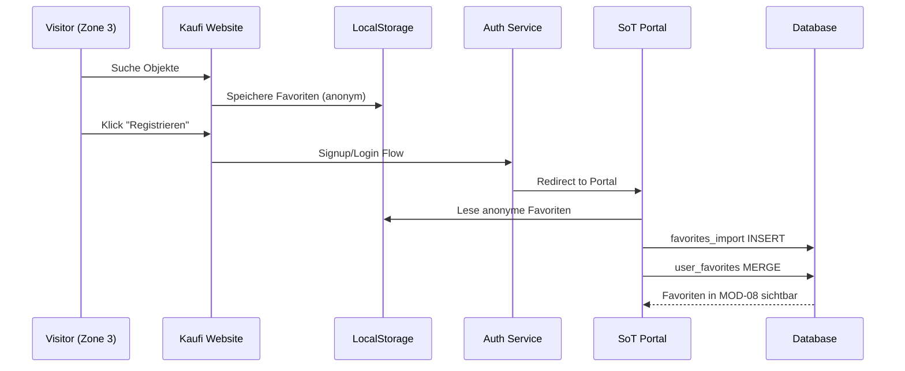
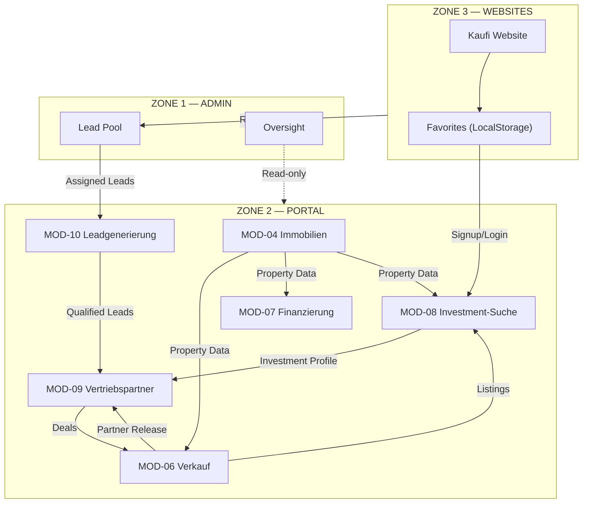

# ARCHITEKTUR-UPDATE: ZONE 2 — 10 MODULE

**Version:** v3.0.0  
**Status:** FROZEN  
**Datum:** 2026-01-25  
**Breaking Change:** Ja (Modul-Nummerierung)

---

## 1) EXECUTIVE SUMMARY

### Änderung
Zone 2 wird von 9 auf **10 Module** erweitert. Das neue **MOD-08 "Investment-Suche / Ankauf"** wird eingefügt, bisherige Module 8/9 rücken auf 9/10.

### Begründung
1. **Fehlende Nutzerlandung:** Webseiten-Registrierer (Käufer/Investoren) hatten keinen klaren Landepunkt für ihre favorisierten Objekte.
2. **Marken-Trennung:** "Kaufi" ist eine externe Marktplatz-Marke, nicht ein SoT-Modul. SoT benötigt ein neutrales Investment-Suche-Modul.
3. **Vollständiger Lifecycle:** Verkauf (MOD-06) + Ankauf (MOD-08) = kompletter Transaktions-Lifecycle.

---

## 2) MARKEN- UND PRODUKTLOGIK (FROZEN)

### 2.1 System of a Town (SoT)

**Positionierung:** Die ideale Lösung zur Verwaltung deines Immobilienportfolios.

| Aspekt | Definition |
|--------|------------|
| **Zielgruppe** | Eigentümer, Vermieter, Bestandshalter |
| **Kernnutzen** | KI-gestützte Digitalisierung von Verwaltungsprozessen |
| **Tonalität** | Neutral, professionell, operativ |
| **Module** | MOD-01 bis MOD-08 (Standard), MOD-09/10 (Partner-Addon) |

**Kernaussage:** SoT ist Verwaltungssoftware, kein Verkaufskanal.

### 2.2 Kaufi

**Positionierung:** Marktplatz für Kapitalanlageimmobilien + Karrieremöglichkeit für Berater.

| Aspekt | Definition |
|--------|------------|
| **Zielgruppe** | Kapitalanleger, Finanzberater, Aufteiler/Bauträger |
| **Kernnutzen** | Objektsuche, Investment-Vergleich, Partner-Netzwerk |
| **Tonalität** | Verkaufsorientiert, Investment-fokussiert |
| **Zonen-Zugehörigkeit** | Zone 3 (Website), Source in MOD-08 (Portal) |

**Kritische Abgrenzung:**
- "Kaufi" ist **KEIN** Modulname
- "Kaufi" ist eine **Source/Channel** innerhalb von MOD-08
- UI-Label "Kaufi" darf als Tab/Filter erscheinen, nicht als Modul-Titel

---

## 3) KANONISCHE MODULZUORDNUNG (FROZEN)

### 3.1 Zone 2 — 10 Module

| MOD | Name | Typ | Sichtbarkeit | Route-Prefix |
|-----|------|-----|--------------|--------------|
| **01** | Stammdaten | Core | Alle | `/portal/stammdaten` |
| **02** | KI Office | Core | Alle | `/portal/office` |
| **03** | DMS | Core | Alle | `/portal/dms` |
| **04** | Immobilien | Core | Alle | `/portal/immobilien` |
| **05** | MSV (Miet-Sonderverwaltung) | Freemium | Alle | `/portal/msv` |
| **06** | Verkauf | Standard | Alle | `/portal/verkauf` |
| **07** | Finanzierung | Standard | Alle | `/portal/finanzierung` |
| **08** | Investment-Suche / Ankauf | Standard | Alle | `/portal/investments` |
| **09** | Vertriebspartner | Addon | Partner | `/portal/vertriebspartner` |
| **10** | Leadgenerierung | Addon | Partner | `/portal/leads` |

### 3.2 Sichtbarkeitsregeln (FROZEN)

| Nutzertyp | Sichtbare Module |
|-----------|------------------|
| Standard-SoT-User (Client) | MOD-01 bis MOD-08 |
| Vertriebspartner (sales_partner) | MOD-01 bis MOD-10 |
| Platform Admin | Alle (via Oversight) |

### 3.3 Nummerierungs-Migration

| Alt | Neu | Modulname |
|-----|-----|-----------|
| — | MOD-08 | Investment-Suche / Ankauf (NEU) |
| MOD-08 | MOD-09 | Vertriebspartner |
| MOD-09 | MOD-10 | Leadgenerierung |

---

## 4) MOD-08 INVESTMENT-SUCHE / ANKAUF — ÜBERSICHT

### 4.1 Ziel

Neutrales SoT-Modul für die Suche, Bewertung und den Ankauf von Investment-Immobilien. Aggregiert mehrere Quellen (inkl. Kaufi-Website-Favoriten) in einer einheitlichen Oberfläche.

### 4.2 Quellen (Sources)

| Source | Beschreibung | Datenfluss |
|--------|--------------|------------|
| **SoT-Verkauf** | Listings aus MOD-06 (intern) | listings WHERE partner_visible = true |
| **Kaufi** | Marktplatz-Favoriten (Zone 3) | favorites_import bei Login |
| **Extern/Imports** | Kleinanzeigen-Links, Scraper (Phase 2) | external_imports |

### 4.3 Kernfunktionen

1. **Suche:** Multi-Source Investment-Suche mit Filtern
2. **Favoriten:** Zentrale Watchlist (inkl. Kaufi-Sync)
3. **Mandat:** Buy-Side Kaufbetreuung (Placeholder)
4. **Scraper:** Web-Scraping für externe Quellen (Placeholder)
5. **Simulation:** Portfolio-Impact-Analyse

---

## 5) KAUFI-WEBSITE → SOT FAVORITEN-SYNC

### 5.1 Konzeptflow



### 5.2 Datencontract: Favorites Import

```typescript
interface FavoritesImportPayload {
  source: 'kaufi_website' | 'external';
  items: {
    source_object_id: string;
    source_type: 'listing' | 'external_url';
    title?: string;
    address?: string;
    price?: number;
    url?: string;
    added_at: string; // ISO timestamp
  }[];
  imported_at: string;
}
```

### 5.3 API-Endpoints (Geplant)

| API-ID | Endpoint | Method | Zone | Beschreibung |
|--------|----------|--------|------|--------------|
| API-400 | `/favorites/export` | GET | Zone 3 | Anonyme Favoriten aus LocalStorage/Cookie |
| API-401 | `/investments/favorites/import` | POST | Zone 2 | Import der Zone-3-Favoriten |
| API-402 | `/investments/favorites/sync` | POST | Zone 2 | Merge bei bestehendem Account |

---

## 6) PUBLISHING-CHANNELS (AKTUALISIERT)

### 6.1 Übersicht

| Kanal | Kosten | Agreements | Ziel |
|-------|--------|------------|------|
| **Kaufi (Zone 3)** | Kostenlos | SALES_MANDATE | Öffentlicher Marktplatz |
| **Scout24** | Bezahlt (Credits) | SCOUT24_CREDITS | Externe Reichweite |
| **eBay Kleinanzeigen** | Link-Eintrag | — | Externe Sichtbarkeit |
| **Partner-Netzwerk** | Kostenlos | PARTNER_RELEASE + SYSTEM_FEE | Finanzvertrieb |

### 6.2 Partner-Netzwerk Monetarisierung

| Element | Wert | Trigger |
|---------|------|---------|
| **Partner-Provision** | 5–15% (Owner wählt) | Bei Freigabe für Finanzvertrieb |
| **Systemgebühr** | 2.000€ erfolgsabhängig | Bei Closing via Partner |
| **Lead-Split** | 1/3 Platform : 2/3 Partner | Für Zone-1-Pool-Leads |

---

## 7) CROSS-MODULE DATA FLOWS (AKTUALISIERT)



---

## 8) FROZEN ENTSCHEIDUNGEN (NEU)

| ID | Entscheidung | Status |
|----|--------------|--------|
| F-30 | Zone 2 hat 10 Module, nicht 9 | FROZEN |
| F-31 | MOD-08 = Investment-Suche/Ankauf (neutral) | FROZEN |
| F-32 | Kaufi = Source/Channel, nicht Modul | FROZEN |
| F-33 | Standard-User: MOD-01..08; Partner: +09/10 | FROZEN |
| F-34 | Kaufi-Favoriten-Sync bei Login mandatory | FROZEN |
| F-35 | Partner-Provision: 5–15% Range | FROZEN |
| F-36 | Systemgebühr: 2.000€ erfolgsabhängig | FROZEN |

---

## 9) DOKUMENT-UPDATES ERFORDERLICH

| Dokument | Änderung |
|----------|----------|
| `MODULE_BLUEPRINT.md` | 10 Module, neue Sichtbarkeitsregeln |
| `docs/modules/MOD-08_VERTRIEBSPARTNER.md` | → Umbenennen zu `MOD-09_VERTRIEBSPARTNER.md` |
| `docs/modules/MOD-06_VERKAUF.md` | Kaufi als Channel-Name, MOD-09 Referenzen |
| `docs/presentation/SYSTEM_DIAGRAM.md` | 10-Modul-Grid, Kaufi-Sync-Flow |
| `A1_SystemOverview.md` | Zone 2 Grid aktualisieren |
| `tile_catalog` (DB) | Neue Tile-Codes, Reihenfolge |

---

## 10) NÄCHSTE SCHRITTE

1. ✅ D1: Architektur-Update (dieses Dokument)
2. ⏳ D2: MOD-08 Investment-Suche Full Spec
3. ⏳ D3: MOD-06 Verkauf Korrektur (Kaufi als Channel)
4. ⏳ D4: MOD-09 Vertriebspartner (umbenannt)
5. ⏳ D5: MOD-10 Leadgenerierung (minimal)
6. ⏳ D6: API-Katalog Update
7. ⏳ D7: Mermaid Diagramm-Paket
8. ⏳ D8: Open Questions Update

---

*Dieses Dokument ist die verbindliche Architektur-Referenz für die 10-Modul-Struktur.*
