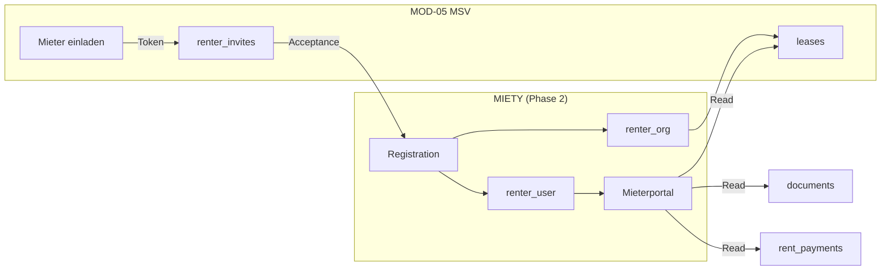
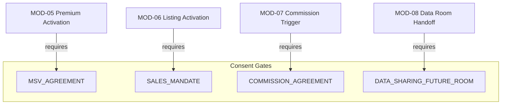

# IST-ZUSTAND PRÜFBERICHT (Zone 1 + Zone 2, MOD-01 bis MOD-05)

**PLAN_MARKER_A**  
**Datum:** 2026-01-25  
**Scope:** Vollumfängliche Prüfung Zone 1 + Zone 2 für MOD-01..MOD-05  
**Zweck:** Audit vor MOD-06/07 Planungsinkrement

---

## A1) ROUTE-INVENTORY

### Zone 1: Admin Portal (`/admin/*`)

| Route | Screen | Status |
|-------|--------|--------|
| `/admin` | Dashboard | IMPLEMENTED |
| `/admin/organizations` | Organizations List | IMPLEMENTED |
| `/admin/organizations/:id` | Organization Detail | IMPLEMENTED |
| `/admin/users` | Users List | IMPLEMENTED |
| `/admin/delegations` | Delegations | IMPLEMENTED |
| `/admin/contacts` | Master Contacts | IMPLEMENTED |
| `/admin/tiles` | Tile Catalog | IMPLEMENTED |
| `/admin/integrations` | Integrations Registry | IMPLEMENTED |
| `/admin/communication` | Communication Hub | IMPLEMENTED |
| `/admin/oversight` | Oversight Views | IMPLEMENTED |
| `/admin/audit` | Audit Log | IMPLEMENTED |
| `/admin/billing` | Billing Management | IMPLEMENTED |
| `/admin/agreements` | Agreements | IMPLEMENTED |
| `/admin/inbox` | Admin Inbox | IMPLEMENTED |
| `/admin/support` | Support | IMPLEMENTED |

**Zone 1 Status:** ✅ ROUTES COMPLETE (15 Routen)

---

### Zone 2: User Portal — MOD-01 bis MOD-05

#### MOD-01: Stammdaten

| Route | Screen | Spec Status |
|-------|--------|-------------|
| `/portal/stammdaten` | Dashboard | SPEC READY |
| `/portal/stammdaten/profil` | Profil | SPEC READY |
| `/portal/stammdaten/firma` | Firma | SPEC READY |
| `/portal/stammdaten/abrechnung` | Abrechnung/Billing | SPEC READY |
| `/portal/stammdaten/sicherheit` | Sicherheit | SPEC READY |

**MOD-01 Status:** ✅ SPEC READY (5 Routen)

---

#### MOD-02: KI Office

| Route | Screen | Spec Status |
|-------|--------|-------------|
| `/portal/ki-office` | Dashboard | SPEC READY |
| `/portal/ki-office/email` | Personal Email | SPEC READY |
| `/portal/ki-office/brief` | Briefgenerator | SPEC READY |
| `/portal/ki-office/kontakte` | Kontakte | SPEC READY |
| `/portal/ki-office/kalender` | Kalender | SPEC READY |

**MOD-02 Status:** ✅ SPEC READY (5 Routen)

---

#### MOD-03: DMS

| Route | Screen | Spec Status | Hinweis |
|-------|--------|-------------|---------|
| `/portal/dms` | Dashboard | SPEC READY | Entry Point |
| `/portal/dms/eingang` | Posteingang | SPEC READY | Route in App.tsx ≠ Spec (`/dms/post`) |
| `/portal/dms/zuordnung` | Sortieren | SPEC READY | Route in App.tsx ≠ Spec (`/dms/sort`) |
| `/portal/dms/archiv` | Archiv/Storage | SPEC READY | Route in App.tsx ≠ Spec (`/dms/storage`) |
| `/portal/dms/einstellungen` | Einstellungen | SPEC READY | Route in App.tsx ≠ Spec (`/dms/dmssettings`) |

**MOD-03 Status:** ⚠️ SPEC READY, aber Route-Naming-Drift zwischen App.tsx und Spec

**ACTION REQUIRED:** App.tsx Routes an Spec angleichen ODER Spec aktualisieren.

---

#### MOD-04: Immobilien

| Route | Screen | Spec Status |
|-------|--------|-------------|
| `/portal/immobilien` | Dashboard/Portfolio | SPEC READY |
| `/portal/immobilien/portfolio` | Portfolio List | SPEC READY |
| `/portal/immobilien/verwaltung` | Verwaltung | SPEC READY |
| `/portal/immobilien/verkauf` | Verkauf-Aktivierung | SPEC READY |
| `/portal/immobilien/sanierung` | Sanierung | SPEC READY |

**Zusätzliche Routen (Spec, nicht in App.tsx):**
- `/portal/immobilien/new` — Objekt anlegen
- `/portal/immobilien/:id` — Exposé
- `/portal/immobilien/kontexte` — Vermieter-Kontexte
- `/portal/immobilien/:id/sanierung` — Objektbezogene Sanierung
- `/portal/immobilien/bewertung` — Bewertung

**MOD-04 Status:** ⚠️ SPEC READY, aber dynamische Routen fehlen in App.tsx

---

#### MOD-05: MSV

| Route | Screen | Spec Status |
|-------|--------|-------------|
| `/portal/msv` | Dashboard | FROZEN |
| `/portal/msv/listen` | Arbeitsliste | FROZEN |
| `/portal/msv/mieteingang` | Mieteingang | FROZEN |
| `/portal/msv/vermietung` | Vermietung | FROZEN |
| `/portal/msv/einstellungen` | Einstellungen | FROZEN |

**MOD-05 Status:** ✅ FROZEN v2.0 (5 Routen)

---

### Route-Inventory Summary

| Modul | Routen | Spec Status | Implementation |
|-------|--------|-------------|----------------|
| Zone 1 Admin | 15 | N/A | IMPLEMENTED |
| MOD-01 Stammdaten | 5 | SPEC READY | PENDING |
| MOD-02 KI Office | 5 | SPEC READY | PENDING |
| MOD-03 DMS | 5 | SPEC READY | PENDING (Route-Drift) |
| MOD-04 Immobilien | 5 (+5 dynamisch) | SPEC READY | PENDING |
| MOD-05 MSV | 5 | FROZEN | PENDING |
| **TOTAL Zone 2** | **25 Base + ~10 dynamisch** | — | — |

---

## A2) DATA MODEL INVENTORY (MOD-01..MOD-05)

### Backbone/Core Tables (Cross-Module)

| Tabelle | SoT-Owner | Genutzt von |
|---------|-----------|-------------|
| `profiles` | Core | MOD-01 |
| `organizations` | Core | MOD-01, Alle |
| `memberships` | Core | MOD-01, Alle |
| `org_delegations` | Core | MOD-01 |
| `contacts` | Backbone | MOD-02, MOD-04, MOD-05, MOD-06, MOD-07, MOD-08 |
| `documents` | MOD-03 | MOD-02, MOD-04, MOD-05 |
| `document_links` | MOD-03 | MOD-04, MOD-05 |
| `audit_events` | Backbone | Alle |
| `user_consents` | Backbone | MOD-05, MOD-06, MOD-07 |
| `agreement_templates` | Backbone | MOD-01 |

### MOD-01 Tables

| Tabelle | Status | SoT |
|---------|--------|-----|
| `plans` | EXISTS | Billing |
| `subscriptions` | EXISTS | Billing |
| `invoices` | EXISTS | Billing |
| `billing_usage` | PLANNED | MOD-03/Billing |

### MOD-02 Tables

| Tabelle | Status | SoT |
|---------|--------|-----|
| `mail_accounts` | PLANNED | MOD-02 |
| `mail_sync_status` | PLANNED | MOD-02 |
| `letter_drafts` | PLANNED | MOD-02 |
| `letter_sent` | PLANNED | MOD-02 |
| `calendar_events` | PLANNED | MOD-02 |
| `calendar_reminders` | PLANNED | MOD-02 |
| `communication_events` | PLANNED | Backbone |

### MOD-03 Tables

| Tabelle | Status | SoT |
|---------|--------|-----|
| `storage_nodes` | PLANNED | MOD-03 |
| `documents` | EXISTS | MOD-03 |
| `document_links` | PLANNED | MOD-03 |
| `extractions` | PLANNED | MOD-03 |
| `document_chunks` | PLANNED | MOD-03 |
| `jobs` | PLANNED | MOD-03/Worker |
| `connectors` | PLANNED | MOD-03 |
| `inbound_items` | EXISTS | MOD-03 |
| `inbound_routing_rules` | EXISTS | MOD-03 |

### MOD-04 Tables

| Tabelle | Status | SoT |
|---------|--------|-----|
| `properties` | EXISTS | MOD-04 |
| `units` | EXISTS | MOD-04 |
| `property_features` | EXISTS | MOD-04 |
| `property_financing` | EXISTS | MOD-04 |
| `landlord_contexts` | PLANNED | MOD-04 |
| `context_property_assignment` | PLANNED | MOD-04 |
| `property_valuations` | PLANNED | MOD-04 |
| `service_cases` | PLANNED | MOD-04 |
| `service_case_offers` | PLANNED | MOD-04 |

### MOD-05 Tables

| Tabelle | Status | SoT |
|---------|--------|-----|
| `leases` | EXISTS | MOD-05 |
| `renter_invites` | EXISTS | MOD-05 |
| `msv_enrollments` | PLANNED | MOD-05 |
| `msv_readiness_items` | PLANNED | MOD-05 |
| `msv_communication_prefs` | PLANNED | MOD-05 |
| `rent_payments` | PLANNED | MOD-05 |
| `rent_reminders` | PLANNED | MOD-05 |
| `msv_templates` | PLANNED | MOD-05 |

### Status-Maschinen (FROZEN)

| Entity | States | Owner |
|--------|--------|-------|
| `leases.status` | draft → active → notice_given → terminated | MOD-05 |
| `msv_enrollments.status` | inactive → blocked/active | MOD-05 |
| `rent_payments.status` | pending → partial/paid/overdue | MOD-05 |
| `rent_reminders.status` | draft → confirmed → sent → delivered/failed | MOD-05 |
| `extractions.status` | queued → running → done/failed | MOD-03 |
| `jobs.status` | queued → running → done/failed/dead | MOD-03 |

---

## A3) API/ENDPOINT INVENTORY

### Nummerierte API-Liste (MOD-01..MOD-05)

#### MOD-01: Stammdaten (API-001 bis API-015)

| API-ID | Endpoint | Owner | Scope | Auth | Audit Event |
|--------|----------|-------|-------|------|-------------|
| API-001 | `GET /stammdaten/profile` | MOD-01 | Z2 | Self | — |
| API-002 | `PATCH /stammdaten/profile` | MOD-01 | Z2 | Self | profile.updated |
| API-003 | `POST /stammdaten/profile/avatar` | MOD-01 | Z2 | Self | profile.avatar_updated |
| API-004 | `GET /stammdaten/organization` | MOD-01 | Z2 | Tenant | — |
| API-005 | `PATCH /stammdaten/organization` | MOD-01 | Z2 | org_admin | organization.updated |
| API-006 | `GET /stammdaten/members` | MOD-01 | Z2 | org_admin | — |
| API-007 | `POST /stammdaten/members/invite` | MOD-01 | Z2 | org_admin | member.invited |
| API-008 | `PATCH /stammdaten/members/:id` | MOD-01 | Z2 | org_admin | member.role_changed |
| API-009 | `DELETE /stammdaten/members/:id` | MOD-01 | Z2 | org_admin | member.removed |
| API-010 | `GET /stammdaten/delegations` | MOD-01 | Z2 | org_admin | — |
| API-011 | `GET /stammdaten/billing/current` | MOD-01 | Z2 | org_admin | — |
| API-012 | `GET /stammdaten/billing/invoices` | MOD-01 | Z2 | org_admin | — |
| API-013 | `GET /stammdaten/billing/usage` | MOD-01 | Z2 | org_admin | — |
| API-014 | `POST /stammdaten/billing/change-plan` | MOD-01 | Z2 | org_admin | billing.plan_changed |
| API-015 | `POST /stammdaten/security/change-password` | MOD-01 | Z2 | Self | security.password_changed |

#### MOD-02: KI Office (API-020 bis API-045)

| API-ID | Endpoint | Owner | Scope | Auth | Audit Event |
|--------|----------|-------|-------|------|-------------|
| API-020 | `GET /ki-office/email/accounts` | MOD-02 | Z2 | Self | — |
| API-021 | `POST /ki-office/email/accounts` | MOD-02 | Z2 | Self | email.account_connected |
| API-022 | `DELETE /ki-office/email/accounts/:id` | MOD-02 | Z2 | Self | email.account_disconnected |
| API-023 | `GET /ki-office/email/folders/:accountId` | MOD-02 | Z2 | Self | — |
| API-024 | `GET /ki-office/email/messages` | MOD-02 | Z2 | Self | — |
| API-025 | `GET /ki-office/email/messages/:id` | MOD-02 | Z2 | Self | — |
| API-026 | `POST /ki-office/email/messages/send` | MOD-02 | Z2 | Self | email.sent |
| API-027 | `POST /ki-office/email/messages/:id/archive-to-dms` | MOD-02 | Z2 | Self | email.archived_to_dms |
| API-030 | `POST /ki-office/brief/draft` | MOD-02 | Z2 | Tenant | letter.draft_created |
| API-031 | `PATCH /ki-office/brief/draft/:id` | MOD-02 | Z2 | Tenant | letter.draft_updated |
| API-032 | `POST /ki-office/brief/draft/:id/preview-pdf` | MOD-02 | Z2 | Tenant | — |
| API-033 | `POST /ki-office/brief/draft/:id/send` | MOD-02 | Z2 | Tenant | letter.sent |
| API-034 | `GET /ki-office/brief/sent` | MOD-02 | Z2 | Tenant | — |
| API-040 | `GET /ki-office/contacts` | MOD-02 | Z2 | Tenant | — |
| API-041 | `POST /ki-office/contacts` | MOD-02 | Z2 | Tenant | contact.created |
| API-042 | `PATCH /ki-office/contacts/:id` | MOD-02 | Z2 | Tenant | contact.updated |
| API-043 | `DELETE /ki-office/contacts/:id` | MOD-02 | Z2 | Tenant | contact.deleted |
| API-044 | `GET /ki-office/calendar/events` | MOD-02 | Z2 | Self | — |
| API-045 | `POST /ki-office/calendar/events` | MOD-02 | Z2 | Self | calendar.event_created |

#### MOD-03: DMS (API-050 bis API-080)

| API-ID | Endpoint | Owner | Scope | Auth | Audit Event |
|--------|----------|-------|-------|------|-------------|
| API-050 | `GET /storage/nodes` | MOD-03 | Z2 | Tenant | — |
| API-051 | `POST /storage/nodes` | MOD-03 | Z2 | Tenant | dms.node_created |
| API-052 | `PATCH /storage/nodes/:id` | MOD-03 | Z2 | Tenant | dms.node_updated |
| API-053 | `DELETE /storage/nodes/:id` | MOD-03 | Z2 | Tenant | dms.node_deleted |
| API-060 | `POST /storage/documents/upload` | MOD-03 | Z2 | Tenant | dms.document_uploaded |
| API-061 | `GET /storage/documents` | MOD-03 | Z2 | Tenant | — |
| API-062 | `GET /storage/documents/:id` | MOD-03 | Z2 | Tenant | — |
| API-063 | `POST /storage/documents/:id/move` | MOD-03 | Z2 | Tenant | dms.document_moved |
| API-064 | `POST /storage/documents/:id/archive` | MOD-03 | Z2 | Tenant | dms.document_archived |
| API-065 | `DELETE /storage/documents/:id` | MOD-03 | Z2 | Tenant | dms.document_deleted |
| API-066 | `POST /storage/documents/:id/signed-url` | MOD-03 | Z2 | Tenant | — |
| API-070 | `POST /storage/extractions/estimate` | MOD-03 | Z2 | Tenant | — |
| API-071 | `POST /storage/extractions/confirm` | MOD-03 | Z2 | Tenant | dms.extraction_confirmed |
| API-072 | `GET /storage/extractions/:id` | MOD-03 | Z2 | Tenant | — |
| API-073 | `POST /storage/extractions/:id/cancel` | MOD-03 | Z2 | Tenant | dms.extraction_cancelled |
| API-080 | `POST /storage/connectors/:provider/connect/start` | MOD-03 | Z2 | org_admin | dms.connector_started |
| API-081 | `POST /storage/connectors/:provider/connect/confirm` | MOD-03 | Z2 | org_admin | dms.connector_connected |
| API-082 | `POST /storage/connectors/:id/disconnect` | MOD-03 | Z2 | org_admin | dms.connector_disconnected |

#### MOD-04: Immobilien (API-100 bis API-140)

| API-ID | Endpoint | Owner | Scope | Auth | Audit Event |
|--------|----------|-------|-------|------|-------------|
| API-100 | `GET /immobilien/properties` | MOD-04 | Z2 | Tenant | — |
| API-101 | `POST /immobilien/properties` | MOD-04 | Z2 | org_admin | property.created |
| API-102 | `GET /immobilien/properties/:id` | MOD-04 | Z2 | Tenant | — |
| API-103 | `PATCH /immobilien/properties/:id` | MOD-04 | Z2 | org_admin | property.updated |
| API-104 | `POST /immobilien/properties/:id/toggle-sale` | MOD-04 | Z2 | org_admin | property.sale_toggled |
| API-105 | `POST /immobilien/properties/:id/toggle-rental` | MOD-04 | Z2 | org_admin | property.rental_toggled |
| API-110 | `GET /immobilien/properties/:id/units` | MOD-04 | Z2 | Tenant | — |
| API-111 | `POST /immobilien/properties/:id/units` | MOD-04 | Z2 | org_admin | unit.created |
| API-112 | `PATCH /immobilien/units/:id` | MOD-04 | Z2 | org_admin | unit.updated |
| API-113 | `DELETE /immobilien/units/:id` | MOD-04 | Z2 | org_admin | unit.deleted |
| API-120 | `GET /immobilien/kontexte` | MOD-04 | Z2 | Tenant | — |
| API-121 | `POST /immobilien/kontexte` | MOD-04 | Z2 | org_admin | context.created |
| API-122 | `PATCH /immobilien/kontexte/:id` | MOD-04 | Z2 | org_admin | context.updated |
| API-123 | `POST /immobilien/kontexte/:id/assign` | MOD-04 | Z2 | org_admin | context.properties_assigned |
| API-130 | `GET /sanierung/cases` | MOD-04 | Z2 | Tenant | — |
| API-131 | `POST /sanierung/cases` | MOD-04 | Z2 | org_admin | sanierung.case_created |
| API-132 | `POST /sanierung/cases/:id/outbound/send` | MOD-04 | Z2 | org_admin | sanierung.outbound_sent |
| API-133 | `POST /sanierung/offers/:id/accept` | MOD-04 | Z2 | org_admin | sanierung.offer_accepted |
| API-140 | `POST /bewertung/:property_id/estimate` | MOD-04 | Z2 | Tenant | — |
| API-141 | `POST /bewertung/:property_id/confirm` | MOD-04 | Z2 | org_admin | valuation.confirmed |

#### MOD-05: MSV (API-150 bis API-180)

| API-ID | Endpoint | Owner | Scope | Auth | Audit Event | Consent |
|--------|----------|-------|-------|------|-------------|---------|
| API-150 | `GET /msv/units` | MOD-05 | Z2 | Tenant | — | — |
| API-151 | `GET /msv/leases` | MOD-05 | Z2 | Tenant | — | — |
| API-152 | `POST /msv/leases` | MOD-05 | Z2 | org_admin | msv.lease.created | — |
| API-153 | `PATCH /msv/leases/:id` | MOD-05 | Z2 | org_admin | msv.lease.updated | — |
| API-154 | `POST /msv/leases/:id/status` | MOD-05 | Z2 | org_admin | msv.lease.status_changed | User Confirm |
| API-160 | `GET /msv/enrollments` | MOD-05 | Z2 | Tenant | — | — |
| API-161 | `POST /msv/enrollments/:scope_id/activate` | MOD-05 | Z2 | org_admin | msv.enrollment.activated | MSV_AGREEMENT |
| API-162 | `POST /msv/enrollments/:scope_id/deactivate` | MOD-05 | Z2 | org_admin | msv.enrollment.deactivated | — |
| API-163 | `GET /msv/enrollments/:scope_id/readiness` | MOD-05 | Z2 | Tenant | — | — |
| API-164 | `POST /msv/enrollments/:scope_id/request-data` | MOD-05 | Z2 | org_admin | msv.request.sent | User Confirm |
| API-170 | `POST /msv/templates/generate-pdf` | MOD-05 | Z2 | Tenant | msv.document.generated | — |
| API-171 | `POST /msv/templates/:id/send` | MOD-05 | Z2 | org_admin | msv.document.sent | User Confirm |
| API-172 | `GET /msv/templates` | MOD-05 | Z2 | Tenant | — | — |
| API-175 | `GET /msv/rent-payments` | MOD-05 | Z2 | Tenant (Premium) | — | — |
| API-176 | `POST /msv/rent-payments/generate` | MOD-05 | Z2 | org_admin (Premium) | msv.payments.batch_created | — |
| API-177 | `POST /msv/rent-payments/:id/book` | MOD-05 | Z2 | org_admin (Premium) | msv.payment.booked | — |
| API-180 | `POST /msv/invites` | MOD-05 | Z2 | org_admin | msv.invite.sent | User Confirm |

### API GAPS (Identifiziert)

| GAP-ID | Beschreibung | Modul | Vorschlag |
|--------|--------------|-------|-----------|
| GAP-001 | Armstrong Chat Endpoint fehlt | MOD-02 | `POST /armstrong/chat` (Edge Function) |
| GAP-002 | Caya Webhook Ingestion | MOD-03/Z1 | `POST /integrations/caya/webhook` |
| GAP-003 | DMS Sort Queue APIs | MOD-03 | `GET/POST /dms/sort/queue` |
| GAP-004 | Communication Prefs API | MOD-05 | `GET/POST /msv/prefs` |
| GAP-005 | Rent Reminders CRUD | MOD-05 | `GET/POST /msv/reminders` |

---

## A4) INTEGRATION REGISTRY CHECK

### Phase 1 Integrations (Required)

| Code | Type | Owner | Status | Used By |
|------|------|-------|--------|---------|
| `RESEND` | integration | Zone 1 | REGISTERED | MOD-02, MOD-04, MOD-05 |
| `LOVABLE_AI` | integration | Zone 1 | AVAILABLE | MOD-02 (Armstrong) |
| `STRIPE` | integration | Zone 1 | REGISTERED | MOD-01 Billing |
| `GOOGLE_PLACES` | integration | Zone 1 | PLANNED | MOD-04 Sanierung |
| `SUPABASE_STORAGE` | integration | Zone 1 | NATIVE | MOD-03 |

### Phase 2 Integrations (Planned)

| Code | Type | Owner | Status | Used By |
|------|------|-------|--------|---------|
| `GMAIL_OAUTH` | connector | Zone 1 | PLANNED | MOD-02 |
| `OUTLOOK_OAUTH` | connector | Zone 1 | PLANNED | MOD-02 |
| `IMAP_GENERIC` | connector | Zone 1 | PLANNED | MOD-02 |
| `DROPBOX` | connector | Zone 1 | PLANNED | MOD-03 |
| `ONEDRIVE` | connector | Zone 1 | PLANNED | MOD-03 |
| `GDRIVE` | connector | Zone 1 | PLANNED | MOD-03 |
| `CAYA` | integration | Zone 1 | PLANNED | MOD-03 |
| `SIMPLEFAX` | integration | Zone 1 | PLANNED | MOD-02 |
| `BRIEFDIENST` | integration | Zone 1 | PLANNED | MOD-02 |
| `FINAPI` | integration | Zone 1 | PLANNED | MOD-05 Premium |
| `SPRENGNETTER` | integration | Zone 1 | PLANNED | MOD-04 Bewertung |

### GAPS

| GAP-ID | Integration | Issue | Action |
|--------|-------------|-------|--------|
| INT-GAP-001 | CAYA | Webhook-Format nicht spezifiziert | Spec in ADR-037 ergänzen |
| INT-GAP-002 | FINAPI | OAuth Flow nicht dokumentiert | Konzept in MOD-05 |
| INT-GAP-003 | SPRENGNETTER | API Contract fehlt | Spec in MOD-04 ergänzen |

---

## A5) MERMAID / SYSTEMDIAGRAMME

### A5.1 Zone-Übersicht mit MOD-01..MOD-05 Datenflüssen

```mermaid
flowchart TB
    subgraph Z1["ZONE 1 — ADMIN / GOVERNANCE"]
        Z1_ORG["Organizations"]
        Z1_USR["Users & Memberships"]
        Z1_TILE["Tile Catalog"]
        Z1_INT["Integration Registry"]
        Z1_OVS["Oversight"]
    end

    subgraph Z2["ZONE 2 — USER PORTALS"]
        subgraph MOD01["MOD-01 Stammdaten"]
            M01_PROF["Profile"]
            M01_ORG["Firma"]
            M01_BILL["Billing"]
        end
        
        subgraph MOD02["MOD-02 KI Office"]
            M02_MAIL["Email"]
            M02_BRIEF["Brief"]
            M02_KONT["Kontakte"]
            M02_ARM["Armstrong"]
        end
        
        subgraph MOD03["MOD-03 DMS"]
            M03_VAULT["Storage Vault"]
            M03_POST["Posteingang"]
            M03_SORT["Sortieren"]
        end
        
        subgraph MOD04["MOD-04 Immobilien"]
            M04_PORT["Portfolio"]
            M04_EXPO["Exposé"]
            M04_SAN["Sanierung"]
            M04_BEW["Bewertung"]
        end
        
        subgraph MOD05["MOD-05 MSV"]
            M05_LIST["Listen"]
            M05_MIET["Mieteingang"]
            M05_VERM["Vermietung"]
            M05_MIETY["Miety Andock"]
        end
    end

    subgraph Z3["ZONE 3 — WEBSITES"]
        Z3_PUB["Public Websites"]
        Z3_LEAD["Lead Capture"]
    end

    subgraph CORE["BACKBONE"]
        C_CONTACTS["contacts"]
        C_DOCS["documents"]
        C_AUDIT["audit_events"]
        C_CONSENT["user_consents"]
    end

    subgraph EXT["EXTERNE SYSTEME"]
        E_RESEND["Resend"]
        E_STRIPE["Stripe"]
        E_CAYA["Caya"]
        E_FINAPI["FinAPI"]
    end

    Z1_TILE --> Z2
    Z1_INT --> EXT
    Z1_OVS -.->|read-only| Z2

    M02_KONT --> C_CONTACTS
    M03_VAULT --> C_DOCS
    M04_PORT --> C_DOCS
    M05_LIST --> C_CONTACTS
    
    M04_PORT -->|sale_enabled| MOD06["MOD-06 Verkauf"]
    M04_PORT -->|rental_managed| M05_LIST
    
    M02_BRIEF --> E_RESEND
    M05_VERM --> E_RESEND
    M01_BILL --> E_STRIPE
    M03_POST --> E_CAYA
    M05_MIET -.->|Premium| E_FINAPI
    
    M05_MIETY -.->|Phase 2| MIETY_APP["Miety App"]
```

### A5.2 MOD-05 Miety Andockpunkt

### A5.3 Consent-Gates Übersicht

---

## A6) DOKUMENTATIONS-DELTA

### Erforderliche Updates

| Datei | Änderung | Priorität |
|-------|----------|-----------|
| `docs/modules/MOD-03_DMS.md` | Route-Naming an App.tsx angleichen | P1 |
| `docs/modules/MOD-04_IMMOBILIEN.md` | Dynamische Routes in App.tsx ergänzen | P1 |
| `docs/modules/ZONE2_OPEN_QUESTIONS.md` | Resolved Questions bereinigen | P2 |
| `docs/architecture/ADR-037_Integration_Registry.md` | Caya Webhook-Format ergänzen | P2 |
| `MODULE_BLUEPRINT.md` | MOD-06/07 ergänzen | P0 |
| `src/App.tsx` | Dynamische Routes für MOD-04 ergänzen | P1 |

---

**PLAN_MARKER_A_END**
