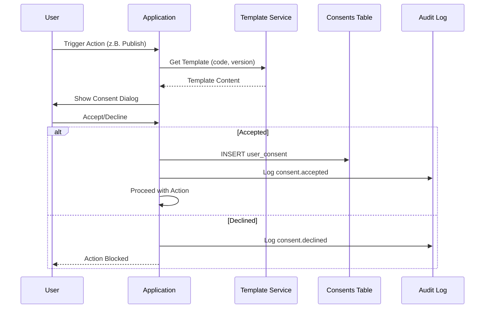

# CONSENT & AUDIT CATALOG

**Version:** v1.0  
**Datum:** 2026-01-26

---

## 1. Consent Gates

### Consent Codes (Vollständig)

| Code | Modul | Trigger | Template Required | Beschreibung |
|------|-------|---------|-------------------|--------------|
| `SALES_MANDATE` | MOD-06 | Listing-Erstellung | ✓ | Verkaufsmandat |
| `SCOUT24_CREDITS` | MOD-06 | Scout24 Publishing | ✓ | Credit-Verbrauch Zustimmung |
| `PARTNER_RELEASE` | MOD-06 | Partner-Netzwerk-Freigabe | ✓ | Partnerfreigabe |
| `SYSTEM_SUCCESS_FEE_2000` | MOD-06 | Erfolgsgebühr | ✓ | €2.000 bei Closing |
| `COMMISSION_AGREEMENT` | MOD-09 | Provisionsvereinbarung | ✓ | 5-15% Commission |
| `FINANCING_SUBMISSION_ACK` | MOD-07 | Future Room Handoff | ✓ | Datenweitergabe |
| `FINANCING_DATA_PROCESSING` | MOD-07 | Case-Erstellung | — | Optional |
| `LEAD_SPLIT_AGREEMENT` | MOD-10 | Pool-Lead Akzeptanz | ✓ | 1/3:2/3 Split |
| `META_ADS_TOS` | MOD-10 | Meta-Werbung | ✓ | Meta AGB |
| `MSV_AGREEMENT` | MOD-05 | Premium-Aktivierung | ✓ | MSV Premium Vertrag |
| `DATA_SHARING_FUTURE_ROOM` | MOD-07 | Externe Datenweitergabe | ✓ | Future Room Export |
| `PARTNER_VERIFICATION_CONSENT` | MOD-09 | Verifizierung | ✓ | §34c/VSH Prüfung |

---

### Consent Flow



---

## 2. Audit Events

### Event Types

| Event Type | Modul | Trigger | Payload |
|------------|-------|---------|---------|
| `user.login` | Auth | Login | ip, user_agent |
| `user.logout` | Auth | Logout | — |
| `consent.accepted` | Backbone | Consent Given | template_id, version |
| `consent.declined` | Backbone | Consent Declined | template_id |
| `listing.created` | MOD-06 | Create Listing | listing_id, property_id |
| `listing.activated` | MOD-06 | Activate | listing_id |
| `listing.published` | MOD-06 | Publish | channel, listing_id |
| `inquiry.created` | MOD-06 | New Inquiry | inquiry_id, listing_id |
| `reservation.created` | MOD-06 | New Reservation | reservation_id |
| `reservation.status_changed` | MOD-06 | Status Transition | from, to |
| `transaction.completed` | MOD-06 | BNL | transaction_id, amount |
| `partner.verified` | MOD-09 | Verification Complete | partner_id |
| `commission.approved` | MOD-09 | Commission Approval | commission_id, amount |
| `commission.paid` | MOD-09 | Payment | commission_id |
| `lead.captured` | MOD-10 | Raw Lead | source, contact_id |
| `lead.assigned` | MOD-10 | Pool → Partner | lead_id, partner_id |
| `lead.accepted` | MOD-10 | Partner Accept | lead_id |
| `lead.rejected` | MOD-10 | Partner Reject | lead_id |
| `deal.stage_changed` | MOD-10 | Pipeline Move | from_stage, to_stage |
| `deal.won` | MOD-10 | Deal Closed | deal_id, value |
| `deal.lost` | MOD-10 | Deal Lost | deal_id, reason |
| `financing.case_created` | MOD-07 | New Case | case_id |
| `financing.status_changed` | MOD-07 | Transition | from, to |
| `financing.export_generated` | MOD-07 | Export | export_id, type |
| `financing.handoff_sent` | MOD-07 | Future Room | handoff_id, method |
| `document.uploaded` | MOD-03 | Upload | doc_id, size |
| `document.viewed` | MOD-03 | View | doc_id, viewer_id |
| `document.downloaded` | MOD-03 | Download | doc_id |
| `access.granted` | Backbone | Share | scope_id, subject_id |
| `access.revoked` | Backbone | Revoke | grant_id |

---

### Audit Table Schema

```sql
CREATE TABLE public.audit_events (
  id UUID PRIMARY KEY DEFAULT gen_random_uuid(),
  actor_user_id UUID NOT NULL,
  target_org_id UUID REFERENCES organizations(id),
  event_type TEXT NOT NULL,
  payload JSONB DEFAULT '{}',
  created_at TIMESTAMPTZ DEFAULT now()
);

CREATE INDEX idx_audit_events_org_time 
ON audit_events(target_org_id, created_at DESC);

CREATE INDEX idx_audit_events_actor_time 
ON audit_events(actor_user_id, created_at DESC);

CREATE INDEX idx_audit_events_type 
ON audit_events(event_type);
```

---

### Audit RLS

```sql
-- Users can INSERT their own audit events
CREATE POLICY "users_insert_own_audit"
ON audit_events FOR INSERT
WITH CHECK (actor_user_id = auth.uid());

-- No UPDATE or DELETE allowed
-- SELECT: Only platform_admin or own tenant events
CREATE POLICY "audit_select"
ON audit_events FOR SELECT
USING (
  public.is_platform_admin()
  OR target_org_id IN (
    SELECT tenant_id FROM memberships WHERE user_id = auth.uid()
  )
);
```

---

## 3. Minimum Audit Coverage

Diese Aktionen MÜSSEN auditiert werden:

| Kategorie | Events |
|-----------|--------|
| **Auth** | login, logout, password_change |
| **Consent** | accepted, declined, withdrawn |
| **Listings** | created, activated, published, unpublished |
| **Reservations** | created, status transitions |
| **Transactions** | created, completed |
| **Leads** | captured, assigned, accepted, rejected, converted |
| **Deals** | stage_changed, won, lost |
| **Financing** | case_created, status_changed, export, handoff |
| **Documents** | uploaded, viewed, downloaded, shared |
| **Access** | granted, revoked |
| **Partner** | verification_submitted, verified, rejected |
| **Commissions** | created, approved, invoiced, paid |

---

*Dieses Dokument definiert alle Consent-Gates und Audit-Anforderungen.*
