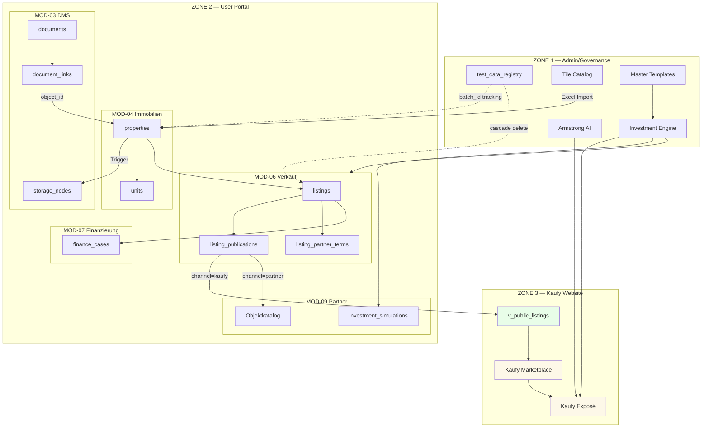
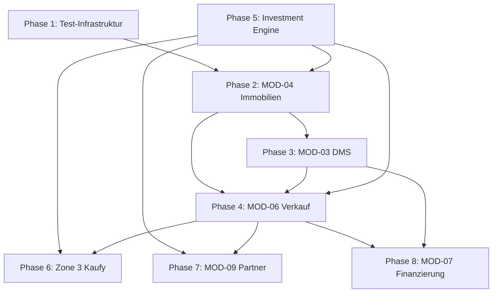

# MASTERPLAN v4.0 — End-to-End Implementation

**Version:** 4.0 FINAL  
**Datum:** 2026-01-27  
**Status:** BEREIT FÜR IMPLEMENTIERUNG  
**Autor:** Lovable AI + Thomas Stelzl

---

## INHALTSVERZEICHNIS

1. [Executive Summary](#1-executive-summary)
2. [Architektur-Übersicht](#2-architektur-übersicht)
3. [Datenfluss-Modell](#3-datenfluss-modell)
4. [Phase 1: Foundation & Test-Infrastruktur](#4-phase-1-foundation--test-infrastruktur)
5. [Phase 2: MOD-04 Immobilien (Source of Truth)](#5-phase-2-mod-04-immobilien-source-of-truth)
6. [Phase 3: MOD-03 DMS & Dokumenten-Management](#6-phase-3-mod-03-dms--dokumenten-management)
7. [Phase 4: MOD-06 Verkauf & Exposé](#7-phase-4-mod-06-verkauf--exposé)
8. [Phase 5: Investment Engine & Berechnungslogik](#8-phase-5-investment-engine--berechnungslogik)
9. [Phase 6: Zone 3 Kaufy Marketplace](#9-phase-6-zone-3-kaufy-marketplace)
10. [Phase 7: MOD-09 Vertriebspartner](#10-phase-7-mod-09-vertriebspartner)
11. [Phase 8: MOD-07 Finanzierung](#11-phase-8-mod-07-finanzierung)
12. [Virtueller End-to-End Testlauf](#12-virtueller-end-to-end-testlauf)
13. [UI/UX Spezifikationen](#13-uiux-spezifikationen)
14. [Entwicklungsreihenfolge & Meilensteine](#14-entwicklungsreihenfolge--meilensteine)

---

## 1. EXECUTIVE SUMMARY

### 1.1 Ziel

Aufbau eines vollständigen Immobilien-Management-Systems mit drei Zonen:
- **Zone 1 (Admin):** Plattform-Governance, Testdaten-Management, Master-Templates
- **Zone 2 (Portal):** 10 operative Module für Eigentümer und Partner
- **Zone 3 (Websites):** Öffentlicher Kaufy-Marktplatz mit Investment-Beratung

### 1.2 Kernprinzipien

| Prinzip | Beschreibung |
|---------|--------------|
| **Single Source of Truth** | MOD-04 besitzt Properties, MOD-06 besitzt Listings |
| **No Hardcoded Data** | Alle Daten kommen aus der Datenbank |
| **Cascading Test Data** | Testdaten können vollständig gelöscht werden |
| **Unified Calculations** | Eine Investment-Engine für alle Zonen |
| **Document Flexibility** | Keine festen Felder, erweiterbare Unterlagen |

### 1.3 Kernkomponenten

```
┌─────────────────────────────────────────────────────────────────────────────┐
│                           SYSTEM OF A TOWN                                  │
├─────────────────────────────────────────────────────────────────────────────┤
│                                                                             │
│  ZONE 1 — ADMIN/GOVERNANCE                                                  │
│  ┌─────────────────────────────────────────────────────────────────────┐   │
│  │  • Testdaten-Management (Excel-Import / Cascading Delete)           │   │
│  │  • Master-Templates (Zinsen, AfA, Steuern)                          │   │
│  │  • Investment Engine (sot-investment-engine)                        │   │
│  │  • Armstrong AI (sot-armstrong-advisor)                             │   │
│  │  • Lead Pool & Partner-Verification                                 │   │
│  └─────────────────────────────────────────────────────────────────────┘   │
│                              │                                              │
│                              ▼                                              │
│  ZONE 2 — USER PORTALS (10 Module)                                          │
│  ┌─────────────────────────────────────────────────────────────────────┐   │
│  │  MOD-01  Stammdaten      │  MOD-06  Verkauf (Exposé)                │   │
│  │  MOD-02  KI Office       │  MOD-07  Finanzierung                    │   │
│  │  MOD-03  DMS             │  MOD-08  Investment-Suche                │   │
│  │  MOD-04  Immobilien ───────► MOD-09  Vertriebspartner               │   │
│  │  MOD-05  MSV             │  MOD-10  Leadgenerierung                 │   │
│  └─────────────────────────────────────────────────────────────────────┘   │
│                              │                                              │
│                              ▼                                              │
│  ZONE 3 — WEBSITES                                                          │
│  ┌─────────────────────────────────────────────────────────────────────┐   │
│  │  KAUFY.app      → Marketplace + Armstrong AI Advisor                │   │
│  │  MIETY.app      → Mieter-Portal (Invite-Flow)                       │   │
│  │  SOT.app        → Management-Software Marketing                     │   │
│  └─────────────────────────────────────────────────────────────────────┘   │
│                                                                             │
└─────────────────────────────────────────────────────────────────────────────┘
```

---

## 2. ARCHITEKTUR-ÜBERSICHT

### 2.1 Drei-Zonen-Modell

```
┌────────────────────────────────────────────────────────────────────────────────┐
│                                                                                │
│  ┌──────────────────────┐     ┌──────────────────────┐     ┌────────────────┐ │
│  │     ZONE 1           │     │     ZONE 2           │     │   ZONE 3       │ │
│  │   ADMIN/GOVERNANCE   │     │   USER PORTALS       │     │   WEBSITES     │ │
│  │                      │     │                      │     │                │ │
│  │  • Organizations     │     │  • MOD-01..10        │     │  • Kaufy       │ │
│  │  • Users             │     │  • Tenant-scoped     │     │  • Miety       │ │
│  │  • Tile Catalog      │     │  • RLS-protected     │     │  • SOT         │ │
│  │  • Master Templates  │     │                      │     │                │ │
│  │  • Test Data Mgmt    │     │                      │     │  READ-ONLY     │ │
│  │                      │     │                      │     │  + Lead Capture│ │
│  └──────────────────────┘     └──────────────────────┘     └────────────────┘ │
│           │                            │                          │           │
│           │                            │                          │           │
│           ▼                            ▼                          ▼           │
│  ┌─────────────────────────────────────────────────────────────────────────┐  │
│  │                     KERNOBJEKTE (Shared Schema)                         │  │
│  │                                                                         │  │
│  │   organizations  │  profiles  │  properties  │  listings  │  documents  │  │
│  │                                                                         │  │
│  └─────────────────────────────────────────────────────────────────────────┘  │
│                                                                                │
└────────────────────────────────────────────────────────────────────────────────┘
```

### 2.2 Zonen-Grenzen (STRICT)

| Regel | Beschreibung |
|-------|--------------|
| **Zone 1 nutzt KEINE Zone-2-Module** | Admin ist Governance, nicht operativ |
| **Zone 2 Module sind isoliert** | Kommunikation nur über definierte Interfaces |
| **Zone 3 ist READ-ONLY** | Keine Schreiboperationen auf Business-Daten |
| **Kernobjekte sind zonen-übergreifend** | Organization, User, Property, Document |

### 2.3 Source of Truth Matrix

| Entität | Owner-Modul | Lesend | Schreibend |
|---------|-------------|--------|------------|
| `properties` | **MOD-04** | MOD-05, 06, 07, 08, 09 | Nur MOD-04 |
| `units` | **MOD-04** | MOD-05 | Nur MOD-04 |
| `listings` | **MOD-06** | MOD-08, 09, Zone 3 | Nur MOD-06 |
| `listing_publications` | **MOD-06** | Zone 3 | Nur MOD-06 |
| `documents` | **MOD-03** | Alle Module | Nur MOD-03 |
| `contacts` | **Backbone** | Alle Module | MOD-01, 02 |
| `finance_cases` | **MOD-07** | MOD-06 | Nur MOD-07 |

---

## 3. DATENFLUSS-MODELL

### 3.1 Hauptfluss: Property → Zone 3

```
┌─────────────────────────────────────────────────────────────────────────────────────┐
│                                                                                     │
│  SCHRITT 1: OBJEKTANLAGE (MOD-04)                                                   │
│  ─────────────────────────────────────────────────────────────────────────────────  │
│                                                                                     │
│    User erstellt Property                                                           │
│         │                                                                           │
│         ▼                                                                           │
│    ┌─────────────────┐                                                              │
│    │   properties    │ ──── INSERT ────► Trigger: create_property_folder_structure  │
│    │   INSERT        │                            │                                 │
│    └─────────────────┘                            ▼                                 │
│                                          ┌─────────────────┐                        │
│                                          │  storage_nodes  │                        │
│                                          │  (Folder-Baum)  │                        │
│                                          └─────────────────┘                        │
│                                                  │                                  │
│                                                  ▼                                  │
│                                          ┌─────────────────┐                        │
│                                          │     units       │ ─► Trigger: unit_folder│
│                                          │    INSERT       │                        │
│                                          └─────────────────┘                        │
│                                                                                     │
├─────────────────────────────────────────────────────────────────────────────────────┤
│                                                                                     │
│  SCHRITT 2: DOKUMENTEN-UPLOAD (MOD-03 DMS)                                          │
│  ─────────────────────────────────────────────────────────────────────────────────  │
│                                                                                     │
│    User lädt Dokumente hoch (Grundbuch, Energieausweis, etc.)                       │
│         │                                                                           │
│         ▼                                                                           │
│    ┌─────────────────┐         ┌─────────────────┐                                  │
│    │   documents     │ ─────►  │  document_links │                                  │
│    │   INSERT        │         │  (node_id,      │                                  │
│    │   (file_path)   │         │   object_id)    │                                  │
│    └─────────────────┘         └─────────────────┘                                  │
│            │                                                                        │
│            ▼                                                                        │
│    Supabase Storage: tenant/{tenant_id}/raw/{YYYY}/{MM}/{doc_id}-{filename}         │
│                                                                                     │
│    ALTERNATIVE: Datenraum-Connector                                                 │
│    ───────────────────────────────                                                  │
│    User verbindet Dropbox/GDrive/OneDrive                                           │
│         │                                                                           │
│         ▼                                                                           │
│    Worker importiert Dateien → Storage-Spiegelung                                   │
│                                                                                     │
├─────────────────────────────────────────────────────────────────────────────────────┤
│                                                                                     │
│  SCHRITT 3: VERKAUFSEXPOSÉ ERSTELLEN (MOD-06)                                       │
│  ─────────────────────────────────────────────────────────────────────────────────  │
│                                                                                     │
│    User erstellt Listing mit SALES_MANDATE Consent                                  │
│         │                                                                           │
│         ▼                                                                           │
│    ┌─────────────────┐                                                              │
│    │    listings     │                                                              │
│    │    INSERT       │                                                              │
│    │  property_id ────────► Referenz zu MOD-04 properties                           │
│    │  status=draft   │                                                              │
│    └─────────────────┘                                                              │
│            │                                                                        │
│            ▼                                                                        │
│    User wählt Unterlagen für Exposé (aus document_links)                            │
│    ──────────────────────────────────────────────────                               │
│    • Grundbuchauszug           ✅ Pflicht                                           │
│    • Grundriss                 ✅ Pflicht                                           │
│    • Energieausweis            ✅ Pflicht                                           │
│    • Mietvertrag               ⚪ Optional                                          │
│    • Nebenkostenabrechnung     ⚪ Optional                                          │
│    • Teilungserklärung         ⚪ Optional (bei WEG)                                │
│    • Baubeschreibung           ⚪ Optional                                          │
│    • + Beliebig erweiterbar                                                         │
│                                                                                     │
│    Armstrong kann strukturieren: "Soll ich die Unterlagen kategorisieren?"          │
│                                                                                     │
├─────────────────────────────────────────────────────────────────────────────────────┤
│                                                                                     │
│  SCHRITT 4: PUBLISHING-FLOW (MOD-06)                                                │
│  ─────────────────────────────────────────────────────────────────────────────────  │
│                                                                                     │
│    A) KAUFY MARKETPLACE (Zone 3)                                                    │
│    ─────────────────────────────                                                    │
│    User aktiviert "Auf Kaufy veröffentlichen"                                       │
│         │                                                                           │
│         ▼                                                                           │
│    listing_publications INSERT                                                      │
│    ├── channel = 'kaufy'                                                            │
│    ├── status = 'published'                                                         │
│    └── published_at = now()                                                         │
│         │                                                                           │
│         ▼                                                                           │
│    v_public_listings View ────► Zone 3 /kaufy/immobilien                            │
│                                                                                     │
│    B) PARTNER-NETZWERK (MOD-09)                                                     │
│    ──────────────────────────────                                                   │
│    User aktiviert "Für Vertriebspartner freigeben"                                  │
│         │                                                                           │
│         ▼                                                                           │
│    Consent-Gates:                                                                   │
│    • PARTNER_RELEASE                                                                │
│    • SYSTEM_SUCCESS_FEE_2000 (2.000€ Erfolgsgebühr)                                 │
│         │                                                                           │
│         ▼                                                                           │
│    listing_partner_terms INSERT                                                     │
│    ├── partner_commission_rate = 5-15%                                              │
│    └── finance_distribution_enabled = true                                          │
│         │                                                                           │
│         ▼                                                                           │
│    listing_publications INSERT                                                      │
│    ├── channel = 'partner_network'                                                  │
│    └── status = 'published'                                                         │
│         │                                                                           │
│         ▼                                                                           │
│    MOD-09 /portal/vertriebspartner/pipeline (Objektkatalog)                         │
│                                                                                     │
└─────────────────────────────────────────────────────────────────────────────────────┘
```

### 3.2 Datenfluss-Diagramm (Mermaid)



---

## 4. PHASE 1: FOUNDATION & TEST-INFRASTRUKTUR

### 4.1 Ziel

Aufbau der Testdaten-Infrastruktur in Zone 1, damit alle nachfolgenden Phasen mit echten (aber löschbaren) Daten entwickelt werden können.

### 4.2 Neue Tabellen

#### `test_data_registry`

```sql
CREATE TABLE public.test_data_registry (
  id UUID PRIMARY KEY DEFAULT gen_random_uuid(),
  entity_type TEXT NOT NULL,  -- 'property', 'unit', 'contact', 'listing', 'document'
  entity_id UUID NOT NULL,
  batch_id UUID NOT NULL,
  batch_name TEXT,
  imported_by UUID REFERENCES profiles(id),
  imported_at TIMESTAMPTZ DEFAULT now(),
  
  CONSTRAINT uq_entity UNIQUE (entity_type, entity_id)
);

-- Index für schnelles Batch-Löschen
CREATE INDEX idx_tdr_batch ON test_data_registry(batch_id);
CREATE INDEX idx_tdr_entity ON test_data_registry(entity_type, entity_id);
```

### 4.3 Excel-Import-Spezifikation

**Dateipfad für Vorlage:** `/public/templates/Testdaten_Vorlage.xlsx`

| Sheet | Spalten | Ziel-Tabelle |
|-------|---------|--------------|
| **Properties** | code, property_type, address, city, postal_code, total_area_sqm, construction_year, market_value | `properties` |
| **Units** | property_code (Ref), unit_number, area_sqm, current_monthly_rent, usage_type | `units` |
| **Contacts** | first_name, last_name, email, phone, company | `contacts` |
| **Leases** | property_code, unit_number, contact_email, monthly_rent, start_date | `leases` |
| **Listings** | property_code, title, asking_price, description, commission_rate | `listings` |

### 4.4 Import-Flow

```
┌─────────────────────────────────────────────────────────────────────────────┐
│                                                                             │
│  1. Admin öffnet /admin/tiles → Tab "Testdaten"                             │
│                                                                             │
│  2. Excel-Upload                                                            │
│     ├── Datei auswählen                                                     │
│     ├── Sheet-Validierung                                                   │
│     └── Vorschau der Daten                                                  │
│                                                                             │
│  3. Import starten                                                          │
│     ├── batch_id = gen_random_uuid()                                        │
│     ├── batch_name = "Import_2026-01-27_14:30"                              │
│     │                                                                       │
│     ├── SHEET 1: Properties                                                 │
│     │   └── FOR EACH row:                                                   │
│     │       ├── properties INSERT                                           │
│     │       ├── test_data_registry INSERT (entity_type='property')          │
│     │       └── Trigger: storage_nodes automatisch                          │
│     │                                                                       │
│     ├── SHEET 2: Units                                                      │
│     │   └── FOR EACH row:                                                   │
│     │       ├── units INSERT (via property_code → property_id Lookup)       │
│     │       ├── test_data_registry INSERT (entity_type='unit')              │
│     │       └── Trigger: unit folder automatisch                            │
│     │                                                                       │
│     ├── SHEET 3: Contacts                                                   │
│     │   └── FOR EACH row:                                                   │
│     │       ├── contacts INSERT                                             │
│     │       └── test_data_registry INSERT (entity_type='contact')           │
│     │                                                                       │
│     ├── SHEET 4: Leases                                                     │
│     │   └── FOR EACH row:                                                   │
│     │       ├── leases INSERT (via property_code + unit_number Lookup)      │
│     │       └── test_data_registry INSERT (entity_type='lease')             │
│     │                                                                       │
│     └── SHEET 5: Listings                                                   │
│         └── FOR EACH row:                                                   │
│             ├── listings INSERT (status='draft')                            │
│             └── test_data_registry INSERT (entity_type='listing')           │
│                                                                             │
│  4. Import-Bericht                                                          │
│     └── Anzahl importierter Datensätze pro Entity-Typ                       │
│                                                                             │
└─────────────────────────────────────────────────────────────────────────────┘
```

### 4.5 Cascading Delete

```sql
-- Funktion für vollständiges Löschen eines Batches
CREATE OR REPLACE FUNCTION delete_test_batch(p_batch_id UUID)
RETURNS TABLE(entity_type TEXT, deleted_count INT)
LANGUAGE plpgsql
SECURITY DEFINER
SET search_path = public
AS $$
DECLARE
  v_entity RECORD;
BEGIN
  -- Reihenfolge: Child → Parent (wegen Foreign Keys)
  
  -- 1. Listing Publications
  DELETE FROM listing_publications lp
  USING test_data_registry tdr
  WHERE tdr.batch_id = p_batch_id 
    AND tdr.entity_type = 'listing'
    AND lp.listing_id = tdr.entity_id;
  
  -- 2. Listings
  DELETE FROM listings l
  USING test_data_registry tdr
  WHERE tdr.batch_id = p_batch_id 
    AND tdr.entity_type = 'listing'
    AND l.id = tdr.entity_id;
  
  -- 3. Leases
  DELETE FROM leases le
  USING test_data_registry tdr
  WHERE tdr.batch_id = p_batch_id 
    AND tdr.entity_type = 'lease'
    AND le.id = tdr.entity_id;
  
  -- 4. Document Links
  DELETE FROM document_links dl
  USING test_data_registry tdr
  WHERE tdr.batch_id = p_batch_id 
    AND tdr.entity_type = 'property'
    AND dl.object_id = tdr.entity_id;
  
  -- 5. Documents (inkl. Storage-Cleanup)
  -- NOTE: Storage-Dateien müssen separat via API gelöscht werden
  DELETE FROM documents d
  USING test_data_registry tdr
  WHERE tdr.batch_id = p_batch_id 
    AND tdr.entity_type = 'document'
    AND d.id = tdr.entity_id;
  
  -- 6. Units
  DELETE FROM units u
  USING test_data_registry tdr
  WHERE tdr.batch_id = p_batch_id 
    AND tdr.entity_type = 'unit'
    AND u.id = tdr.entity_id;
  
  -- 7. Storage Nodes
  DELETE FROM storage_nodes sn
  USING test_data_registry tdr
  WHERE tdr.batch_id = p_batch_id 
    AND tdr.entity_type = 'property'
    AND sn.property_id = tdr.entity_id;
  
  -- 8. Contacts
  DELETE FROM contacts c
  USING test_data_registry tdr
  WHERE tdr.batch_id = p_batch_id 
    AND tdr.entity_type = 'contact'
    AND c.id = tdr.entity_id;
  
  -- 9. Properties
  DELETE FROM properties p
  USING test_data_registry tdr
  WHERE tdr.batch_id = p_batch_id 
    AND tdr.entity_type = 'property'
    AND p.id = tdr.entity_id;
  
  -- 10. Registry selbst
  DELETE FROM test_data_registry WHERE batch_id = p_batch_id;
  
  RETURN QUERY 
    SELECT 'batch_deleted'::TEXT, 1;
END;
$$;
```

### 4.6 UI: Testdaten-Tab in /admin/tiles

```
┌─────────────────────────────────────────────────────────────────────────────┐
│  TILE CATALOG                                                    [Admin]    │
├─────────────────────────────────────────────────────────────────────────────┤
│                                                                             │
│  [Module] [Routen] [Testdaten]                                              │
│                    ──────────                                               │
│                                                                             │
│  ┌─────────────────────────────────────────────────────────────────────┐   │
│  │                                                                     │   │
│  │  📥 EXCEL-IMPORT                                                    │   │
│  │                                                                     │   │
│  │  [Vorlage herunterladen]  [Excel hochladen]                         │   │
│  │                                                                     │   │
│  │  Unterstützte Sheets:                                               │   │
│  │  • Properties (Immobilien)                                          │   │
│  │  • Units (Einheiten)                                                │   │
│  │  • Contacts (Kontakte)                                              │   │
│  │  • Leases (Mietverträge)                                            │   │
│  │  • Listings (Verkaufsanzeigen)                                      │   │
│  │                                                                     │   │
│  └─────────────────────────────────────────────────────────────────────┘   │
│                                                                             │
│  ┌─────────────────────────────────────────────────────────────────────┐   │
│  │                                                                     │   │
│  │  📋 AKTIVE BATCHES                                                  │   │
│  │                                                                     │   │
│  │  ┌───────────────────────────────────────────────────────────────┐ │   │
│  │  │ Batch: Import_2026-01-27_14:30                                │ │   │
│  │  │ Properties: 8  │ Units: 24  │ Contacts: 12  │ Listings: 6    │ │   │
│  │  │ Importiert von: thomas.stelzl@example.com                     │ │   │
│  │  │ [🗑️ Batch löschen]                                            │ │   │
│  │  └───────────────────────────────────────────────────────────────┘ │   │
│  │                                                                     │   │
│  │  ┌───────────────────────────────────────────────────────────────┐ │   │
│  │  │ Batch: Demo_Portfolio                                         │ │   │
│  │  │ Properties: 3  │ Units: 9   │ Contacts: 5   │ Listings: 2    │ │   │
│  │  │ Importiert von: system                                        │ │   │
│  │  │ [🗑️ Batch löschen]                                            │ │   │
│  │  └───────────────────────────────────────────────────────────────┘ │   │
│  │                                                                     │   │
│  │  [⚠️ Alle Testdaten löschen]                                       │   │
│  │                                                                     │   │
│  └─────────────────────────────────────────────────────────────────────┘   │
│                                                                             │
└─────────────────────────────────────────────────────────────────────────────┘
```

### 4.7 Deliverables Phase 1

| # | Deliverable | Status |
|---|-------------|--------|
| 1.1 | `test_data_registry` Tabelle | ⬜ |
| 1.2 | Excel-Vorlage (`Testdaten_Vorlage.xlsx`) | ⬜ |
| 1.3 | Excel-Parser (Edge Function oder Client-Side) | ⬜ |
| 1.4 | `delete_test_batch()` Funktion | ⬜ |
| 1.5 | UI: Testdaten-Tab in /admin/tiles | ⬜ |
| 1.6 | Storage-Cleanup-Logik | ⬜ |

---

## 5. PHASE 2: MOD-04 IMMOBILIEN (Source of Truth)

### 5.1 Ziel

Vollständige Implementierung des Property-Moduls als Source of Truth für alle nachgelagerten Module.

### 5.2 Existierende Tabellen (bereits vorhanden)

- `properties` ✅
- `units` ✅
- `property_features` ✅
- `property_financing` ✅
- `landlord_contexts` ✅
- `context_property_assignment` ✅
- `storage_nodes` ✅

### 5.3 Trigger (bereits vorhanden)

- `create_property_folder_structure()` ✅
- `create_unit_folder()` ✅
- `create_default_unit()` ✅

### 5.4 Portfolio-View mit Investment-Berechnung

```
┌─────────────────────────────────────────────────────────────────────────────┐
│  PORTFOLIO                                                      [MOD-04]    │
├─────────────────────────────────────────────────────────────────────────────┤
│                                                                             │
│  ┌─────────────────────────────────────────────────────────────────────┐   │
│  │ 📊 PORTFOLIO-ÜBERSICHT (Aggregiert)                                 │   │
│  │                                                                     │   │
│  │  ┌────────────────────────────────────────────────────────────────┐│   │
│  │  │           MASTER-GRAPH (40 Jahre Projektion)                   ││   │
│  │  │                                                                ││   │
│  │  │   Wert ─────────────────────────────────────▶ 3.2 Mio €       ││   │
│  │  │   Schuld ──────▼                                               ││   │
│  │  │   Vermögen ─────────────────────────────────▶ 2.4 Mio €       ││   │
│  │  │                                                                ││   │
│  │  │   [Jahr 0]                              [Jahr 40]              ││   │
│  │  └────────────────────────────────────────────────────────────────┘│   │
│  │                                                                     │   │
│  │  HAUSHALTSRECHNUNG (Portfolio-gesamt)                               │   │
│  │  ┌────────────────────────────────────────────────────────────────┐│   │
│  │  │  + Mieteinnahmen gesamt        +96.000 €/Jahr                  ││   │
│  │  │  - Darlehensraten gesamt       -67.200 €/Jahr                  ││   │
│  │  │  - Verwaltung/NK gesamt        -12.000 €/Jahr                  ││   │
│  │  │  + Steuerersparnis gesamt      +18.400 €/Jahr                  ││   │
│  │  │  ─────────────────────────────────────────────────────────────  ││   │
│  │  │  = MONATSÜBERSCHUSS              +2.933 €/Monat          🟢    ││   │
│  │  └────────────────────────────────────────────────────────────────┘│   │
│  └─────────────────────────────────────────────────────────────────────┘   │
│                                                                             │
│  ┌─────────────────────────────────────────────────────────────────────┐   │
│  │ 🏠 IMMOBILIENLISTE                                                  │   │
│  │                                                                     │   │
│  │  [+ Objekt anlegen]  [📥 Excel-Import]  [🔍 Filter]                │   │
│  │                                                                     │   │
│  │  ┌────┬──────┬─────────┬────────────────┬────────┬────────┬──────┐│   │
│  │  │ ID │ Art  │ Ort     │ Adresse        │ Größe  │ Wert   │ Rate ││   │
│  │  ├────┼──────┼─────────┼────────────────┼────────┼────────┼──────┤│   │
│  │  │ZL02│ MFH  │ Leipzig │ Hauptstr. 15   │ 620 m² │ 890k € │ 700€ ││   │
│  │  │ZL03│ MFH  │ Leipzig │ Nebenstr. 8    │ 480 m² │ 650k € │ 520€ ││   │
│  │  │ZL04│ DHH  │ Dresden │ Parkweg 12     │ 180 m² │ 320k € │ 280€ ││   │
│  │  │... │ ...  │ ...     │ ...            │ ...    │ ...    │ ...  ││   │
│  │  └────┴──────┴─────────┴────────────────┴────────┴────────┴──────┘│   │
│  │                                                                     │   │
│  └─────────────────────────────────────────────────────────────────────┘   │
│                                                                             │
└─────────────────────────────────────────────────────────────────────────────┘
```

### 5.5 Exposé-Ansicht (Property Detail)

```
┌─────────────────────────────────────────────────────────────────────────────┐
│  EXPOSÉ: Mehrfamilienhaus Hauptstr. 15, Leipzig                  [MOD-04]  │
├─────────────────────────────────────────────────────────────────────────────┤
│                                                                             │
│  ┌─────────────────────────────────────────────────────────────────────┐   │
│  │ [Stammdaten] [Einheiten] [Finanzierung] [Datenraum] [Bewertung]    │   │
│  └─────────────────────────────────────────────────────────────────────┘   │
│                                                                             │
│  ┌─────────────────────────────────────────────────────────────────────┐   │
│  │                                                                     │   │
│  │  STAMMDATEN                                                         │   │
│  │  ──────────                                                         │   │
│  │                                                                     │   │
│  │  Code: ZL002              Art: Mehrfamilienhaus                     │   │
│  │  Adresse: Hauptstr. 15    PLZ/Ort: 04103 Leipzig                    │   │
│  │  Baujahr: 1928            Sanierung: 2019                           │   │
│  │  Fläche: 620 m²           Nutzung: Wohnen                           │   │
│  │                                                                     │   │
│  │  GRUNDBUCH                                                          │   │
│  │  ──────────                                                         │   │
│  │                                                                     │   │
│  │  Grundbuch von: Leipzig   Blatt: 12345                              │   │
│  │  Band: 78                 Flurstück: 234/5                          │   │
│  │                                                                     │   │
│  │  FINANZIERUNG                                                       │   │
│  │  ────────────                                                       │   │
│  │                                                                     │   │
│  │  Bank: Commerzbank        Darlehensnr.: 123456789                   │   │
│  │  Urspr. Darlehen: 712k €  Restschuld: 534k €                        │   │
│  │  Zins: 2.1%               Zinsbindung bis: 2031                     │   │
│  │  Rate: 2.800 €/Monat                                                │   │
│  │                                                                     │   │
│  └─────────────────────────────────────────────────────────────────────┘   │
│                                                                             │
│  ┌─────────────────────────────────────────────────────────────────────┐   │
│  │                                                                     │   │
│  │  📊 INVESTMENT-BERECHNUNG                                           │   │
│  │                                                                     │   │
│  │  [7 SLIDER - Parameter anpassen]                                    │   │
│  │                                                                     │   │
│  │  Eigenkapital:    [═══════●═══════════] 50.000 €                   │   │
│  │  Tilgungsrate:    [══●════════════════] 2%                         │   │
│  │  Wertsteigerung:  [═══●═══════════════] 2% p.a.                    │   │
│  │  Mietentwicklung: [══●════════════════] 1.5% p.a.                  │   │
│  │  zvE:             [═════●═════════════] 60.000 €                   │   │
│  │  Kirchensteuer:   [○] Ja  [●] Nein                                 │   │
│  │  Splitting:       [●] Einzeln  [○] Verheiratet                     │   │
│  │                                                                     │   │
│  │  ─────────────────────────────────────────────────────────────────  │   │
│  │                                                                     │   │
│  │  MASTER-GRAPH (40 Jahre)                                            │   │
│  │  ┌─────────────────────────────────────────────────────────────┐   │   │
│  │  │  Wertentwicklung ────────────────────────▶ 1.58 Mio €       │   │   │
│  │  │  Restschuld      ──────▼                                    │   │   │
│  │  │  Nettovermögen   ────────────────────────▶ 1.04 Mio €       │   │   │
│  │  └─────────────────────────────────────────────────────────────┘   │   │
│  │                                                                     │   │
│  │  HAUSHALTSRECHNUNG                                                  │   │
│  │  ┌─────────────────────────────────────────────────────────────┐   │   │
│  │  │  + Mieteinnahmen            12.000 €/Jahr  (+1.000 €/Mo)    │   │   │
│  │  │  - Darlehensrate            -8.400 €/Jahr  (-700 €/Mo)      │   │   │
│  │  │  - Hausgeld/NK              -1.200 €/Jahr  (-100 €/Mo)      │   │   │
│  │  │  + Steuerersparnis          +2.800 €/Jahr  (+233 €/Mo)      │   │   │
│  │  │  ─────────────────────────────────────────────────────────  │   │   │
│  │  │  = MONATSBELASTUNG            +433 €/Monat           🟢     │   │   │
│  │  └─────────────────────────────────────────────────────────────┘   │   │
│  │                                                                     │   │
│  │  [▼ 40-Jahres-Detailtabelle anzeigen]                              │   │
│  │                                                                     │   │
│  └─────────────────────────────────────────────────────────────────────┘   │
│                                                                             │
└─────────────────────────────────────────────────────────────────────────────┘
```

### 5.6 Deliverables Phase 2

| # | Deliverable | Status |
|---|-------------|--------|
| 2.1 | Portfolio-Dashboard mit KPIs | ⬜ |
| 2.2 | Immobilienliste (13 Spalten) | ⬜ |
| 2.3 | Property-Detail/Exposé Ansicht | ⬜ |
| 2.4 | Investment-Berechnung (7 Slider) | ⬜ |
| 2.5 | Master-Graph (Recharts) | ⬜ |
| 2.6 | Haushaltsrechnung-Komponente | ⬜ |
| 2.7 | Excel-Import für Properties | ⬜ |
| 2.8 | Download-Vorlage Button | ⬜ |

---

## 6. PHASE 3: MOD-03 DMS & DOKUMENTEN-MANAGEMENT

### 6.1 Ziel

Vollständiges Dokumenten-Management mit Storage-Integration und Datenraum-Connectoren.

### 6.2 Existierende Tabellen

- `documents` ✅
- `document_links` ✅
- `storage_nodes` ✅

### 6.3 Folder-Struktur pro Property

```
tenant/{tenant_id}/
├── raw/
│   └── {YYYY}/
│       └── {MM}/
│           └── {doc_id}-{filename}
└── derived/
    └── {doc_id}/
        ├── unstructured.json
        ├── preview.pdf
        └── thumb.png

storage_nodes (DB):
─────────────────────
📁 [Property-Name: Hauptstr. 15, Leipzig]
├── 📁 Allgemein
│   ├── 📁 Grundbuch
│   ├── 📁 Finanzierung
│   ├── 📁 Versicherung
│   └── 📁 Sonstiges
├── 📁 Einheiten
│   ├── 📁 EG-Links
│   ├── 📁 EG-Rechts
│   ├── 📁 1.OG-Links
│   └── ...
└── 📁 Sanierung
```

### 6.4 Datenraum-Connector Flow

```
┌─────────────────────────────────────────────────────────────────────────────┐
│                                                                             │
│  User in /portal/dms/dmssettings                                            │
│                                                                             │
│  ┌─────────────────────────────────────────────────────────────────────┐   │
│  │                                                                     │   │
│  │  DATENRAUM VERBINDEN                                                │   │
│  │                                                                     │   │
│  │  [Dropbox]  [Google Drive]  [OneDrive]                              │   │
│  │      │                                                              │   │
│  │      ▼                                                              │   │
│  │  OAuth-Flow → Token speichern                                       │   │
│  │      │                                                              │   │
│  │      ▼                                                              │   │
│  │  Ordner-Picker anzeigen                                             │   │
│  │      │                                                              │   │
│  │      ▼                                                              │   │
│  │  User wählt: "/Immobilien/Hauptstr15"                               │   │
│  │      │                                                              │   │
│  │      ▼                                                              │   │
│  │  Worker-Job: import_dropbox                                         │   │
│  │      │                                                              │   │
│  │      ├── Für jede Datei:                                            │   │
│  │      │   ├── Download von Dropbox                                   │   │
│  │      │   ├── Upload zu Supabase Storage                             │   │
│  │      │   ├── documents INSERT                                       │   │
│  │      │   └── document_links INSERT (node_id=inbox)                  │   │
│  │      │                                                              │   │
│  │      └── Import-Status: "12 Dateien importiert"                     │   │
│  │                                                                     │   │
│  │  WICHTIG: Dateien werden GESPIEGELT, nicht referenziert             │   │
│  │  → Bei Änderungen: Manueller Re-Sync erforderlich                   │   │
│  │                                                                     │   │
│  └─────────────────────────────────────────────────────────────────────┘   │
│                                                                             │
└─────────────────────────────────────────────────────────────────────────────┘
```

### 6.5 Wichtige Unterlagen (Start-Aufstellung)

| Kategorie | Dokument | Typischer Kontext |
|-----------|----------|-------------------|
| **Grundbuch** | Grundbuchauszug | Allgemein/Grundbuch |
| **Flächen** | Grundriss | Allgemein/Sonstiges |
| **Flächen** | Flächenberechnung | Allgemein/Sonstiges |
| **WEG** | Teilungserklärung | Allgemein/Sonstiges |
| **Energie** | Energieausweis | Allgemein/Sonstiges |
| **Versicherung** | Gebäudeversicherung Police | Allgemein/Versicherung |
| **Mietverhältnis** | Mietvertrag | Einheiten/[Unit]/Mietvertrag |
| **Mietverhältnis** | Nebenkostenabrechnungen | Einheiten/[Unit]/Korrespondenz |
| **WEG** | Teilungsvertrag | Allgemein/Sonstiges |
| **Finanzen** | Tilgungskontoauszüge | Allgemein/Finanzierung |
| **Bau** | Baubeschreibung | Allgemein/Sonstiges |
| **Bau** | Planunterlagen | Allgemein/Sonstiges |

**WICHTIG:** Diese Liste ist ein Vorschlag. User kann beliebige Dokumente hinzufügen.

### 6.6 Deliverables Phase 3

| # | Deliverable | Status |
|---|-------------|--------|
| 3.1 | Storage-UI mit Folder-Tree | ⬜ |
| 3.2 | Upload-Funktion | ⬜ |
| 3.3 | Preview/Download (Signed URLs) | ⬜ |
| 3.4 | Datenraum-Connector OAuth | ⬜ |
| 3.5 | Import-Worker | ⬜ |
| 3.6 | Document-Links zu Properties | ⬜ |

---

## 7. PHASE 4: MOD-06 VERKAUF & EXPOSÉ

### 7.1 Ziel

Verkaufs-Modul mit Exposé-Erstellung und Multi-Channel-Publishing.

### 7.2 Existierende Tabellen

- `listings` ✅
- `listing_publications` ✅

### 7.3 Neue Tabellen

```sql
-- Bereits im Schema, aber ggf. erweitern:
CREATE TABLE IF NOT EXISTS listing_partner_terms (
  id UUID PRIMARY KEY DEFAULT gen_random_uuid(),
  tenant_id UUID NOT NULL REFERENCES organizations(id),
  listing_id UUID NOT NULL REFERENCES listings(id) UNIQUE,
  partner_commission_rate NUMERIC CHECK (partner_commission_rate >= 5 AND partner_commission_rate <= 15),
  finance_distribution_enabled BOOLEAN DEFAULT false,
  system_success_fee_enabled BOOLEAN DEFAULT false,
  partner_release_consent_id UUID,
  system_fee_consent_id UUID,
  global_release BOOLEAN DEFAULT true,
  released_at TIMESTAMPTZ,
  created_at TIMESTAMPTZ DEFAULT now(),
  updated_at TIMESTAMPTZ DEFAULT now()
);

-- Junction-Tabelle für Listing-Dokumente (optional)
CREATE TABLE IF NOT EXISTS listing_documents (
  id UUID PRIMARY KEY DEFAULT gen_random_uuid(),
  tenant_id UUID NOT NULL REFERENCES organizations(id),
  listing_id UUID NOT NULL REFERENCES listings(id),
  document_id UUID NOT NULL REFERENCES documents(id),
  is_required BOOLEAN DEFAULT false,
  display_order INT DEFAULT 0,
  created_at TIMESTAMPTZ DEFAULT now()
);
```

### 7.4 Verkaufs-Exposé UI

```
┌─────────────────────────────────────────────────────────────────────────────┐
│  VERKAUFS-EXPOSÉ: Hauptstr. 15, Leipzig                          [MOD-06]  │
├─────────────────────────────────────────────────────────────────────────────┤
│                                                                             │
│  STATUS: [Draft ▾]  →  [Active]  →  [Reserved]  →  [Sold]                  │
│                                                                             │
│  ┌─────────────────────────────────────────────────────────────────────┐   │
│  │                                                                     │   │
│  │  OBJEKT-HEADER                                                      │   │
│  │  ─────────────                                                      │   │
│  │                                                                     │   │
│  │  🏠 Mehrfamilienhaus Hauptstr. 15, 04103 Leipzig                    │   │
│  │                                                                     │   │
│  │  Angebotspreis: 890.000 €                                           │   │
│  │  8 Einheiten  │  620 m²  │  Rendite: 5.2%                          │   │
│  │                                                                     │   │
│  │  KANÄLE                                                             │   │
│  │  ┌──────────────┬──────────────┬──────────────┬──────────────┐      │   │
│  │  │ Kaufy        │ Scout24      │ Kleinanzeigen│ Partner      │      │   │
│  │  │ [🟢 Aktiv]   │ [⚪ Inaktiv] │ [⚪ Inaktiv] │ [🟢 Aktiv]   │      │   │
│  │  └──────────────┴──────────────┴──────────────┴──────────────┘      │   │
│  │                                                                     │   │
│  └─────────────────────────────────────────────────────────────────────┘   │
│                                                                             │
│  ┌─────────────────────────────────────────────────────────────────────┐   │
│  │                                                                     │   │
│  │  📊 INVESTMENT-VORSCHAU (wie Käufer es sehen)                       │   │
│  │                                                                     │   │
│  │  [7 SLIDER - Vorschau-Parameter]                                    │   │
│  │                                                                     │   │
│  │  MASTER-GRAPH + HAUSHALTSRECHNUNG                                   │   │
│  │  (Identisch mit Zone 3 Kaufy Exposé)                                │   │
│  │                                                                     │   │
│  └─────────────────────────────────────────────────────────────────────┘   │
│                                                                             │
│  ┌─────────────────────────────────────────────────────────────────────┐   │
│  │                                                                     │   │
│  │  📄 UNTERLAGEN FÜR EXPOSÉ                                           │   │
│  │                                                                     │   │
│  │  Armstrong 🤖: "Soll ich die Unterlagen strukturieren?"             │   │
│  │                                                                     │   │
│  │  ┌───────────────────────────────────────────────────────────────┐ │   │
│  │  │ ✅ Grundbuchauszug.pdf                      [Pflicht] [↑↓] [x]│ │   │
│  │  │ ✅ Grundriss_Alle_Etagen.pdf                [Pflicht] [↑↓] [x]│ │   │
│  │  │ ✅ Energieausweis_2024.pdf                  [Pflicht] [↑↓] [x]│ │   │
│  │  │ ⚪ Mietvertrag_EG_Links.pdf                 [Optional][↑↓] [x]│ │   │
│  │  │ ⚪ NK_Abrechnung_2025.pdf                   [Optional][↑↓] [x]│ │   │
│  │  │ ⚪ Baubeschreibung.pdf                      [Optional][↑↓] [x]│ │   │
│  │  └───────────────────────────────────────────────────────────────┘ │   │
│  │                                                                     │   │
│  │  [+ Dokument hinzufügen]  [📥 Aus DMS auswählen]                   │   │
│  │                                                                     │   │
│  │  HINWEIS: Diese Liste ist erweiterbar. Fügen Sie alle              │   │
│  │  relevanten Unterlagen hinzu.                                       │   │
│  │                                                                     │   │
│  └─────────────────────────────────────────────────────────────────────┘   │
│                                                                             │
│  ┌─────────────────────────────────────────────────────────────────────┐   │
│  │                                                                     │   │
│  │  PARTNER-FREIGABE                                                   │   │
│  │                                                                     │   │
│  │  [✓] Für Vertriebspartner freigeben                                │   │
│  │                                                                     │   │
│  │  Provision: [═══════●═══════] 7.5%                                 │   │
│  │                                                                     │   │
│  │  Systemgebühr: 2.000 € (nur bei erfolgreicher Vermittlung)         │   │
│  │                                                                     │   │
│  │  [Agreement PDF generieren]                                         │   │
│  │                                                                     │   │
│  └─────────────────────────────────────────────────────────────────────┘   │
│                                                                             │
└─────────────────────────────────────────────────────────────────────────────┘
```

### 7.5 v_public_listings View

```sql
CREATE OR REPLACE VIEW v_public_listings AS
SELECT 
  l.id AS listing_id,
  l.public_id,
  l.tenant_id,
  l.title,
  l.description,
  l.asking_price,
  l.status AS listing_status,
  l.created_at AS listing_created_at,
  lp.published_at,
  
  -- Property-Daten (aus MOD-04)
  p.id AS property_id,
  p.code AS property_code,
  p.address,
  p.city,
  p.postal_code,
  p.property_type,
  p.total_area_sqm,
  p.construction_year,
  p.market_value,
  p.management_fee,
  
  -- Aggregierte Mietdaten
  (SELECT COUNT(*) FROM units u WHERE u.property_id = p.id) AS unit_count,
  (SELECT SUM(u.current_monthly_rent) FROM units u WHERE u.property_id = p.id) AS monthly_rent_total,
  
  -- Hero-Bild (erstes verknüpftes Bild)
  (SELECT d.file_path 
   FROM documents d 
   JOIN document_links dl ON d.id = dl.document_id
   WHERE dl.object_id = p.id 
     AND d.mime_type LIKE 'image/%'
   ORDER BY d.created_at ASC 
   LIMIT 1) AS hero_image_path,
  
  -- Partner-Terms (falls freigegeben)
  lpt.partner_commission_rate,
  lpt.finance_distribution_enabled
  
FROM listings l
JOIN properties p ON l.property_id = p.id
LEFT JOIN listing_publications lp ON l.id = lp.listing_id AND lp.channel = 'kaufy'
LEFT JOIN listing_partner_terms lpt ON l.id = lpt.listing_id
WHERE lp.status = 'published'
  AND l.status = 'active';
```

### 7.6 Deliverables Phase 4

| # | Deliverable | Status |
|---|-------------|--------|
| 4.1 | Listing-Erstellung mit Consent-Gate | ⬜ |
| 4.2 | Verkaufs-Exposé UI | ⬜ |
| 4.3 | Dokumenten-Selektion für Exposé | ⬜ |
| 4.4 | Kaufy Publishing Wizard | ⬜ |
| 4.5 | Partner Publishing Wizard | ⬜ |
| 4.6 | `v_public_listings` View | ⬜ |
| 4.7 | `listing_partner_terms` Tabelle | ⬜ |

---

## 8. PHASE 5: INVESTMENT ENGINE & BERECHNUNGSLOGIK

### 8.1 Ziel

Einheitliche Berechnungslogik für alle Zonen (Zone 1, 2, 3).

### 8.2 Edge Function: sot-investment-engine

**Bereits implementiert** ✅ (supabase/functions/sot-investment-engine/index.ts)

### 8.3 Input-Parameter (7 Slider)

| Parameter | Typ | Default | Bereich |
|-----------|-----|---------|---------|
| `purchasePrice` | number | 250.000 | 50.000 - 10.000.000 |
| `monthlyRent` | number | 800 | 0 - 50.000 |
| `equity` | number | 50.000 | 0 - purchasePrice |
| `termYears` | number | 15 | 5 - 30 |
| `repaymentRate` | number | 2 | 1 - 10 |
| `taxableIncome` | number | 60.000 | 0 - 500.000 |
| `maritalStatus` | 'single' \| 'married' | 'single' | - |
| `hasChurchTax` | boolean | false | - |
| `churchTaxState` | string | - | DE Bundesländer |
| `afaModel` | 'linear' \| '7i' \| '7h' \| '7b' | 'linear' | - |
| `buildingShare` | number | 0.8 | 0.5 - 1.0 |
| `managementCostMonthly` | number | 25 | 0 - 500 |
| `valueGrowthRate` | number | 2 | 0 - 10 |
| `rentGrowthRate` | number | 1.5 | 0 - 5 |

### 8.4 Output-Struktur

```typescript
interface CalculationResult {
  summary: {
    monthlyBurden: number;      // Monatliche Belastung (netto)
    totalInvestment: number;    // Gesamtinvestition
    loanAmount: number;         // Darlehensbetrag
    ltv: number;                // Loan-to-Value Ratio
    interestRate: number;       // Effektiver Zinssatz
    yearlyRent: number;         // Jahresmiete
    yearlyInterest: number;     // Jahreszins
    yearlyRepayment: number;    // Jahrestilgung
    yearlyAfa: number;          // Jährliche AfA
    yearlyTaxSavings: number;   // Jährliche Steuerersparnis
    roiBeforeTax: number;       // Rendite vor Steuern
    roiAfterTax: number;        // Rendite nach Steuern
  };
  projection: YearlyData[];     // 40-Jahres-Projektion
  inputs: CalculationInput;     // Echo der Eingaben
}

interface YearlyData {
  year: number;
  rent: number;
  interest: number;
  repayment: number;
  remainingDebt: number;
  managementCost: number;
  afa: number;
  taxableRentalIncome: number;
  taxSavings: number;
  cashFlowBeforeTax: number;
  cashFlowAfterTax: number;
  propertyValue: number;
  netWealth: number;
}
```

### 8.5 Master-Graph Visualisierung

```
┌─────────────────────────────────────────────────────────────────────────────┐
│                                                                             │
│  MASTER-GRAPH: 40-Jahres-Projektion                                         │
│                                                                             │
│  1.8M €  ┤                                           ╭─── Wertentwicklung   │
│          │                                     ╭─────╯                      │
│  1.4M €  ┤                              ╭──────╯                            │
│          │                        ╭─────╯                                   │
│  1.0M €  ┤                  ╭─────╯                    ╭─── Nettovermögen   │
│          │            ╭─────╯                   ╭──────╯                    │
│   600k € ┤      ╭─────╯                   ╭─────╯                           │
│          │ ╭────╯         ╲──────────────╯                                  │
│   200k € ┤─╯               ╲                                                │
│          │                  ╲──────────╲                                    │
│     0 €  ┼──────────────────────────────╲────────── Restschuld              │
│          └────┬────┬────┬────┬────┬────┬────┬────┬                          │
│               0    5   10   15   20   25   30   35   40  Jahre              │
│                                                                             │
│  LEGENDE:                                                                   │
│  ━━━ Wertentwicklung (Immobilie)                                            │
│  ─── Nettovermögen (Wert - Restschuld)                                      │
│  ╌╌╌ Restschuld (Darlehen)                                                  │
│                                                                             │
└─────────────────────────────────────────────────────────────────────────────┘
```

### 8.6 Haushaltsrechnung Visualisierung

```
┌─────────────────────────────────────────────────────────────────────────────┐
│                                                                             │
│  HAUSHALTSRECHNUNG                                                          │
│                                                                             │
│  ┌─────────────────────────────────────────────────────────────────────┐   │
│  │                                                                     │   │
│  │  EINNAHMEN                                                          │   │
│  │  ──────────────────────────────────────────────                     │   │
│  │  Mieteinnahmen (8 Einheiten)           +12.000 €/Jahr  (+1.000/Mo) │   │
│  │                                                                     │   │
│  │  AUSGABEN                                                           │   │
│  │  ──────────────────────────────────────────────                     │   │
│  │  Darlehensrate (Zins + Tilgung)         -8.400 €/Jahr  (-700/Mo)   │   │
│  │  Hausgeld / NK-Vorauszahlung            -1.200 €/Jahr  (-100/Mo)   │   │
│  │  Rücklagen (optional)                       -0 €/Jahr              │   │
│  │                                                                     │   │
│  │  STEUEREFFEKT                                                       │   │
│  │  ──────────────────────────────────────────────                     │   │
│  │  AfA (2% von 712k € Gebäudeanteil)     -14.240 €     (Abzug)       │   │
│  │  Zinsaufwand (abzugsfähig)              -5.880 €     (Abzug)       │   │
│  │  → Steuerersparnis bei 42% GrSt         +2.800 €/Jahr  (+233/Mo)   │   │
│  │                                                                     │   │
│  │  ═══════════════════════════════════════════════════════════════   │   │
│  │                                                                     │   │
│  │  ERGEBNIS                                                           │   │
│  │  ──────────────────────────────────────────────                     │   │
│  │  Cashflow vor Steuer                    +2.400 €/Jahr  (+200/Mo)   │   │
│  │  Cashflow nach Steuer                   +5.200 €/Jahr  (+433/Mo)   │   │
│  │                                                                     │   │
│  │  ┌───────────────────────────────────────────────────────────────┐ │   │
│  │  │                                                               │ │   │
│  │  │  💰 MONATLICHE BELASTUNG:  +433 €/Monat             🟢       │ │   │
│  │  │                                                               │ │   │
│  │  │  Sie verdienen jeden Monat 433 € mit dieser Immobilie.       │ │   │
│  │  │                                                               │ │   │
│  │  └───────────────────────────────────────────────────────────────┘ │   │
│  │                                                                     │   │
│  └─────────────────────────────────────────────────────────────────────┘   │
│                                                                             │
└─────────────────────────────────────────────────────────────────────────────┘
```

### 8.7 Deliverables Phase 5

| # | Deliverable | Status |
|---|-------------|--------|
| 5.1 | Investment Engine (bereits vorhanden) | ✅ |
| 5.2 | Slider-Komponente (7 Parameter) | ⬜ |
| 5.3 | Master-Graph Komponente (Recharts) | ⬜ |
| 5.4 | Haushaltsrechnung Komponente | ⬜ |
| 5.5 | 40-Jahres-Detailtabelle (Collapsible) | ⬜ |
| 5.6 | useInvestmentEngine Hook | ✅ |

---

## 9. PHASE 6: ZONE 3 KAUFY MARKETPLACE

### 9.1 Ziel

Öffentlicher Marktplatz mit interaktiver Investment-Suche und Armstrong AI.

### 9.2 Refactoring: Keine Hardcoded Daten

**AKTUELL (KaufyImmobilien.tsx):**
```typescript
// ❌ FALSCH - Hardcoded Daten
const placeholderListings = [
  { id: 1, title: 'Mehrfamilienhaus Leipzig-Süd', ... },
  ...
];
```

**NEU:**
```typescript
// ✅ RICHTIG - Daten aus Datenbank
const { data: listings, isLoading } = useQuery({
  queryKey: ['public-listings'],
  queryFn: async () => {
    const { data } = await supabase
      .from('v_public_listings')
      .select('*')
      .order('published_at', { ascending: false });
    return data;
  }
});
```

### 9.3 Investment Search Card

```
┌─────────────────────────────────────────────────────────────────────────────┐
│                                                                             │
│  KAUFY IMMOBILIEN-SUCHE                                                     │
│                                                                             │
│  ┌─────────────────────────────────────────────────────────────────────┐   │
│  │ SUCHFILTER                                                          │   │
│  │                                                                     │   │
│  │ Eigenkapital:    [═══════●═══════] 50.000 €                        │   │
│  │ Tilgungsrate:    [══●════════════] 2%                              │   │
│  │ zvE:             [═════●═════════] 60.000 €                        │   │
│  │                                                                     │   │
│  │ [Stadt ▾]  [Objektart ▾]  [Preis-Range ▾]                          │   │
│  └─────────────────────────────────────────────────────────────────────┘   │
│                                                                             │
│  12 Objekte gefunden                              Sortieren: [Belastung ▾] │
│                                                                             │
│  ┌───────────────────────────────────┬───────────────────────────────────┐ │
│  │                                   │                                   │ │
│  │  ┌─────────────────────────────┐ │  ┌─────────────────────────────┐ │ │
│  │  │ [HERO IMAGE]                │ │  │ [HERO IMAGE]                │ │ │
│  │  │                             │ │  │                             │ │ │
│  │  │ 📍 Leipzig, Hauptstr. 15    │ │  │ 📍 Dresden, Parkweg 8       │ │ │
│  │  │ MFH | 620 m² | 8 Einheiten  │ │  │ DHH | 180 m² | 2 Einheiten  │ │ │
│  │  ├─────────────────────────────┤ │  ├─────────────────────────────┤ │ │
│  │  │                             │ │  │                             │ │ │
│  │  │ HAUSHALTSRECHNUNG           │ │  │ HAUSHALTSRECHNUNG           │ │ │
│  │  │                             │ │  │                             │ │ │
│  │  │ + Miete      +1.000 €/Mo    │ │  │ + Miete        +650 €/Mo    │ │ │
│  │  │ - Rate        -700 €/Mo     │ │  │ - Rate         -480 €/Mo    │ │ │
│  │  │ - NK          -100 €/Mo     │ │  │ - NK            -80 €/Mo    │ │ │
│  │  │ + Steuer      +233 €/Mo     │ │  │ + Steuer       +142 €/Mo    │ │ │
│  │  │ ─────────────────────────── │ │  │ ─────────────────────────── │ │ │
│  │  │ BELASTUNG    +433 €/Mo  🟢  │ │  │ BELASTUNG    +232 €/Mo  🟢  │ │ │
│  │  │                             │ │  │                             │ │ │
│  │  ├─────────────────────────────┤ │  ├─────────────────────────────┤ │ │
│  │  │ 890.000 €   Rendite: 5.2%   │ │  │ 320.000 €   Rendite: 4.8%   │ │ │
│  │  │                             │ │  │                             │ │ │
│  │  │ [Details ansehen →]         │ │  │ [Details ansehen →]         │ │ │
│  │  └─────────────────────────────┘ │  └─────────────────────────────┘ │ │
│  │                                   │                                   │ │
│  └───────────────────────────────────┴───────────────────────────────────┘ │
│                                                                             │
└─────────────────────────────────────────────────────────────────────────────┘
```

### 9.4 Kaufy Exposé (Detail-Ansicht)

```
┌─────────────────────────────────────────────────────────────────────────────┐
│                                                                 [Armstrong] │
│  KAUFY EXPOSÉ                                                    [320px]    │
├─────────────────────────────────────────────────────────────────────────────┤
│                                                                             │
│  ┌────────────────────────────────────────────┐  ┌───────────────────────┐ │
│  │                                            │  │                       │ │
│  │  [HERO IMAGE - Full Width]                 │  │  🤖 Armstrong         │ │
│  │                                            │  │                       │ │
│  │  📍 Hauptstr. 15, 04103 Leipzig            │  │  Hallo! Ich bin       │ │
│  │  Mehrfamilienhaus | 8 Einheiten | 620 m²   │  │  Armstrong, Ihr       │ │
│  │                                            │  │  Investment-Berater.  │ │
│  │  Angebotspreis: 890.000 €                  │  │                       │ │
│  │                                            │  │  Fragen Sie mich zu:  │ │
│  ├────────────────────────────────────────────┤  │  • Finanzierung       │ │
│  │                                            │  │  • Steuervorteilen    │ │
│  │  📊 INVESTMENT-SIMULATION                  │  │  • Renditeoptimierung │ │
│  │                                            │  │                       │ │
│  │  [7 SLIDER - Interaktiv]                   │  │  ─────────────────── │ │
│  │                                            │  │                       │ │
│  │  Eigenkapital:  [═══●═════] 50.000 €      │  │  💬 Was möchten Sie   │ │
│  │  Tilgung:       [═●═══════] 2%            │  │     wissen?           │ │
│  │  Wertsteigerung:[══●══════] 2%            │  │                       │ │
│  │  Mietentwickl.: [═●═══════] 1.5%          │  │  [________________]   │ │
│  │  zvE:           [════●════] 60.000 €      │  │  [Senden]             │ │
│  │  Kirchensteuer: [○] Ja [●] Nein           │  │                       │ │
│  │  Splitting:     [●] Einzeln [○] Verheiratet│  └───────────────────────┘ │
│  │                                            │                             │
│  │  ─────────────────────────────────────────│                             │
│  │                                            │                             │
│  │  MASTER-GRAPH                              │                             │
│  │  ┌────────────────────────────────────┐   │                             │
│  │  │  Wert ────────────────▶ 1.58 Mio € │   │                             │
│  │  │  Schuld ──▼                        │   │                             │
│  │  │  Vermögen ─────────────▶ 1.04 Mio €│   │                             │
│  │  └────────────────────────────────────┘   │                             │
│  │                                            │                             │
│  │  HAUSHALTSRECHNUNG                         │                             │
│  │  ┌────────────────────────────────────┐   │                             │
│  │  │ + Miete           +1.000 €/Mo      │   │                             │
│  │  │ - Rate              -700 €/Mo      │   │                             │
│  │  │ - NK                -100 €/Mo      │   │                             │
│  │  │ + Steuer            +233 €/Mo      │   │                             │
│  │  │ ────────────────────────────────── │   │                             │
│  │  │ BELASTUNG          +433 €/Mo   🟢  │   │                             │
│  │  └────────────────────────────────────┘   │                             │
│  │                                            │                             │
│  │  [▼ 40-Jahres-Projektion anzeigen]        │                             │
│  │                                            │                             │
│  ├────────────────────────────────────────────┤                             │
│  │                                            │                             │
│  │  📄 VERFÜGBARE UNTERLAGEN                  │                             │
│  │                                            │                             │
│  │  ✓ Grundbuchauszug                         │                             │
│  │  ✓ Grundriss (alle Etagen)                 │                             │
│  │  ✓ Energieausweis                          │                             │
│  │  ✓ Mietübersicht                           │                             │
│  │                                            │                             │
│  │  [Unterlagen anfordern]                    │                             │
│  │                                            │                             │
│  ├────────────────────────────────────────────┤                             │
│  │                                            │                             │
│  │  [Finanzierung anfragen]  [Beratung buchen]│                             │
│  │                                            │                             │
│  └────────────────────────────────────────────┘                             │
│                                                                             │
└─────────────────────────────────────────────────────────────────────────────┘
```

### 9.5 Deliverables Phase 6

| # | Deliverable | Status |
|---|-------------|--------|
| 6.1 | KaufyImmobilien.tsx Refactoring (keine Mocks) | ⬜ |
| 6.2 | Investment Search Card Komponente | ⬜ |
| 6.3 | KaufyExpose.tsx mit 7 Slidern | ⬜ |
| 6.4 | Armstrong Sidebar Integration | ⬜ |
| 6.5 | Favorites-Sync (LocalStorage → DB) | ⬜ |
| 6.6 | Lead-Capture (Finanzierung/Beratung) | ⬜ |

---

## 10. PHASE 7: MOD-09 VERTRIEBSPARTNER

### 10.1 Ziel

Partner-Cockpit mit Objektkatalog, Beratung und Investment-Simulation.

### 10.2 Objektkatalog

**Datenquelle:** Listings mit `partner_network` Publication

```sql
SELECT l.*, p.*, lpt.partner_commission_rate
FROM listings l
JOIN properties p ON l.property_id = p.id
JOIN listing_publications lp ON l.id = lp.listing_id
JOIN listing_partner_terms lpt ON l.id = lpt.listing_id
WHERE lp.channel = 'partner_network' 
  AND lp.status = 'published'
  AND l.status = 'active'
  AND lpt.finance_distribution_enabled = true;
```

### 10.3 Beratungs-View

```
┌─────────────────────────────────────────────────────────────────────────────┐
│  BERATUNG                                                        [MOD-09]  │
├─────────────────────────────────────────────────────────────────────────────┤
│                                                                             │
│  Kunde: Max Mustermann                                                      │
│  Investment-Profil: 50.000 - 150.000 € | Min. 4% Rendite | Leipzig, Dresden│
│                                                                             │
│  ┌─────────────────────────────────────────────────────────────────────┐   │
│  │                                                                     │   │
│  │  PASSENDE OBJEKTE (3 Treffer)                                       │   │
│  │                                                                     │   │
│  │  [Investment Search Cards - identisch mit Zone 3]                   │   │
│  │                                                                     │   │
│  │  Card 1: Hauptstr. 15, Leipzig  | Belastung: +433 €/Mo | Match: 95% │   │
│  │  Card 2: Nebenstr. 8, Leipzig   | Belastung: +287 €/Mo | Match: 87% │   │
│  │  Card 3: Parkweg 12, Dresden    | Belastung: +232 €/Mo | Match: 82% │   │
│  │                                                                     │   │
│  └─────────────────────────────────────────────────────────────────────┘   │
│                                                                             │
│  ┌─────────────────────────────────────────────────────────────────────┐   │
│  │                                                                     │   │
│  │  📊 SIMULATION FÜR KUNDE                                            │   │
│  │                                                                     │   │
│  │  [7 SLIDER - Parameter des Kunden]                                  │   │
│  │  [MASTER-GRAPH]                                                     │   │
│  │  [HAUSHALTSRECHNUNG]                                                │   │
│  │                                                                     │   │
│  │  [PDF exportieren]  [An Kunden senden]  [Deal erstellen]           │   │
│  │                                                                     │   │
│  └─────────────────────────────────────────────────────────────────────┘   │
│                                                                             │
└─────────────────────────────────────────────────────────────────────────────┘
```

### 10.4 Deliverables Phase 7

| # | Deliverable | Status |
|---|-------------|--------|
| 7.1 | Objektkatalog (Read-only aus MOD-06) | ⬜ |
| 7.2 | Meine Auswahl (Shortlist) | ⬜ |
| 7.3 | Beratungs-View mit Investment-Simulation | ⬜ |
| 7.4 | Investment-Profile Matching | ⬜ |
| 7.5 | Deal-Erstellung | ⬜ |

---

## 11. PHASE 8: MOD-07 FINANZIERUNG

### 11.1 Ziel

Finanzierungs-Vorbereitung und Export zu Future Room.

### 11.2 Readiness-Gate

```
┌─────────────────────────────────────────────────────────────────────────────┐
│                                                                             │
│  FINANZIERUNGSPAKET: Hauptstr. 15                                [MOD-07]  │
│                                                                             │
│  ┌─────────────────────────────────────────────────────────────────────┐   │
│  │                                                                     │   │
│  │  READINESS-CHECK                                                    │   │
│  │                                                                     │   │
│  │  ✅ Objekt-Stammdaten vollständig                                   │   │
│  │  ✅ Mietübersicht vorhanden                                         │   │
│  │  ✅ Grundbuchauszug hochgeladen                                     │   │
│  │  ⚠️ Selbstauskunft fehlt                    [Jetzt ausfüllen]       │   │
│  │  ⚠️ Einkommensnachweise fehlen              [Hochladen]             │   │
│  │  ✅ Energieausweis vorhanden                                        │   │
│  │                                                                     │   │
│  │  ─────────────────────────────────────────────────────────────────  │   │
│  │                                                                     │   │
│  │  STATUS: 4 von 6 Anforderungen erfüllt                              │   │
│  │                                                                     │   │
│  │  [Export zu Future Room - BLOCKIERT]                                │   │
│  │                                                                     │   │
│  └─────────────────────────────────────────────────────────────────────┘   │
│                                                                             │
└─────────────────────────────────────────────────────────────────────────────┘
```

### 11.3 Deliverables Phase 8

| # | Deliverable | Status |
|---|-------------|--------|
| 8.1 | Finance Case Erstellung | ⬜ |
| 8.2 | Readiness-Gate UI | ⬜ |
| 8.3 | Dokumenten-Checklist | ⬜ |
| 8.4 | Export-Bundle Generierung | ⬜ |
| 8.5 | Future Room Handoff (Platzhalter) | ⬜ |

---

## 12. VIRTUELLER END-TO-END TESTLAUF

### 12.1 Szenario

**User:** Eigentümer mit 8-Objekt-Portfolio verkauft Mehrfamilienhaus

### 12.2 Schritt-für-Schritt

```
┌─────────────────────────────────────────────────────────────────────────────┐
│                                                                             │
│  SCHRITT 1: TESTDATEN IMPORTIEREN (Zone 1)                                  │
│  ─────────────────────────────────────────                                  │
│                                                                             │
│  Admin → /admin/tiles → Testdaten-Tab                                       │
│  └─ Excel-Vorlage hochladen (8 Properties, 24 Units, 12 Contacts)           │
│  └─ batch_id = "demo_2026-01-27"                                            │
│  └─ test_data_registry: 44 Einträge                                         │
│                                                                             │
│  ✅ PRÜFPUNKT:                                                              │
│  • properties: 8 Datensätze                                                 │
│  • storage_nodes: Folder-Struktur für jedes Property                        │
│  • units: 24 Datensätze (3 pro Property)                                    │
│                                                                             │
├─────────────────────────────────────────────────────────────────────────────┤
│                                                                             │
│  SCHRITT 2: PORTFOLIO ANSEHEN (MOD-04)                                      │
│  ─────────────────────────────────────                                      │
│                                                                             │
│  User → /portal/immobilien                                                  │
│  └─ Portfolio-Dashboard zeigt:                                              │
│     • 8 Objekte                                                             │
│     • Σ Verkehrswert: 4.2 Mio €                                             │
│     • Σ Restschuld: 2.8 Mio €                                               │
│     • Σ Mieteinnahmen: 96.000 €/Jahr                                        │
│  └─ Investment-Graph: Aggregierte 40-Jahres-Projektion                      │
│  └─ Haushaltsrechnung: +2.933 €/Monat Überschuss                            │
│                                                                             │
│  ✅ PRÜFPUNKT:                                                              │
│  • Alle 8 Objekte in Liste sichtbar                                         │
│  • Investment-Berechnung funktioniert                                       │
│                                                                             │
├─────────────────────────────────────────────────────────────────────────────┤
│                                                                             │
│  SCHRITT 3: DOKUMENTE HOCHLADEN (MOD-03)                                    │
│  ─────────────────────────────────────                                      │
│                                                                             │
│  User → /portal/immobilien/ZL002 → Datenraum-Tab                            │
│  └─ Upload: Grundbuchauszug.pdf, Grundriss.pdf, Energieausweis.pdf          │
│  └─ documents: 3 INSERT                                                     │
│  └─ document_links: 3 INSERT (object_id = property_id)                      │
│  └─ Supabase Storage: tenant/{tenant_id}/raw/2026/01/{doc_id}-{filename}    │
│                                                                             │
│  ALTERNATIVE: Datenraum-Connector                                           │
│  └─ User verbindet Dropbox                                                  │
│  └─ Wählt Ordner "/Immobilien/Hauptstr15"                                   │
│  └─ Worker importiert 12 Dateien → Storage-Spiegelung                       │
│                                                                             │
│  ✅ PRÜFPUNKT:                                                              │
│  • Dokumente in storage_nodes-Baum sichtbar                                 │
│  • Preview/Download funktioniert (Signed URLs)                              │
│                                                                             │
├─────────────────────────────────────────────────────────────────────────────┤
│                                                                             │
│  SCHRITT 4: VERKAUFS-EXPOSÉ ERSTELLEN (MOD-06)                              │
│  ─────────────────────────────────────────────                              │
│                                                                             │
│  User → /portal/verkauf/objekte/new                                         │
│  └─ Property auswählen: ZL002 (Hauptstr. 15)                                │
│  └─ SALES_MANDATE Consent erteilen                                          │
│  └─ listings INSERT (status='draft')                                        │
│                                                                             │
│  User → /portal/verkauf/objekte/{listing_id}                                │
│  └─ Titel: "Renditestarkes MFH in Leipzig-Süd"                              │
│  └─ Angebotspreis: 890.000 €                                                │
│  └─ Beschreibung eingeben (oder Armstrong generieren lassen)                │
│  └─ Dokumente für Exposé auswählen:                                         │
│     • ✅ Grundbuchauszug (Pflicht)                                          │
│     • ✅ Grundriss (Pflicht)                                                │
│     • ✅ Energieausweis (Pflicht)                                           │
│     • ⚪ Mietverträge (Optional)                                            │
│     • ⚪ NK-Abrechnungen (Optional)                                         │
│     • + Weitere hinzufügen (beliebig erweiterbar)                           │
│                                                                             │
│  ✅ PRÜFPUNKT:                                                              │
│  • listings: 1 Datensatz mit property_id Referenz                           │
│  • Investment-Vorschau funktioniert im Exposé                               │
│                                                                             │
├─────────────────────────────────────────────────────────────────────────────┤
│                                                                             │
│  SCHRITT 5: PUBLISHING - KAUFY (Zone 3)                                     │
│  ─────────────────────────────────────                                      │
│                                                                             │
│  User → /portal/verkauf/objekte/{id}/publish?channel=kaufy                  │
│  └─ Readiness-Check: Alle Pflichtfelder OK                                  │
│  └─ Preview anzeigen                                                        │
│  └─ "Veröffentlichen" klicken                                               │
│  └─ listing_publications INSERT (channel='kaufy', status='published')       │
│                                                                             │
│  ERGEBNIS:                                                                  │
│  └─ Zone 3 /kaufy/immobilien zeigt neues Listing                            │
│  └─ v_public_listings View liefert Daten                                    │
│  └─ Investment Search Card zeigt Haushaltsrechnung                          │
│                                                                             │
│  ✅ PRÜFPUNKT:                                                              │
│  • Listing in /kaufy/immobilien sichtbar                                    │
│  • Hero-Image wird angezeigt                                                │
│  • Haushaltsrechnung reagiert auf Filter-Slider                             │
│                                                                             │
├─────────────────────────────────────────────────────────────────────────────┤
│                                                                             │
│  SCHRITT 6: PUBLISHING - PARTNER-NETZWERK (MOD-09)                          │
│  ──────────────────────────────────────────────────                         │
│                                                                             │
│  User → /portal/verkauf/objekte/{id}/publish?channel=partner                │
│  └─ Provision festlegen: 7.5%                                               │
│  └─ PARTNER_RELEASE Consent erteilen                                        │
│  └─ SYSTEM_SUCCESS_FEE_2000 Consent erteilen                                │
│  └─ listing_partner_terms INSERT                                            │
│  └─ listing_publications INSERT (channel='partner_network')                 │
│                                                                             │
│  ERGEBNIS:                                                                  │
│  └─ MOD-09 /portal/vertriebspartner/pipeline zeigt Listing                  │
│  └─ Partner sieht: Provision 7.5%                                           │
│  └─ Partner kann Simulation für Kunden durchführen                          │
│                                                                             │
│  ✅ PRÜFPUNKT:                                                              │
│  • Listing in MOD-09 Objektkatalog sichtbar                                 │
│  • Provisions-Info wird angezeigt                                           │
│  • Investment-Simulation funktioniert                                       │
│                                                                             │
├─────────────────────────────────────────────────────────────────────────────┤
│                                                                             │
│  SCHRITT 7: ZONE 3 KAUFY EXPOSÉ                                             │
│  ─────────────────────────────────                                          │
│                                                                             │
│  Besucher → /kaufy/immobilien → Klick auf Objekt                            │
│  └─ /kaufy/expose/{public_id}                                               │
│  └─ Hero-Image + Stammdaten angezeigt                                       │
│  └─ 7 Slider interaktiv                                                     │
│  └─ Master-Graph reagiert in Echtzeit                                       │
│  └─ Haushaltsrechnung reagiert in Echtzeit                                  │
│  └─ Armstrong Sidebar: "Fragen Sie mich..."                                 │
│                                                                             │
│  Besucher interagiert:                                                      │
│  └─ Ändert Eigenkapital: 50.000 → 80.000 €                                  │
│  └─ Monatsbelastung ändert sich: +433 → +512 €                              │
│  └─ Master-Graph aktualisiert                                               │
│                                                                             │
│  Besucher klickt "Finanzierung anfragen":                                   │
│  └─ Lead-Capture Form                                                       │
│  └─ leads INSERT (source='kaufy', zone1_pool=true)                          │
│  └─ Weiterleitung zu Zone 1 Lead Pool                                       │
│                                                                             │
│  ✅ PRÜFPUNKT:                                                              │
│  • Alle Berechnungen korrekt                                                │
│  • Armstrong reagiert auf Kontext                                           │
│  • Lead wird erfasst                                                        │
│                                                                             │
├─────────────────────────────────────────────────────────────────────────────┤
│                                                                             │
│  SCHRITT 8: TESTDATEN LÖSCHEN (Zone 1)                                      │
│  ─────────────────────────────────────                                      │
│                                                                             │
│  Admin → /admin/tiles → Testdaten-Tab                                       │
│  └─ Klick "Batch löschen: demo_2026-01-27"                                  │
│  └─ Confirmation Dialog                                                     │
│  └─ delete_test_batch('demo_2026-01-27') ausführen                          │
│                                                                             │
│  CASCADING DELETE:                                                          │
│  └─ listing_publications: 2 DELETE                                          │
│  └─ listing_partner_terms: 1 DELETE                                         │
│  └─ listings: 1 DELETE                                                      │
│  └─ document_links: 3 DELETE                                                │
│  └─ documents: 3 DELETE + Storage-Cleanup                                   │
│  └─ units: 24 DELETE                                                        │
│  └─ storage_nodes: ~50 DELETE                                               │
│  └─ properties: 8 DELETE                                                    │
│  └─ test_data_registry: 44 DELETE                                           │
│                                                                             │
│  ✅ PRÜFPUNKT:                                                              │
│  • Alle Tabellen leer (für diesen Batch)                                    │
│  • Supabase Storage: Dateien gelöscht                                       │
│  • Zone 3: Listing nicht mehr sichtbar                                      │
│  • MOD-09: Listing nicht mehr sichtbar                                      │
│                                                                             │
└─────────────────────────────────────────────────────────────────────────────┘
```

---

## 13. UI/UX SPEZIFIKATIONEN

### 13.1 Investment Search Card (Shared Component)

Verwendet in:
- Zone 3: /kaufy/immobilien
- Zone 3: /kaufy (Home Highlights)
- MOD-09: /portal/vertriebspartner/pipeline
- MOD-09: /portal/vertriebspartner/beratung
- MOD-08: /portal/investments

```tsx
interface InvestmentSearchCardProps {
  listing: PublicListing;
  calculationParams: CalculationInput;
  onParamsChange?: (params: CalculationInput) => void;
  showProvision?: boolean; // Nur in MOD-09
}
```

### 13.2 Investment Slider Panel (Shared Component)

Verwendet in:
- MOD-04: Portfolio + Exposé
- MOD-06: Verkaufs-Exposé
- Zone 3: Kaufy Exposé
- MOD-09: Beratung

```tsx
interface InvestmentSliderPanelProps {
  value: CalculationInput;
  onChange: (value: CalculationInput) => void;
  layout?: 'horizontal' | 'vertical';
}
```

### 13.3 Haushaltsrechnung Komponente (Shared Component)

```tsx
interface HaushaltsrechnungProps {
  result: CalculationResult;
  variant?: 'compact' | 'detailed';
  showMonthly?: boolean;
}
```

### 13.4 Master-Graph Komponente (Shared Component)

```tsx
interface MasterGraphProps {
  projection: YearlyData[];
  height?: number;
  showLegend?: boolean;
}
```

---

## 14. ENTWICKLUNGSREIHENFOLGE & MEILENSTEINE

### 14.1 Abhängigkeiten



### 14.2 Meilenstein-Plan

| Phase | Meilenstein | Abhängigkeiten | Geschätzter Aufwand |
|-------|-------------|----------------|---------------------|
| **Phase 1** | Test-Infrastruktur komplett | - | 2-3 Tage |
| **Phase 2** | MOD-04 mit Investment-Berechnung | Phase 1, Phase 5 | 3-4 Tage |
| **Phase 3** | DMS mit Datenraum-Connector | Phase 2 | 2-3 Tage |
| **Phase 4** | MOD-06 mit Publishing Wizards | Phase 2, Phase 3 | 3-4 Tage |
| **Phase 5** | Investment Engine UI-Komponenten | - | 2-3 Tage |
| **Phase 6** | Zone 3 Kaufy Refactoring | Phase 4, Phase 5 | 2-3 Tage |
| **Phase 7** | MOD-09 Vertriebspartner | Phase 4, Phase 5 | 2-3 Tage |
| **Phase 8** | MOD-07 Finanzierung | Phase 3, Phase 4 | 2-3 Tage |

### 14.3 Empfohlene Reihenfolge

```
1. Phase 5: Investment Engine UI-Komponenten (Grundlage für alles)
   └─ Slider, Master-Graph, Haushaltsrechnung, Detailtabelle

2. Phase 1: Test-Infrastruktur
   └─ test_data_registry, Excel-Import, Cascading Delete

3. Phase 2: MOD-04 Immobilien
   └─ Portfolio-Dashboard, Property-Detail, Investment-Integration

4. Phase 3: MOD-03 DMS
   └─ Storage-UI, Upload, Datenraum-Connector

5. Phase 4: MOD-06 Verkauf
   └─ Listing-Erstellung, Exposé-UI, Publishing Wizards

6. Phase 6: Zone 3 Kaufy
   └─ Refactoring (keine Mocks), Investment Search Cards, Armstrong

7. Phase 7: MOD-09 Vertriebspartner
   └─ Objektkatalog, Beratung, Matching

8. Phase 8: MOD-07 Finanzierung
   └─ Finance Cases, Readiness-Gate, Export
```

---

## ANHANG A: KOMPONENTEN-ÜBERSICHT

| Komponente | Pfad | Verwendung |
|------------|------|------------|
| `InvestmentSliderPanel` | `src/components/investment/` | MOD-04, 06, 09, Zone 3 |
| `MasterGraph` | `src/components/investment/` | MOD-04, 06, 09, Zone 3 |
| `Haushaltsrechnung` | `src/components/investment/` | MOD-04, 06, 09, Zone 3 |
| `InvestmentSearchCard` | `src/components/zone3/kaufy/` | Zone 3, MOD-08, MOD-09 |
| `DetailTable40Jahre` | `src/components/investment/` | MOD-04, 06, Zone 3 |
| `ExcelImportDialog` | `src/components/admin/` | Zone 1 |
| `TestDataManager` | `src/components/admin/` | Zone 1 |
| `PublishingWizard` | `src/components/verkauf/` | MOD-06 |
| `ArmstrongSidebar` | `src/components/zone3/kaufy/` | Zone 3 |

---

## ANHANG B: DATENBANK-ÄNDERUNGEN

### Neue Tabellen

1. `test_data_registry` (Phase 1)
2. `listing_documents` (Phase 4, optional)

### Neue Views

1. `v_public_listings` (Phase 4)

### Neue Funktionen

1. `delete_test_batch(batch_id UUID)` (Phase 1)

### Existierende Trigger (bereits vorhanden)

1. `create_property_folder_structure()` ✅
2. `create_unit_folder()` ✅
3. `create_default_unit()` ✅

---

## ANHANG C: AKZEPTANZKRITERIEN

| ID | Kriterium | Phase |
|----|-----------|-------|
| AC-01 | Excel-Import erstellt Testdaten korrekt | Phase 1 |
| AC-02 | Cascading Delete löscht alle verknüpften Daten | Phase 1 |
| AC-03 | Portfolio zeigt aggregierte Investment-Berechnung | Phase 2 |
| AC-04 | Property-Exposé hat interaktive 7 Slider | Phase 2 |
| AC-05 | Dokumente werden in storage_nodes-Baum organisiert | Phase 3 |
| AC-06 | Datenraum-Connector importiert Dateien | Phase 3 |
| AC-07 | Listing-Erstellung erfordert SALES_MANDATE | Phase 4 |
| AC-08 | Kaufy Publishing aktiviert v_public_listings | Phase 4 |
| AC-09 | Partner Publishing aktiviert MOD-09 Sichtbarkeit | Phase 4 |
| AC-10 | Zone 3 zeigt keine hardcoded Daten | Phase 6 |
| AC-11 | Investment Search Card zeigt Haushaltsrechnung | Phase 6 |
| AC-12 | Armstrong Sidebar funktioniert in Zone 3 | Phase 6 |
| AC-13 | MOD-09 zeigt nur partner_visible Listings | Phase 7 |
| AC-14 | Readiness-Gate blockiert unvollständige Finance Cases | Phase 8 |

---

**ENDE DES MASTERPLANS v4.0**

---

*Dieses Dokument ist die verbindliche Grundlage für die Implementierung.*
