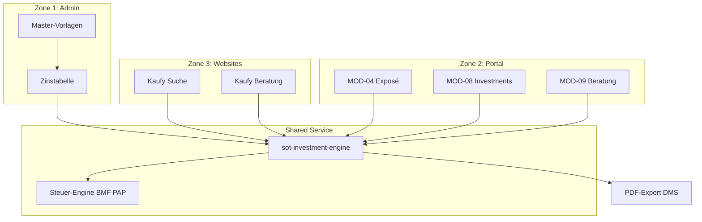

# Investment Engine Specification v3.0

> **Status:** FROZEN | **Owner:** Zone 1 (Config) + Shared Service  
> **Edge Function:** `sot-investment-engine` | **API Range:** 200-299

---

## 1. Übersicht & Einsatzorte

Die Investment Engine ist die **zentrale Berechnungslogik** für alle Kapitalanlage-Kalkulationen im System. Sie garantiert **identische Ergebnisse** über alle Touchpoints hinweg.

### Einsatzorte

| Zone | Modul/Seite | Funktion | PDF-Export |
|------|-------------|----------|------------|
| **Zone 3** | Kaufy Website `/kaufy/suche` | Anonyme Suche nach Monatsbelastung | ✅ |
| **Zone 3** | Kaufy Beratung `/kaufy/beratung` | Investment-Rechner mit Erklärungen | ✅ |
| **Zone 2** | MOD-04 Immobilien (Exposé) | Objekt-Kalkulation mit Slidern | ✅ |
| **Zone 2** | MOD-08 Investments `/portal/investments` | Ankauf-Bewertung & Favoriten | ✅ |
| **Zone 2** | MOD-09 Vertriebspartner `/portal/vertriebspartner/beratung` | Kundenberatung mit Kalkulation | ✅ |
| **Zone 1** | Admin Master-Vorlagen | Pflege der Zinstabellen | ❌ |

---

## 2. Zone 1: Master-Konfiguration

### 2.1 Admin-Bereich: Master-Vorlagen

**Route:** `/admin/master-templates` (neuer Reiter unter Einstellungen)

#### Zinstabelle (Pflichtfelder)

| Zinsbindung | LTV ≤60% | LTV ≤80% | LTV ≤90% | LTV ≤100% |
|-------------|----------|----------|----------|-----------|
| 5 Jahre | 3.60% | 3.70% | 3.90% | 4.20% |
| 10 Jahre | 3.70% | 3.80% | 4.00% | 4.30% |
| **15 Jahre** | **4.00%** | **4.00%** | **4.20%** | **4.50%** |
| 20 Jahre | 4.10% | 4.20% | 4.40% | 4.70% |

*Stand: Januar 2026 – Quelle: Finanztip/Statista*

#### Weitere Master-Daten

- **Standard-AfA-Satz:** 2% (linear)
- **AfA-Modelle:** 7i, 7h, 7b (Slot für spätere Erweiterung)
- **Nebenkosten-Pauschale:** Grunderwerbsteuer nach Bundesland
- **Instandhaltung:** €0.40/qm Standard

---

## 3. Benutzer-Inputs

### 3.1 Such-Eingabe (Zone 3 Kaufy + Zone 2 Investments)

```typescript
interface InvestmentSearchInput {
  // Pflichtfelder
  taxableIncome: number;           // Zu versteuerndes Einkommen (zvE)
  equity: number;                  // Verfügbares Eigenkapital
  maritalStatus: 'single' | 'married';  // Grundtabelle / Splittingtarif
  churchTax: boolean;              // Kirchensteuerpflicht
  
  // Optional
  churchTaxRate?: 0.08 | 0.09;     // 8% Bayern/BaWü, 9% Rest
  maxMonthlyBurden?: number;       // Filter: Max. Monatsbelastung
  preferredCities?: string[];      // Standort-Filter
  propertyTypes?: string[];        // Objekttyp-Filter
}
```

### 3.2 Objekt-Justierung (Exposé-Seite mit Slidern)

```typescript
interface PropertyAdjustmentInput {
  // Slider-Werte (justierbar auf Exposé-Seite)
  repaymentRate: number;           // Tilgungssatz: 1-5% (Standard: 1%)
  equityRatio: number;             // EK-Anteil: 0-30% (Standard: 8%)
  fixedInterestPeriod: 5 | 10 | 15 | 20;  // Zinsbindung (Standard: 15)
  
  // Prognose-Parameter
  rentGrowth: number;              // Mietsteigerung p.a.: 0-4% (Standard: 2%)
  valueGrowth: number;             // Wertentwicklung p.a.: 0-4% (Standard: 2%)
}
```

---

## 4. Berechnungslogik

### 4.1 Finanzierung

```
Darlehen = Kaufpreis + Erwerbsnebenkosten - Eigenkapital
LTV = Darlehen / Kaufpreis × 100
Zinssatz = lookup(Zinstabelle, LTV, Zinsbindung)
Annuität = Darlehen × (Zinssatz + Tilgungssatz)
```

### 4.2 Einnahmen & Ausgaben (jährlich)

```
EINNAHMEN:
  + Nettomieteinnahmen (ggf. × Mietsteigerung^Jahr)

AUSGABEN:
  - WEG-Verwaltung (monatlich × 12)
  - Instandhaltungskosten (€/qm × Fläche)
  - Zinsen (abnehmend über Laufzeit, Annuitätenrechnung)
  - Tilgung (Vermögensaufbau, nicht liquiditätswirksam)
```

### 4.3 Steuerliche Betrachtung (BMF PAP 2026)

```typescript
// V+V-Ergebnis (Einkünfte aus Vermietung und Verpachtung)
VuV = Mieteinnahmen - AfA - Verwaltung - Instandhaltung - Zinsen

// Neues zu versteuerndes Einkommen
zvE_neu = zvE_alt + VuV

// Steuerberechnung nach PAP
if (maritalStatus === 'married') {
  // Splittingtarif: zvE halbieren, Steuer verdoppeln
  steuer = 2 × berechneSteuer(zvE_neu / 2)
} else {
  steuer = berechneSteuer(zvE_neu)
}

// Solidaritätszuschlag (5.5% wenn ESt > Freigrenze)
soli = steuer > 18130 ? steuer × 0.055 : 0

// Kirchensteuer
kist = churchTax ? steuer × churchTaxRate : 0

// Steuerersparnis durch Immobilie
ersparnis = (steuer_alt + soli_alt + kist_alt) - (steuer_neu + soli_neu + kist_neu)
```

### 4.4 Liquiditätsberechnung

```
LIQUIDITÄT (monatlich) =
  + Mieteinnahmen / 12
  - Zinsen / 12
  - Verwaltung / 12
  - Instandhaltung / 12
  + Steuerersparnis / 12
  - Tilgung / 12           ← Vermögensaufbau (Reinvestition)
  
= MONATLICHE BELASTUNG    ← Kernwert für Suche & Darstellung
```

### 4.5 Vermögensentwicklung (40-Jahres-Projektion)

```typescript
interface YearlyProjection {
  year: number;
  
  // Finanzierung
  interestPayment: number;
  principalPayment: number;
  remainingDebt: number;
  
  // Cashflow
  rentalIncome: number;
  operatingCosts: number;
  taxEffect: number;
  netCashflow: number;
  cumulativeCashflow: number;
  
  // Vermögen
  propertyValue: number;
  netEquity: number;        // Objektwert - Restschuld
  equityReturn: number;     // EK-Rendite
}
```

---

## 5. Output-Schema

### 5.1 Suchergebnis-Karte (Zone 3 + Zone 2)

```typescript
interface PropertySearchResult {
  property: {
    id: string;
    publicId: string;
    title: string;
    address: string;
    city: string;
    purchasePrice: number;
    area: number;
    monthlyRent: number;
    imageUrl?: string;
  };
  
  // ★ KERNWERTE für Sortierung & Filter
  monthlyBurden: number;           // Monatliche Belastung
  yearlyBurden: number;            // Jährliche Belastung
  
  // Einnahmen-Seite
  income: {
    monthlyRent: number;           // Kaltmiete
    yearlyRent: number;
    taxSavingsMonthly: number;     // Steuerersparnis
    taxSavingsYearly: number;
  };
  
  // Ausgaben-Seite
  expenses: {
    interestMonthly: number;       // Zinsen
    managementMonthly: number;     // Verwaltung
    maintenanceMonthly: number;    // Instandhaltung
    repaymentMonthly: number;      // Tilgung (neutral)
  };
  
  // Kennzahlen
  metrics: {
    grossYield: number;            // Bruttomietrendite
    netYield: number;              // Nettomietrendite
    equityReturnYear1: number;     // EK-Rendite Jahr 1
    year40NetWealth: number;       // Nettovermögen nach 40 Jahren
    totalRentIncome40y: number;    // Kumulierte Miete 40 Jahre
    totalTaxSavings40y: number;    // Kumulierte Steuerersparnis
  };
  
  // Finanzierung
  financing: {
    loanAmount: number;
    interestRate: number;
    ltv: number;
    fixedInterestPeriod: number;
  };
}
```

### 5.2 Detail-Ansicht (Exposé mit Slidern)

```typescript
interface PropertyDetailCalculation extends PropertySearchResult {
  // Slider-Einstellungen (aktuell)
  adjustments: PropertyAdjustmentInput;
  
  // 40-Jahres-Projektion
  projection: YearlyProjection[];
  
  // Zusammenfassung
  summary: {
    totalInvestment: number;       // Kaufpreis + NK
    equityRequired: number;        // Eigenkapitalbedarf
    monthlyRateTotal: number;      // Annuität gesamt
    breakEvenYear: number;         // Jahr mit positivem Cashflow
    payoffYear: number;            // Jahr der Volltilgung
  };
}
```

---

## 6. UI-Komponenten

### 6.1 Ergebnis-Darstellung (Karte)

```
┌─────────────────────────────────────────────┐
│ [Bild]  Musterstraße 12, München            │
│         2-Zimmer-Wohnung, 36 qm             │
│                                             │
│  KAUFPREIS        MONATSBELASTUNG           │
│  377.895 €        -257 €                    │
│                                             │
│  ─────────────────────────────────────────  │
│  Einnahmen:                                 │
│    Miete            + 950 €                 │
│    Steuerersparnis  + 274 €                 │
│                                             │
│  Ausgaben:                                  │
│    Zinsen           - 1.131 €               │
│    Verwaltung       - 44 €                  │
│    Tilgung          - 306 € (Vermögen)      │
│                                             │
│  ═══════════════════════════════════════    │
│  Netto-Belastung:   -257 € / Monat          │
│                                             │
│  [Details ansehen]  [♡ Merken]  [PDF ↓]     │
└─────────────────────────────────────────────┘
```

### 6.2 Exposé-Slider (Justierung)

```
┌─────────────────────────────────────────────┐
│ Finanzierung anpassen                       │
│                                             │
│ Tilgung:        ●───────────○ 1.0%          │
│ Eigenkapital:   ●───────────○ 8%            │
│ Zinsbindung:    [5] [10] [15*] [20]         │
│                                             │
│ Prognose                                    │
│ Mietsteigerung: ●───────────○ 2.0% p.a.     │
│ Wertentwicklung:●───────────○ 2.0% p.a.     │
│                                             │
│ [Berechnung aktualisieren]                  │
└─────────────────────────────────────────────┘
```

---

## 7. PDF-Export

### Verfügbarkeit

Jede Seite mit Investment-Berechnung **MUSS** einen PDF-Export-Button haben:

| Seite | PDF-Inhalt |
|-------|------------|
| Zone 3 Kaufy Suche | Objekt-Zusammenfassung + Berechnung |
| Zone 3 Kaufy Beratung | Simulationsergebnis |
| Zone 2 MOD-04 Exposé | Vollständiges Exposé mit 40-Jahres-Plan |
| Zone 2 MOD-08 Investments | Bewertungs-Übersicht |
| Zone 2 MOD-09 Beratung | Beratungsprotokoll mit Berechnung |

### PDF-Struktur

1. **Kopf:** Logo, Datum, Disclaimer
2. **Objektdaten:** Adresse, Fläche, Baujahr, Miete
3. **Finanzierung:** Kaufpreis, Nebenkosten, Darlehen, Zinssatz
4. **Einnahmen/Ausgaben:** Monatliche + jährliche Aufstellung
5. **Steuerberechnung:** VuV-Ergebnis, Steuerersparnis
6. **Vermögensentwicklung:** 40-Jahres-Tabelle + Diagramm
7. **Fußzeile:** Rechtliche Hinweise (aus Excel übernommen)

---

## 8. Datenfluss



---

## 9. API-Endpunkte

### 9.1 Berechnung

```
POST /functions/v1/sot-investment-engine
Content-Type: application/json
Authorization: Bearer <optional-jwt>

{
  "action": "calculate",
  "input": InvestmentSearchInput,
  "propertyId": "uuid",           // optional für spezifisches Objekt
  "adjustments": PropertyAdjustmentInput  // optional
}

Response: PropertyDetailCalculation
```

### 9.2 Suche mit Berechnung

```
POST /functions/v1/sot-investment-engine
{
  "action": "search",
  "input": InvestmentSearchInput,
  "filters": {
    "maxPrice": 500000,
    "cities": ["München", "Berlin"],
    "maxMonthlyBurden": 300
  },
  "sort": "monthlyBurden",
  "limit": 20
}

Response: PropertySearchResult[]
```

### 9.3 PDF-Export

```
POST /functions/v1/sot-investment-engine
{
  "action": "export-pdf",
  "calculation": PropertyDetailCalculation,
  "template": "expose" | "summary" | "advisory"
}

Response: { documentId: string, downloadUrl: string }
```

---

## 10. Rechtliche Hinweise (Pflicht im PDF)

> Die folgenden Informationen stellen keine Anlageberatung dar. Jede Entscheidung zur Kapitalanlage sollte nach individueller Prüfung und Beratung durch qualifizierte Fachleute getroffen werden.
>
> Die Wertentwicklung von Immobilien kann Schwankungen unterliegen. Steuerliche Auswirkungen können sich je nach individueller Situation unterscheiden. Es wird empfohlen, einen Steuerberater zu konsultieren.
>
> Diese Musterberechnungen basieren auf aktuellen rechtlichen Bestimmungen und Annahmen, die sich ändern können.

---

## Changelog

| Version | Datum | Änderung |
|---------|-------|----------|
| 3.0 | 2026-01-26 | Vollständige Spezifikation mit Zone-Integration |
| 2.0 | 2026-01-25 | Güterstand + Kirchensteuer ergänzt |
| 1.0 | 2026-01-24 | Initiale Engine-Definition |
