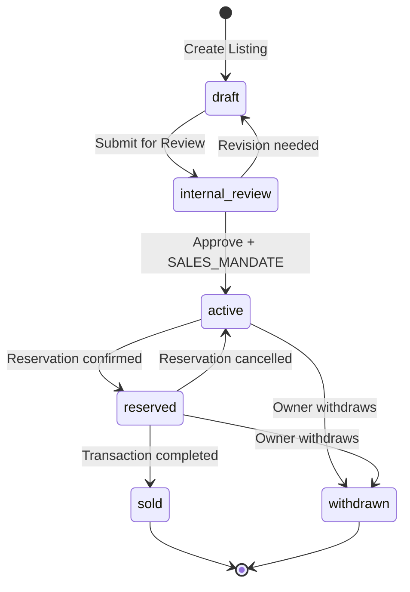
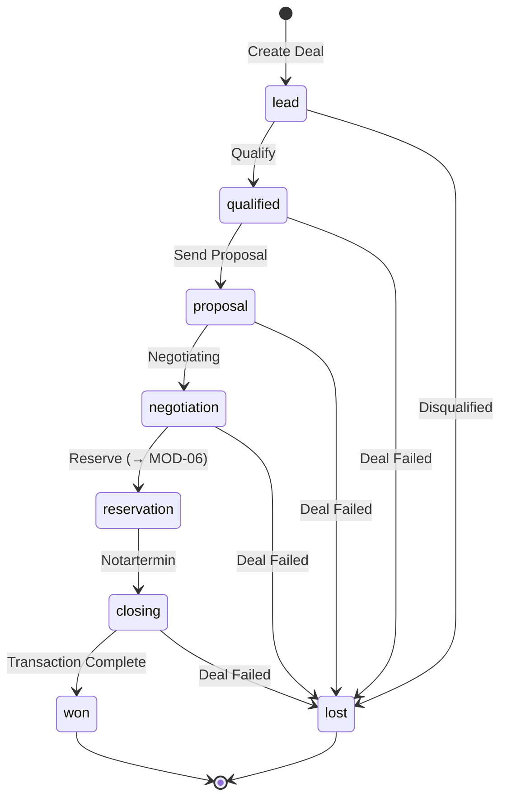
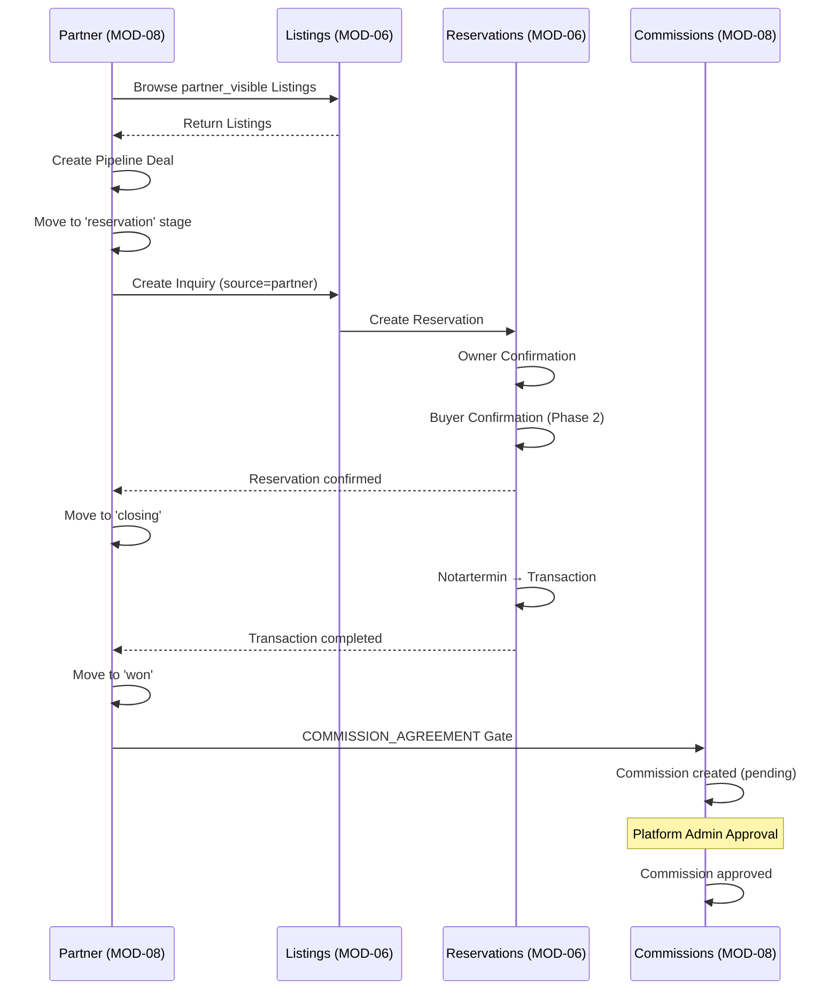
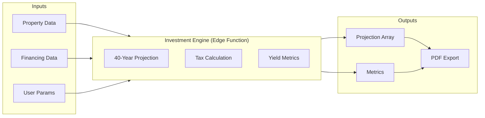

# MOD-06 & MOD-08 — SHARED DOMAIN & APIs

**Version:** v1.1.0  
**Status:** SPEC READY  
**Datum:** 2026-01-25  
**Zweck:** Gemeinsame Domänen-Definitionen und API-Contracts für MOD-06 (Verkauf) und MOD-08 (Vertriebspartner)

---

## 1) DOMAIN OWNERSHIP MATRIX

### Tabellen-Ownership

| Tabelle | Owner | MOD-06 Access | MOD-08 Access |
|---------|-------|---------------|---------------|
| `listings` | MOD-06 | CRUD | Read (partner_visible only) |
| `listing_inquiries` | MOD-06 | CRUD | Write (via Partner-Referral) |
| `reservations` | MOD-06 | CRUD | Read (Status) |
| `transactions` | MOD-06 | CRUD | Read (nach Completion) |
| `partner_pipelines` | MOD-08 | Read (Status-Sync) | CRUD |
| `investment_profiles` | MOD-08 | — | CRUD |
| `commissions` | MOD-08 | Trigger | CRUD |
| `investment_simulations` | MOD-08 | — | CRUD |
| `partner_listing_views` | MOD-08 | Read (Analytics) | Write |

### Shared Read Contracts

| Contract | Anbieter | Konsument | Filter |
|----------|----------|-----------|--------|
| Partner-Listings | MOD-06 | MOD-08 | `partner_visible = true` |
| Listing-Status | MOD-06 | MOD-08 | Via listing_id FK |
| Reservation-Status | MOD-06 | MOD-08 | Via reservation_id FK |
| Property-Data | MOD-04 | MOD-06, MOD-08 | Via property_id FK |

---

## 2) LIFECYCLE DIAGRAMS

### 2.1 Listing Lifecycle (MOD-06)



### 2.2 Pipeline Lifecycle (MOD-08)



### 2.3 Cross-Module Flow: Partner Deal to Reservation



### 2.4 Investment Engine Data Flow



---

## 3) SHARED API CONTRACTS

### 3.1 Consent Gates

| Gate | Code | Trigger | Required By |
|------|------|---------|-------------|
| Sales Mandate | `SALES_MANDATE` | Listing Activation | MOD-06 |
| Commission Agreement | `COMMISSION_AGREEMENT` | Commission Trigger | MOD-08 |
| Data Sharing | `DATA_SHARING_FUTURE_ROOM` | Data Room Handoff | MOD-07 |

### 3.2 Audit Events (Standardisiert)

#### MOD-06 Events

| Event | Category | Payload Minimum |
|-------|----------|-----------------|
| `listing.created` | sales | listing_id, property_id, created_by |
| `listing.activated` | sales | listing_id, published_at |
| `listing.reserved` | sales | listing_id, reservation_id |
| `listing.sold` | sales | listing_id, transaction_id, final_price |
| `listing.withdrawn` | sales | listing_id, reason |
| `inquiry.created` | sales | inquiry_id, listing_id, source |
| `inquiry.qualified` | sales | inquiry_id |
| `inquiry.converted` | sales | inquiry_id, reservation_id |
| `reservation.created` | sales | reservation_id, listing_id, buyer_contact_id |
| `reservation.owner_confirmed` | sales | reservation_id |
| `reservation.confirmed` | sales | reservation_id |
| `reservation.cancelled` | sales | reservation_id, reason |
| `transaction.created` | sales | transaction_id, reservation_id |
| `transaction.notarized` | sales | transaction_id, notary_date |
| `transaction.completed` | sales | transaction_id, final_price |

#### MOD-08 Events

| Event | Category | Payload Minimum |
|-------|----------|-----------------|
| `pipeline.created` | partner | pipeline_id, listing_id, partner_user_id |
| `pipeline.stage_changed` | partner | pipeline_id, old_stage, new_stage |
| `pipeline.won` | partner | pipeline_id, deal_value |
| `pipeline.lost` | partner | pipeline_id, reason |
| `simulation.created` | partner | simulation_id, property_id, created_by |
| `profile.created` | partner | profile_id, contact_id |
| `profile.updated` | partner | profile_id, changed_fields |
| `commission.created` | partner | commission_id, amount, pipeline_id |
| `commission.agreement_signed` | partner | commission_id, consent_id |
| `commission.approved` | partner | commission_id, approved_by |
| `commission.invoiced` | partner | commission_id, invoice_id |
| `commission.paid` | partner | commission_id, paid_at |
| `listing.viewed` | partner | listing_id, partner_user_id |

---

## 4) INVESTMENT ENGINE CONTRACT

### 4.1 Edge Function: `sot-investment-engine`

**Endpoint:** `POST /functions/v1/sot-investment-engine`

**Auth:** Bearer Token (Supabase)

### 4.2 Request Schema

```typescript
interface InvestmentEngineRequest {
  // Required
  purchase_price: number;       // Kaufpreis in €
  equity: number;               // Eigenkapital in €
  annual_rent: number;          // Jahresmiete in €
  
  // Optional (mit Defaults)
  interest_rate?: number;       // Default: Zone 1 Tabelle
  fixed_period?: number;        // 5, 10, 15 Jahre - Default: 10
  repayment_rate?: number;      // Default: 2%
  annual_costs?: number;        // Nebenkosten - Default: 0
  appreciation_rate?: number;   // Wertsteigerung - Default: 1%
  tax_rate?: number;            // zvE-basiert - Default: 42%
  regime?: 'PRIVATE' | 'BUSINESS'; // Default: PRIVATE
  
  // Context (optional)
  property_id?: string;
  contact_id?: string;
  pipeline_id?: string;
}
```

### 4.3 Response Schema

```typescript
interface InvestmentEngineResponse {
  success: boolean;
  
  projection: YearlyData[];     // 40 Jahre
  
  metrics: {
    equity_yield: number;       // Eigenkapitalrendite %
    total_yield: number;        // Gesamtrendite %
    amortization_year: number;  // Jahr der Amortisation
    total_tax_benefit: number;  // Steuerersparnis gesamt
    break_even_rent: number;    // Break-Even Miete
    max_loan: number;           // Max. Darlehen für Cashflow-Neutralität
  };
  
  financing: {
    loan_amount: number;
    monthly_rate: number;
    annual_interest: number;
    annual_repayment: number;
  };
  
  engine_version: string;       // z.B. "1.0.0"
  calculated_at: string;        // ISO timestamp
}

interface YearlyData {
  year: number;
  rent_income: number;
  costs: number;
  interest: number;
  repayment: number;
  remaining_debt: number;
  property_value: number;
  cash_flow_before_tax: number;
  tax_effect: number;
  cash_flow_after_tax: number;
  cumulative_cash_flow: number;
}
```

### 4.4 Interest Rate Table (Zone 1)

| LTV Bracket | 5 Jahre | 10 Jahre | 15 Jahre |
|-------------|---------|----------|----------|
| ≤ 60% | 3.2% | 3.5% | 3.8% |
| 61-80% | 3.5% | 3.8% | 4.1% |
| 81-90% | 3.9% | 4.2% | 4.5% |
| > 90% | 4.3% | 4.6% | 5.0% |

**Note:** Tabelle wird von Zone 1 gepflegt und versioned.

---

## 5) CROSS-MODULE API ENDPOINTS

### 5.1 MOD-06 → MOD-08 (Listings for Partners)

```
GET /verkauf/listings/partner-visible
Query: { city?, price_min?, price_max?, type? }
Response: Listing[] (filtered by partner_visible=true)
Auth: sales_partner
```

### 5.2 MOD-08 → MOD-06 (Partner Referral)

```
POST /verkauf/inquiries
Body: { 
  listing_id, 
  source: 'partner', 
  partner_pipeline_id,
  contact_id,
  message
}
Response: Inquiry
Auth: sales_partner
```

### 5.3 MOD-08 → MOD-07 (Financing Handoff)

```
Link: /portal/finanzierung?property_id={id}&contact_id={id}&pipeline_id={id}
```

---

## 6) RLS POLICIES

### 6.1 listings

```sql
-- Tenant Members can read
CREATE POLICY "Tenant members read listings" ON listings
FOR SELECT USING (
  EXISTS (SELECT 1 FROM memberships WHERE tenant_id = listings.tenant_id AND user_id = auth.uid())
);

-- Partners can read partner_visible only
CREATE POLICY "Partners read partner_visible" ON listings
FOR SELECT USING (
  partner_visible = true
  AND EXISTS (
    SELECT 1 FROM memberships 
    WHERE tenant_id = listings.tenant_id 
    AND user_id = auth.uid() 
    AND role = 'sales_partner'
  )
);

-- Org Admin can CRUD
CREATE POLICY "Org admin manage listings" ON listings
FOR ALL USING (
  EXISTS (
    SELECT 1 FROM memberships 
    WHERE tenant_id = listings.tenant_id 
    AND user_id = auth.uid() 
    AND role IN ('org_admin', 'internal_ops')
  )
);
```

### 6.2 partner_pipelines

```sql
-- Partners see own pipelines
CREATE POLICY "Partners own pipelines" ON partner_pipelines
FOR ALL USING (
  assigned_to = auth.uid()
  OR EXISTS (
    SELECT 1 FROM memberships 
    WHERE tenant_id = partner_pipelines.tenant_id 
    AND user_id = auth.uid() 
    AND role IN ('org_admin', 'platform_admin')
  )
);
```

### 6.3 commissions

```sql
-- Partners see own commissions
CREATE POLICY "Partners own commissions" ON commissions
FOR SELECT USING (
  EXISTS (
    SELECT 1 FROM partner_pipelines pp
    WHERE pp.id = commissions.pipeline_id
    AND pp.assigned_to = auth.uid()
  )
  OR EXISTS (
    SELECT 1 FROM memberships 
    WHERE tenant_id = commissions.tenant_id 
    AND user_id = auth.uid() 
    AND role IN ('org_admin', 'platform_admin')
  )
);

-- Only platform_admin can approve
CREATE POLICY "Platform admin approve commissions" ON commissions
FOR UPDATE USING (
  EXISTS (
    SELECT 1 FROM memberships 
    WHERE user_id = auth.uid() 
    AND role = 'platform_admin'
  )
);
```

---

## 7) CONFLICT CHECKS

### Keine Konflikte identifiziert:

| Check | Status | Erklärung |
|-------|--------|-----------|
| Route-Overlap | ✓ | MOD-06 = `/verkauf/*`, MOD-08 = `/vertriebspartner/*` |
| Tabellen-Overlap | ✓ | Ownership klar getrennt |
| Zone-Trennung | ✓ | Beide in Zone 2, keine Zone-1-Workflows |
| Consent-Codes | ✓ | SALES_MANDATE (MOD-06), COMMISSION_AGREEMENT (MOD-08) |
| Trigger-Flags | ✓ | sale_enabled (MOD-04) triggert MOD-06, partner_visible (MOD-06) triggert MOD-08 |

---

## 8) IMPLEMENTATION NOTES

### Phase 1 MVP

1. **MOD-06:**
   - Listings CRUD
   - Inquiries CRUD
   - Reservations (Owner Confirmation only)
   - Transactions (Manual)

2. **MOD-08:**
   - Pipeline Kanban
   - Listings Read-only
   - Investment Engine Basic
   - Commissions (Manual Approval)

### Phase 2

1. **MOD-06:**
   - Buyer Confirmation
   - Zone 3 Public Listings
   - Automated Transaction Docs

2. **MOD-08:**
   - Commission Payout (Stripe Connect)
   - Multi-Level Partners
   - Advanced Matching Algorithm

---

## PLAN_MARKER_B

**Datum:** 2026-01-25  
**Abgeschlossen:**
- IST-Zustand Prüfbericht (MOD-01..05)
- Open Questions Re-Audit
- MOD-06 Spezifikation
- MOD-08 Spezifikation
- Shared Domain & APIs

**Nächste Schritte:**
1. Route-Drift in MOD-03 bereinigen
2. Dynamische Routes in App.tsx ergänzen
3. Investment Engine Edge Function spezifizieren
4. DB-Schema für neue Tabellen erstellen
5. Consent-Templates für SALES_MANDATE/COMMISSION_AGREEMENT
