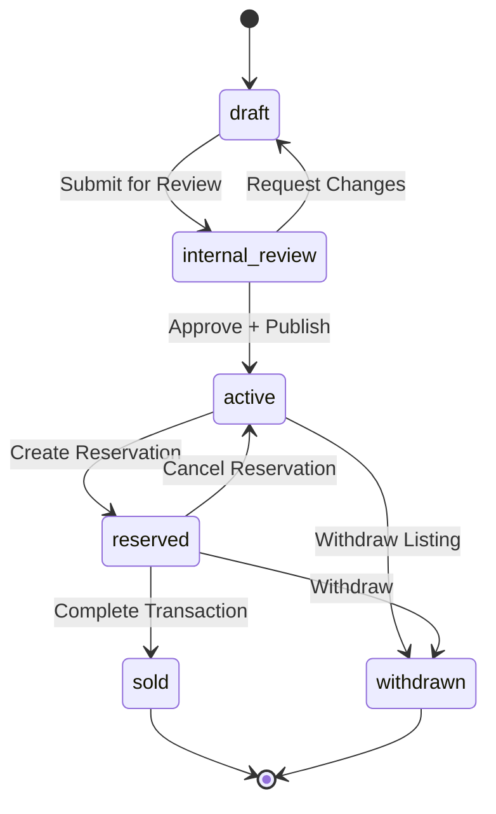
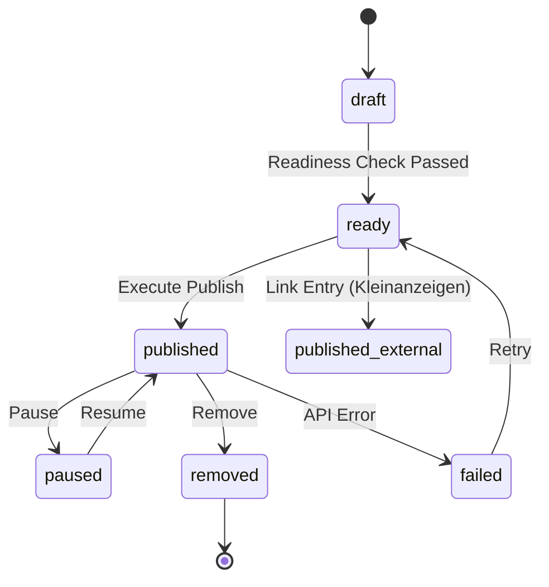
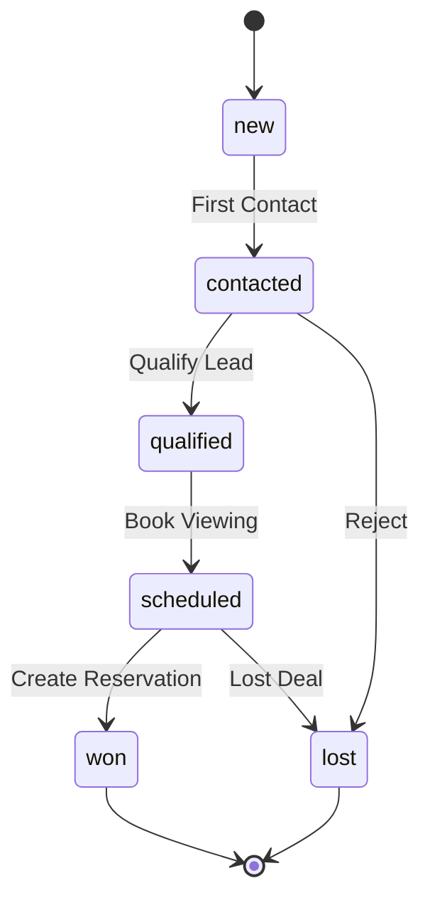
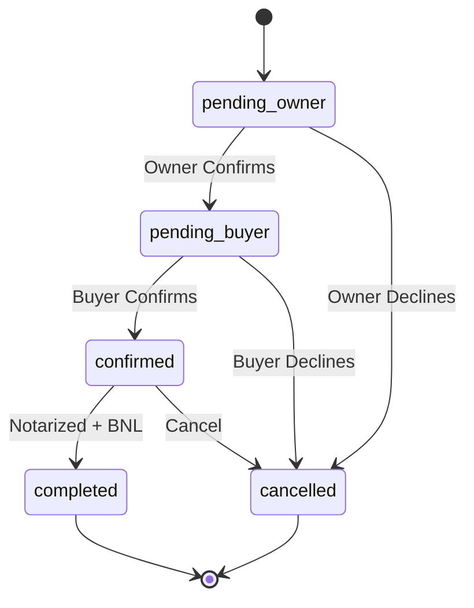
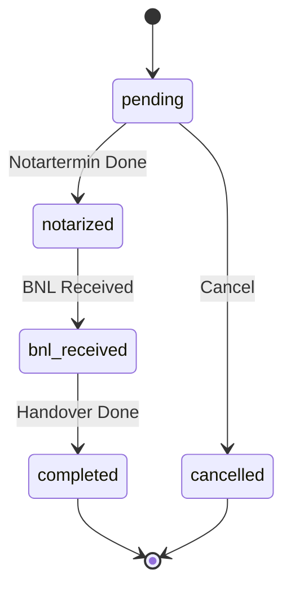
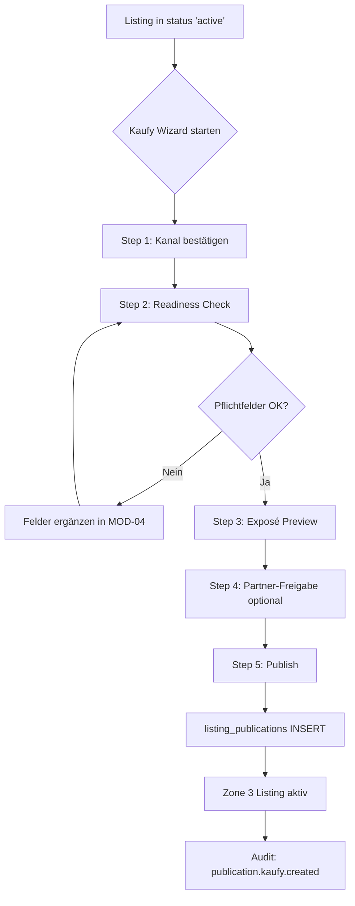
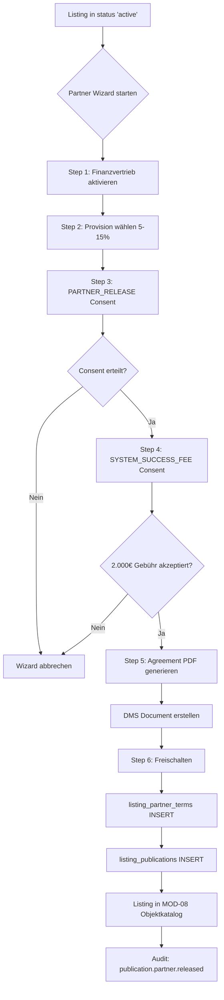

# MOD-06 — VERKAUF (Sales & Listings)

**Version:** v2.0.0  
**Status:** SPEC COMPLETE  
**Letzte Aktualisierung:** 2026-01-25  
**Zone:** 2 (User Portal)  
**Route-Prefix:** `/portal/verkauf`  
**Typ:** Standard-Modul (alle Tenants)  
**Abhängig von:** MOD-04 (Properties), MOD-01 (Contacts), MOD-03 (DMS), Backbone (Consents, Audit)

---

## 1) MODULDEFINITION

### 1.1 Ziel

MOD-06 „Verkauf" ist das operative Modul für den Immobilienverkauf aus **Eigentümersicht**. Es transformiert Properties (MOD-04) in verkaufsfähige Listings und verwaltet den gesamten Sales-Lifecycle bis zur Transaktion.

**Kernfunktion:** Veröffentlichung von Objekten über 4 Kanäle + Management des gesamten Verkaufsprozesses.

### 1.2 Nutzerrollen

| Rolle | Zugang | Beschreibung |
|-------|--------|--------------|
| org_admin | Full | Listings erstellen, aktivieren, Deals abschließen |
| internal_ops | Write | Listings bearbeiten, Anfragen bearbeiten |
| sales_partner | Read | Nur Partner-sichtbare Listings (via MOD-08) |

### 1.3 Scope IN (testbar)

- Listing aus Property erstellen (mit SALES_MANDATE Consent)
- Listing-Lifecycle: draft → review → active → reserved → sold/withdrawn
- **4 Publishing-Kanäle:** Kaufy, Scout24, Kleinanzeigen, Partner-Netzwerk
- Partner-Visibility Flags setzen
- Inquiry Management (Anfragen erfassen, zuordnen)
- Reservation Workflow
- Transaction Documentation (Notartermin, BNL)
- DMS-Integration für Verkaufsunterlagen

### 1.4 Scope OUT (Nicht-Ziele)

- Partner-Pipeline Management (→ MOD-08)
- Commission Berechnung/Auszahlung (→ MOD-08)
- Financing Package Creation (→ MOD-07)
- Lead-Generierung/Ads (→ MOD-09)

### 1.5 Source of Truth Matrix

| Domäne | SoT-Modul | Andere Module |
|--------|-----------|---------------|
| Listings | **MOD-06** | MOD-08: Read-only |
| listing_publications | **MOD-06** | — |
| listing_partner_terms | **MOD-06** | MOD-08: Read |
| Inquiries | **MOD-06** | — |
| Reservations | **MOD-06** | MOD-08: Status-Read |
| Transactions | **MOD-06** | — |
| Properties | MOD-04 | MOD-06: Read-only |
| Partner Pipelines | MOD-08 | MOD-06: — |

---

## 2) ROUTE-STRUKTUR (SoT App.tsx)

| Route | UI-Label | Screen | Beschreibung |
|-------|----------|--------|--------------|
| `/portal/verkauf` | Dashboard | VerkaufDashboard | KPIs, Pipeline-Overview, Alerts |
| `/portal/verkauf/objekte` | Objekte | VerkaufObjekte | Listing-Liste mit Filtern |
| `/portal/verkauf/aktivitaeten` | Aktivitäten | VerkaufAktivitaeten | Timeline, Logs |
| `/portal/verkauf/anfragen` | Anfragen | VerkaufAnfragen | Inquiry Management |
| `/portal/verkauf/vorgaenge` | Vorgänge | VerkaufVorgaenge | Reservations + Transactions |

### Dynamische Routes (Phase 2)

| Route | Screen |
|-------|--------|
| `/portal/verkauf/objekte/new` | Listing erstellen |
| `/portal/verkauf/objekte/:id` | Listing Detail |
| `/portal/verkauf/objekte/:id/publish` | Publishing Wizard |
| `/portal/verkauf/anfragen/:id` | Inquiry Detail |
| `/portal/verkauf/vorgaenge/:id` | Reservation/Transaction Detail |

---

## 3) PUBLISHING-KANÄLE (4 Channels)

### 3.1 Übersicht

| Kanal | Kosten | Gate/Agreements | Zielgruppe |
|-------|--------|-----------------|------------|
| **Kaufy** | Kostenlos | SALES_MANDATE | Öffentlich (Zone 3) |
| **Immobilienscout24** | Bezahlt (Credits) | SCOUT24_CREDITS | Öffentlich |
| **eBay Kleinanzeigen** | Link-Eintrag | — | Öffentlich (extern) |
| **Partner-Netzwerk** | Kostenlos | PARTNER_RELEASE + SYSTEM_FEE | Finanzvertrieb |

### 3.2 Kaufy Publishing Wizard (kostenfrei)

**Route:** `/portal/verkauf/objekte/:id/publish?channel=kaufy`

| Step | Titel | Validierung | Output |
|------|-------|-------------|--------|
| 1 | Kanal bestätigen | — | channel='kaufy' |
| 2 | Readiness Check | Pflichtfelder prüfen | validation_result |
| 3 | Exposé Preview | Web-Preview anzeigen | preview_rendered |
| 4 | Partner-Freigabe (optional) | Toggle global/selektiv | partner_config |
| 5 | Publish | — | publication_record |

**Readiness Pflichtfelder:**
- Adresse, Ort, PLZ
- Objektart, Nutzungsart
- Gesamtfläche
- Preis (Angebotspreis ODER Marktwert)
- Mindestens 3 Fotos
- Kurzbeschreibung (min. 100 Zeichen)
- Energieausweis-Infos
- Rechtlicher Disclaimer akzeptiert

**Output:**
- `listing_publications` INSERT (channel='kaufy', status='published')
- Zone 3 Listing wird sichtbar
- Audit: `publication.kaufy.created`

### 3.3 Scout24 Publishing Wizard (bezahlt)

**Route:** `/portal/verkauf/objekte/:id/publish?channel=scout24`

| Step | Titel | Validierung | Output |
|------|-------|-------------|--------|
| 1 | Kostenhinweis | Credits anzeigen | cost_acknowledged |
| 2 | Feld-Mapping | Scout24-Pflichtfelder | mapping_complete |
| 3 | Credit-Approval | Zahlung/Credit-Check | payment_approved |
| 4 | Export Job | Status-Tracking | export_job_id |
| 5 | Bestätigung | — | publication_record |

**Scout24 Pflichtfelder (Mapping-Liste):**
- objektart, nutzungsart, baujahr
- wohnflaeche, grundstuecksflaeche
- zimmer, etage
- kaufpreis, provision
- heizungsart, energieausweis
- Mindestens 5 Fotos

**Kosten:** Via Credits-System (Action Cost Catalog, Phase 2 definiert)

**Fehlerfälle:**
- Fehlende Pflichtfelder → Wizard blockiert in Step 2
- Zahlung fehlgeschlagen → Retry oder Abbruch
- API-Fehler → Status 'failed' + Retry-Option

### 3.4 eBay Kleinanzeigen Wizard (Link-Eintrag)

**Route:** `/portal/verkauf/objekte/:id/publish?channel=kleinanzeigen`

| Step | Titel | Validierung | Output |
|------|-------|-------------|--------|
| 1 | URL eingeben | URL-Format | external_url |
| 2 | Optional: Screenshot | DMS-Upload | screenshot_doc_id |
| 3 | Speichern | — | publication_record |

**Output:**
- `listing_publications` INSERT (channel='kleinanzeigen', status='published_external', external_url)
- Audit: `publication.kleinanzeigen.linked`

**Aktionen:**
- Link aktualisieren
- Link entfernen (status → 'removed')

### 3.5 Partner-Netzwerk / Finanzvertrieb Wizard

**Route:** `/portal/verkauf/objekte/:id/publish?channel=partner`

| Step | Titel | Validierung | Output |
|------|-------|-------------|--------|
| 1 | Finanzvertrieb aktivieren | Toggle | finance_distribution_enabled |
| 2 | Provision festlegen | 5–15% Range | partner_commission_rate |
| 3 | Provisionsvereinbarung | PARTNER_RELEASE Consent | consent_partner_release_id |
| 4 | Systemgebühr Agreement | SYSTEM_SUCCESS_FEE Consent | consent_system_fee_id |
| 5 | PDF generieren | DMS-Link | agreement_doc_id |
| 6 | Freischalten | — | publication_record |

**Partner-Provisions-Modell:**
- **Partner-Provision:** 5–15% (Eigentümer wählt)
- **Split bei Zone-1-Leads:** 1/3 Platform : 2/3 Partner
- **Systemgebühr:** 2.000€ erfolgsabhängig (nur bei Closing)

**Consent Codes:**
- `PARTNER_RELEASE`: Freigabe für Partner-Netzwerk
- `SYSTEM_SUCCESS_FEE_2000`: Erfolgsgebühr bei Closing

**Output:**
- `listing_partner_terms` INSERT/UPDATE
- `listing_publications` INSERT (channel='partner_network')
- Listing erscheint in MOD-08 Objektkatalog
- Agreement-PDF in DMS
- Audit: `publication.partner.released`

---

## 4) DATENMODELL

### 4.1 Tabellen-Übersicht

| Tabelle | Owner | Beschreibung |
|---------|-------|--------------|
| listings | MOD-06 | Haupt-Listing-Objekte |
| listing_publications | MOD-06 | Pro Kanal: Status, Config |
| listing_partner_terms | MOD-06 | Provision, Gebühren, Agreements |
| listing_inquiries | MOD-06 | Anfragen/Interessenten |
| listing_activities | MOD-06 | Timeline/Audit-Stream |
| reservations | MOD-06 | Reservierungs-Workflow |
| transactions | MOD-06 | Notarielle Abwicklung |

### 4.2 `listings` (Haupt-Tabelle)

| Feld | Typ | Pflicht | Beschreibung |
|------|-----|---------|--------------|
| id | uuid PK | Ja | — |
| tenant_id | uuid FK | Ja | Tenant-Isolation |
| public_id | text | Ja | `SOT-L-XXXXXXXX` |
| property_id | uuid FK | Ja | Referenz zu properties |
| status | listing_status | Ja | Lifecycle-Status |
| asking_price | numeric | Nein | Angebotspreis |
| min_price | numeric | Nein | Mindestpreis (intern) |
| expose_document_id | uuid FK | Nein | Haupt-Exposé im DMS |
| sales_mandate_consent_id | uuid FK | Ja | SALES_MANDATE Consent |
| published_at | timestamptz | Nein | Erstaktivierung |
| reserved_at | timestamptz | Nein | Reservierungszeitpunkt |
| sold_at | timestamptz | Nein | Verkaufszeitpunkt |
| withdrawn_at | timestamptz | Nein | Rückzugszeitpunkt |
| created_by | uuid FK | Ja | Ersteller |
| created_at | timestamptz | Ja | — |
| updated_at | timestamptz | Ja | — |

### 4.3 `listing_publications` (Pro Kanal)

| Feld | Typ | Pflicht | Beschreibung |
|------|-----|---------|--------------|
| id | uuid PK | Ja | — |
| tenant_id | uuid FK | Ja | — |
| listing_id | uuid FK | Ja | — |
| channel | publication_channel | Ja | kaufy, scout24, kleinanzeigen, partner_network |
| status | publication_status | Ja | draft, ready, published, paused, removed, failed |
| external_url | text | Nein | Für Kleinanzeigen |
| external_id | text | Nein | Scout24 ID etc. |
| published_at | timestamptz | Nein | — |
| paused_at | timestamptz | Nein | — |
| removed_at | timestamptz | Nein | — |
| error_message | text | Nein | Bei failed |
| config | jsonb | Nein | Channel-spezifische Config |
| created_at | timestamptz | Ja | — |
| updated_at | timestamptz | Ja | — |

### 4.4 `listing_partner_terms` (Provision + Gebühren)

| Feld | Typ | Pflicht | Beschreibung |
|------|-----|---------|--------------|
| id | uuid PK | Ja | — |
| tenant_id | uuid FK | Ja | — |
| listing_id | uuid FK | Ja | UNIQUE |
| partner_commission_rate | numeric | Ja | 5.00–15.00 (Prozent) |
| finance_distribution_enabled | boolean | Ja | Finanzvertrieb aktiv |
| system_success_fee_enabled | boolean | Ja | 2.000€ Gebühr aktiv |
| partner_release_consent_id | uuid FK | Nein | PARTNER_RELEASE |
| system_fee_consent_id | uuid FK | Nein | SYSTEM_SUCCESS_FEE_2000 |
| agreement_document_id | uuid FK | Nein | PDF im DMS |
| global_release | boolean | Ja | Alle Partner oder selektiv |
| released_at | timestamptz | Nein | — |
| created_at | timestamptz | Ja | — |
| updated_at | timestamptz | Ja | — |

### 4.5 `listing_inquiries` (Anfragen)

| Feld | Typ | Pflicht | Beschreibung |
|------|-----|---------|--------------|
| id | uuid PK | Ja | — |
| tenant_id | uuid FK | Ja | — |
| public_id | text | Ja | `SOT-A-XXXXXXXX` |
| listing_id | uuid FK | Ja | — |
| contact_id | uuid FK | Nein | Interessent (wenn verknüpft) |
| source | inquiry_source | Ja | website, partner, direct, referral |
| status | inquiry_status | Ja | new, contacted, qualified, scheduled, won, lost |
| contact_name | text | Nein | — |
| contact_email | text | Nein | — |
| contact_phone | text | Nein | — |
| message | text | Nein | Anfrage-Text |
| assigned_to | uuid FK | Nein | Bearbeiter |
| partner_pipeline_id | uuid FK | Nein | Wenn via MOD-08 |
| qualified_at | timestamptz | Nein | — |
| converted_at | timestamptz | Nein | — |
| created_at | timestamptz | Ja | — |
| updated_at | timestamptz | Ja | — |

### 4.6 `reservations`

| Feld | Typ | Pflicht | Beschreibung |
|------|-----|---------|--------------|
| id | uuid PK | Ja | — |
| tenant_id | uuid FK | Ja | — |
| public_id | text | Ja | `SOT-R-XXXXXXXX` |
| listing_id | uuid FK | Ja | — |
| buyer_contact_id | uuid FK | Ja | Käufer |
| inquiry_id | uuid FK | Nein | Ursprüngliche Anfrage |
| partner_pipeline_id | uuid FK | Nein | Wenn via Partner |
| status | reservation_status | Ja | — |
| reserved_price | numeric | Nein | — |
| reservation_fee | numeric | Nein | — |
| reservation_expires_at | timestamptz | Nein | — |
| owner_confirmed_at | timestamptz | Nein | — |
| owner_confirmed_by | uuid FK | Nein | — |
| buyer_confirmed_at | timestamptz | Nein | — |
| notary_date | date | Nein | — |
| created_at | timestamptz | Ja | — |
| updated_at | timestamptz | Ja | — |

### 4.7 `transactions`

| Feld | Typ | Pflicht | Beschreibung |
|------|-----|---------|--------------|
| id | uuid PK | Ja | — |
| tenant_id | uuid FK | Ja | — |
| public_id | text | Ja | `SOT-TX-XXXXXXXX` |
| reservation_id | uuid FK | Ja | — |
| listing_id | uuid FK | Ja | — |
| property_id | uuid FK | Ja | — |
| buyer_contact_id | uuid FK | Ja | — |
| final_price | numeric | Ja | Finaler Kaufpreis |
| notary_date | date | Nein | — |
| bnl_date | date | Nein | BNL-Datum |
| handover_date | date | Nein | Übergabe |
| status | transaction_status | Ja | — |
| commission_amount | numeric | Nein | Berechnete Provision |
| system_fee_amount | numeric | Nein | 2.000€ wenn fällig |
| notes | text | Nein | — |
| created_at | timestamptz | Ja | — |
| updated_at | timestamptz | Ja | — |

### 4.8 Enums

```sql
CREATE TYPE listing_status AS ENUM (
  'draft', 'internal_review', 'active', 'reserved', 'sold', 'withdrawn'
);

CREATE TYPE publication_channel AS ENUM (
  'kaufy', 'scout24', 'kleinanzeigen', 'partner_network'
);

CREATE TYPE publication_status AS ENUM (
  'draft', 'ready', 'published', 'published_external', 'paused', 'removed', 'failed'
);

CREATE TYPE inquiry_source AS ENUM (
  'website', 'partner', 'direct', 'referral'
);

CREATE TYPE inquiry_status AS ENUM (
  'new', 'contacted', 'qualified', 'scheduled', 'won', 'lost'
);

CREATE TYPE reservation_status AS ENUM (
  'pending_owner', 'pending_buyer', 'confirmed', 'cancelled', 'completed'
);

CREATE TYPE transaction_status AS ENUM (
  'pending', 'notarized', 'bnl_received', 'completed', 'cancelled'
);
```

---

## 5) STATUS-MASCHINEN

### 5.1 Listing Status



### 5.2 Publication Status (per Channel)



### 5.3 Inquiry Status



### 5.4 Reservation Status



### 5.5 Transaction Status



---

## 6) SCREEN SPECIFICATIONS

### 6.1 Dashboard (`/portal/verkauf`)

**KPIs:**
| KPI | Berechnung |
|-----|------------|
| Aktive Listings | COUNT(listings WHERE status='active') |
| Reservierte | COUNT(listings WHERE status='reserved') |
| Verkauft (YTD) | COUNT(transactions WHERE status='completed' AND year=current) |
| Offene Anfragen | COUNT(inquiries WHERE status='new') |
| Pipeline Value | SUM(listings.asking_price WHERE status IN ('active','reserved')) |
| Partner-Freigaben | COUNT(listing_partner_terms WHERE finance_distribution_enabled) |

**Alerts:**
- Anfragen > 48h unbearbeitet
- Reservierungen mit ablaufendem Datum
- Listings ohne Exposé
- Publikationen mit Status 'failed'

**Quick Actions:**
- Neues Listing erstellen
- Publishing Wizard starten
- Anfrage bearbeiten

### 6.2 Objekte (`/portal/verkauf/objekte`)

**Layout:** DataTable + Detail-Drawer

**Spalten:**
| # | Spalte | Quelle |
|---|--------|--------|
| 1 | ID | listings.public_id |
| 2 | Objekt | property.address + city |
| 3 | Status | Badge (listing.status) |
| 4 | Angebotspreis | listings.asking_price |
| 5 | Kanäle | Icons für aktive Publications |
| 6 | Partner | Toggle (finance_distribution_enabled) |
| 7 | Provision | listing_partner_terms.partner_commission_rate |
| 8 | Anfragen | COUNT(inquiries) |
| 9 | Erstellt | listings.created_at |

**Filter:**
- Status (Multi-Select)
- Kanal (Multi-Select)
- Partner-Freigabe (Ja/Nein)
- Preis-Range

**Aktionen (Dropdown):**
- Details anzeigen
- Publishing Wizard (pro Kanal)
- Partner-Freigabe konfigurieren
- Exposé generieren
- Status ändern
- Anfragen anzeigen

### 6.3 Aktivitäten (`/portal/verkauf/aktivitaeten`)

**Layout:** Timeline (chronologisch absteigend)

**Event-Types:**
- Listing erstellt/geändert
- Publication gestartet/beendet
- Anfrage eingegangen
- Reservation erstellt
- Owner/Buyer Confirmation
- Transaction-Meilensteine

### 6.4 Anfragen (`/portal/verkauf/anfragen`)

**Layout:** Kanban ODER DataTable (Toggle)

**Kanban-Spalten:** new | contacted | qualified | scheduled | won/lost

**Aktionen:**
- Status ändern (Drag & Drop)
- Kontakt erstellen/verknüpfen
- Notizen hinzufügen
- Reservation erstellen (bei qualified+)
- Als verloren markieren

### 6.5 Vorgänge (`/portal/verkauf/vorgaenge`)

**Layout:** Tabs + DataTable

**Tabs:**
- Reservierungen (aktive)
- Transaktionen (laufende)
- Abgeschlossen

**Reservation Detail (Drawer/Modal):**
- Status-Timeline
- Owner/Buyer Confirmation Actions
- Notartermin-Picker
- Dokumente (DMS-Links)
- "In Transaktion umwandeln" CTA

**Transaction Detail:**
- Meilenstein-Tracker
- Datum-Felder (Notar, BNL, Übergabe)
- Provision + Systemgebühr Berechnung
- Abschluss-Button

---

## 7) PUBLISHING FLOW DIAGRAMS

### 7.1 Kaufy Publishing Flow



### 7.2 Partner-Netzwerk Publishing Flow



---

## 8) CONSENT & AGREEMENTS

### 8.1 Consent Gates

| Aktion | Consent Code | Pflicht | Trigger |
|--------|--------------|---------|---------|
| Listing erstellen | SALES_MANDATE | Ja | Vor INSERT |
| Kaufy Publishing | — | — | SALES_MANDATE reicht |
| Scout24 Publishing | SCOUT24_CREDITS | Ja | Zahlung/Credits |
| Partner Publishing | PARTNER_RELEASE | Ja | Vor Freigabe |
| Partner Publishing | SYSTEM_SUCCESS_FEE_2000 | Ja | Vor Freigabe |

### 8.2 Agreement Templates

| Code | Titel | Inhalt |
|------|-------|--------|
| SALES_MANDATE | Verkaufsauftrag | Beauftragung zur Veröffentlichung |
| PARTNER_RELEASE | Partner-Freigabe | Zustimmung zur Vertriebspartner-Nutzung |
| SYSTEM_SUCCESS_FEE_2000 | Systemgebühr | 2.000€ erfolgsabhängig bei Closing |

### 8.3 Audit Events

| Event | Trigger | Payload |
|-------|---------|---------|
| listing.created | INSERT | listing_id, property_id, consent_id |
| listing.activated | Status → active | listing_id |
| listing.reserved | Status → reserved | listing_id, reservation_id |
| listing.sold | Status → sold | listing_id, transaction_id |
| listing.withdrawn | Status → withdrawn | listing_id, reason |
| publication.kaufy.created | Kaufy publish | listing_id, publication_id |
| publication.scout24.created | Scout24 publish | listing_id, publication_id, cost |
| publication.kleinanzeigen.linked | Link entry | listing_id, external_url |
| publication.partner.released | Partner release | listing_id, commission_rate, consents |
| inquiry.created | INSERT | inquiry_id, source |
| inquiry.qualified | Status → qualified | inquiry_id |
| inquiry.converted | Status → won | inquiry_id, reservation_id |
| reservation.created | INSERT | reservation_id |
| reservation.owner_confirmed | Owner confirms | reservation_id |
| reservation.confirmed | Both confirm | reservation_id |
| transaction.notarized | Notartermin | transaction_id, date |
| transaction.completed | Abschluss | transaction_id, final_price, commission, system_fee |

---

## 9) API CONTRACT (API-200..279)

### 9.1 Listings (API-200..215)

| API-ID | Endpoint | Method | Auth | Audit |
|--------|----------|--------|------|-------|
| API-200 | `/verkauf/listings` | GET | Tenant | — |
| API-201 | `/verkauf/listings` | POST | org_admin | listing.created |
| API-202 | `/verkauf/listings/:id` | GET | Tenant | — |
| API-203 | `/verkauf/listings/:id` | PATCH | org_admin | listing.updated |
| API-204 | `/verkauf/listings/:id/activate` | POST | org_admin | listing.activated |
| API-205 | `/verkauf/listings/:id/withdraw` | POST | org_admin | listing.withdrawn |

### 9.2 Publications (API-216..225)

| API-ID | Endpoint | Method | Auth | Audit |
|--------|----------|--------|------|-------|
| API-216 | `/verkauf/listings/:id/publications` | GET | Tenant | — |
| API-217 | `/verkauf/listings/:id/publish/kaufy` | POST | org_admin | publication.kaufy.created |
| API-218 | `/verkauf/listings/:id/publish/scout24` | POST | org_admin | publication.scout24.created |
| API-219 | `/verkauf/listings/:id/publish/kleinanzeigen` | POST | org_admin | publication.kleinanzeigen.linked |
| API-220 | `/verkauf/listings/:id/publish/partner` | POST | org_admin | publication.partner.released |
| API-221 | `/verkauf/publications/:id/pause` | POST | org_admin | publication.paused |
| API-222 | `/verkauf/publications/:id/resume` | POST | org_admin | publication.resumed |
| API-223 | `/verkauf/publications/:id/remove` | POST | org_admin | publication.removed |

### 9.3 Partner Terms (API-226..230)

| API-ID | Endpoint | Method | Auth | Audit |
|--------|----------|--------|------|-------|
| API-226 | `/verkauf/listings/:id/partner-terms` | GET | Tenant | — |
| API-227 | `/verkauf/listings/:id/partner-terms` | PUT | org_admin | partner_terms.updated |

### 9.4 Inquiries (API-240..250)

| API-ID | Endpoint | Method | Auth | Audit |
|--------|----------|--------|------|-------|
| API-240 | `/verkauf/inquiries` | GET | Tenant | — |
| API-241 | `/verkauf/inquiries` | POST | Tenant | inquiry.created |
| API-242 | `/verkauf/inquiries/:id` | GET | Tenant | — |
| API-243 | `/verkauf/inquiries/:id` | PATCH | Tenant | inquiry.updated |
| API-244 | `/verkauf/inquiries/:id/qualify` | POST | Tenant | inquiry.qualified |
| API-245 | `/verkauf/inquiries/:id/reject` | POST | Tenant | inquiry.rejected |
| API-246 | `/verkauf/inquiries/:id/convert` | POST | org_admin | inquiry.converted |

### 9.5 Reservations (API-260..270)

| API-ID | Endpoint | Method | Auth | Audit |
|--------|----------|--------|------|-------|
| API-260 | `/verkauf/reservations` | GET | Tenant | — |
| API-261 | `/verkauf/reservations` | POST | org_admin | reservation.created |
| API-262 | `/verkauf/reservations/:id` | GET | Tenant | — |
| API-263 | `/verkauf/reservations/:id/owner-confirm` | POST | org_admin | reservation.owner_confirmed |
| API-264 | `/verkauf/reservations/:id/buyer-confirm` | POST | Tenant | reservation.buyer_confirmed |
| API-265 | `/verkauf/reservations/:id/cancel` | POST | org_admin | reservation.cancelled |

### 9.6 Transactions (API-270..279)

| API-ID | Endpoint | Method | Auth | Audit |
|--------|----------|--------|------|-------|
| API-270 | `/verkauf/transactions` | GET | Tenant | — |
| API-271 | `/verkauf/transactions` | POST | org_admin | transaction.created |
| API-272 | `/verkauf/transactions/:id` | GET | Tenant | — |
| API-273 | `/verkauf/transactions/:id/notarize` | POST | org_admin | transaction.notarized |
| API-274 | `/verkauf/transactions/:id/bnl` | POST | org_admin | transaction.bnl_received |
| API-275 | `/verkauf/transactions/:id/complete` | POST | org_admin | transaction.completed |

---

## 10) CROSS-MODULE DEPENDENCIES

### MOD-06 → MOD-04 (Properties)

| Trigger | Effect |
|---------|--------|
| property.sale_enabled=true | Property in Listing-Kandidaten |
| Listing erstellt | property_id FK |
| Transaction.completed | Optional: sale_enabled=false |

### MOD-06 → MOD-08 (Vertriebspartner)

| Trigger | Effect |
|---------|--------|
| finance_distribution_enabled=true | Listing in MOD-08 Objektkatalog |
| partner_commission_rate gesetzt | Rate sichtbar in Katalog |
| Inquiry via Partner | partner_pipeline_id verknüpft |
| Transaction.completed via Partner | Commission-Trigger |

### MOD-06 → MOD-03 (DMS)

| Trigger | Effect |
|---------|--------|
| Exposé generiert | document_id Referenz |
| Agreement PDF | document_id Referenz |
| Transaktionsdokumente | Mehrere document_ids |

### MOD-06 → Zone 3 (Websites)

| Trigger | Effect |
|---------|--------|
| publication.kaufy.status='published' | Listing auf kaufy.io sichtbar |
| Listing-Daten Update | Sync zu Zone 3 (read-only) |

---

## 11) RLS KONZEPT

```sql
-- listings: Tenant-isoliert
CREATE POLICY "Tenant members can view listings"
ON listings FOR SELECT
USING (tenant_id IN (
  SELECT tenant_id FROM memberships WHERE user_id = auth.uid()
));

CREATE POLICY "Org admins can manage listings"
ON listings FOR ALL
USING (tenant_id IN (
  SELECT tenant_id FROM memberships 
  WHERE user_id = auth.uid() 
  AND role IN ('org_admin', 'internal_ops')
));

-- listing_publications: Analog
-- listing_inquiries: Analog
-- reservations: Analog
-- transactions: Analog

-- Partner-Sichtbarkeit (für MOD-08 Queries):
CREATE POLICY "Partners can view released listings"
ON listings FOR SELECT
USING (
  EXISTS (
    SELECT 1 FROM listing_partner_terms lpt
    WHERE lpt.listing_id = listings.id
    AND lpt.finance_distribution_enabled = true
  )
  AND EXISTS (
    SELECT 1 FROM memberships 
    WHERE user_id = auth.uid() 
    AND role = 'sales_partner'
  )
);
```

---

## 12) OPEN QUESTIONS (MOD-06)

| ID | Frage | Status | Empfehlung |
|----|-------|--------|------------|
| Q6.1 | Scout24 Credit-Kosten: Fix oder variabel? | PENDING | Fix pro Listing (P1) |
| Q6.2 | Buyer-Confirmation: Digital oder nur dokumentiert? | PENDING | Dokumentiert Phase 1 (P2) |
| Q6.3 | Systemgebühr 2.000€: Trigger bei Notartermin oder BNL? | PENDING | BNL-Datum (P0) |
| Q6.4 | Exposé-Generator: Edge Function oder Client-side? | PENDING | Edge Function (P1) |
| Q6.5 | Kleinanzeigen: Screenshot-Upload Pflicht? | PENDING | Optional (P2) |

---

*Version 2.0.0 — Vollständige Spezifikation inkl. 4 Publishing-Kanäle, Agreements, APIs.*
