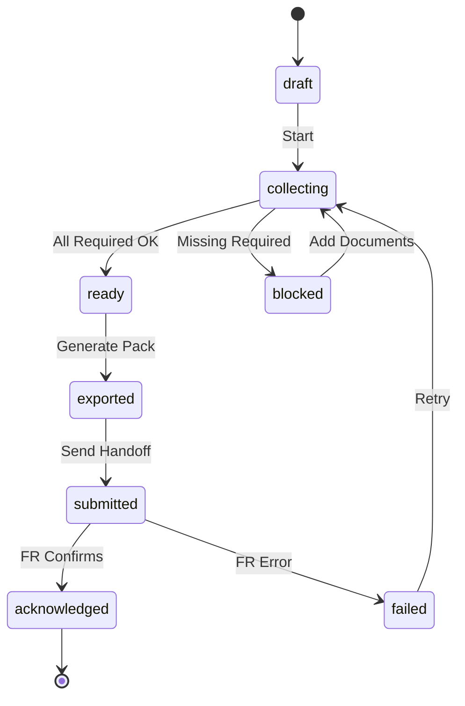
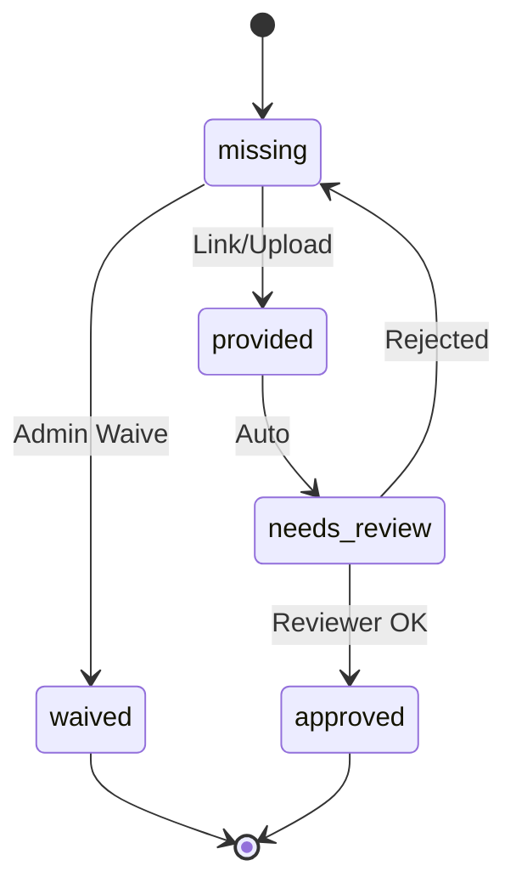
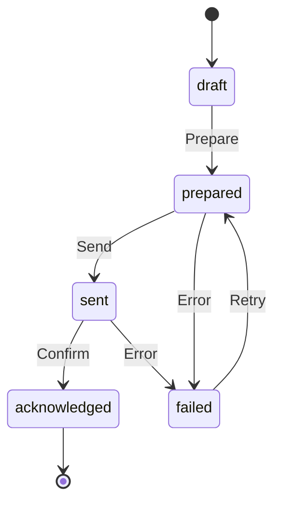
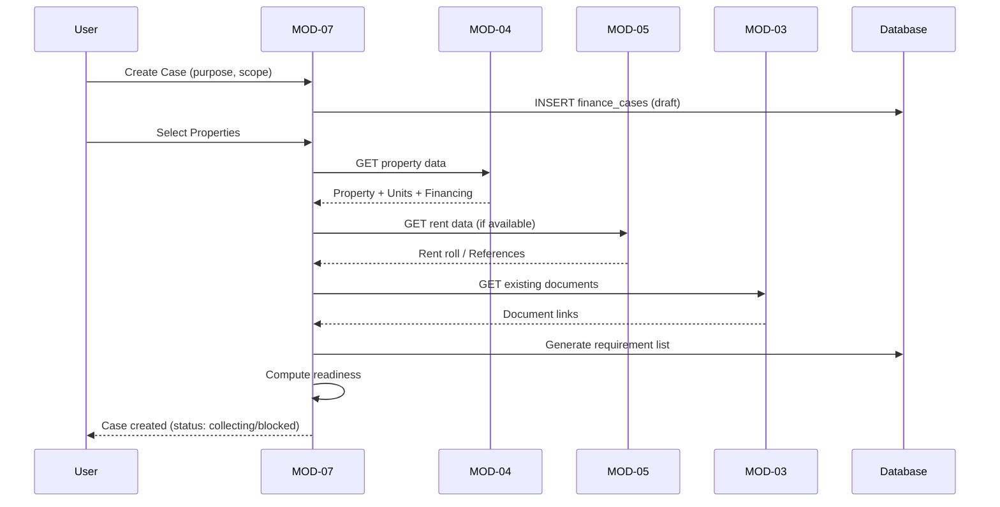
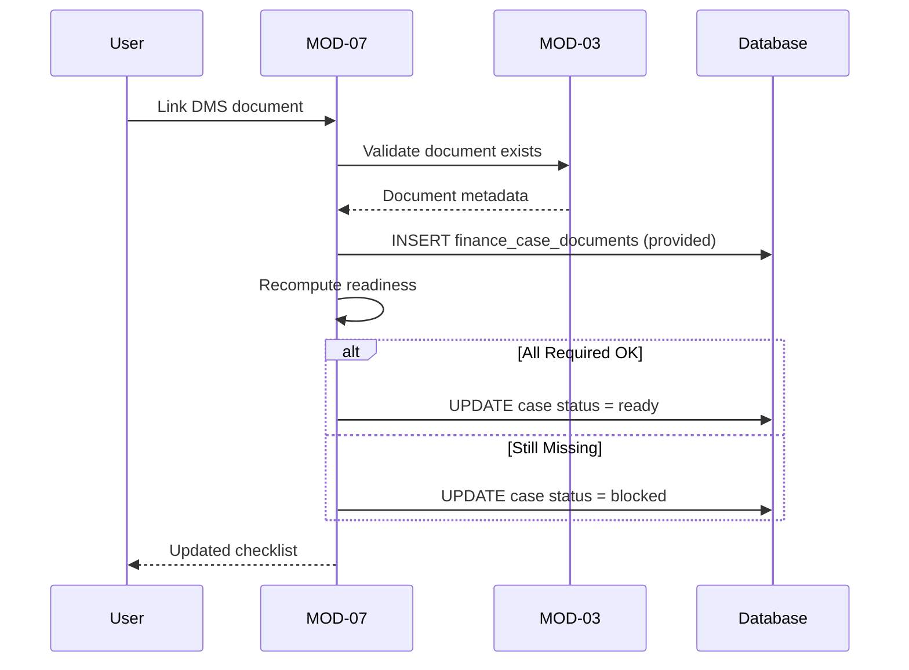
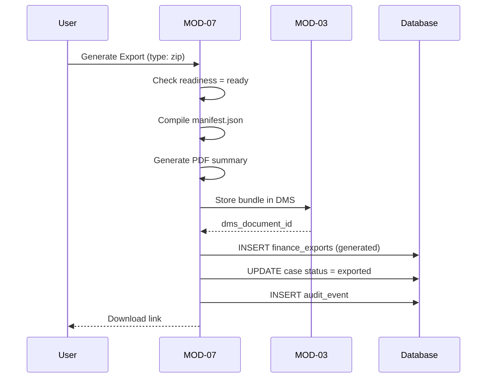
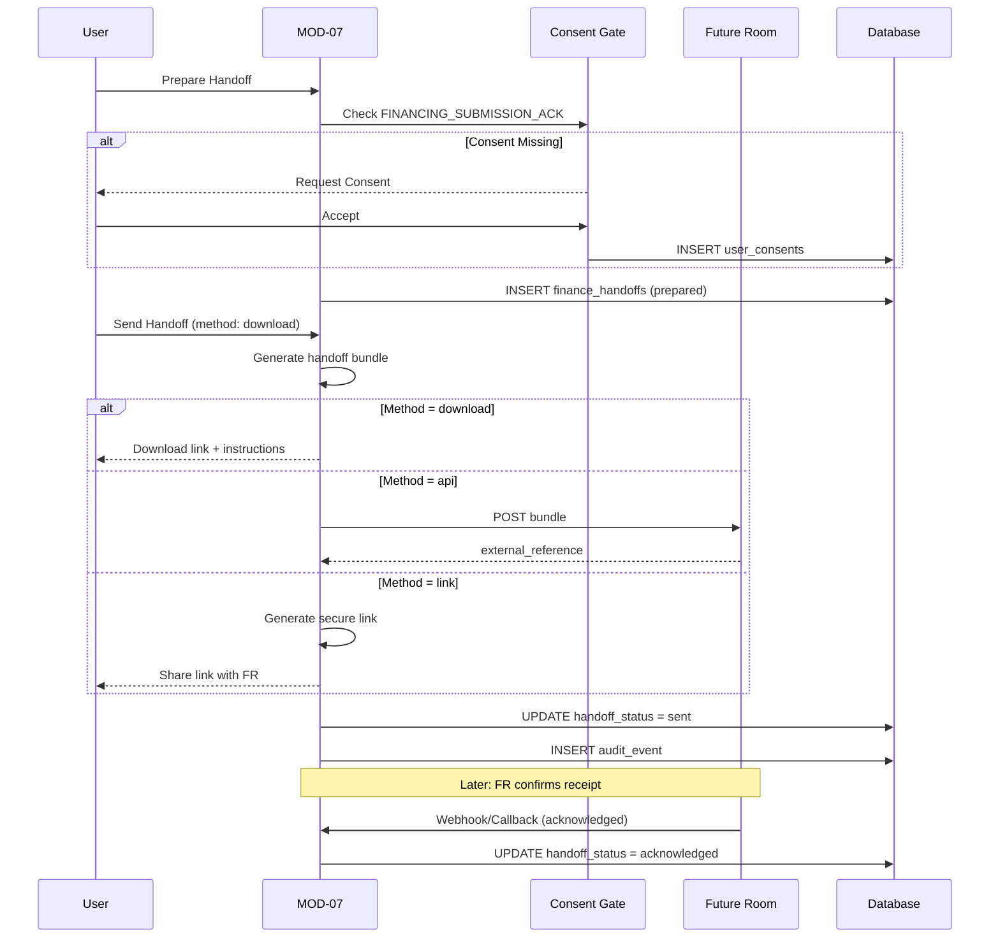
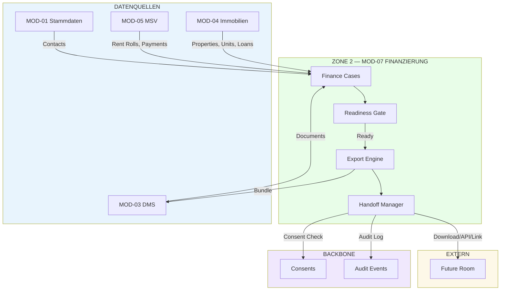

# MOD-07 — FINANZIERUNG (Finance Case & Handoff Module)

**Version:** v1.0.0  
**Status:** COMPLETE SPEC  
**Datum:** 2026-01-26  
**Zone:** 2 (User Portal)  
**Typ:** STANDARD (für alle Nutzer verfügbar)  
**Route-Prefix:** `/portal/finanzierung`  
**API-Range:** API-600 bis API-699  
**Abhängig von:** MOD-04 (Immobilien), MOD-05 (MSV), MOD-03 (DMS), MOD-01 (Stammdaten), Backbone (Consents, Audit)

---

## 1) MODULDEFINITION

### 1.1 Zweck

MOD-07 „Finanzierung" ist das Modul zur strukturierten Erstellung eines **Finanzierungsfalls (Case)**, zum Sammeln/Validieren aller Unterlagen und Objekt-/Portfolio-Daten sowie zum Erstellen eines standardisierten **Finanzierungspakets**. Der Abschluss ist eine kontrollierte **Übergabe (Handoff)** an das externe System „Future Room" oder an interne Prozesse.

**Kernfunktion:** Datenaggregation + Readiness-Prüfung + Export/Handoff

### 1.2 Zielnutzer / Rollen

| Rolle | Zugang | Beschreibung |
|-------|--------|--------------|
| `org_admin` | Full | Legt Cases an, finalisiert Handoff |
| `internal_ops` | Write | Dokumente prüfen, Daten nachpflegen |
| `viewer` | Read | Lesend für Team (optional) |

### 1.3 Scope IN (testbar)

- Finanzierungscases anlegen/führen (pro Objekt oder Portfolio-weit)
- Datensammlung aus MOD-04 (Immobilien), MOD-05 (MSV), MOD-03 (DMS), MOD-01 (Stammdaten)
- Dokumenten-Checklisten + Readiness Gate (vollständig/unvollständig)
- Paket-Generator (strukturierter Export: PDF + strukturierte Daten/ZIP)
- Status-Maschine von Draft bis Submitted
- Handoff zu Future Room: Export + Übergabe-Token/Link/Transmission
- Audit Events und Consent Gates

### 1.4 Scope OUT (Nicht-Ziele)

- ❌ Keine Banken-API Live-Abgabe (Phase 2)
- ❌ Keine Kreditvermittlung/Produktberatung-Engine
- ❌ Kein Nachbau von Future Room (nur Übergabe-Schnittstelle)
- ❌ Keine Buchhaltungsautomatisierung

---

## 2) ARCHITEKTUR-POSITION

### 2.1 Cross-Module Abhängigkeiten

| Modul | Abhängigkeit | Datenfluss |
|-------|--------------|------------|
| MOD-04 Immobilien | Properties/Units/Finanzierungsdaten | READ (SoT) |
| MOD-05 MSV | Mieteinnahmen/Reports | READ (Premium/Basis) |
| MOD-03 DMS | Dokumentenablage, Data Rooms | READ/WRITE |
| MOD-01 Stammdaten | Personen/Organisationen, Adressen | READ |
| Zone 1 Admin | Oversight, Integrations, Audit | READ (Oversight) |

### 2.2 High-Level Flow

```
User erstellt Case → wählt Objekt(e) → System zieht Daten → 
  → fordert Dokumente → Readiness Gate → Paket generieren → Handoff Future Room
```

---

## 3) ROUTE-STRUKTUR

### 3.1 Kern-Screens (5 Screens)

| Route | UI-Label | Screen | Beschreibung |
|-------|----------|--------|--------------|
| `/portal/finanzierung` | Dashboard | FinanceDashboard | KPIs: offene Cases, Ready-to-submit, fehlende Unterlagen |
| `/portal/finanzierung/faelle` | Fälle | FinanceCaseList | Filter: Status, Objekt, Portfolio, Responsible |
| `/portal/finanzierung/faelle/:case_id` | Case Detail | FinanceCaseDetail | Tabs: Übersicht, Daten, Unterlagen, Export, Status |
| `/portal/finanzierung/dokumente` | Dokumente | FinanceDocuments | Case-zentrierte Checklist, DMS-Verknüpfungen |
| `/portal/finanzierung/einstellungen` | Einstellungen | FinanceSettings | Templates, Export-Formate, Readiness-Regeln |

### 3.2 Dynamische Routes

| Route | Screen | Beschreibung |
|-------|--------|--------------|
| `/portal/finanzierung/faelle/:case_id` | FinanceCaseDetail | Case-Detailansicht mit Tabs |
| `/portal/finanzierung/faelle/:case_id/export` | FinanceCaseExport | Export-Wizard |
| `/portal/finanzierung/faelle/:case_id/handoff` | FinanceCaseHandoff | Handoff-Wizard |

### 3.3 UI-Prinzipien

- **Readiness Panel** ist immer sichtbar: Ampel + fehlende Items
- **Export/Handoff** ist gesperrt solange Readiness nicht erfüllt (oder bewusst Override durch `org_admin`)
- **Progress Tracker** zeigt Status-Flow visuell an

---

## 4) DATENMODELL

### 4.1 Neue Tabellen (MOD-07 Owner)

#### A) `finance_cases`

| Feld | Typ | Beschreibung |
|------|-----|--------------|
| id | uuid PK | — |
| tenant_id | uuid FK | Tenant-Isolation |
| public_id | text | `SOT-FIN-XXXXXXXX` |
| case_code | text | Human-readable (z.B. FIN-2026-001) |
| scope_type | text | `property` \| `portfolio` |
| primary_property_id | uuid FK | Nullable |
| included_property_ids | uuid[] | Alle einbezogenen Properties |
| purpose | text | `refinance` \| `purchase` \| `equity_release` \| `construction` \| `other` |
| status | text | Siehe Status-Maschine |
| responsible_user_id | uuid FK | Zuständiger User |
| notes | text | Freitext |
| created_at | timestamptz | — |
| updated_at | timestamptz | — |

**Status-Enum:**
```
draft → collecting → ready → exported → submitted → acknowledged
                  ↘ blocked
submitted → failed → collecting (retry)
```

#### B) `finance_case_parties`

| Feld | Typ | Beschreibung |
|------|-----|--------------|
| id | uuid PK | — |
| tenant_id | uuid FK | — |
| case_id | uuid FK | → finance_cases |
| party_type | text | `borrower` \| `co_borrower` \| `guarantor` \| `advisor` \| `bank_contact` |
| contact_id | uuid FK | → contacts (MOD-01) |
| role_notes | text | — |
| created_at | timestamptz | — |

#### C) `finance_case_documents`

| Feld | Typ | Beschreibung |
|------|-----|--------------|
| id | uuid PK | — |
| tenant_id | uuid FK | — |
| case_id | uuid FK | → finance_cases |
| requirement_code | text | Siehe 4.3 |
| document_id | uuid FK | → documents (MOD-03), nullable |
| status | text | `missing` \| `provided` \| `waived` \| `needs_review` \| `approved` |
| source | text | `upload` \| `dms_link` \| `generated` \| `external` |
| meta | jsonb | Doc dates, validity, extracted fields |
| reviewed_by | uuid FK | — |
| reviewed_at | timestamptz | — |
| created_at | timestamptz | — |
| updated_at | timestamptz | — |

#### D) `finance_readiness_snapshots`

| Feld | Typ | Beschreibung |
|------|-----|--------------|
| id | uuid PK | — |
| tenant_id | uuid FK | — |
| case_id | uuid FK | — |
| snapshot_at | timestamptz | — |
| readiness_score | integer | 0-100 |
| missing_required | jsonb | Liste fehlender Pflichtdokumente |
| warnings | jsonb | Warnungen (z.B. abgelaufene Dokumente) |
| computed_by | text | `system` \| `manual` |

#### E) `finance_exports`

| Feld | Typ | Beschreibung |
|------|-----|--------------|
| id | uuid PK | — |
| tenant_id | uuid FK | — |
| case_id | uuid FK | — |
| export_type | text | `pdf` \| `zip` \| `future_room_bundle` |
| status | text | `draft` \| `generated` \| `transmitted` \| `failed` |
| dms_document_id | uuid FK | Output in MOD-03 |
| payload_ref | jsonb | File references |
| manifest | jsonb | Strukturierte Daten für Export |
| created_at | timestamptz | — |
| generated_at | timestamptz | — |

#### F) `finance_handoffs`

| Feld | Typ | Beschreibung |
|------|-----|--------------|
| id | uuid PK | — |
| tenant_id | uuid FK | — |
| case_id | uuid FK | — |
| target_system | text | `future_room` |
| handoff_status | text | `draft` \| `prepared` \| `sent` \| `acknowledged` \| `failed` |
| handoff_method | text | `download` \| `api` \| `link` |
| external_reference | text | Nullable |
| handoff_token | text | Nullable |
| handoff_url | text | Nullable |
| consent_id | uuid FK | → user_consents |
| created_at | timestamptz | — |
| updated_at | timestamptz | — |

### 4.2 RLS-Konzept

| Tabelle | Policy | Beschreibung |
|---------|--------|--------------|
| finance_cases | tenant_id = active_tenant | Standard Tenant-Isolation |
| finance_case_parties | tenant_id = active_tenant | — |
| finance_case_documents | tenant_id = active_tenant | — |
| finance_readiness_snapshots | tenant_id = active_tenant | — |
| finance_exports | tenant_id = active_tenant | Write: org_admin only |
| finance_handoffs | tenant_id = active_tenant | Write: org_admin only |

### 4.3 Requirement Codes (Dokument-Checkliste)

| Code | Label | Pflicht | Scope | Auto-Quelle |
|------|-------|---------|-------|-------------|
| `IDENTITY_DOCS` | Ausweisdokumente | ✓ | Borrower | — |
| `INCOME_PROOF` | Einkommensnachweise | ✓ | Borrower | — |
| `TAX_ASSESSMENTS` | Steuerbescheide | ✓ | Borrower | — |
| `RENT_ROLL` | Mieterliste | ✓ (wenn vermietet) | Property | MOD-05 |
| `PROPERTY_VALUATION` | Wertgutachten | Optional | Property | MOD-04 |
| `LOAN_STATEMENTS` | Darlehensauszüge | ✓ (bei Refinance) | Property | MOD-04 |
| `PROPERTY_DOCS_BASIC` | Grundbuch/Teilungserklärung | ✓ | Property | MOD-03 |
| `ENERGY_CERTIFICATE` | Energieausweis | ✓ | Property | MOD-04 |
| `INSURANCE_PROOF` | Versicherungsnachweise | Optional | Property | — |
| `BANK_STATEMENTS` | Kontoauszüge | Optional | Borrower | — |
| `PORTFOLIO_OVERVIEW` | Portfolio-Übersicht | ✓ (bei Portfolio) | Portfolio | MOD-04/05/07 |
| `SELF_DISCLOSURE` | Selbstauskunft | ✓ | Borrower | Generated |

---

## 5) STATUS-MASCHINEN

### 5.1 `finance_cases.status`



### 5.2 `finance_case_documents.status`



### 5.3 `finance_handoffs.handoff_status`



---

## 6) API CONTRACT

### 6.1 Core Case APIs (API-600 bis API-609)

| API-ID | Endpoint | Method | Auth | Beschreibung |
|--------|----------|--------|------|--------------|
| API-600 | `/financing/cases` | GET | org_admin, internal_ops | Liste aller Cases |
| API-601 | `/financing/cases` | POST | org_admin | Case anlegen |
| API-602 | `/financing/cases/:id` | GET | org_admin, internal_ops | Case Detail |
| API-603 | `/financing/cases/:id` | PATCH | org_admin, internal_ops | Case aktualisieren |
| API-604 | `/financing/cases/:id/transition` | POST | org_admin | Status-Transition mit Guards |
| API-605 | `/financing/cases/:id/clone` | POST | org_admin | Case duplizieren |

### 6.2 Readiness APIs (API-610 bis API-619)

| API-ID | Endpoint | Method | Auth | Beschreibung |
|--------|----------|--------|------|--------------|
| API-610 | `/financing/cases/:id/readiness` | GET | org_admin, internal_ops | Readiness-Status |
| API-611 | `/financing/cases/:id/readiness/recompute` | POST | org_admin | Readiness neu berechnen |
| API-612 | `/financing/cases/:id/readiness/snapshots` | GET | org_admin | Snapshot-History |

### 6.3 Party APIs (API-620 bis API-629)

| API-ID | Endpoint | Method | Auth | Beschreibung |
|--------|----------|--------|------|--------------|
| API-620 | `/financing/cases/:id/parties` | GET | org_admin, internal_ops | Liste Parteien |
| API-621 | `/financing/cases/:id/parties` | POST | org_admin | Partei hinzufügen |
| API-622 | `/financing/cases/:id/parties/:party_id` | DELETE | org_admin | Partei entfernen |

### 6.4 Document APIs (API-630 bis API-649)

| API-ID | Endpoint | Method | Auth | Beschreibung |
|--------|----------|--------|------|--------------|
| API-630 | `/financing/cases/:id/documents` | GET | org_admin, internal_ops | Dokument-Checklist |
| API-631 | `/financing/cases/:id/documents/link` | POST | org_admin, internal_ops | DMS-Dokument verknüpfen |
| API-632 | `/financing/cases/:id/documents/upload` | POST | org_admin, internal_ops | Upload via DMS |
| API-633 | `/financing/cases/:id/documents/:doc_id` | PATCH | org_admin, internal_ops | Status/Meta aktualisieren |
| API-634 | `/financing/cases/:id/documents/:doc_id/waive` | POST | org_admin | Dokument als nicht erforderlich markieren |
| API-635 | `/financing/cases/:id/documents/:doc_id/review` | POST | org_admin, internal_ops | Dokument prüfen/genehmigen |

### 6.5 Export APIs (API-650 bis API-659)

| API-ID | Endpoint | Method | Auth | Beschreibung |
|--------|----------|--------|------|--------------|
| API-650 | `/financing/cases/:id/exports` | POST | org_admin | Export-Pack generieren |
| API-651 | `/financing/cases/:id/exports` | GET | org_admin | Export-Liste |
| API-652 | `/financing/exports/:export_id/download` | GET | org_admin | Download Bundle |
| API-653 | `/financing/exports/:export_id/retry` | POST | org_admin | Export wiederholen |

### 6.6 Handoff APIs (API-660 bis API-669)

| API-ID | Endpoint | Method | Auth | Beschreibung |
|--------|----------|--------|------|--------------|
| API-660 | `/financing/cases/:id/handoff/prepare` | POST | org_admin | Handoff vorbereiten |
| API-661 | `/financing/cases/:id/handoff/send` | POST | org_admin | Handoff senden |
| API-662 | `/financing/cases/:id/handoff/status` | GET | org_admin | Handoff-Status |
| API-663 | `/financing/cases/:id/handoff/retry` | POST | org_admin | Handoff wiederholen |

---

## 7) CONSENT & AUDIT

### 7.1 Consent Gates

| Code | Label | Trigger | Pflicht |
|------|-------|---------|---------|
| `FINANCING_SUBMISSION_ACK` | Datenweitergabe-Zustimmung | Vor Handoff-Send | ✓ |
| `FINANCING_DATA_PROCESSING` | Datenverarbeitung | Bei Case-Erstellung | Optional |

### 7.2 Audit Events

| Event Type | Trigger | Payload |
|------------|---------|---------|
| `financing.case.created` | POST /cases | case_id, purpose, scope |
| `financing.case.updated` | PATCH /cases/:id | changed_fields |
| `financing.case.transitioned` | POST /transition | from_status, to_status |
| `financing.readiness.blocked` | Recompute | missing_items |
| `financing.readiness.ready` | Recompute | score |
| `financing.document.linked` | POST /documents/link | doc_id, requirement_code |
| `financing.document.uploaded` | POST /documents/upload | doc_id |
| `financing.document.reviewed` | POST /review | status, reviewer |
| `financing.document.waived` | POST /waive | reason |
| `financing.export.generated` | POST /exports | export_id, type |
| `financing.export.failed` | POST /exports | error |
| `financing.export.downloaded` | GET /download | export_id |
| `financing.handoff.prepared` | POST /prepare | handoff_id |
| `financing.handoff.sent` | POST /send | method, target |
| `financing.handoff.acknowledged` | Callback | external_ref |
| `financing.handoff.failed` | Callback/Error | error |

---

## 8) END-TO-END FLOWS

### 8.1 Flow A: Case anlegen + Datenpull



### 8.2 Flow B: Dokumente vervollständigen



### 8.3 Flow C: Export generieren



### 8.4 Flow D: Handoff Future Room



---

## 9) OPEN QUESTIONS

| Q-ID | Frage | Empfehlung | Prio |
|------|-------|------------|------|
| FR-1 | Handoff-Methode: download/link/api? | **Download** in Phase 1 (einfachste Integration) | P0 |
| FR-2 | Mindestfelder im Manifest? | Standard: property_data, borrower_data, documents[], summary | P0 |
| FR-3 | Dokumenttypen je Case-Type? | Matrix definieren: Refinance/Purchase/Equity = unterschiedliche Pflichtdocs | P1 |
| FR-4 | Mehrere Borrower (joint)? | **Ja**, via `finance_case_parties` mit `co_borrower` | P0 |
| FR-5 | Exportformate? | **PDF + ZIP** in Phase 1, CSV optional | P1 |
| FR-6 | Self-Disclosure-Formular integriert? | **Ja**, als generiertes Dokument (SELF_DISCLOSURE requirement) | P1 |
| FR-7 | Future Room API-Spec verfügbar? | **Nein** — Download-Methode als Fallback | P2 |

---

## 10) ACCEPTANCE CRITERIA

| # | Kriterium | Typ | Status |
|---|-----------|-----|--------|
| AC1 | Case kann angelegt werden mit Objekt/Portfolio-Scope | Functional | SPEC |
| AC2 | Status-Transitions funktionieren mit Guards | Functional | SPEC |
| AC3 | Readiness zeigt fehlende Items; blocked/ready korrekt | Functional | SPEC |
| AC4 | DMS-Verknüpfung pro Requirement funktioniert | Functional | SPEC |
| AC5 | Export erzeugt Bundle + Manifest im DMS | Functional | SPEC |
| AC6 | Handoff prepare/send erzeugt Record + Audit Events | Functional | SPEC |
| AC7 | Consent Gate blockt Handoff ohne Zustimmung | Security | SPEC |
| AC8 | RLS isoliert Cases nach Tenant | Security | SPEC |

---

## 11) CROSS-MODULE BERÜHRUNGSWEGE

| Von | Nach | Aktion |
|-----|------|--------|
| MOD-07 | MOD-04 | READ property/unit/financing data |
| MOD-07 | MOD-05 | READ rent rolls, lease data |
| MOD-07 | MOD-03 | READ/WRITE documents, store exports |
| MOD-07 | MOD-01 | READ contacts for parties |
| MOD-07 | Backbone | READ/WRITE consents, audit_events |
| Zone 1 | MOD-07 | Oversight (read-only) |

---

## 12) MERMAID: SYSTEM-INTEGRATION



---

## 13) DOKUMENT-CHECKLISTEN (BEISPIEL)

### Refinance Case

| # | Requirement | Pflicht | Quelle |
|---|-------------|---------|--------|
| 1 | IDENTITY_DOCS | ✓ | Upload |
| 2 | INCOME_PROOF | ✓ | Upload |
| 3 | TAX_ASSESSMENTS | ✓ | Upload |
| 4 | RENT_ROLL | ✓ | MOD-05 |
| 5 | LOAN_STATEMENTS | ✓ | MOD-04 |
| 6 | PROPERTY_DOCS_BASIC | ✓ | MOD-03 |
| 7 | ENERGY_CERTIFICATE | ✓ | MOD-04 |
| 8 | SELF_DISCLOSURE | ✓ | Generated |
| 9 | BANK_STATEMENTS | — | Upload |
| 10 | INSURANCE_PROOF | — | Upload |

### Purchase Case

| # | Requirement | Pflicht | Quelle |
|---|-------------|---------|--------|
| 1 | IDENTITY_DOCS | ✓ | Upload |
| 2 | INCOME_PROOF | ✓ | Upload |
| 3 | TAX_ASSESSMENTS | ✓ | Upload |
| 4 | PROPERTY_DOCS_BASIC | ✓ | Upload/External |
| 5 | ENERGY_CERTIFICATE | ✓ | Upload/External |
| 6 | SELF_DISCLOSURE | ✓ | Generated |
| 7 | PROPERTY_VALUATION | — | Optional |

---

## 14) CHANGELOG

| Datum | Version | Änderung |
|-------|---------|----------|
| 2026-01-26 | v1.0.0 | Initial Complete Spec |

---

*Dieses Dokument ist die vollständige Spezifikation für MOD-07 Finanzierung.*
