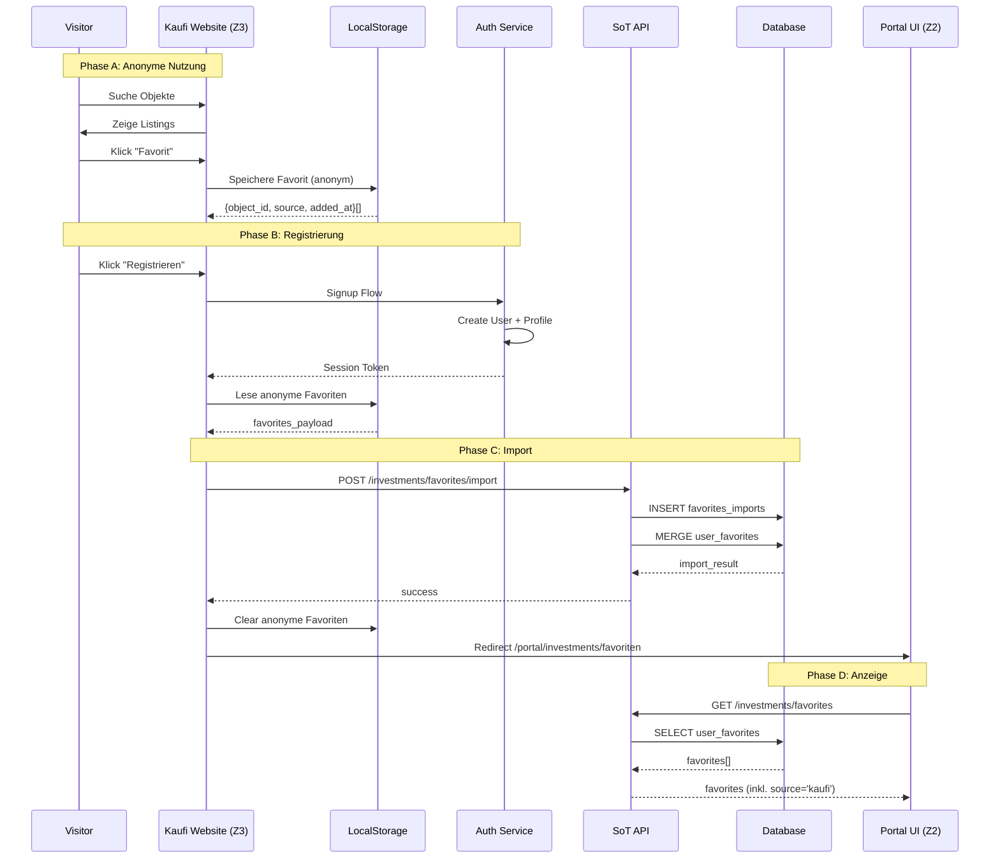
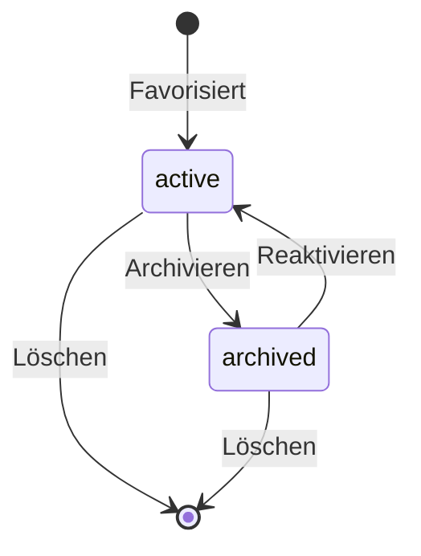
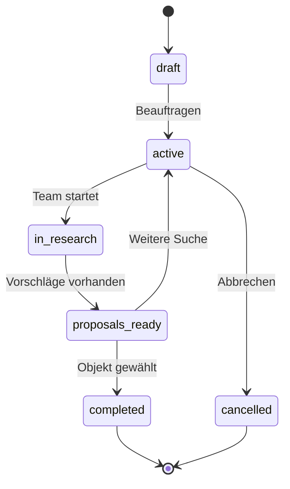
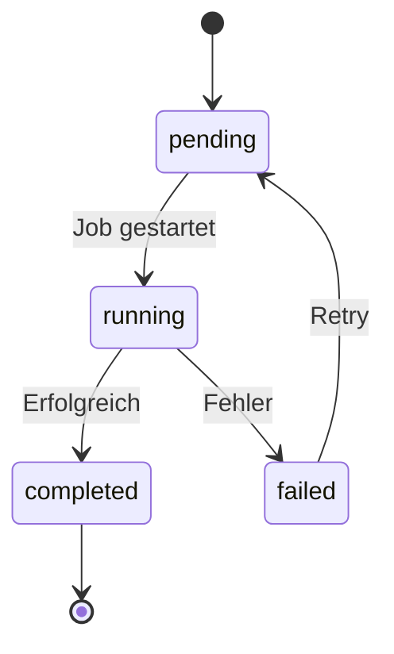

# MOD-08 — INVESTMENT-SUCHE / ANKAUF

**Version:** v1.0.0  
**Status:** SPEC COMPLETE  
**Datum:** 2026-01-25  
**Zone:** 2 (User Portal)  
**Route-Prefix:** `/portal/investments`  
**Typ:** Standard-Modul (alle Tenants)  
**Abhängig von:** MOD-04 (Properties), MOD-06 (Listings), MOD-07 (Finanzierung), Backbone (Consents, Audit)

---

## 1) MODULDEFINITION

### 1.1 Ziel

MOD-08 „Investment-Suche / Ankauf" ist das neutrale SoT-Modul für die Suche, Bewertung und den Ankauf von Investment-Immobilien. Es aggregiert mehrere Quellen (SoT-Verkauf, Kaufi-Marktplatz, externe Imports) in einer einheitlichen Oberfläche.

**Kernfunktion:** Zentraler Landepunkt für alle Investoren/Käufer — insbesondere für Nutzer, die über die Kaufi-Website (Zone 3) registrieren und ihre Favoriten wiederfinden wollen.

### 1.2 Marken-Abgrenzung (FROZEN)

| Element | Modul-Intern | UI-Label erlaubt |
|---------|--------------|------------------|
| **Modulname** | Investment-Suche / Ankauf | ✓ "Investment-Suche", "Ankauf" |
| **Kaufi** | Source/Channel/Tab | ✓ "Kaufi" als Tab-Label |
| **Kaufi** | Modulname | ✗ VERBOTEN |

### 1.3 Nutzerrollen

| Rolle | Zugang | Beschreibung |
|-------|--------|--------------|
| org_admin | Full | Alle Funktionen |
| internal_ops | Write | Suche, Favoriten, Simulation |
| client (Standard-User) | Write | Eigene Suche/Favoriten |
| sales_partner | Read | Zusätzlich MOD-09 Objektkatalog |

### 1.4 Scope IN (testbar)

- Multi-Source Investment-Suche (SoT-Verkauf, Kaufi, Extern)
- Favoriten-Management mit Kaufi-Website-Sync
- Buy-Side Mandat (Placeholder)
- Web-Scraper Integration (Placeholder)
- Portfolio-Simulation (Impact-Analyse)
- Investment-Engine-Anbindung

### 1.5 Scope OUT (Nicht-Ziele)

- Listing-Erstellung (→ MOD-06)
- Property-Bearbeitung (→ MOD-04)
- Partner-Pipeline-Management (→ MOD-09)
- Lead-Generierung (→ MOD-10)

### 1.6 Source of Truth Matrix

| Domäne | SoT-Modul | Andere Module |
|--------|-----------|---------------|
| user_favorites | **MOD-08** | — |
| favorite_sources | **MOD-08** | — |
| investment_mandates | **MOD-08** | — |
| scraper_jobs | **MOD-08** | — |
| portfolio_simulations | **MOD-08** | — |
| Listings | MOD-06 | MOD-08: Read-only |
| Properties | MOD-04 | MOD-08: Read-only |

---

## 2) ROUTE-STRUKTUR (BINDING)

### 2.1 Haupt-Routes

| Route | UI-Label | Screen | Beschreibung |
|-------|----------|--------|--------------|
| `/portal/investments` | Dashboard | InvestmentsDashboard | KPIs, Aktivitäts-Stream |
| `/portal/investments/suche` | Suche | InvestmentsSuche | Multi-Source-Suche |
| `/portal/investments/favoriten` | Favoriten | InvestmentsFavoriten | Watchlist |
| `/portal/investments/mandat` | Mandat | InvestmentsMandat | Buy-Side Betreuung |
| `/portal/investments/scraper` | Scraper | InvestmentsScraper | Web-Scraping Jobs |
| `/portal/investments/simulation` | Simulation | InvestmentsSimulation | Portfolio-Impact |

### 2.2 Dynamische Routes

| Route | Screen | Beschreibung |
|-------|--------|--------------|
| `/portal/investments/suche/:source/:id` | ObjectDetail | Detail-Ansicht (Read-only) |
| `/portal/investments/favoriten/:id` | FavoriteDetail | Favorit mit Notizen |
| `/portal/investments/mandat/:id` | MandatDetail | Mandats-Status |
| `/portal/investments/simulation/:id` | SimulationResult | Simulations-Ergebnis |

---

## 3) SOURCES (QUELLEN)

### 3.1 Source-Übersicht

| Source-Code | Name | Datenherkunft | Status |
|-------------|------|---------------|--------|
| `sot_verkauf` | SoT-Verkauf | listings (MOD-06) | Phase 1 |
| `kaufi` | Kaufi Marktplatz | kaufi_listings (Zone 3) + LocalStorage | Phase 1 |
| `external` | Extern/Imports | external_imports | Phase 2 |
| `scraper` | Web-Scraper | scraper_results | Phase 2 |

### 3.2 Source-Filter UI

**Tab-Navigation:**
- "Alle" (Default)
- "SoT-Verkauf"
- "Kaufi" ← Marken-Label erlaubt
- "Extern" (Phase 2)

### 3.3 Kaufi-Source im Detail

**Datenfluss:**
1. Zone 3 (Kaufi Website) → LocalStorage Favorites
2. User Login/Signup → favorites_import Trigger
3. favorites_import → user_favorites MERGE
4. MOD-08 UI zeigt Favoriten mit Source-Tag "Kaufi"

**Wichtig:** Kaufi-Listings können auch ohne Favorisierung durchsucht werden (wenn API verfügbar).

---

## 4) KAUFI-FAVORITEN-SYNC (KRITISCHER FLOW)

### 4.1 Sequenzdiagramm



### 4.2 Datencontract: Favorites Import

**Request Payload:**
```typescript
interface FavoritesImportRequest {
  source: 'kaufi_website';
  items: FavoriteItem[];
  client_timestamp: string; // ISO 8601
}

interface FavoriteItem {
  source_object_id: string;        // ID aus Kaufi
  source_type: 'kaufi_listing';
  title?: string;
  address?: string;
  city?: string;
  price?: number;
  thumbnail_url?: string;
  object_url?: string;
  added_at: string;                // ISO 8601
}
```

**Response:**
```typescript
interface FavoritesImportResponse {
  imported_count: number;
  merged_count: number;       // Bereits existierende
  skipped_count: number;      // Duplikate
  favorites_ids: string[];    // Neue user_favorites.id
}
```

### 4.3 LocalStorage Schema (Zone 3)

```typescript
// Key: "kaufi_favorites"
interface KaufiFavoritesStorage {
  version: 1;
  items: {
    id: string;               // Kaufi Object ID
    title: string;
    address: string;
    price: number;
    url: string;
    thumbnail?: string;
    added_at: string;
  }[];
  last_updated: string;
}
```

---

## 5) DATENMODELL

### 5.1 Tabellen-Übersicht

| Tabelle | Owner | Status | Beschreibung |
|---------|-------|--------|--------------|
| user_favorites | MOD-08 | Phase 1 | Nutzer-Favoriten |
| favorite_sources | MOD-08 | Phase 1 | Source-Referenzen |
| favorites_imports | MOD-08 | Phase 1 | Import-Audit |
| investment_mandates | MOD-08 | PLACEHOLDER | Buy-Side Mandate |
| scraper_jobs | MOD-08 | PLACEHOLDER | Scraping-Jobs |
| scraper_results | MOD-08 | PLACEHOLDER | Scraping-Ergebnisse |
| portfolio_simulations | MOD-08 | Phase 1 | Simulations-Snapshots |

### 5.2 `user_favorites`

| Feld | Typ | Pflicht | Beschreibung |
|------|-----|---------|--------------|
| id | uuid PK | Ja | — |
| tenant_id | uuid FK | Ja | Tenant-Isolation |
| user_id | uuid FK | Ja | Besitzer |
| source_code | text | Ja | sot_verkauf, kaufi, external |
| source_object_id | text | Ja | ID im Quellsystem |
| source_object_type | text | Ja | listing, kaufi_listing, external |
| listing_id | uuid FK | Nein | Wenn source=sot_verkauf |
| property_id | uuid FK | Nein | Wenn verknüpft |
| cached_data | jsonb | Nein | Snapshot (Titel, Preis, etc.) |
| notes | text | Nein | Nutzer-Notizen |
| tags | text[] | Nein | Nutzer-Tags |
| is_archived | boolean | Ja | Soft-Delete |
| imported_from | uuid FK | Nein | favorites_imports.id |
| created_at | timestamptz | Ja | — |
| updated_at | timestamptz | Ja | — |

**Unique Constraint:** (user_id, source_code, source_object_id)

### 5.3 `favorites_imports`

| Feld | Typ | Pflicht | Beschreibung |
|------|-----|---------|--------------|
| id | uuid PK | Ja | — |
| tenant_id | uuid FK | Ja | — |
| user_id | uuid FK | Ja | — |
| source | text | Ja | kaufi_website |
| raw_payload | jsonb | Ja | Original-Request |
| imported_count | int | Ja | — |
| merged_count | int | Ja | — |
| skipped_count | int | Ja | — |
| client_timestamp | timestamptz | Nein | — |
| imported_at | timestamptz | Ja | — |
| ip_address | inet | Nein | — |
| user_agent | text | Nein | — |

### 5.4 `portfolio_simulations`

| Feld | Typ | Pflicht | Beschreibung |
|------|-----|---------|--------------|
| id | uuid PK | Ja | — |
| tenant_id | uuid FK | Ja | — |
| user_id | uuid FK | Ja | — |
| name | text | Nein | Simulations-Name |
| target_property_id | uuid FK | Nein | Ziel-Objekt (wenn intern) |
| target_listing_id | uuid FK | Nein | Ziel-Listing |
| target_favorite_id | uuid FK | Nein | Ziel-Favorit |
| input_params | jsonb | Ja | Engine-Input |
| portfolio_snapshot | jsonb | Ja | Aktuelles Portfolio (aggregiert) |
| simulation_result | jsonb | Ja | Engine-Output |
| engine_version | text | Ja | — |
| created_at | timestamptz | Ja | — |

### 5.5 `investment_mandates` (PLACEHOLDER)

| Feld | Typ | Pflicht | Beschreibung |
|------|-----|---------|--------------|
| id | uuid PK | Ja | — |
| tenant_id | uuid FK | Ja | — |
| contact_id | uuid FK | Ja | Auftraggeber |
| mandate_type | text | Ja | buy_side |
| criteria | jsonb | Ja | Suchkriterien |
| status | text | Ja | draft, active, completed, cancelled |
| assigned_to | uuid FK | Nein | Bearbeiter |
| created_at | timestamptz | Ja | — |
| updated_at | timestamptz | Ja | — |

### 5.6 `scraper_jobs` (PLACEHOLDER)

| Feld | Typ | Pflicht | Beschreibung |
|------|-----|---------|--------------|
| id | uuid PK | Ja | — |
| tenant_id | uuid FK | Ja | — |
| user_id | uuid FK | Ja | — |
| job_type | text | Ja | apify, firecrawl, manual |
| target_url | text | Nein | — |
| search_criteria | jsonb | Nein | — |
| status | text | Ja | pending, running, completed, failed |
| result_count | int | Nein | — |
| started_at | timestamptz | Nein | — |
| completed_at | timestamptz | Nein | — |
| error_message | text | Nein | — |
| created_at | timestamptz | Ja | — |

---

## 6) SCREEN SPECIFICATIONS

### 6.1 Dashboard (`/portal/investments`)

**KPIs:**

| KPI | Berechnung |
|-----|------------|
| Aktive Favoriten | COUNT(user_favorites WHERE !is_archived) |
| Neue diese Woche | COUNT(user_favorites WHERE created_at > 7d) |
| Offene Mandate | COUNT(investment_mandates WHERE status='active') |
| Simulationen | COUNT(portfolio_simulations) |
| Preisänderungen | COUNT(favorites mit Preisänderung) |

**Aktivitäts-Stream:**
- Neue Listings in favorisierten Städten
- Preisänderungen bei Favoriten
- Mandats-Updates
- Scraper-Ergebnisse (Phase 2)

**Quick Actions:**
- Zur Suche
- Favorit hinzufügen
- Simulation starten
- Mandat erstellen (Phase 2)

### 6.2 Suche (`/portal/investments/suche`)

**Layout:** Filter-Sidebar + Grid/Liste Toggle

**Source-Tabs:**
- Alle (Default)
- SoT-Verkauf
- Kaufi
- Extern (Phase 2)

**Filter:**
| Filter | Typ | Beschreibung |
|--------|-----|--------------|
| Stadt | Multi-Select | — |
| PLZ | Text | — |
| Objekttyp | Multi-Select | MFH, ETW, Gewerbe, etc. |
| Preis-Range | Slider | Min/Max |
| Rendite-Range | Slider | Min/Max (wenn berechenbar) |
| Baujahr-Range | Slider | — |
| Fläche-Range | Slider | — |
| Provision | Checkbox | Mit/Ohne Partner-Provision |

**Objekt-Card:**
- Thumbnail
- Adresse / Stadt
- Preis
- Fläche
- Rendite-Indikator (wenn vorhanden)
- Source-Badge (SoT / Kaufi / Extern)
- Favorit-Toggle

**Aktionen:**
- Detail anzeigen
- Favorisieren
- Simulation starten
- Anfrage senden (wenn SoT-Listing)

### 6.3 Favoriten (`/portal/investments/favoriten`)

**Layout:** Grid/Liste + Gruppen-Option

**Gruppierung:**
- Nach Source
- Nach Stadt
- Nach Tags (Nutzer-definiert)

**Favorit-Card (erweitert):**
- Objekt-Infos (cached)
- Source-Badge
- Nutzer-Notizen (Inline-Edit)
- Tags
- Preishistorie (wenn vorhanden)
- Aktionen: Öffnen, Archivieren, Simulation

**Bulk Actions:**
- Tags zuweisen
- Archivieren
- Exportieren (CSV)

**Import-Hinweis:**
Wenn `favorites_imports` vorhanden:
> "X Favoriten wurden von Kaufi.io übernommen"

### 6.4 Mandat (`/portal/investments/mandat`) — PLACEHOLDER

**Beschreibung:** Buy-Side Kaufbetreuung durch SoT-Team.

**Workflow (konzeptionell):**
1. Nutzer definiert Suchkriterien
2. SoT-Team recherchiert
3. Vorschläge werden präsentiert
4. Nutzer wählt aus
5. Überleitung zu Finanzierung (MOD-07)

**Screen Elements:**
- Kriterien-Formular
- Status-Tracker
- Vorschläge-Liste
- Kommunikations-Feed

### 6.5 Scraper (`/portal/investments/scraper`) — PLACEHOLDER

**Beschreibung:** Web-Scraping für externe Objekte (Kleinanzeigen, Immoscout, etc.)

**Workflow (konzeptionell):**
1. URL eingeben ODER Suchkriterien definieren
2. Scraper-Job starten (Apify / Firecrawl)
3. Ergebnisse prüfen
4. Zu Favoriten hinzufügen

**Screen Elements:**
- Job-Erstellung (URL oder Kriterien)
- Job-Queue mit Status
- Ergebnis-Preview
- Import zu Favoriten

### 6.6 Simulation (`/portal/investments/simulation`)

**Zweck:** Portfolio-Impact-Analyse für potenziellen Kauf.

**Input:**
| Feld | Quelle | Beschreibung |
|------|--------|--------------|
| Ziel-Objekt | Favorit / Listing / Manuell | — |
| Kaufpreis | Auto / Manuell | — |
| Eigenkapital | Manuell | — |
| Finanzierungsparameter | Manuell | Zins, Tilgung, Bindung |
| Steuersatz | Manuell / Profil | — |

**Portfolio-Kontext:**
- Aktuelle Properties aus MOD-04 (aggregiert)
- Aktuelle Finanzierungen aus MOD-07 (aggregiert)
- Aktuelle Mieteinnahmen aus MOD-05 (aggregiert)

**Output (Investment Engine):**
- Portfolio VORHER vs. NACHHER
- Cashflow-Delta
- Rendite-Delta
- Risiko-Indikatoren
- 40-Jahres-Projektion (Gesamt-Portfolio)

**Aktionen:**
- Speichern
- PDF Export
- An Berater senden (→ MOD-09)
- Finanzierung anfragen (→ MOD-07)

---

## 7) STATUS-MASCHINEN

### 7.1 Favorit Lifecycle



### 7.2 Mandat Status (PLACEHOLDER)



### 7.3 Scraper Job Status (PLACEHOLDER)



---

## 8) API CONTRACT

### 8.1 Nummernkreis

**MOD-08 Investment-Suche: API-400 bis API-499**

### 8.2 Favoriten APIs (API-400 bis API-420)

| API-ID | Endpoint | Method | Auth | Audit |
|--------|----------|--------|------|-------|
| API-400 | `/investments/favorites` | GET | user | — |
| API-401 | `/investments/favorites` | POST | user | favorite.created |
| API-402 | `/investments/favorites/:id` | GET | user | — |
| API-403 | `/investments/favorites/:id` | PATCH | user | favorite.updated |
| API-404 | `/investments/favorites/:id` | DELETE | user | favorite.deleted |
| API-405 | `/investments/favorites/:id/archive` | POST | user | favorite.archived |
| API-406 | `/investments/favorites/:id/restore` | POST | user | favorite.restored |
| API-410 | `/investments/favorites/import` | POST | user | favorites.imported |
| API-411 | `/investments/favorites/sync` | POST | user | favorites.synced |
| API-412 | `/investments/favorites/export` | GET | user | — |

### 8.3 Suche APIs (API-420 bis API-430)

| API-ID | Endpoint | Method | Auth | Audit |
|--------|----------|--------|------|-------|
| API-420 | `/investments/search` | GET | user | — |
| API-421 | `/investments/search/sot` | GET | user | — |
| API-422 | `/investments/search/kaufi` | GET | user | — |
| API-423 | `/investments/search/external` | GET | user | — |
| API-424 | `/investments/object/:source/:id` | GET | user | object.viewed |

### 8.4 Simulation APIs (API-440 bis API-450)

| API-ID | Endpoint | Method | Auth | Audit |
|--------|----------|--------|------|-------|
| API-440 | `/investments/simulations` | GET | user | — |
| API-441 | `/investments/simulations` | POST | user | simulation.created |
| API-442 | `/investments/simulations/:id` | GET | user | — |
| API-443 | `/investments/simulations/:id/pdf` | GET | user | — |
| API-444 | `/investments/simulate` | POST | user | — |

### 8.5 Mandat APIs (API-460 bis API-470) — PLACEHOLDER

| API-ID | Endpoint | Method | Auth | Audit |
|--------|----------|--------|------|-------|
| API-460 | `/investments/mandates` | GET | user | — |
| API-461 | `/investments/mandates` | POST | user | mandate.created |
| API-462 | `/investments/mandates/:id` | GET | user | — |
| API-463 | `/investments/mandates/:id` | PATCH | user | mandate.updated |
| API-464 | `/investments/mandates/:id/cancel` | POST | user | mandate.cancelled |

### 8.6 Scraper APIs (API-480 bis API-490) — PLACEHOLDER

| API-ID | Endpoint | Method | Auth | Audit |
|--------|----------|--------|------|-------|
| API-480 | `/investments/scraper/jobs` | GET | user | — |
| API-481 | `/investments/scraper/jobs` | POST | user | scraper.job_created |
| API-482 | `/investments/scraper/jobs/:id` | GET | user | — |
| API-483 | `/investments/scraper/jobs/:id/cancel` | POST | user | scraper.job_cancelled |
| API-484 | `/investments/scraper/results/:job_id` | GET | user | — |
| API-485 | `/investments/scraper/results/:id/import` | POST | user | scraper.result_imported |

---

## 9) CROSS-MODULE BERÜHRUNGSWEGE

### 9.1 MOD-06 → MOD-08

| Aktion | Beschreibung |
|--------|--------------|
| Listings-Read | MOD-08 liest partner_visible Listings |
| Anfrage erstellen | MOD-08 kann Inquiry in MOD-06 erstellen |

### 9.2 MOD-04 → MOD-08

| Aktion | Beschreibung |
|--------|--------------|
| Property-Read | Portfolio-Aggregation für Simulation |
| Property-Link | Favorit kann mit Property verknüpft werden |

### 9.3 MOD-07 → MOD-08

| Aktion | Beschreibung |
|--------|--------------|
| Finanzierung anfordern | Aus Simulation/Favorit heraus |
| Financing-Read | Aktuelle Finanzierungen für Simulation |

### 9.4 MOD-08 → MOD-09

| Aktion | Beschreibung |
|--------|--------------|
| Investment Profile | Partner nutzt MOD-08 Simulations-Daten |
| Listing Browse | Partner sieht MOD-08 Sources in MOD-09 Objektkatalog |

### 9.5 Zone 3 → MOD-08

| Aktion | Beschreibung |
|--------|--------------|
| Favorites Import | Kaufi-Website Favoriten → user_favorites |
| Listing Browse | Kaufi-Listings als Source durchsuchbar |

---

## 10) CONSENT & AUDIT

### 10.1 Consent Gates

| Aktion | Consent Code | Pflicht |
|--------|--------------|---------|
| Favorites Import | — | Nein (implizit bei Login) |
| Mandat erstellen | INVESTMENT_MANDATE | Phase 2 |
| Scraper nutzen | — | Nein |

### 10.2 Audit Events

| Event | Trigger | Payload |
|-------|---------|---------|
| favorite.created | INSERT | favorite_id, source, object_id |
| favorite.updated | UPDATE | favorite_id, changed_fields |
| favorite.archived | Archive | favorite_id |
| favorite.deleted | DELETE | favorite_id |
| favorites.imported | Import | import_id, count |
| simulation.created | INSERT | simulation_id, target |
| object.viewed | Detail-View | source, object_id |
| mandate.created | INSERT | mandate_id |
| scraper.job_created | INSERT | job_id, type |

---

## 11) RLS KONZEPT

### 11.1 user_favorites

```sql
-- SELECT: Eigene Favoriten
CREATE POLICY "Users can view own favorites"
ON user_favorites FOR SELECT
USING (user_id = auth.uid());

-- INSERT: Eigene Favoriten
CREATE POLICY "Users can create own favorites"
ON user_favorites FOR INSERT
WITH CHECK (user_id = auth.uid());

-- UPDATE: Eigene Favoriten
CREATE POLICY "Users can update own favorites"
ON user_favorites FOR UPDATE
USING (user_id = auth.uid());

-- DELETE: Eigene Favoriten
CREATE POLICY "Users can delete own favorites"
ON user_favorites FOR DELETE
USING (user_id = auth.uid());
```

### 11.2 portfolio_simulations

```sql
-- SELECT: Eigene Simulationen
CREATE POLICY "Users can view own simulations"
ON portfolio_simulations FOR SELECT
USING (user_id = auth.uid());

-- INSERT: Eigene Simulationen
CREATE POLICY "Users can create own simulations"
ON portfolio_simulations FOR INSERT
WITH CHECK (user_id = auth.uid());
```

### 11.3 Listings (MOD-06, Read-Only)

MOD-08 liest via bestehende MOD-06 Policies:
- `partner_visible = true` ODER
- `is_public_listing = true`

---

## 12) OPEN QUESTIONS

| Q-ID | Frage | Empfehlung | Prio |
|------|-------|------------|------|
| Q8.1 | Kaufi-API direkt anbinden oder nur Import? | Phase 1: Nur Import; Phase 2: API | P1 |
| Q8.2 | Scraper: Apify vs. Firecrawl? | Beide als Provider, User wählt | P2 |
| Q8.3 | Mandat-Pricing? | Separate Preisliste, Phase 2 | P2 |
| Q8.4 | Favoriten-Limit? | Soft-Limit 100, dann Premium | P1 |
| Q8.5 | Preishistorie-Tracking? | Ja, bei cached_data Update | P1 |

---

## 13) ACCEPTANCE CRITERIA

| # | Kriterium | Testbar |
|---|-----------|---------|
| 1 | User kann Multi-Source-Suche durchführen | ✓ |
| 2 | Kaufi-Favoriten werden bei Login importiert | ✓ |
| 3 | Favoriten zeigen Source-Badge | ✓ |
| 4 | Portfolio-Simulation aggregiert MOD-04/05/07 Daten | ✓ |
| 5 | Simulations-PDF kann exportiert werden | ✓ |
| 6 | Mandat-Screen zeigt Placeholder | ✓ |
| 7 | Scraper-Screen zeigt Placeholder | ✓ |
| 8 | Audit-Events werden für alle CUD-Operationen erzeugt | ✓ |

---

*Dieses Dokument ist die verbindliche Spezifikation für MOD-08 Investment-Suche / Ankauf.*
