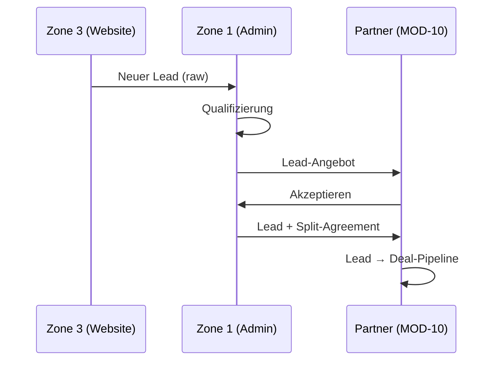

# MOD-10 — LEADGENERIERUNG (Lead Generation & Pipeline)

**Version:** v1.0.0  
**Status:** MINIMAL SPEC (Phase 1 Placeholder)  
**Datum:** 2026-01-25  
**Zone:** 2 (User Portal)  
**Typ:** ADDON (nur für Partner-Tenants)  
**Route-Prefix:** `/portal/leads`  
**Abhängig von:** MOD-09 (Vertriebspartner), MOD-06 (Listings), MOD-01 (Contacts), Backbone (Consents, Audit)

> **WICHTIG:** Dieses Modul war zuvor MOD-09. Es wurde auf MOD-10 verschoben.

---

## 1) MODULDEFINITION

### 1.1 Ziel

MOD-10 „Leadgenerierung" ist das operative ADDON-Modul für das aktive Lead-/Deal-Pipeline-Management durch Vertriebspartner. Es ermöglicht die Verwaltung von Leads aus verschiedenen Quellen (Zone 1 Pool, Website, Referrals) und deren Konvertierung zu Deals.

**Kernfunktion:** Lead-zu-Deal-Pipeline für Partner, separiert von der Objektauswahl (MOD-09).

### 1.2 Nutzerrollen

| Rolle | Zugang | Beschreibung |
|-------|--------|--------------|
| sales_partner | Full | Eigene Leads/Deals |
| org_admin (Plattform) | Oversight | Lead Pool Management |
| internal_ops | Write | Lead-Zuweisung |

### 1.3 Scope IN (geplant)

- Lead-Inbox (zugewiesene Leads aus Zone 1 Pool)
- Lead-Qualifizierung
- Deal-Pipeline (Kanban)
- Lead-Quellen-Tracking
- Konversions-Metriken
- Handoff zu MOD-09 (Objektmatching)

### 1.4 Scope OUT

- Objekt-Katalog (→ MOD-09)
- Investment-Beratung (→ MOD-09)
- Listing-Erstellung (→ MOD-06)

---

## 2) ROUTE-STRUKTUR

| Route | UI-Label | Screen | Beschreibung |
|-------|----------|--------|--------------|
| `/portal/leads` | Dashboard | LeadsDashboard | KPIs, Pipeline-Overview |
| `/portal/leads/inbox` | Inbox | LeadsInbox | Neue/Zugewiesene Leads |
| `/portal/leads/pipeline` | Pipeline | LeadsPipeline | Deal-Kanban |
| `/portal/leads/sources` | Quellen | LeadsSources | Lead-Quellen-Analyse |
| `/portal/leads/reports` | Reports | LeadsReports | Konversions-Reports |

### Dynamische Routes

| Route | Screen |
|-------|--------|
| `/portal/leads/inbox/:id` | Lead Detail |
| `/portal/leads/pipeline/:id` | Deal Detail |

---

## 3) DATENMODELL (PLACEHOLDER)

### 3.1 Tabellen-Übersicht

| Tabelle | Owner | Status | Beschreibung |
|---------|-------|--------|--------------|
| leads | MOD-10 | PLACEHOLDER | Lead-Objekte |
| lead_assignments | MOD-10 | PLACEHOLDER | Zuweisungen aus Pool |
| partner_deals | MOD-10 | PLACEHOLDER | Deal-Pipeline |
| lead_activities | MOD-10 | PLACEHOLDER | Aktivitäts-Log |

### 3.2 `leads` (PLACEHOLDER)

| Feld | Typ | Beschreibung |
|------|-----|--------------|
| id | uuid PK | — |
| tenant_id | uuid FK | Tenant-Isolation |
| public_id | text | `SOT-LEAD-XXXXXXXX` |
| source | text | zone1_pool, website, referral, manual |
| contact_id | uuid FK | Verknüpfter Kontakt |
| assigned_partner_id | uuid FK | Zugewiesener Partner |
| status | text | new, contacted, qualified, converted, lost |
| interest_type | text | buy, finance, consult |
| notes | text | — |
| created_at | timestamptz | — |
| updated_at | timestamptz | — |

### 3.3 `partner_deals` (PLACEHOLDER)

| Feld | Typ | Beschreibung |
|------|-----|--------------|
| id | uuid PK | — |
| tenant_id | uuid FK | — |
| lead_id | uuid FK | Ursprünglicher Lead |
| contact_id | uuid FK | Kunde |
| listing_id | uuid FK | Verknüpftes Listing (optional) |
| stage | text | lead, qualified, proposal, negotiation, closing, won, lost |
| deal_value | numeric | — |
| expected_close_date | date | — |
| created_at | timestamptz | — |
| updated_at | timestamptz | — |

---

## 4) ZONE 1 LEAD POOL

### 4.1 Konzept

Leads aus Zone 3 (Websites) werden NICHT direkt an Partner geroutet, sondern landen im **Zone 1 Lead Pool**. Platform Admins qualifizieren und verteilen Leads an Partner.

### 4.2 Lead-Split (FROZEN)

| Element | Wert |
|---------|------|
| **Platform-Anteil** | 1/3 der Provision |
| **Partner-Anteil** | 2/3 der Provision |

**Trigger:** Partner akzeptiert Lead aus Pool → Automatische Split-Vereinbarung.

### 4.3 Flow

---

## 5) API CONTRACT (RESERVIERT)

### 5.1 Nummernkreis

**MOD-10 Leadgenerierung: API-500 bis API-599**

### 5.2 Lead APIs (API-500 bis API-520)

| API-ID | Endpoint | Method | Auth | Status |
|--------|----------|--------|------|--------|
| API-500 | `/leads` | GET | sales_partner | PLACEHOLDER |
| API-501 | `/leads/:id` | GET | sales_partner | PLACEHOLDER |
| API-502 | `/leads/:id/qualify` | POST | sales_partner | PLACEHOLDER |
| API-503 | `/leads/:id/convert` | POST | sales_partner | PLACEHOLDER |
| API-510 | `/leads/inbox` | GET | sales_partner | PLACEHOLDER |
| API-511 | `/leads/inbox/:id/accept` | POST | sales_partner | PLACEHOLDER |
| API-512 | `/leads/inbox/:id/reject` | POST | sales_partner | PLACEHOLDER |

### 5.3 Deal APIs (API-520 bis API-540)

| API-ID | Endpoint | Method | Auth | Status |
|--------|----------|--------|------|--------|
| API-520 | `/leads/deals` | GET | sales_partner | PLACEHOLDER |
| API-521 | `/leads/deals` | POST | sales_partner | PLACEHOLDER |
| API-522 | `/leads/deals/:id` | GET | sales_partner | PLACEHOLDER |
| API-523 | `/leads/deals/:id/stage` | POST | sales_partner | PLACEHOLDER |
| API-524 | `/leads/deals/:id/win` | POST | sales_partner | PLACEHOLDER |
| API-525 | `/leads/deals/:id/lose` | POST | sales_partner | PLACEHOLDER |

### 5.4 Admin/Pool APIs (API-550 bis API-560)

| API-ID | Endpoint | Method | Auth | Status |
|--------|----------|--------|------|--------|
| API-550 | `/admin/leads/pool` | GET | platform_admin | PLACEHOLDER |
| API-551 | `/admin/leads/pool/:id/assign` | POST | platform_admin | PLACEHOLDER |
| API-552 | `/admin/leads/pool/:id/reject` | POST | platform_admin | PLACEHOLDER |

---

## 6) CROSS-MODULE BERÜHRUNGSWEGE

| Von | Nach | Aktion |
|-----|------|--------|
| Zone 3 | Zone 1 | Raw Lead Capture |
| Zone 1 | MOD-10 | Lead Assignment |
| MOD-10 | MOD-09 | Deal → Objektmatching |
| MOD-10 | MOD-06 | Deal → Reservation Trigger |
| MOD-10 | MOD-01 | Contact Creation |

---

## 7) OPEN QUESTIONS

| Q-ID | Frage | Empfehlung | Prio |
|------|-------|------------|------|
| Q10.1 | Lead-Qualifizierungs-Kriterien? | Definieren in Phase 2 | P1 |
| Q10.2 | Automatische Lead-Rotation? | Manuell in Phase 1 | P2 |
| Q10.3 | Lead-Timeout bei Nicht-Akzeptanz? | 48h, dann re-assign | P1 |
| Q10.4 | Lead-Kosten für Partner? | Kostenlos, nur Split | P0 |

---

## 8) ACCEPTANCE CRITERIA

| # | Kriterium | Status |
|---|-----------|--------|
| 1 | Lead-Inbox zeigt zugewiesene Leads | PLACEHOLDER |
| 2 | Lead-Akzeptanz triggert Split-Agreement | PLACEHOLDER |
| 3 | Deal-Pipeline mit Kanban | PLACEHOLDER |
| 4 | Stage-Transitions mit Audit | PLACEHOLDER |
| 5 | Konversions-Reports verfügbar | PLACEHOLDER |

---

*Dieses Dokument ist der minimale Planungsrahmen für MOD-10 Leadgenerierung.*
