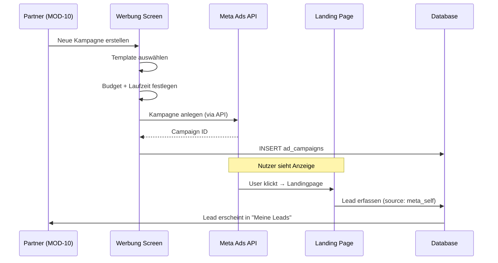
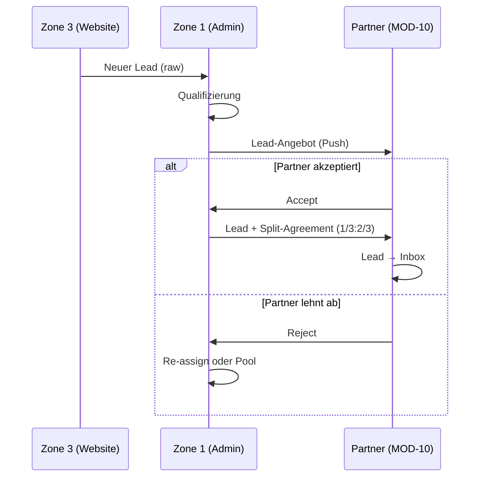
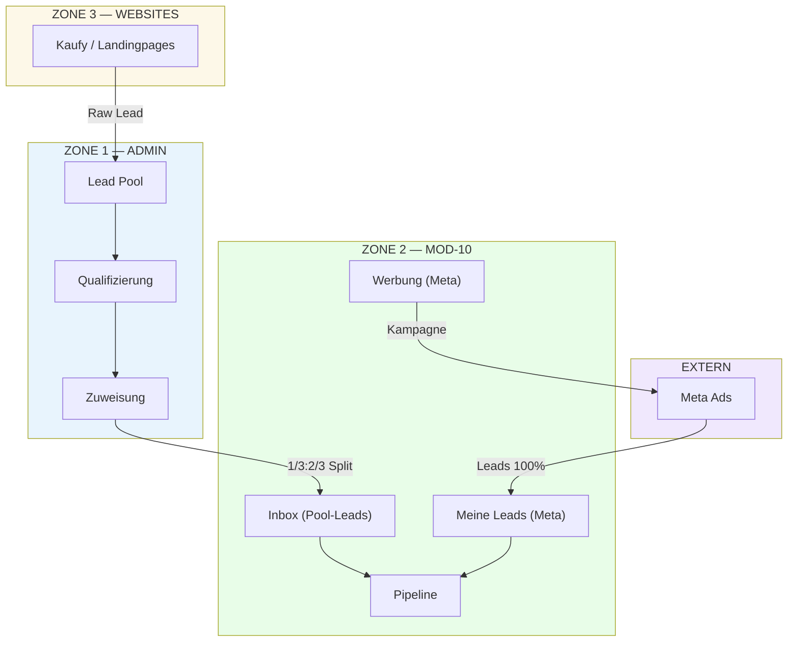

# MOD-10 — LEADGENERIERUNG (Lead Generation & Pipeline)

**Version:** v2.0.0  
**Status:** COMPLETE SPEC  
**Datum:** 2026-01-26  
**Zone:** 2 (User Portal)  
**Typ:** ADDON (nur für Kaufy-Registrierte)  
**Route-Prefix:** `/portal/leads`  
**API-Range:** API-500 bis API-599  
**Abhängig von:** MOD-09 (Vertriebspartner), MOD-06 (Listings), MOD-01 (Contacts), Backbone (Consents, Audit)

---

## 1) MODULDEFINITION

### 1.1 Ziel

MOD-10 „Leadgenerierung" ist das operative ADDON-Modul für:
1. **Aktive Lead-Generierung** via bezahlte Meta-Werbung (Facebook/Instagram)
2. **Lead-Pipeline-Management** für Vertriebspartner
3. **Lead-Zuweisung** durch Platform Admins aus Zone 1

**Kernfunktionen:**
- Partner kann selbst Meta-Ads buchen (Kapitalanlage-Immobilien-Werbung)
- Generierte Leads landen direkt beim buchenden Partner
- Admin kann Leads aus Zone 1 Pool an Partner zuweisen
- Objektbezogene Werbung (Property-spezifische Kampagnen) — Phase 2

### 1.2 Nutzerrollen

| Rolle | Zugang | Beschreibung |
|-------|--------|--------------|
| sales_partner | Full | Eigene Leads/Deals, Meta-Ads buchen |
| org_admin (Plattform) | Oversight | Lead Pool Management, Zuweisung |
| internal_ops | Write | Lead-Zuweisung, Support |

### 1.3 Scope IN (geplant)

- **Meta-Ads Self-Service:** Partner bucht eigene Werbung
- **Lead-Inbox:** Zugewiesene Leads aus Zone 1 Pool
- **Eigene Leads:** Leads aus eigener Meta-Kampagne
- **Lead-Qualifizierung:** Status-Workflow
- **Deal-Pipeline:** Kanban-Ansicht
- **Lead-Quellen-Tracking:** Meta, Pool, Referral
- **Konversions-Metriken:** Reports

### 1.4 Scope OUT

- ❌ Objektbezogene Werbung (Phase 2)
- ❌ Objekt-Katalog (→ MOD-09)
- ❌ Investment-Beratung (→ MOD-09)
- ❌ Listing-Erstellung (→ MOD-06)

---

## 2) ROUTE-STRUKTUR

| Route | UI-Label | Screen | Beschreibung |
|-------|----------|--------|--------------|
| `/portal/leads` | Dashboard | LeadsDashboard | KPIs, Pipeline-Overview |
| `/portal/leads/inbox` | Inbox | LeadsInbox | Zugewiesene Leads (aus Pool) |
| `/portal/leads/meine-leads` | Meine Leads | MyLeads | Eigene Leads (aus Meta-Ads) |
| `/portal/leads/pipeline` | Pipeline | LeadsPipeline | Deal-Kanban |
| `/portal/leads/werbung` | Werbung | AdsManager | Meta-Ads Buchung |
| `/portal/leads/sources` | Quellen | LeadsSources | Lead-Quellen-Analyse |
| `/portal/leads/reports` | Reports | LeadsReports | Konversions-Reports |

### Dynamische Routes

| Route | Screen |
|-------|--------|
| `/portal/leads/inbox/:id` | Lead Detail (Pool) |
| `/portal/leads/meine-leads/:id` | Lead Detail (Eigene) |
| `/portal/leads/pipeline/:id` | Deal Detail |
| `/portal/leads/werbung/:campaign_id` | Kampagnen-Detail |

---

## 3) META-ADS SELBSTBUCHUNG

### 3.1 Konzept

Partner können **eigenständig bei Meta (Facebook/Instagram) Werbung buchen** für Kapitalanlage-Immobilien. Die Plattform stellt:
- Vorlagen/Templates für Anzeigen
- Tracking-Pixel-Integration
- Lead-Erfassung via Formulare
- Direkte Zuordnung zum buchenden Partner

### 3.2 Flow: Partner bucht Meta-Ads

### 3.3 Kostenmodell

| Element | Beschreibung |
|---------|--------------|
| **Werbekosten** | Direkt an Meta (Partner zahlt selbst) |
| **Plattformgebühr** | Keine (oder minimal für Tracking) |
| **Lead-Ownership** | 100% beim Partner (kein Split) |

### 3.4 Abgrenzung zu Pool-Leads

| Aspekt | Eigene Leads (Meta) | Pool-Leads (Zone 1) |
|--------|---------------------|---------------------|
| **Quelle** | Partner-eigene Kampagne | Website / Zone 3 |
| **Kosten** | Partner zahlt Meta | Kostenlos |
| **Provision-Split** | 0% Platform | 1/3 Platform : 2/3 Partner |
| **Ownership** | Partner | Platform → Partner |

---

## 4) ZONE 1 LEAD POOL

### 4.1 Konzept

Leads aus Zone 3 (Websites) werden NICHT direkt an Partner geroutet, sondern landen im **Zone 1 Lead Pool**. Platform Admins qualifizieren und verteilen Leads an Partner.

### 4.2 Lead-Split (FROZEN)

| Element | Wert |
|---------|------|
| **Platform-Anteil** | 1/3 der Provision |
| **Partner-Anteil** | 2/3 der Provision |

**Trigger:** Partner akzeptiert Lead aus Pool → Automatische Split-Vereinbarung.

### 4.3 Admin-Zuweisung Flow

---

## 5) OBJEKTBEZOGENE WERBUNG (PHASE 2)

### 5.1 Konzept (geplant)

- Property-Owner kann Werbung für **spezifisches Objekt** buchen
- Kampagne zeigt Objekt-Details aus MOD-06 Listing
- Leads werden dem Listing zugeordnet
- Aktive Buchung erforderlich (nicht automatisch)

### 5.2 Differenzierung

| Werbetyp | Buchung durch | Leads gehen an | Phase |
|----------|---------------|----------------|-------|
| **Kapitalanlage allgemein** | Partner (MOD-10) | Partner | 1 |
| **Objektbezogen** | Owner (MOD-06) | Listing/Owner | 2 |

---

## 6) DATENMODELL

### 6.1 Tabellen-Übersicht

| Tabelle | Owner | Status | Beschreibung |
|---------|-------|--------|--------------|
| leads | MOD-10 | SPEC | Lead-Objekte |
| lead_assignments | MOD-10 | SPEC | Zuweisungen aus Pool |
| partner_deals | MOD-10 | SPEC | Deal-Pipeline |
| lead_activities | MOD-10 | SPEC | Aktivitäts-Log |
| ad_campaigns | MOD-10 | SPEC | Meta-Kampagnen |
| ad_campaign_leads | MOD-10 | SPEC | Kampagne → Lead Mapping |

### 6.2 `leads`

| Feld | Typ | Beschreibung |
|------|-----|--------------|
| id | uuid PK | — |
| tenant_id | uuid FK | Tenant-Isolation |
| public_id | text | `SOT-LEAD-XXXXXXXX` |
| source | text | `zone1_pool` \| `meta_self` \| `meta_property` \| `referral` \| `manual` |
| source_campaign_id | uuid FK | Bei Meta-Leads |
| contact_id | uuid FK | Verknüpfter Kontakt |
| assigned_partner_id | uuid FK | Zugewiesener Partner |
| status | text | `new` \| `contacted` \| `qualified` \| `converted` \| `lost` |
| interest_type | text | `buy` \| `finance` \| `consult` |
| property_interest_id | uuid FK | Bei objektbezogenem Interest |
| notes | text | — |
| created_at | timestamptz | — |
| updated_at | timestamptz | — |

### 6.3 `ad_campaigns`

| Feld | Typ | Beschreibung |
|------|-----|--------------|
| id | uuid PK | — |
| tenant_id | uuid FK | Partner-Tenant |
| partner_user_id | uuid FK | Buchender Partner |
| campaign_type | text | `kapitalanlage_allgemein` \| `property_specific` |
| property_id | uuid FK | Bei objektbezogen |
| meta_campaign_id | text | Externe Meta-ID |
| status | text | `draft` \| `pending` \| `active` \| `paused` \| `completed` |
| budget_cents | integer | Budget in Cents |
| spent_cents | integer | Ausgegeben |
| start_date | date | — |
| end_date | date | — |
| template_used | text | Template-Code |
| created_at | timestamptz | — |
| updated_at | timestamptz | — |

### 6.4 `partner_deals`

| Feld | Typ | Beschreibung |
|------|-----|--------------|
| id | uuid PK | — |
| tenant_id | uuid FK | — |
| lead_id | uuid FK | Ursprünglicher Lead |
| contact_id | uuid FK | Kunde |
| listing_id | uuid FK | Verknüpftes Listing (optional) |
| stage | text | `lead` \| `qualified` \| `proposal` \| `negotiation` \| `closing` \| `won` \| `lost` |
| deal_value | numeric | — |
| commission_split | jsonb | `{platform: 0.33, partner: 0.67}` bei Pool-Leads |
| expected_close_date | date | — |
| created_at | timestamptz | — |
| updated_at | timestamptz | — |

---

## 7) API CONTRACT

### 7.1 Nummernkreis

**MOD-10 Leadgenerierung: API-500 bis API-599**

### 7.2 Lead APIs (API-500 bis API-519)

| API-ID | Endpoint | Method | Auth | Beschreibung |
|--------|----------|--------|------|--------------|
| API-500 | `/leads` | GET | sales_partner | Alle eigenen Leads |
| API-501 | `/leads/:id` | GET | sales_partner | Lead Detail |
| API-502 | `/leads/:id/qualify` | POST | sales_partner | Lead qualifizieren |
| API-503 | `/leads/:id/convert` | POST | sales_partner | Lead → Deal konvertieren |
| API-504 | `/leads/:id/contact` | POST | sales_partner | Kontakt loggen |
| API-510 | `/leads/inbox` | GET | sales_partner | Pool-Leads (zugewiesen) |
| API-511 | `/leads/inbox/:id/accept` | POST | sales_partner | Pool-Lead akzeptieren |
| API-512 | `/leads/inbox/:id/reject` | POST | sales_partner | Pool-Lead ablehnen |

### 7.3 Deal APIs (API-520 bis API-539)

| API-ID | Endpoint | Method | Auth | Beschreibung |
|--------|----------|--------|------|--------------|
| API-520 | `/leads/deals` | GET | sales_partner | Alle Deals |
| API-521 | `/leads/deals` | POST | sales_partner | Deal anlegen |
| API-522 | `/leads/deals/:id` | GET | sales_partner | Deal Detail |
| API-523 | `/leads/deals/:id/stage` | POST | sales_partner | Stage-Transition |
| API-524 | `/leads/deals/:id/win` | POST | sales_partner | Deal gewonnen |
| API-525 | `/leads/deals/:id/lose` | POST | sales_partner | Deal verloren |

### 7.4 Ads/Campaign APIs (API-540 bis API-549)

| API-ID | Endpoint | Method | Auth | Beschreibung |
|--------|----------|--------|------|--------------|
| API-540 | `/leads/campaigns` | GET | sales_partner | Eigene Kampagnen |
| API-541 | `/leads/campaigns` | POST | sales_partner | Kampagne erstellen |
| API-542 | `/leads/campaigns/:id` | GET | sales_partner | Kampagnen-Detail |
| API-543 | `/leads/campaigns/:id/pause` | POST | sales_partner | Pausieren |
| API-544 | `/leads/campaigns/:id/resume` | POST | sales_partner | Fortsetzen |
| API-545 | `/leads/campaigns/:id/stats` | GET | sales_partner | Statistiken |

### 7.5 Admin/Pool APIs (API-550 bis API-560)

| API-ID | Endpoint | Method | Auth | Beschreibung |
|--------|----------|--------|------|--------------|
| API-550 | `/admin/leads/pool` | GET | platform_admin | Pool-Übersicht |
| API-551 | `/admin/leads/pool/:id/assign` | POST | platform_admin | Lead zuweisen |
| API-552 | `/admin/leads/pool/:id/reject` | POST | platform_admin | Lead ablehnen |
| API-553 | `/admin/leads/pool/stats` | GET | platform_admin | Pool-Statistiken |

---

## 8) CROSS-MODULE BERÜHRUNGSWEGE

| Von | Nach | Aktion |
|-----|------|--------|
| Zone 3 | Zone 1 | Raw Lead Capture |
| Zone 1 | MOD-10 | Lead Assignment (Pool → Inbox) |
| MOD-10 | MOD-09 | Deal → Objektmatching |
| MOD-10 | MOD-06 | Deal → Reservation Trigger |
| MOD-10 | MOD-01 | Contact Creation |
| MOD-10 | Meta API | Campaign Management |

---

## 9) CONSENT & AUDIT

### 9.1 Consent Gates

| Code | Label | Trigger |
|------|-------|---------|
| `LEAD_SPLIT_AGREEMENT` | Pool-Lead Provisionsvereinbarung | Bei Accept Pool-Lead |
| `META_ADS_TOS` | Meta Werbe-AGB | Bei erster Kampagne |

### 9.2 Audit Events

| Event Type | Trigger |
|------------|---------|
| `lead.created` | Neuer Lead |
| `lead.assigned` | Pool → Partner |
| `lead.accepted` | Partner akzeptiert |
| `lead.rejected` | Partner lehnt ab |
| `lead.qualified` | Status-Transition |
| `lead.converted` | → Deal |
| `deal.stage_changed` | Pipeline-Movement |
| `deal.won` | Closing |
| `deal.lost` | Verloren |
| `campaign.created` | Neue Kampagne |
| `campaign.activated` | Kampagne startet |
| `campaign.paused` | Pausiert |
| `campaign.completed` | Beendet |

---

## 10) OPEN QUESTIONS

| Q-ID | Frage | Empfehlung | Prio |
|------|-------|------------|------|
| Q10.1 | Lead-Qualifizierungs-Kriterien? | Standard-Checkliste definieren | P1 |
| Q10.2 | Automatische Lead-Rotation? | Manuell in Phase 1 | P2 |
| Q10.3 | Lead-Timeout bei Nicht-Akzeptanz? | **48h**, dann re-assign | P1 |
| Q10.4 | Lead-Kosten für Partner? | **Kostenlos für Pool**, nur Split | P0 |
| Q10.5 | Meta API Integration Scope? | **Managed Ads** (SoT bucht im Auftrag) vs. Self-Service | P0 |
| Q10.6 | Kampagnen-Templates? | 3-5 Standard-Templates für Kapitalanlage | P1 |
| Q10.7 | Budget-Minimum? | 100€ pro Kampagne empfohlen | P2 |

### Empfehlung zu Q10.5:
**Managed Ads** (Plattform bucht im Auftrag des Partners) ist einfacher zu implementieren als vollständige Self-Service API-Integration. Partner gibt Budget frei, Plattform managed die Kampagne.

---

## 11) ACCEPTANCE CRITERIA

| # | Kriterium | Status |
|---|-----------|--------|
| 1 | Partner sieht zugewiesene Pool-Leads in Inbox | SPEC |
| 2 | Lead-Akzeptanz triggert Split-Agreement | SPEC |
| 3 | Deal-Pipeline mit Kanban funktioniert | SPEC |
| 4 | Stage-Transitions mit Audit | SPEC |
| 5 | Konversions-Reports verfügbar | SPEC |
| 6 | Meta-Kampagne kann erstellt werden | SPEC |
| 7 | Leads aus eigener Kampagne erscheinen in "Meine Leads" | SPEC |
| 8 | Admin kann Leads aus Pool zuweisen | SPEC |

---

## 12) MERMAID: LEAD-FLOW GESAMT

---

## 13) CHANGELOG

| Datum | Version | Änderung |
|-------|---------|----------|
| 2026-01-26 | v2.0.0 | Meta-Ads Self-Service, Admin-Zuweisung, objektbezogene Werbung (Phase 2) |
| 2026-01-25 | v1.1.0 | 10-Modul-Renumbering (von MOD-09 zu MOD-10) |

---

*Dieses Dokument ist die vollständige Spezifikation für MOD-10 Leadgenerierung.*
