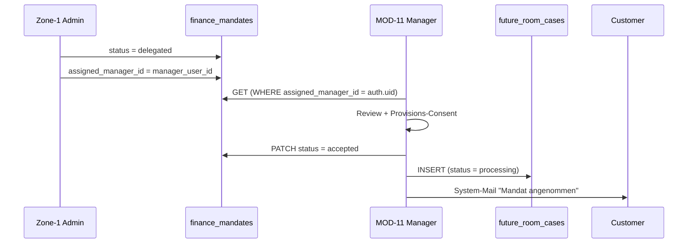

# MOD-11 — FINANZIERUNGSMANAGER

**Version:** v1.0.0  
**Status:** COMPLETE SPEC  
**Datum:** 2026-01-28  
**Zone:** 2 (User Portal)  
**Typ:** SPEZIALISTENMODUL (für Rolle `finance_manager`)  
**Route-Prefix:** `/portal/finanzierungsmanager`  
**API-Range:** API-1100 bis API-1199  

---

## 1) MODULDEFINITION

### 1.1 Zweck

MOD-11 ist das Arbeitsmodul für Finanzierungsmanager (Rolle: `finance_manager`). 
Nach Delegation eines Mandats durch Zone-1 Admin (`/admin/futureroom`) übernimmt der 
Manager die Bearbeitung, prüft Unterlagen, und reicht bei Banken ein.

### 1.2 Zielnutzer / Rollen

| Rolle | Zugang | Beschreibung |
|-------|--------|--------------|
| `finance_manager` | Full Access | Bearbeitet delegierte Mandate, reicht bei Banken ein |

### 1.3 Inputs

- `finance_mandates` mit `status=delegated` + `assigned_manager_id=auth.uid()`
- `finance_requests` (read)
- `applicant_profiles` (read/write für Nachpflege)
- `finance_bank_contacts` (read, aus Zone-1)
- `documents` / `storage_nodes` (read/write für Datenraum)

### 1.4 Outputs

- `future_room_cases` (create/update)
- Bank-Einreichung (E-Mail oder Plattform-Export)
- Status-Updates → Spiegelung an Zone-1 + MOD-07

---

## 2) SOURCE OF TRUTH (SoT) Matrix

| Phase | Status | SoT Owner |
|-------|--------|-----------|
| Phase 1 | `finance_requests.status = draft` | MOD-07 |
| Phase 2 | `finance_mandates.status = new/triage/delegated` | Zone-1 FutureRoom |
| Phase 3 | `finance_mandates.status = accepted` | MOD-11 |
| Phase 3 | `future_room_cases.*` | MOD-11 |

---

## 3) SUB-TILES (4 Menüpunkte, FROZEN)

| # | Route | Label | Beschreibung |
|---|-------|-------|--------------|
| 1 | `/portal/finanzierungsmanager` | Mandate | Collapsible "How it works" + Mandate Inbox (delegated) + Annehmen → Provisions-Consent → Case erzeugen |
| 2 | `/portal/finanzierungsmanager/bearbeitung` | Bearbeitung | Case-Liste + Detail: Selbstauskunft nachpflegen + Objekt (read-only) + Datenraum-Links + Notizen |
| 3 | `/portal/finanzierungsmanager/einreichen` | Einreichen | Bank auswählen (Zone-1 Kontakte) + Plattform/E-Mail Optionen + PDF + Datenraum-Link |
| 4 | `/portal/finanzierungsmanager/status` | Status | Timeline + Bank-Rückmeldungen + Spiegelung an Zone-1 + MOD-07 |

---

## 4) DATENMODELL

### 4.1 Genutzte Tabellen (kein eigenes Schema, Wiederverwendung)

| Tabelle | Zugriff | Beschreibung |
|---------|---------|--------------|
| `finance_mandates` | READ + PATCH | Delegierte Mandate annehmen |
| `future_room_cases` | CREATE + UPDATE | Aktive Fälle nach Acceptance |
| `applicant_profiles` | READ + PATCH | Selbstauskunft nachpflegen |
| `finance_requests` | READ | Request-Daten lesen |
| `finance_bank_contacts` | READ | Bankkontakte aus Zone-1 |
| `documents` | READ + CREATE | Datenraum-Dokumente |
| `document_links` | READ + CREATE | Verknüpfungen |

### 4.2 Status-Schema

**finance_mandates.status (FROZEN):**
```
new → triage → delegated → accepted → closed
```

**future_room_cases.status (FROZEN):**
```
processing → submitted_to_bank → pending_docs → approved → rejected
```

---

## 5) API-KATALOG (API-1100 bis API-1199)

| API-ID | Endpoint | Method | Rollen | Beschreibung |
|--------|----------|--------|--------|--------------|
| API-1101 | `/future_room_cases` | GET | finance_manager | Liste der angenommenen Cases |
| API-1102 | `/future_room_cases` | POST | finance_manager | Case erstellen bei Acceptance |
| API-1103 | `/future_room_cases/:id` | PATCH | finance_manager | Case-Status aktualisieren |
| API-1104 | `/finance_mandates` | GET | finance_manager | Delegierte Mandate abrufen (assigned_manager_id = auth.uid) |
| API-1105 | `/finance_mandates/:id` | PATCH | finance_manager | Mandat annehmen (status → accepted) |
| API-1106 | `/applicant_profiles/:id` | GET | finance_manager | Selbstauskunft lesen |
| API-1107 | `/applicant_profiles/:id` | PATCH | finance_manager | Selbstauskunft nachpflegen |
| API-1108 | `/finance_bank_contacts` | GET | finance_manager | Bankkontakte abrufen |
| API-1109 | `/finance_requests/:id` | GET | finance_manager | Request-Daten lesen |

---

## 6) WORKFLOW

### 6.1 Mandate annehmen



### 6.2 Bearbeitung

1. Selbstauskunft prüfen + nachpflegen (`applicant_profiles`)
2. Objekt-Daten prüfen (read-only aus MOD-04/MOD-08/custom)
3. Datenraum prüfen (Dokumente via DMS `storage_nodes`)
4. Interne Notizen hinzufügen

### 6.3 Einreichen

**Option A: Plattform (Hypoport/Europace)**
- Export als strukturiertes Format (Phase 2)

**Option B: Direkt per E-Mail**
1. Bank auswählen aus `finance_bank_contacts`
2. E-Mail Editor mit KI-Draft
3. PDF generieren (Selbstauskunft + Kalkulation + Objektübersicht)
4. Datenraum-Link anhängen
5. Senden → `future_room_cases.status = submitted_to_bank`

---

## 7) PROVISIONS-CONSENT (Pflicht bei Annahme)

Bei Klick auf "Annehmen" muss der Manager eine Provisionsvereinbarung bestätigen:

```typescript
interface CommissionConsent {
  mandate_id: string;
  manager_id: string;
  consent_given_at: string;
  commission_rate_percent: number;
  terms_accepted: boolean;
}
```

Erst nach Consent wird:
- `finance_mandates.status = accepted`
- `future_room_cases` INSERT
- System-Mail an Kunde + Partner

---

## 8) ABHÄNGIGKEITEN

| Von | Zu | Art |
|-----|-----|-----|
| Zone-1 FutureRoom | MOD-11 | Mandate-Delegation |
| MOD-07 | MOD-11 | finance_requests + applicant_profiles |
| MOD-03 DMS | MOD-11 | Dokumente + Storage |
| MOD-04 Immobilien | MOD-11 | Objekt-Daten (read-only) |

---

## 9) CHANGELOG

| Version | Datum | Änderungen |
|---------|-------|------------|
| 1.0.0 | 2026-01-28 | Initial Release: Mandate Inbox, Provisions-Consent, Selbstauskunft-Bearbeitung, Bank-Einreichung |
