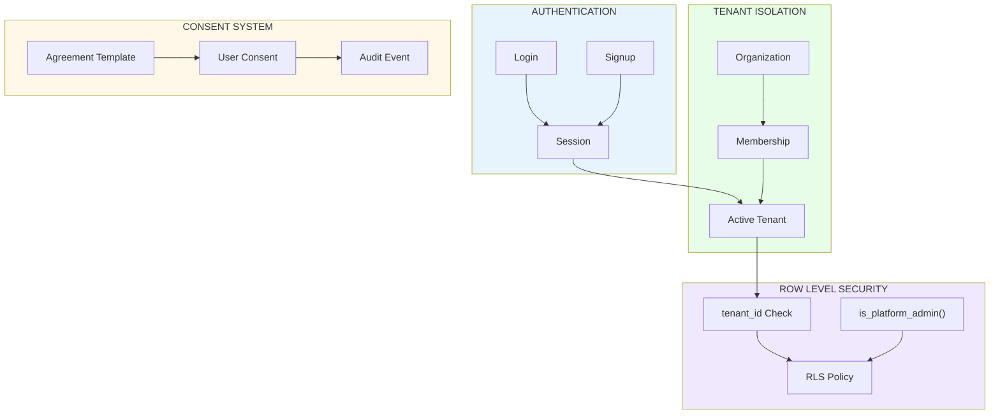
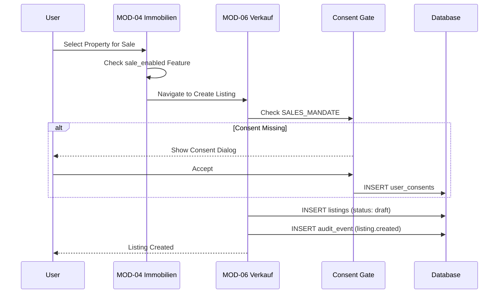
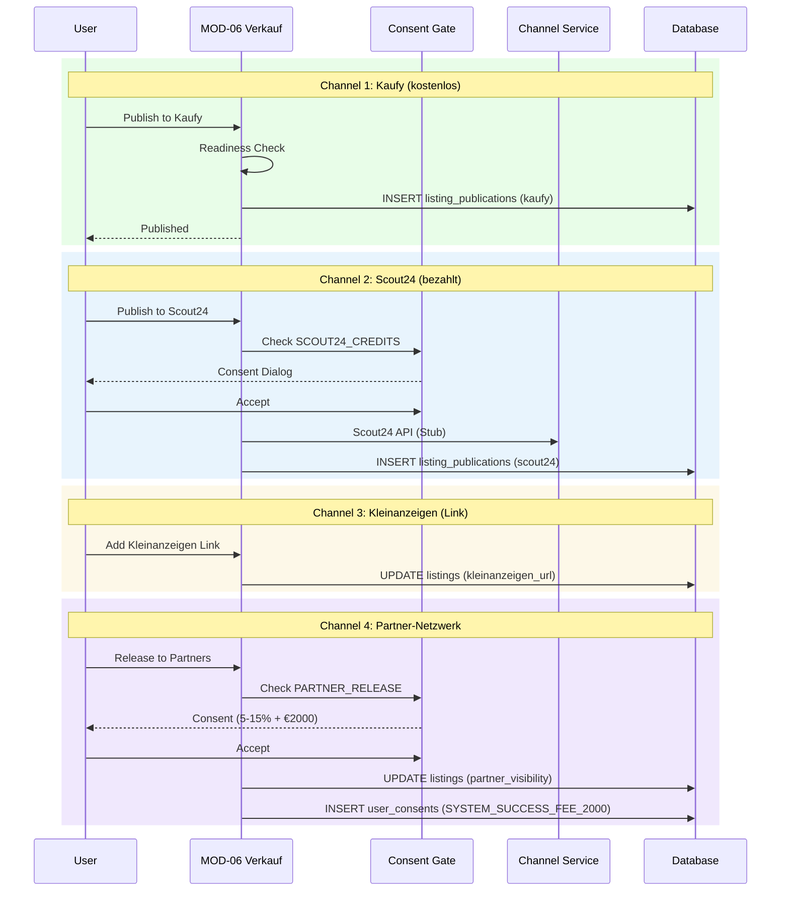
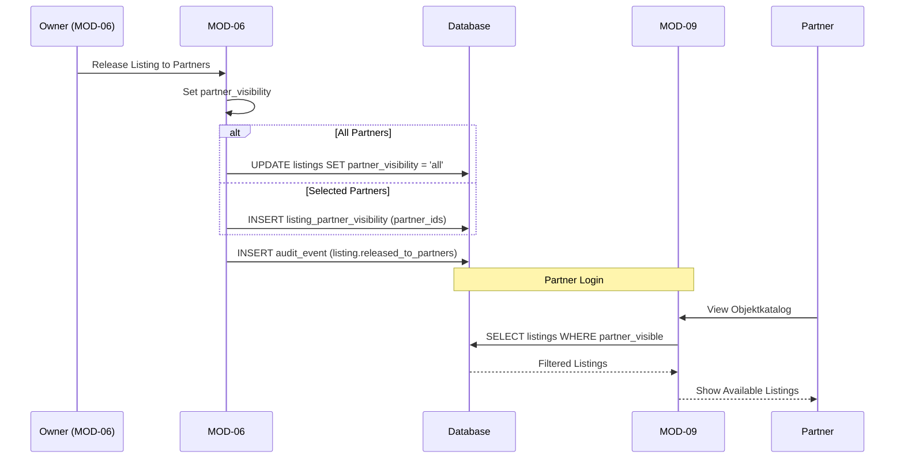
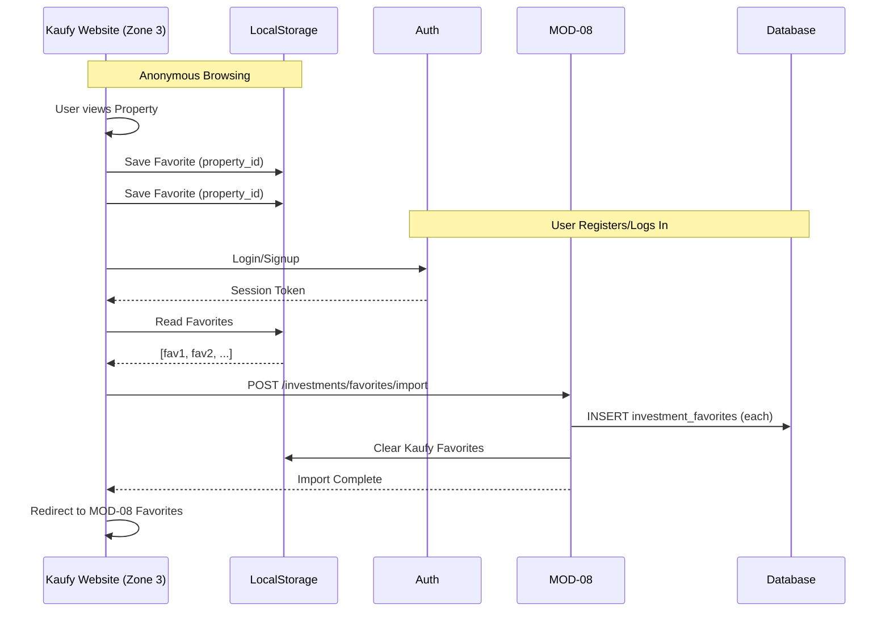
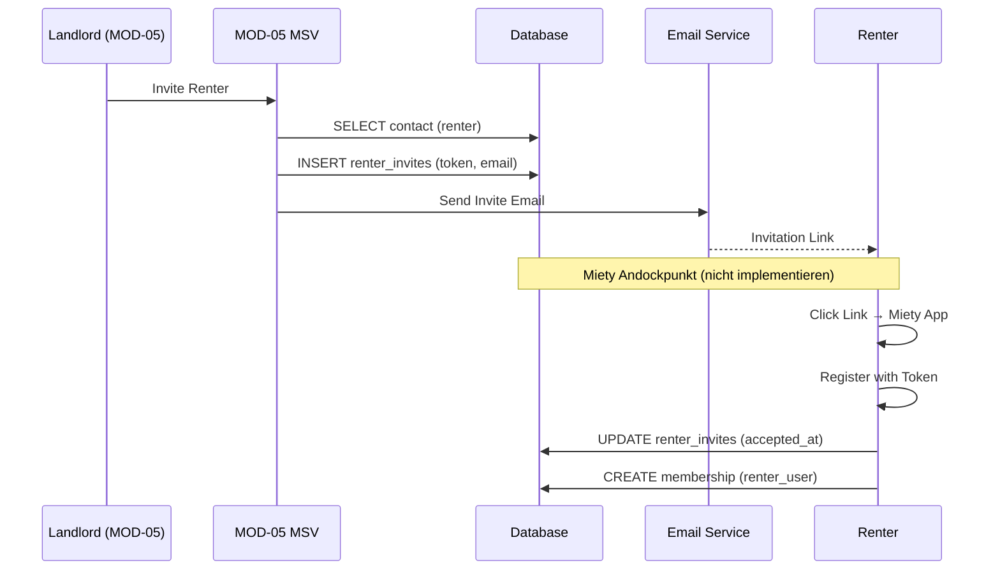
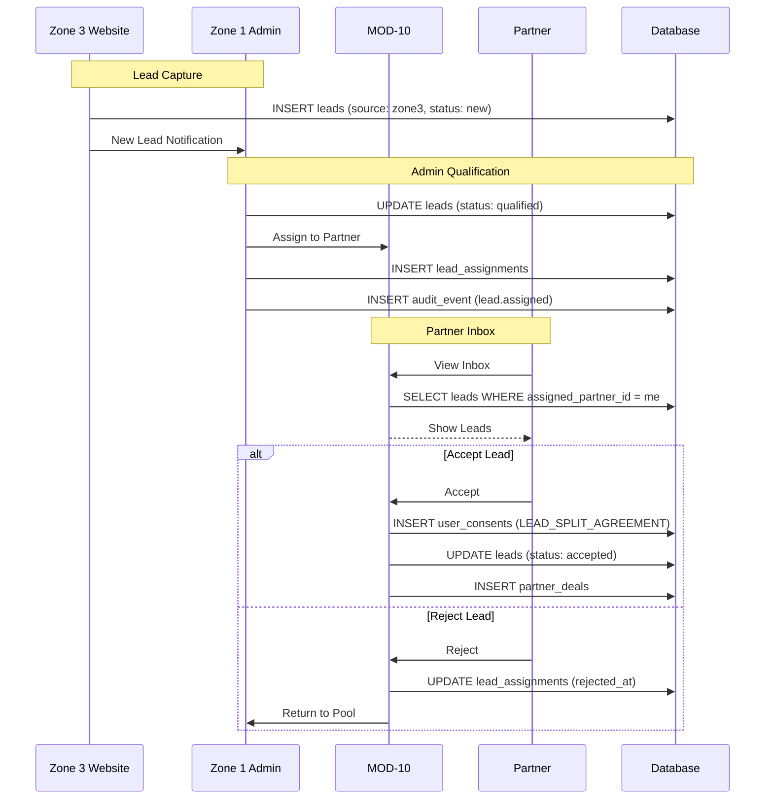

# FLOW PACK — Cross-Module Flows

**Version:** v1.0  
**Datum:** 2026-01-26

---

## DIA-003: Core Foundations

---

## DIA-010: MOD-04 → MOD-06 Listing-Erstellung

---

## DIA-011: MOD-06 Publishing 4 Channels

---

## DIA-012: MOD-06 → MOD-09 Partner Release

---

## DIA-013: Kaufy Favorites Sync

---

## DIA-015: MOD-05 → Miety Invite

---

## DIA-016: Lead Capture → Pipeline

---

*Dieses Dokument enthält alle Cross-Module Flow-Diagramme.*
