# System of a Town — System Diagrams & Cross-Module Flows

**Version:** v2.0.0  
**Status:** SPEC COMPLETE  
**Letzte Aktualisierung:** 2026-01-25  
**Zweck:** Visualisierung der Gesamtarchitektur, Publishing-Flows, State Machines

---

## 1) SYSTEM-ÜBERSICHT (3-Zonen-Modell)

### 1.1 High-Level Architecture

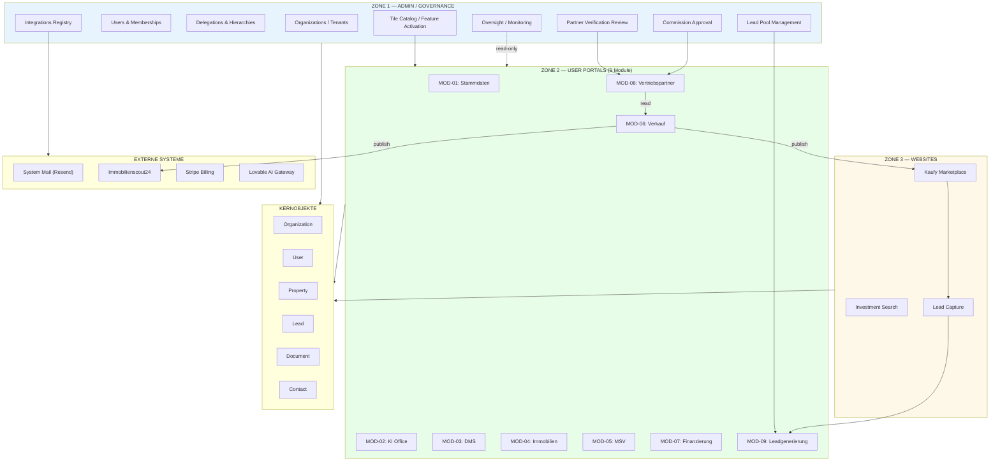

---

## 2) MOD-06 ↔ MOD-08 DATA FLOW

### 2.1 Complete Interaction Flow

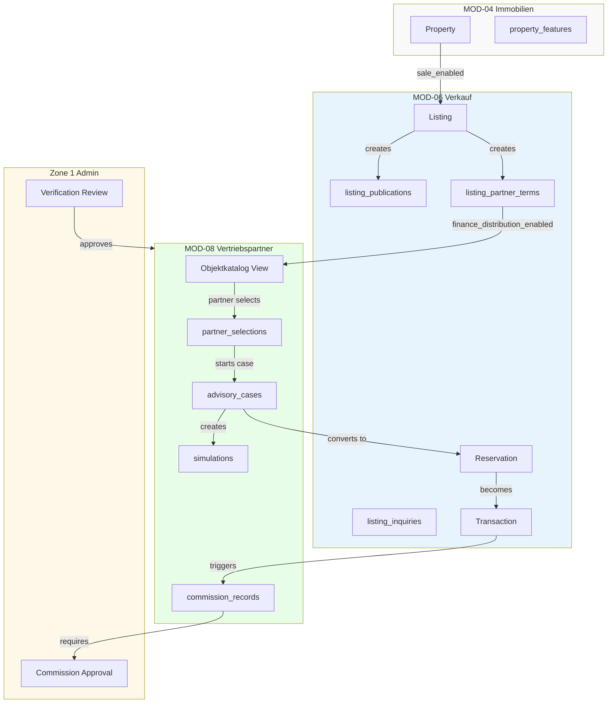

---

## 3) PUBLISHING CHANNEL FLOWS

### 3.1 Kaufy Publishing Flow

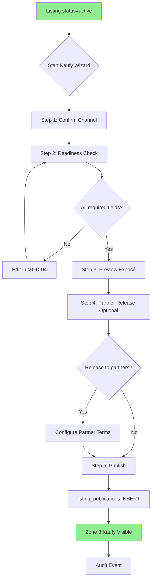

### 3.2 Partner Network Release Flow

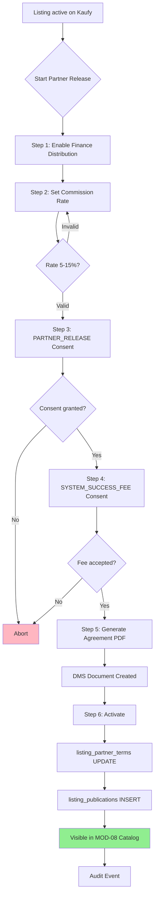

### 3.3 Scout24 Publishing Flow

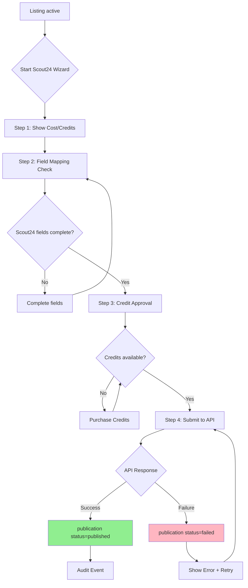

### 3.4 eBay Kleinanzeigen Flow

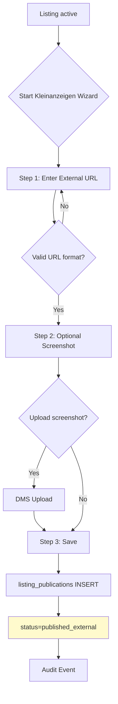

---

## 4) STATE MACHINES

### 4.1 Listing Lifecycle

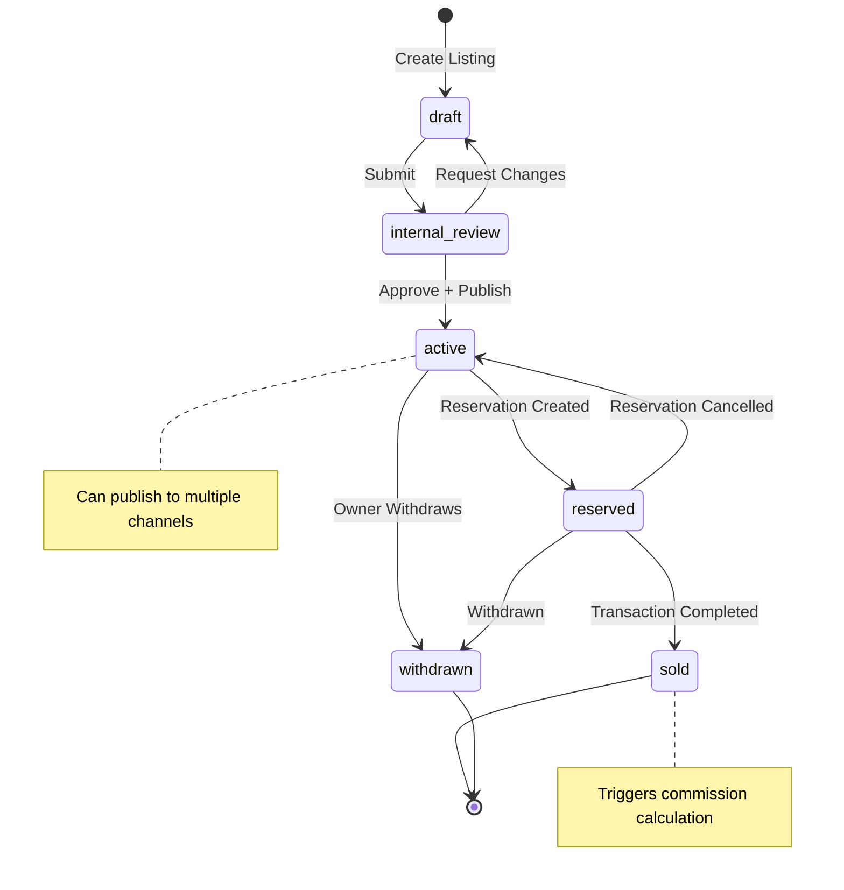

### 4.2 Publication Status (per Channel)

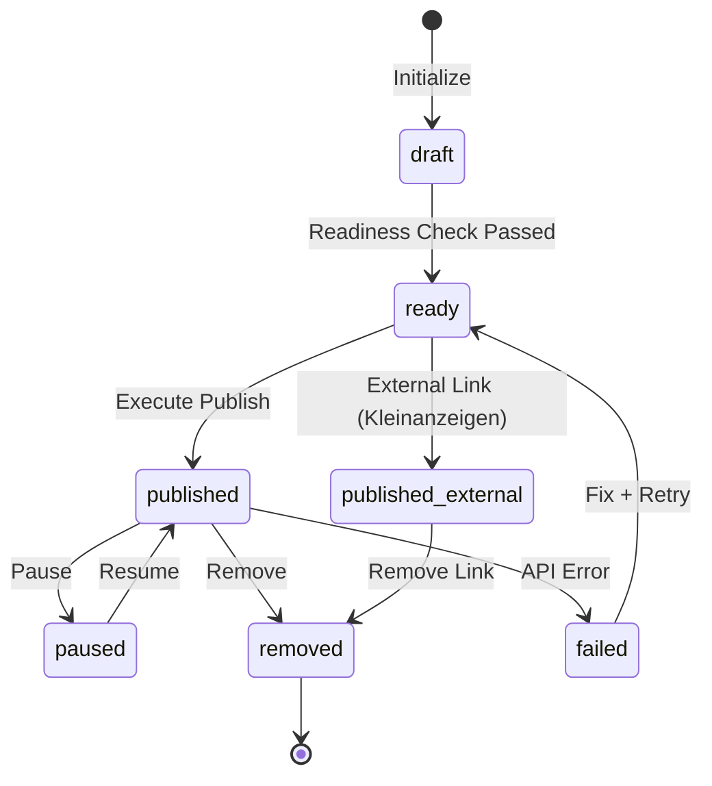

### 4.3 Partner Verification Status

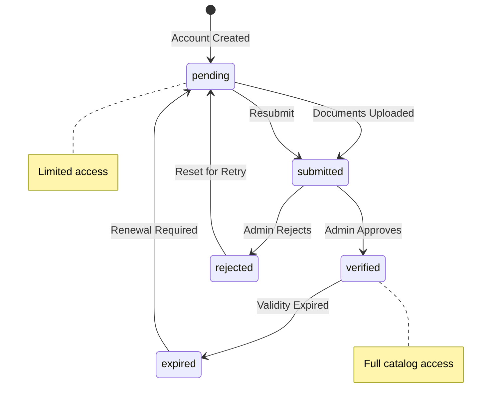

### 4.4 Advisory Case Status

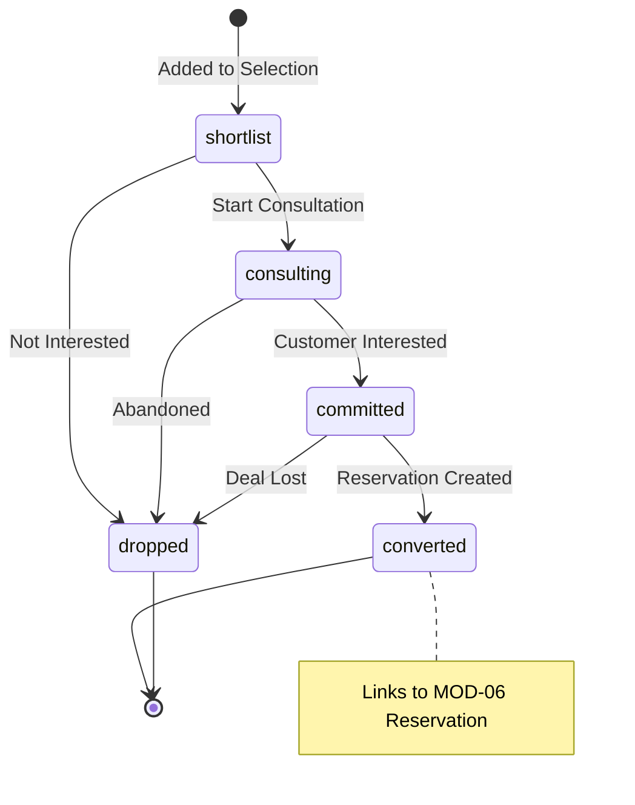

### 4.5 Commission Status

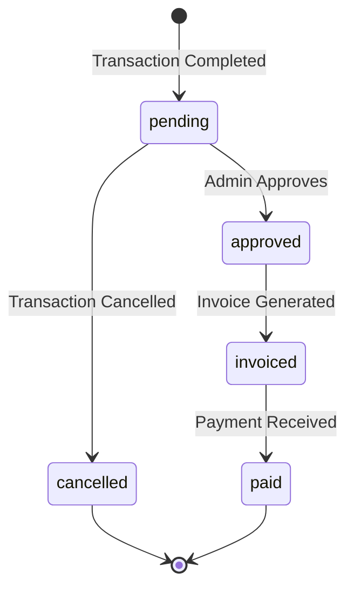

---

## 5) CROSS-MODULE FLOWS

### 5.1 Complete Sales Journey

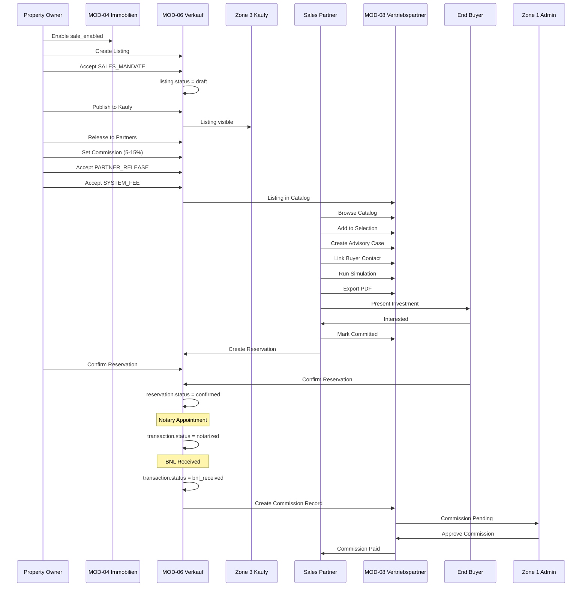

### 5.2 Lead Flow (MOD-09 → MOD-08)

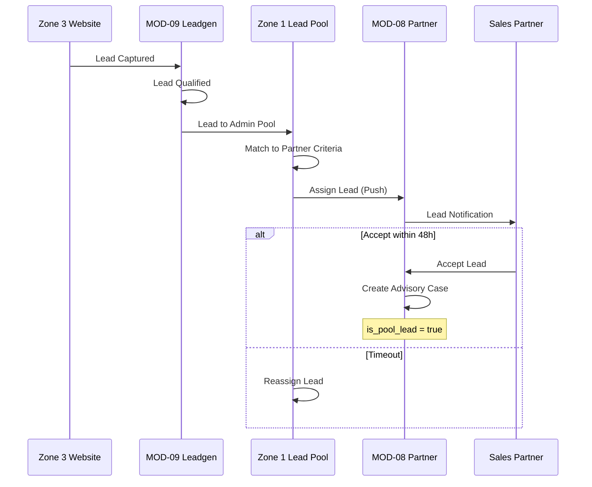

---

## 6) AGREEMENT & CONSENT FLOW

### 6.1 Publishing Consent Chain

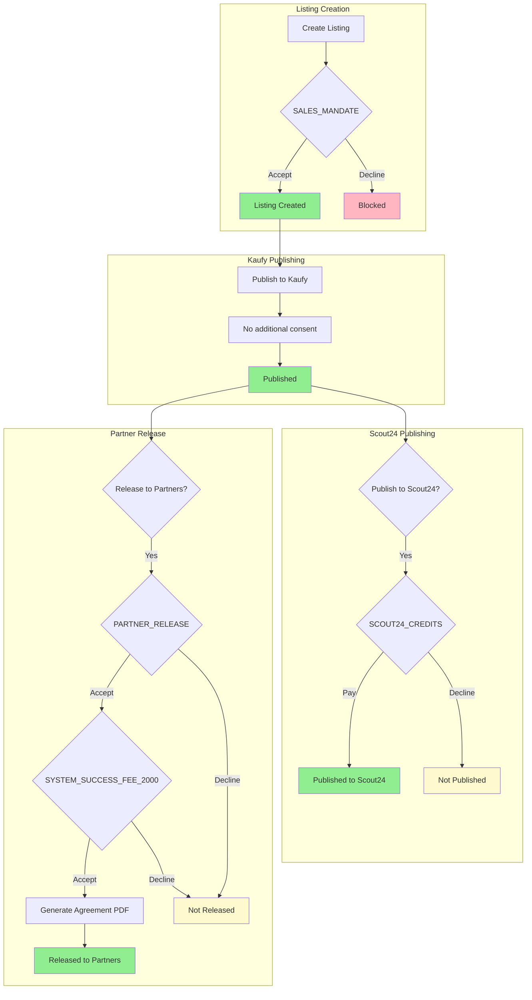

---

## 7) PROVISIONS-MODELL DIAGRAMM

### 7.1 Commission Calculation Flow

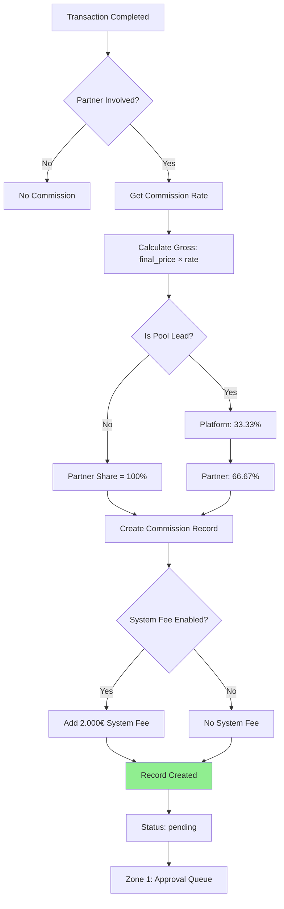

---

## 8) ZONE 2 MODULE GRID (9 Module)

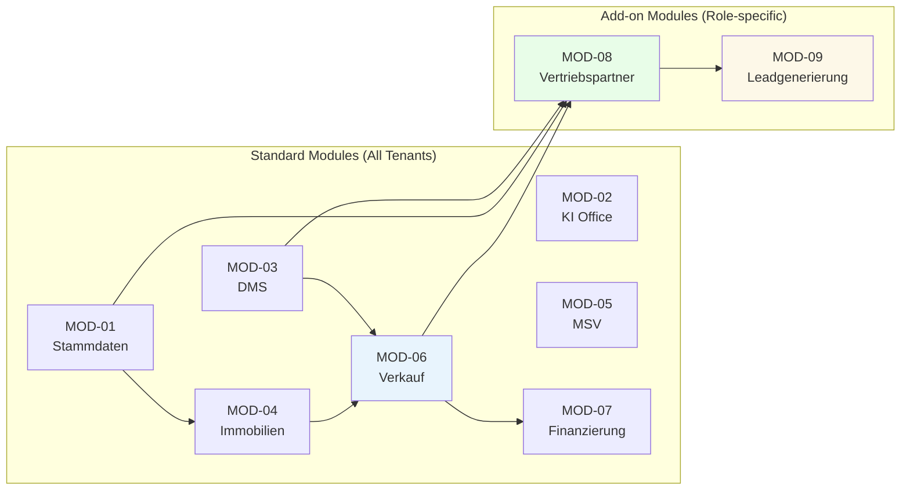

---

## 9) INVESTMENT ENGINE INTEGRATION

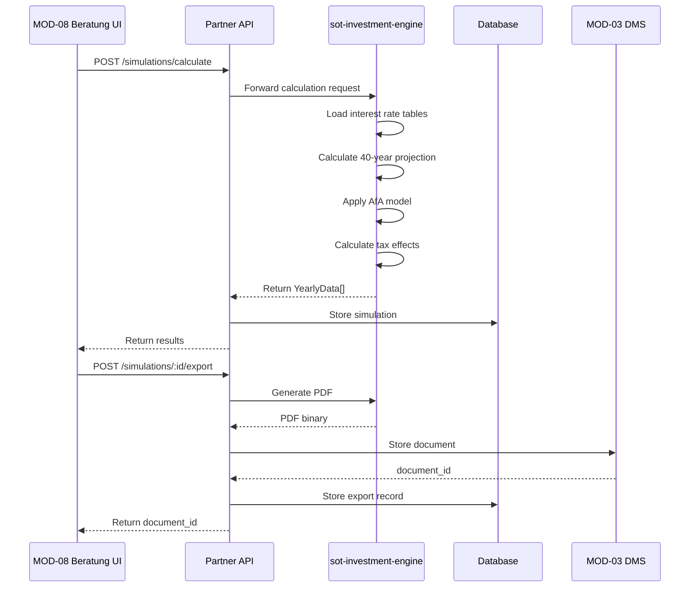

---

*Version 2.0.0 — Vollständige Diagramm-Sammlung für MOD-06 + MOD-08*
