# System of a Town — System Diagrams & Cross-Module Flows

**Version:** v3.0.0  
**Status:** SPEC COMPLETE  
**Letzte Aktualisierung:** 2026-01-26  
**Zweck:** Visualisierung der Gesamtarchitektur, Publishing-Flows, State Machines (10-Modul-Architektur)

---

## 1) SYSTEM-ÜBERSICHT (3-Zonen-Modell mit 10 Modulen)

### 1.1 High-Level Architecture

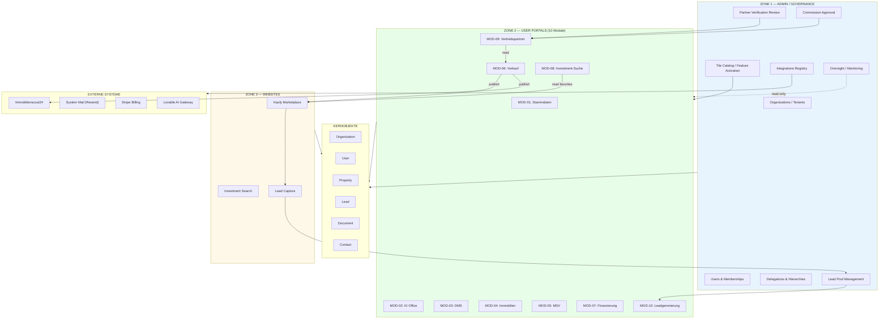
```mermaid
flowchart TB
    subgraph Z1["ZONE 1 — ADMIN / GOVERNANCE"]
        Z1_ORG["Organizations / Tenants"]
        Z1_USR["Users & Memberships"]
        Z1_DEL["Delegations & Hierarchies"]
        Z1_TILE["Tile Catalog / Feature Activation"]
        Z1_INT["Integrations Registry"]
        Z1_OVS["Oversight / Monitoring"]
        Z1_VERIFY["Partner Verification Review"]
        Z1_COMM["Commission Approval"]
        Z1_LEADS["Lead Pool Management"]
    end

    subgraph Z2["ZONE 2 — USER PORTALS (10 Module)"]
        Z2_M1["MOD-01: Stammdaten"]
        Z2_M2["MOD-02: KI Office"]
        Z2_M3["MOD-03: DMS"]
        Z2_M4["MOD-04: Immobilien"]
        Z2_M5["MOD-05: MSV"]
        Z2_M6["MOD-06: Verkauf"]
        Z2_M7["MOD-07: Finanzierung"]
        Z2_M8["MOD-08: Investment-Suche"]
        Z2_M9["MOD-09: Vertriebspartner"]
        Z2_M10["MOD-10: Leadgenerierung"]
    end

    subgraph Z3["ZONE 3 — WEBSITES"]
        Z3_KAUFY["Kaufy Marketplace"]
        Z3_SEARCH["Investment Search"]
        Z3_LC["Lead Capture"]
    end

    subgraph CORE["KERNOBJEKTE"]
        C_ORG["Organization"]
        C_USR["User"]
        C_PROP["Property"]
        C_LEAD["Lead"]
        C_DOC["Document"]
        C_CONTACT["Contact"]
    end

    subgraph EXT["EXTERNE SYSTEME"]
        E_RESEND["System Mail (Resend)"]
        E_SCOUT24["Immobilienscout24"]
        E_STRIPE["Stripe Billing"]
        E_AI["Lovable AI Gateway"]
    end

    Z1 --> CORE
    Z2 --> CORE
    Z3 --> CORE

    Z1_TILE --> Z2
    Z1_INT --> EXT
    Z1_OVS -.->|read-only| Z2
    Z1_VERIFY --> Z2_M9
    Z1_COMM --> Z2_M9
    Z1_LEADS --> Z2_M10

    Z2_M6 -->|publish| Z3_KAUFY
    Z2_M6 -->|publish| E_SCOUT24
    Z2_M8 -->|read favorites| Z3_KAUFY
    Z2_M9 -->|read| Z2_M6

    Z3_LC --> Z1_LEADS
    Z3_KAUFY --> Z3_LC

    style Z1 fill:#E8F4FD
    style Z2 fill:#E8FDE8
    style Z3 fill:#FDF8E8
```

---

## 2) MOD-06 ↔ MOD-09 DATA FLOW

### 2.1 Complete Interaction Flow

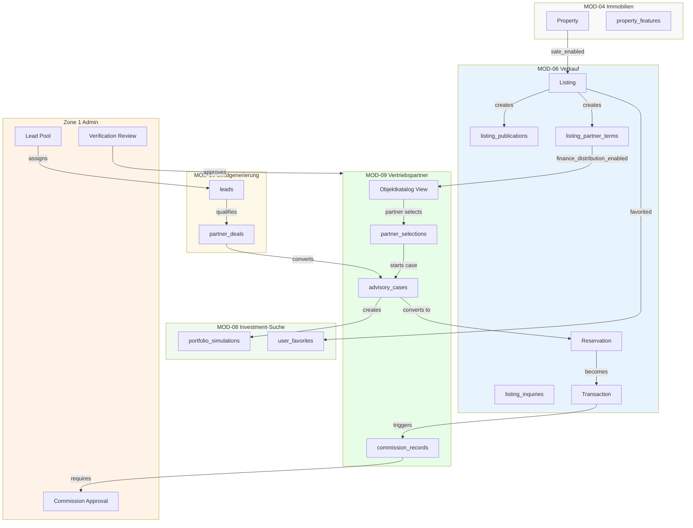
```mermaid
flowchart TD
    subgraph MOD04["MOD-04 Immobilien"]
        P[Property]
        P_FEAT[property_features]
    end

    subgraph MOD06["MOD-06 Verkauf"]
        L[Listing]
        L_PUB[listing_publications]
        L_TERMS[listing_partner_terms]
        L_INQ[listing_inquiries]
        RES[Reservation]
        TX[Transaction]
    end

    subgraph MOD08["MOD-08 Investment-Suche"]
        FAV[user_favorites]
        SIM[portfolio_simulations]
    end

    subgraph MOD09["MOD-09 Vertriebspartner"]
        CAT[Objektkatalog View]
        SEL[partner_selections]
        CASE[advisory_cases]
        COMM[commission_records]
    end

    subgraph MOD10["MOD-10 Leadgenerierung"]
        LEADS[leads]
        DEALS[partner_deals]
    end

    subgraph Z1["Zone 1 Admin"]
        POOL[Lead Pool]
        VERIFY[Verification Review]
        COMM_APPR[Commission Approval]
    end

    P -->|sale_enabled| L
    L -->|creates| L_PUB
    L -->|creates| L_TERMS
    L_TERMS -->|finance_distribution_enabled| CAT
    L -->|favorited| FAV
    
    CAT -->|partner selects| SEL
    SEL -->|starts case| CASE
    CASE -->|creates| SIM
    
    CASE -->|converts to| RES
    RES -->|becomes| TX
    TX -->|triggers| COMM
    
    POOL -->|assigns| LEADS
    LEADS -->|qualifies| DEALS
    DEALS -->|converts| CASE
    
    VERIFY -->|approves| MOD09
    COMM -->|requires| COMM_APPR

    style MOD04 fill:#f9f9f9
    style MOD06 fill:#e8f4fd
    style MOD08 fill:#f0f9f0
    style MOD09 fill:#e8fde8
    style MOD10 fill:#fdf8e8
    style Z1 fill:#fff3e8
```

---

## 3) PUBLISHING CHANNEL FLOWS

### 3.1 Kaufy Publishing Flow

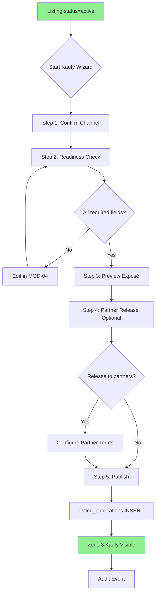
```mermaid
flowchart TD
    A[Listing status=active] --> B{Start Kaufy Wizard}
    B --> C[Step 1: Confirm Channel]
    C --> D[Step 2: Readiness Check]
    D --> E{All required fields?}
    E -->|No| F[Edit in MOD-04]
    F --> D
    E -->|Yes| G[Step 3: Preview Exposé]
    G --> H[Step 4: Partner Release Optional]
    H --> I{Release to partners?}
    I -->|Yes| J[Configure Partner Terms]
    I -->|No| K[Step 5: Publish]
    J --> K
    K --> L[listing_publications INSERT]
    L --> M[Zone 3 Kaufy Visible]
    M --> N[Audit Event]

    style A fill:#90EE90
    style M fill:#90EE90
```

### 3.2 Partner Network Release Flow

```mermaid
flowchart TD
    A[Listing active on Kaufy] --> B{Start Partner Release}
    B --> C[Step 1: Enable Finance Distribution]
    C --> D[Step 2: Set Commission Rate]
    D --> E{Rate 5-15%?}
    E -->|Invalid| D
    E -->|Valid| F[Step 3: PARTNER_RELEASE Consent]
    F --> G{Consent granted?}
    G -->|No| H[Abort]
    G -->|Yes| I[Step 4: SYSTEM_SUCCESS_FEE Consent]
    I --> J{Fee accepted?}
    J -->|No| H
    J -->|Yes| K[Step 5: Generate Agreement PDF]
    K --> L[DMS Document Created]
    L --> M[Step 6: Activate]
    M --> N[listing_partner_terms UPDATE]
    N --> O[listing_publications INSERT]
    O --> P[Visible in MOD-09 Catalog]
    P --> Q[Audit Event]

    style P fill:#90EE90
    style H fill:#FFB6C1
```

### 3.3 Scout24 Publishing Flow

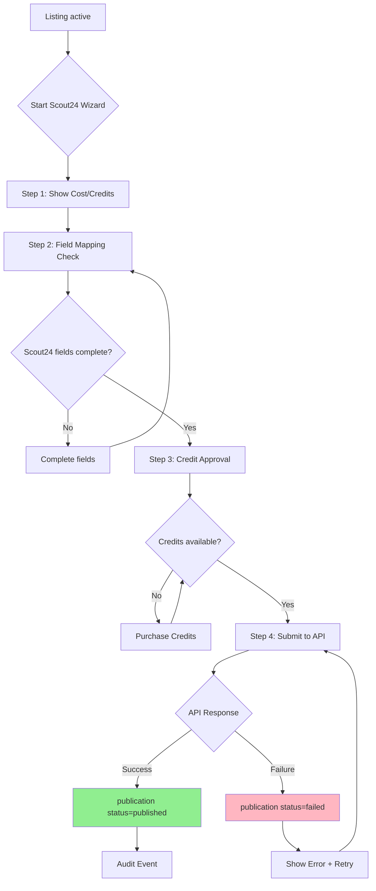
```mermaid
flowchart TD
    A[Listing active] --> B{Start Scout24 Wizard}
    B --> C[Step 1: Show Cost/Credits]
    C --> D[Step 2: Field Mapping Check]
    D --> E{Scout24 fields complete?}
    E -->|No| F[Complete fields]
    F --> D
    E -->|Yes| G[Step 3: Credit Approval]
    G --> H{Credits available?}
    H -->|No| I[Purchase Credits]
    I --> H
    H -->|Yes| J[Step 4: Submit to API]
    J --> K{API Response}
    K -->|Success| L[publication status=published]
    K -->|Failure| M[publication status=failed]
    M --> N[Show Error + Retry]
    N --> J
    L --> O[Audit Event]

    style L fill:#90EE90
    style M fill:#FFB6C1
```

### 3.4 eBay Kleinanzeigen Flow

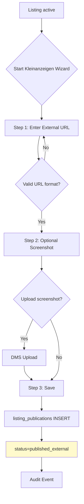
```mermaid
flowchart TD
    A[Listing active] --> B{Start Kleinanzeigen Wizard}
    B --> C[Step 1: Enter External URL]
    C --> D{Valid URL format?}
    D -->|No| C
    D -->|Yes| E[Step 2: Optional Screenshot]
    E --> F{Upload screenshot?}
    F -->|Yes| G[DMS Upload]
    G --> H[Step 3: Save]
    F -->|No| H
    H --> I[listing_publications INSERT]
    I --> J[status=published_external]
    J --> K[Audit Event]

    style J fill:#FFFACD
```

---

## 4) KAUFY FAVORITES SYNC FLOW

### 4.1 Zone 3 → MOD-08 Sync

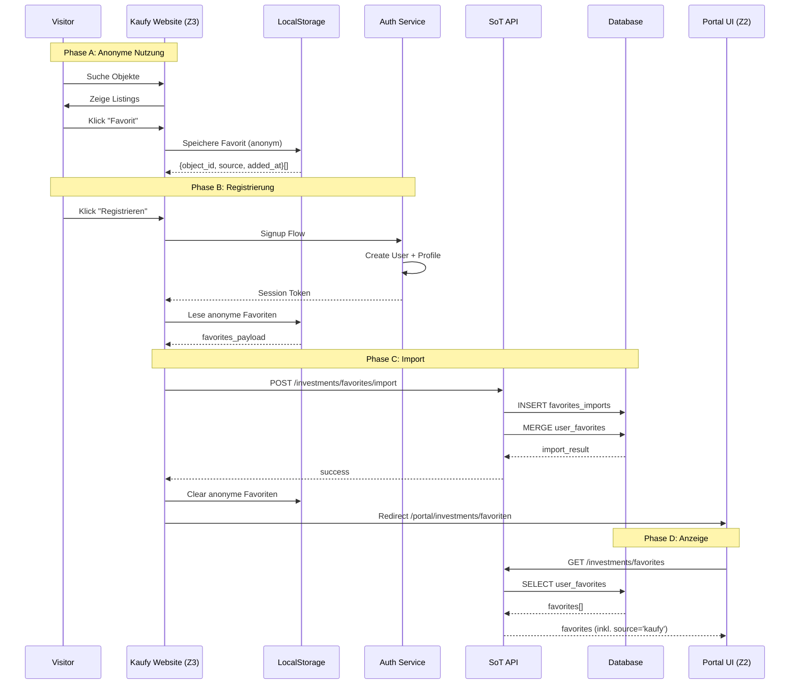
```mermaid
sequenceDiagram
    participant V as Visitor
    participant KW as Kaufy Website (Z3)
    participant LS as LocalStorage
    participant AUTH as Auth Service
    participant API as SoT API
    participant DB as Database
    participant UI as Portal UI (Z2)

    Note over V,KW: Phase A: Anonyme Nutzung
    V->>KW: Suche Objekte
    KW->>V: Zeige Listings
    V->>KW: Klick "Favorit"
    KW->>LS: Speichere Favorit (anonym)
    LS-->>KW: {object_id, source, added_at}[]

    Note over V,AUTH: Phase B: Registrierung
    V->>KW: Klick "Registrieren"
    KW->>AUTH: Signup Flow
    AUTH->>AUTH: Create User + Profile
    AUTH-->>KW: Session Token
    KW->>LS: Lese anonyme Favoriten
    LS-->>KW: favorites_payload

    Note over KW,DB: Phase C: Import
    KW->>API: POST /investments/favorites/import
    API->>DB: INSERT favorites_imports
    API->>DB: MERGE user_favorites
    DB-->>API: import_result
    API-->>KW: success
    KW->>LS: Clear anonyme Favoriten
    KW->>UI: Redirect /portal/investments/favoriten

    Note over UI,DB: Phase D: Anzeige
    UI->>API: GET /investments/favorites
    API->>DB: SELECT user_favorites
    DB-->>API: favorites[]
    API-->>UI: favorites (inkl. source='kaufy')
```

---

## 5) STATE MACHINES

### 5.1 Listing Lifecycle

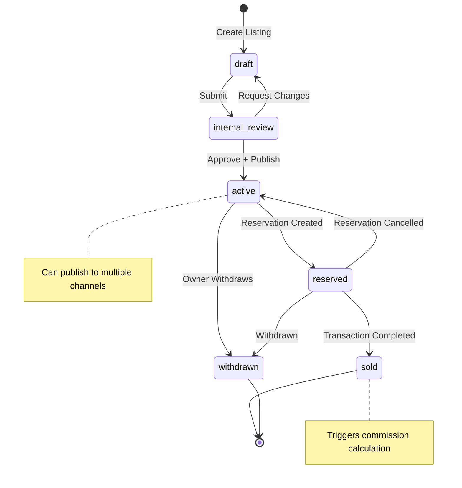
```mermaid
stateDiagram-v2
    [*] --> draft: Create Listing
    draft --> internal_review: Submit
    internal_review --> draft: Request Changes
    internal_review --> active: Approve + Publish
    active --> reserved: Reservation Created
    active --> withdrawn: Owner Withdraws
    reserved --> active: Reservation Cancelled
    reserved --> sold: Transaction Completed
    reserved --> withdrawn: Withdrawn
    sold --> [*]
    withdrawn --> [*]
    
    note right of active: Can publish to multiple channels
    note right of sold: Triggers commission calculation
```

### 5.2 Publication Status (per Channel)

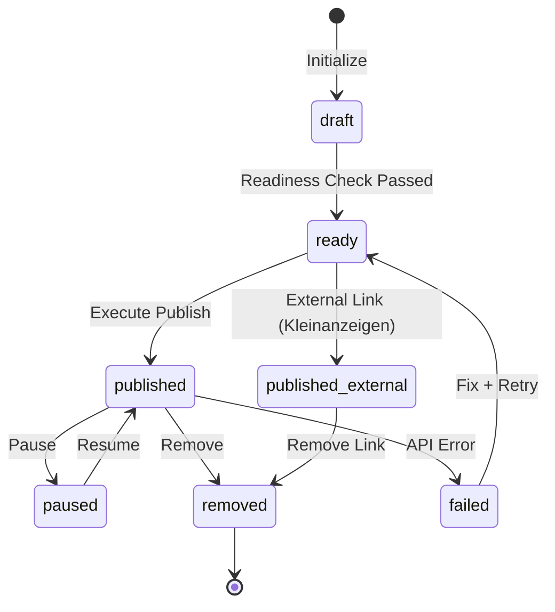
```mermaid
stateDiagram-v2
    [*] --> draft: Initialize
    draft --> ready: Readiness Check Passed
    ready --> published: Execute Publish
    ready --> published_external: External Link (Kleinanzeigen)
    published --> paused: Pause
    published --> removed: Remove
    paused --> published: Resume
    published --> failed: API Error
    failed --> ready: Fix + Retry
    removed --> [*]
    published_external --> removed: Remove Link
```

### 5.3 Partner Verification Status

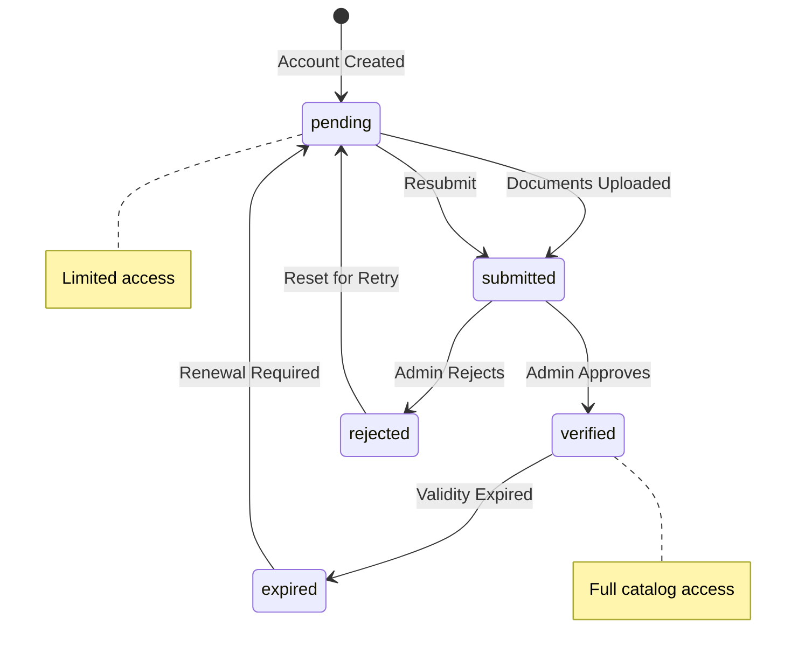
```mermaid
stateDiagram-v2
    [*] --> pending: Account Created
    pending --> submitted: Documents Uploaded
    submitted --> verified: Admin Approves
    submitted --> rejected: Admin Rejects
    rejected --> pending: Reset for Retry
    pending --> submitted: Resubmit
    verified --> expired: Validity Expired
    expired --> pending: Renewal Required
    
    note right of verified: Full catalog access
    note right of pending: Limited access
```

### 5.4 Advisory Case Status

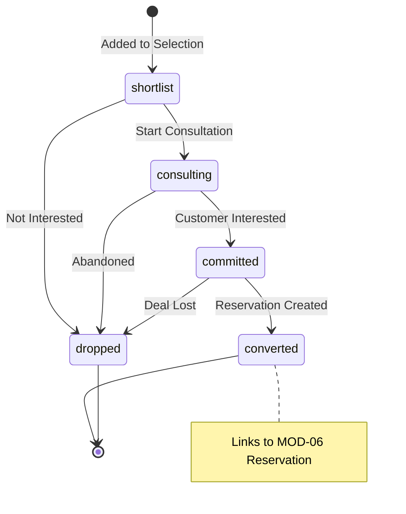
```mermaid
stateDiagram-v2
    [*] --> shortlist: Added to Selection
    shortlist --> consulting: Start Consultation
    shortlist --> dropped: Not Interested
    consulting --> committed: Customer Interested
    consulting --> dropped: Abandoned
    committed --> converted: Reservation Created
    committed --> dropped: Deal Lost
    converted --> [*]
    dropped --> [*]
    
    note right of converted: Links to MOD-06 Reservation
```

### 5.5 Commission Status

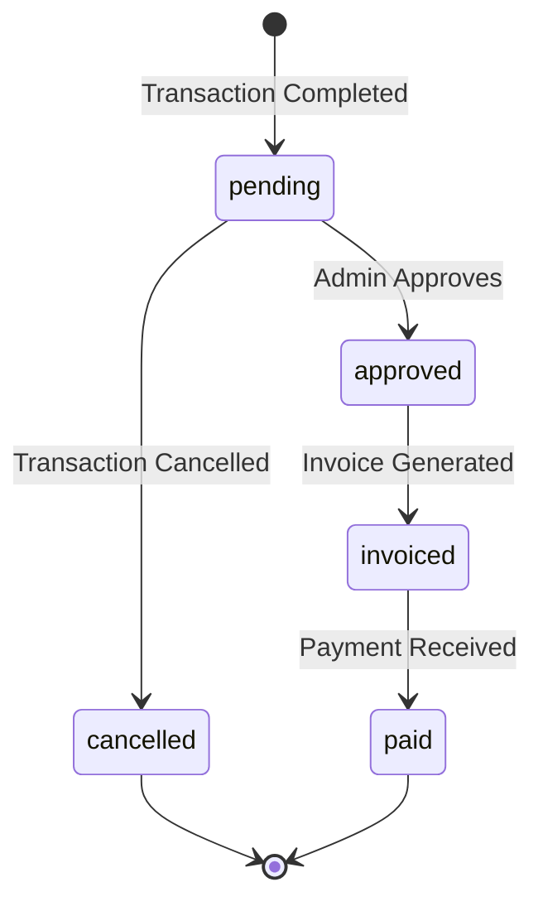
```mermaid
stateDiagram-v2
    [*] --> pending: Transaction Completed
    pending --> approved: Admin Approves
    pending --> cancelled: Transaction Cancelled
    approved --> invoiced: Invoice Generated
    invoiced --> paid: Payment Received
    cancelled --> [*]
    paid --> [*]
```

### 5.6 Lead Status (MOD-10)

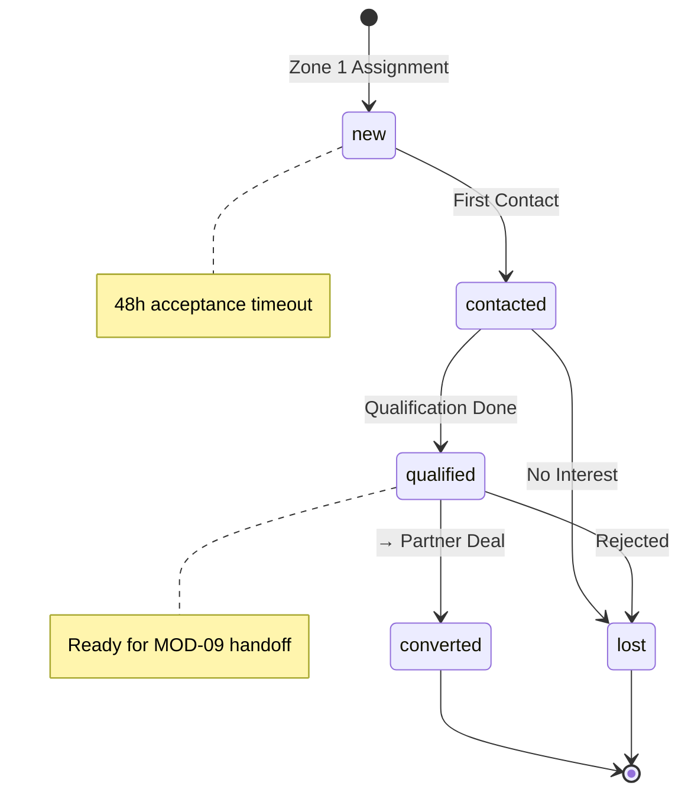
```mermaid
stateDiagram-v2
    [*] --> new: Zone 1 Assignment
    new --> contacted: First Contact
    contacted --> qualified: Qualification Done
    contacted --> lost: No Interest
    qualified --> converted: → Partner Deal
    qualified --> lost: Rejected
    converted --> [*]
    lost --> [*]
    
    note right of new: 48h acceptance timeout
    note right of qualified: Ready for MOD-09 handoff
```

---

## 6) CROSS-MODULE FLOWS

### 6.1 Complete Sales Journey (10-Modul)

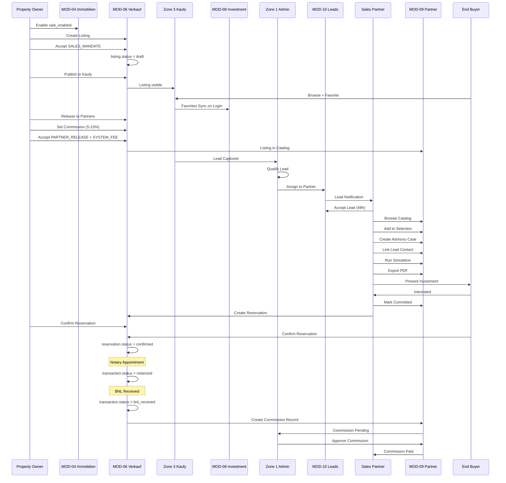
```mermaid
sequenceDiagram
    participant Owner as Property Owner
    participant MOD04 as MOD-04 Immobilien
    participant MOD06 as MOD-06 Verkauf
    participant Z3 as Zone 3 Kaufy
    participant MOD08 as MOD-08 Investment
    participant Z1 as Zone 1 Admin
    participant MOD10 as MOD-10 Leads
    participant Partner as Sales Partner
    participant MOD09 as MOD-09 Partner
    participant Buyer as End Buyer

    Owner->>MOD04: Enable sale_enabled
    Owner->>MOD06: Create Listing
    Owner->>MOD06: Accept SALES_MANDATE
    MOD06->>MOD06: listing.status = draft
    Owner->>MOD06: Publish to Kaufy
    MOD06->>Z3: Listing visible
    
    Buyer->>Z3: Browse + Favorite
    Z3->>MOD08: Favorites Sync on Login
    
    Owner->>MOD06: Release to Partners
    Owner->>MOD06: Set Commission (5-15%)
    Owner->>MOD06: Accept PARTNER_RELEASE + SYSTEM_FEE
    MOD06->>MOD09: Listing in Catalog
    
    Z3->>Z1: Lead Captured
    Z1->>Z1: Qualify Lead
    Z1->>MOD10: Assign to Partner
    MOD10->>Partner: Lead Notification
    Partner->>MOD10: Accept Lead (48h)
    
    Partner->>MOD09: Browse Catalog
    Partner->>MOD09: Add to Selection
    Partner->>MOD09: Create Advisory Case
    Partner->>MOD09: Link Lead Contact
    Partner->>MOD09: Run Simulation
    Partner->>MOD09: Export PDF
    Partner->>Buyer: Present Investment
    Buyer->>Partner: Interested
    Partner->>MOD09: Mark Committed
    Partner->>MOD06: Create Reservation
    
    Owner->>MOD06: Confirm Reservation
    Buyer->>MOD06: Confirm Reservation
    MOD06->>MOD06: reservation.status = confirmed
    
    Note over MOD06: Notary Appointment
    MOD06->>MOD06: transaction.status = notarized
    
    Note over MOD06: BNL Received
    MOD06->>MOD06: transaction.status = bnl_received
    MOD06->>MOD09: Create Commission Record
    MOD09->>Z1: Commission Pending
    Z1->>MOD09: Approve Commission
    MOD09->>Partner: Commission Paid
```

### 6.2 Lead Flow (Zone 3 → Zone 1 → MOD-10 → MOD-09)

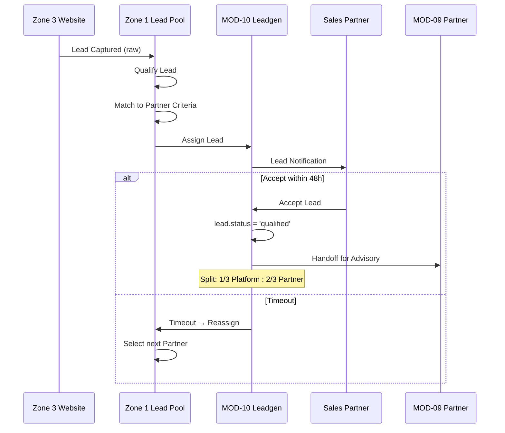
```mermaid
sequenceDiagram
    participant Z3 as Zone 3 Website
    participant Z1 as Zone 1 Lead Pool
    participant MOD10 as MOD-10 Leadgen
    participant Partner as Sales Partner
    participant MOD09 as MOD-09 Partner

    Z3->>Z1: Lead Captured (raw)
    Z1->>Z1: Qualify Lead
    Z1->>Z1: Match to Partner Criteria
    Z1->>MOD10: Assign Lead
    MOD10->>Partner: Lead Notification
    
    alt Accept within 48h
        Partner->>MOD10: Accept Lead
        MOD10->>MOD10: lead.status = 'qualified'
        MOD10->>MOD09: Handoff for Advisory
        Note over MOD10: Split: 1/3 Platform : 2/3 Partner
    else Timeout
        MOD10->>Z1: Timeout → Reassign
        Z1->>Z1: Select next Partner
    end
```

---

## 7) AGREEMENT & CONSENT FLOW

### 7.1 Publishing Consent Chain

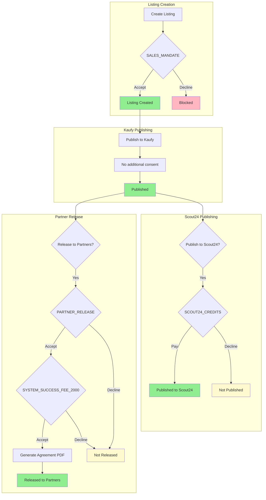
```mermaid
flowchart TD
    subgraph "Listing Creation"
        A[Create Listing] --> B{SALES_MANDATE}
        B -->|Accept| C[Listing Created]
        B -->|Decline| D[Blocked]
    end

    subgraph "Kaufy Publishing"
        C --> E[Publish to Kaufy]
        E --> F[No additional consent]
        F --> G[Published]
    end

    subgraph "Partner Release"
        G --> H{Release to Partners?}
        H -->|Yes| I{PARTNER_RELEASE}
        I -->|Accept| J{SYSTEM_SUCCESS_FEE_2000}
        J -->|Accept| K[Generate Agreement PDF]
        K --> L[Released to Partners]
        I -->|Decline| M[Not Released]
        J -->|Decline| M
    end

    subgraph "Scout24 Publishing"
        G --> N{Publish to Scout24?}
        N -->|Yes| O{SCOUT24_CREDITS}
        O -->|Pay| P[Published to Scout24]
        O -->|Decline| Q[Not Published]
    end

    style C fill:#90EE90
    style G fill:#90EE90
    style L fill:#90EE90
    style P fill:#90EE90
    style D fill:#FFB6C1
    style M fill:#FFFACD
    style Q fill:#FFFACD
```

---

## 8) PROVISIONS-MODELL DIAGRAMM

### 8.1 Commission Calculation Flow

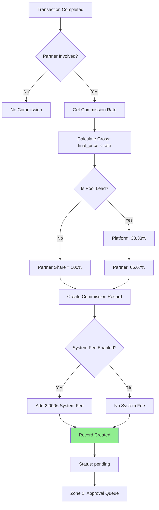
```mermaid
flowchart TD
    A[Transaction Completed] --> B{Partner Involved?}
    B -->|No| C[No Commission]
    B -->|Yes| D[Get Commission Rate]
    D --> E[Calculate Gross: final_price × rate]
    E --> F{Is Pool Lead?}
    F -->|No| G[Partner Share = 100%]
    F -->|Yes| H[Platform: 33.33%]
    H --> I[Partner: 66.67%]
    G --> J[Create Commission Record]
    I --> J
    J --> K{System Fee Enabled?}
    K -->|Yes| L[Add 2.000€ System Fee]
    K -->|No| M[No System Fee]
    L --> N[Record Created]
    M --> N
    N --> O[Status: pending]
    O --> P[Zone 1: Approval Queue]

    style N fill:#90EE90
```

---

## 9) ZONE 2 MODULE GRID (10 Module)

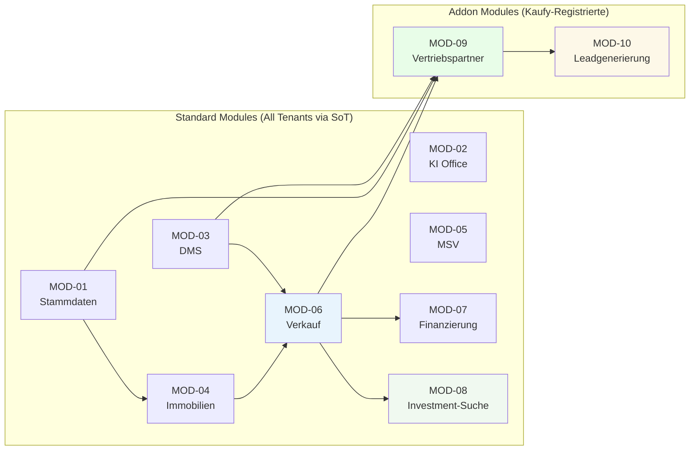
```mermaid
flowchart LR
    subgraph "Standard Modules (All Tenants via SoT)"
        M1[MOD-01<br/>Stammdaten]
        M2[MOD-02<br/>KI Office]
        M3[MOD-03<br/>DMS]
        M4[MOD-04<br/>Immobilien]
        M5[MOD-05<br/>MSV]
        M6[MOD-06<br/>Verkauf]
        M7[MOD-07<br/>Finanzierung]
        M8[MOD-08<br/>Investment-Suche]
    end
    
    subgraph "Addon Modules (Kaufy-Registrierte)"
        M9[MOD-09<br/>Vertriebspartner]
        M10[MOD-10<br/>Leadgenerierung]
    end

    M4 --> M6
    M6 --> M9
    M6 --> M8
    M9 --> M10
    M6 --> M7
    M1 --> M4
    M1 --> M9
    M3 --> M6
    M3 --> M9

    style M6 fill:#e8f4fd
    style M8 fill:#f0f9f0
    style M9 fill:#e8fde8
    style M10 fill:#fdf8e8
```

---

## 10) INVESTMENT ENGINE INTEGRATION

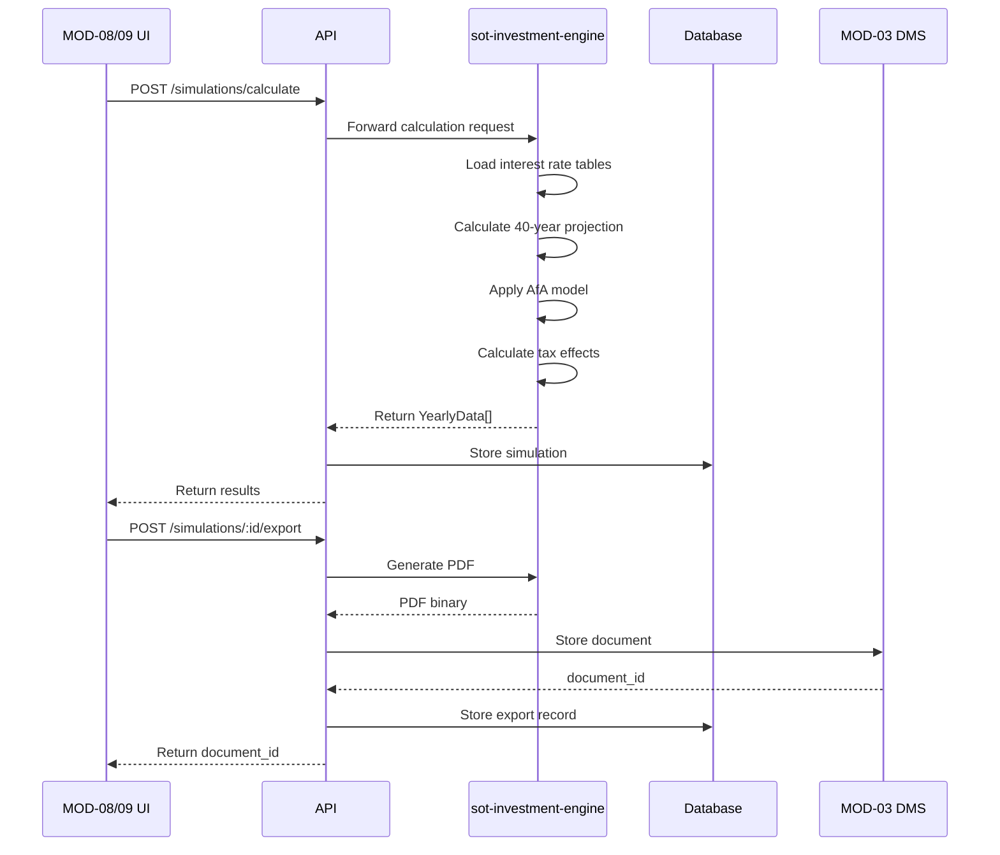
```mermaid
sequenceDiagram
    participant UI as MOD-08/09 UI
    participant API as API
    participant EF as sot-investment-engine
    participant DB as Database
    participant DMS as MOD-03 DMS

    UI->>API: POST /simulations/calculate
    API->>EF: Forward calculation request
    EF->>EF: Load interest rate tables
    EF->>EF: Calculate 40-year projection
    EF->>EF: Apply AfA model
    EF->>EF: Calculate tax effects
    EF-->>API: Return YearlyData[]
    API->>DB: Store simulation
    API-->>UI: Return results

    UI->>API: POST /simulations/:id/export
    API->>EF: Generate PDF
    EF-->>API: PDF binary
    API->>DMS: Store document
    DMS-->>API: document_id
    API->>DB: Store export record
    API-->>UI: Return document_id
```

---

## 11) MARKEN & SICHTBARKEIT (FROZEN)

### 11.1 Sichtbarkeitsmatrix

| Registrierung | Sichtbare Module | Zielgruppe |
|---------------|------------------|------------|
| **SoT** | MOD-01 bis MOD-08 | Vermieter, Portfoliohalter |
| **Kaufy** | MOD-01 bis MOD-10 | Berater, Vertriebe, Aufteiler |

### 11.2 Marken-Regel

| Marke | Erlaubte Verwendung |
|-------|---------------------|
| **Kaufy** (mit y) | Source/Channel-Name, Tab-Label, Website-Marke |
| **Kaufy** | ❌ NICHT als Modulname erlaubt |

---

*Version 3.0.0 — Vollständige Diagramm-Sammlung für 10-Modul-Architektur*
