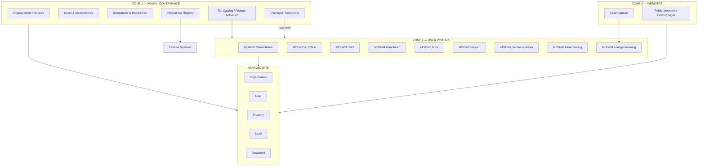
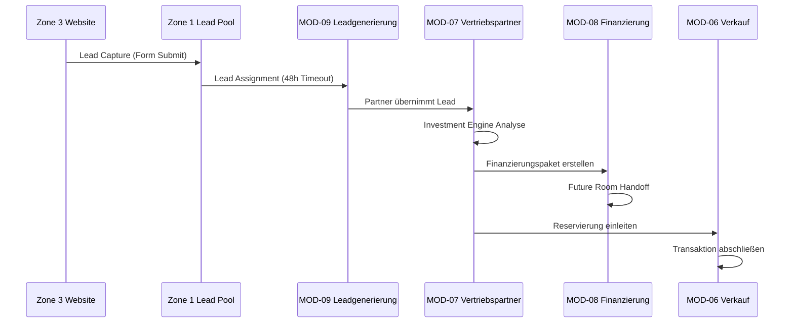
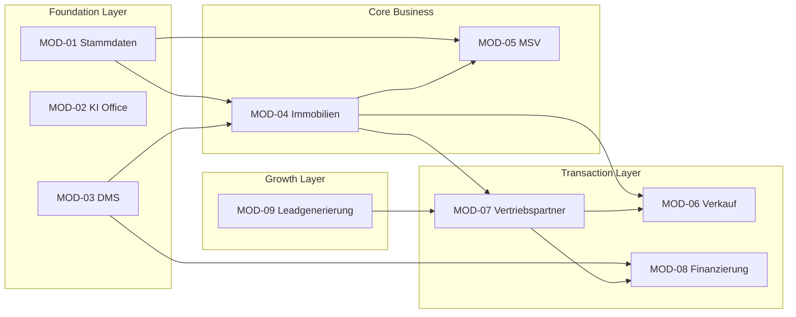
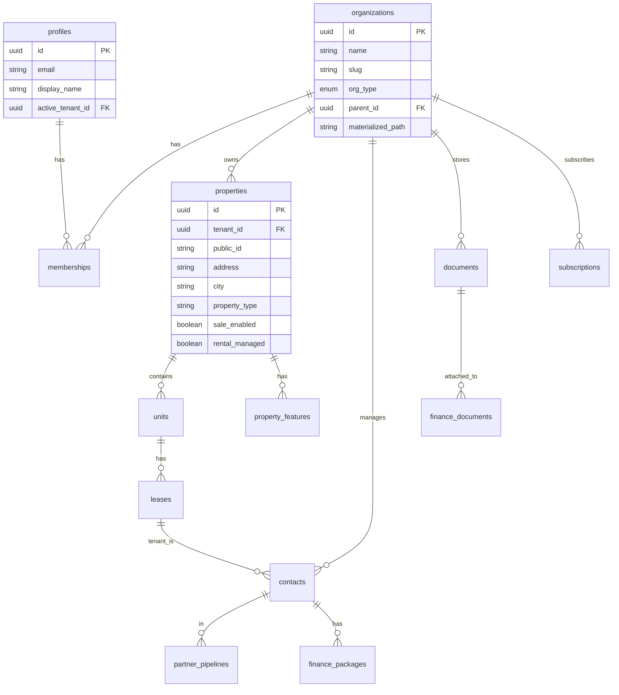
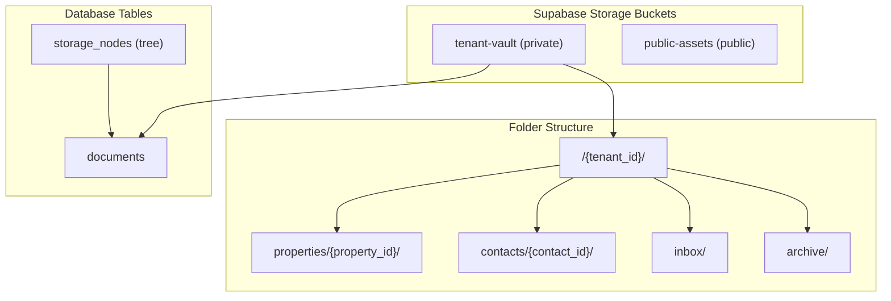

# ChatGPT PROMPT-PAKET — System of a Town
**Version:** 1.0.0  
**Datum:** 2026-01-25  
**Zweck:** Prompts für Präsentation, UI-Mockups und Diagramme

---

## PROMPT A: PRÄSENTATIONS-SLIDES (15-20 Folien)

### Kontext für ChatGPT

```
Du bist ein erfahrener Präsentationsdesigner für Enterprise SaaS-Produkte. 
Erstelle eine professionelle Slide-Deck-Struktur für "System of a Town" — 
eine Multi-Tenant Real Estate Management Plattform.

DESIGN-VORGABEN:
- Dark Theme (Hintergrund: #0a0f1a, Cards: #141c2e)
- Akzentfarbe: #3b82f6 (Primary Blue)
- Typografie: Sans-serif, clean, Enterprise-Stil
- Keine überladenen Slides — max. 3-4 Punkte pro Folie
- Mermaid-Diagramme wo sinnvoll

ZIELGRUPPE:
- Investoren und technische Stakeholder
- Produktmanager und Architekten
- Demo-Präsentation für Pilotkunden
```

### Slide-Struktur

```
SLIDE 1: Title
"System of a Town"
Subtitle: Die modulare Plattform für Immobilien-Ökosysteme
Visual: Logo + 3-Zonen-Symbolik

SLIDE 2: Vision Statement
"Ein System — Alle Akteure"
• Eigentümer, Berater, Mieter, Partner in einer Plattform
• Multi-Tenant, Multi-Entity, Consent-basiert
• AI-first mit Armstrong Chatbot

SLIDE 3: Das Problem
• Fragmentierte Tools (Excel, Papier, Legacy-Software)
• Keine durchgängige Lead-zu-Transaktion-Kette
• Compliance-Risiken durch fehlende Audit-Trails

SLIDE 4: Die Lösung — 3-Zonen-Architektur
[Mermaid Diagram: Zone 1/2/3]
• Zone 1: Admin/Governance (God Mode)
• Zone 2: User Portals (9 Module)
• Zone 3: Websites (Lead Capture)

SLIDE 5: Zone 1 — Admin Portal
• Organizations & Tenants
• User Management & Delegations
• Tile Catalog & Feature Activation
• Integration Registry
• Billing & Subscriptions

SLIDE 6: Zone 2 — Die 9 Module
[Grid Visual: 3x3 Module-Kacheln]
MOD-01 Stammdaten | MOD-02 KI Office | MOD-03 DMS
MOD-04 Immobilien | MOD-05 MSV | MOD-06 Verkauf
MOD-07 Partner | MOD-08 Finanzierung | MOD-09 Leads

SLIDE 7: MOD-01 bis MOD-03 (Foundation)
• Stammdaten: Profil, Firma, Billing, Security
• KI Office: Email, Brief, Kontakte, Kalender + Armstrong
• DMS: Posteingang, Zuordnung, Archiv, Storage Tree

SLIDE 8: MOD-04 Immobilien (Source of Truth)
• Portfolio-Übersicht mit 13-Spalten-Liste
• Exposé-Hub als Datenraum
• Flags: sale_enabled, rental_managed
• Sanierung mit Tender-ID-Workflow

SLIDE 9: MOD-05 bis MOD-06 (Operations)
• MSV: Mieterliste, Mieteingang, Vermietung
• Verkauf: Objekte, Aktivitäten, Reservierung

SLIDE 10: MOD-07 bis MOD-09 (Business)
• Vertriebspartner: Pipeline, Investment Engine, Provisionen
• Finanzierung: Selbstauskunft, Pakete, Future Room Handoff
• Leadgenerierung: Managed Meta Ads, Lead-Pool, Zuweisung

SLIDE 11: Cross-Module Datenflüsse
[Mermaid Diagram: Lead Flow]
Zone 3 → Lead Capture → Zone 1 Pool → MOD-09 → MOD-07 → MOD-08 → MOD-06

SLIDE 12: Technologie-Stack
• Frontend: React + Vite + TypeScript + Tailwind
• Backend: Supabase (Postgres + Auth + Storage + Edge Functions)
• AI: Lovable AI Gateway (Gemini/GPT-5)
• Integrations: Resend, Stripe, Caya, Meta Ads

SLIDE 13: Datenmodell — Core Entities
[Entity Relationship Diagram]
• organizations (Multi-Tenant Root)
• profiles / memberships (User Context)
• properties / units (Immobilien)
• contacts / leads (Personen)
• documents (DMS)

SLIDE 14: Sicherheit & Compliance
• Row Level Security (RLS) auf allen Tabellen
• Consent-basierte Datenfreigabe
• Audit Events für alle kritischen Aktionen
• GDPR-konforme Mieter-Organisation

SLIDE 15: Module Readiness Matrix
[Table: 9 Module × 4 Dimensionen]
| Modul | DB | UI | Logic | Status |
|-------|----|----|-------|--------|
| MOD-01 | ✅ | 🔶 | ⬜ | Spec Ready |
...

SLIDE 16: Roadmap — Phase 1
Q1 2026:
• Zone 1 Admin Portal (Complete)
• Zone 2 Shell + MOD-01 bis MOD-04
• Armstrong Chatbot MVP
• Caya Integration

SLIDE 17: Roadmap — Phase 2
Q2-Q3 2026:
• MOD-05 bis MOD-09 (Full Implementation)
• Zone 3 Lead-Websites
• Meta Ads Integration
• Future Room Handoff

SLIDE 18: Business Model
• SaaS Subscription (Plans: Starter, Pro, Enterprise)
• Transaction Fees (1/3 Platform Commission on Partner Deals)
• Marketplace Credits (Valuations, Lead Purchases)

SLIDE 19: Team & Kontakt
[Team Fotos / Logos]
• Founder / Product
• Tech Lead
• Kontakt: hello@kaufy.io

SLIDE 20: Call to Action
"Bereit für das System der Zukunft?"
• Demo anfragen
• Pilot-Partner werden
• Investoren-Deck anfordern
```

---

## PROMPT B: DESIGN-MOCKUP-PROMPTS (für dein CI-Template)

### B1: Zone 1 Admin Dashboard

```
Erstelle ein hochauflösendes UI-Mockup für das Zone 1 Admin Dashboard.

LAYOUT (Desktop 1440px):
- Left Sidebar: 260px, dunkel (#0a0c12), Logo oben, 12 Menüpunkte
- Main Content: fluid
- Kein Chat Panel (Zone 1 hat keinen Armstrong)

HEADER:
- Title: "Admin Dashboard"
- Search: Globale Suche rechts
- User Avatar + Notification Bell

KPI-ROW (4 Kacheln):
1. "Mandanten" | 247 | +12 this month
2. "Aktive Nutzer" | 1,892 | +156 this week
3. "API-Aufrufe" | 2.4M | 99.8% uptime
4. "Support-Tickets" | 23 | 4 critical

CONTENT CARDS (2 Spalten):
- System Health (Donut Chart: Services Status)
- Recent Activity (Timeline mit Events)
- Revenue Overview (Bar Chart: Monthly ARR)
- Active Alerts (Table: 5 Rows)

COLORS:
- Background: hsl(222 47% 6%) = #0a0f1a
- Card: hsl(222 30% 10%) = #141c2e
- Border: hsl(222 20% 18%) = #252e42
- Primary: hsl(217 91% 60%) = #3b82f6
- Text Primary: hsl(210 40% 98%) = #f8fafc
- Text Secondary: hsl(215 20% 65%) = #94a3b8

TYPOGRAPHY:
- Page Title: 24px Semibold
- Card Title: 14px Semibold
- KPI Value: 32px Bold (tabular-nums)
- Body: 14px Regular

STYLE:
- Radius: 12px
- Shadows: Subtle (0 2px 8px rgba(0,0,0,0.3))
- Keine Gradients — flache Flächen
```

### B2: Zone 2 Portal Dashboard (9 Tiles)

```
Erstelle ein hochauflösendes UI-Mockup für das Zone 2 Portal Dashboard.

LAYOUT (Desktop 1440px):
- Left Sidebar: 260px, Logo + 9 Module-Menüpunkte
- Main Content: fluid, max-width 1200px centered
- Right Panel: 380px AI Assistant "Armstrong"

HEADER:
- Title: "Willkommen zurück, [Name]"
- Breadcrumb: Portal > Dashboard
- Search + Notifications + Avatar

KPI-ROW (4 Kacheln):
1. "Portfolio-Wert" | €4.2M | +8.3% YoY
2. "Aktive Objekte" | 12 | 3 im Verkauf
3. "Monatl. Cashflow" | €18,450 | +€1,200
4. "Offene Tasks" | 7 | 2 überfällig

MODULE GRID (3x3):
Zeige 9 Kacheln als Cards mit Icon, Titel und Kurzbeschreibung:
1. Stammdaten (User Icon) — "Profil & Abrechnung"
2. KI Office (Mail Icon) — "Email, Brief, Kontakte"
3. DMS (Folder Icon) — "Dokumente & Posteingang"
4. Immobilien (Building Icon) — "Portfolio & Exposés"
5. MSV (Key Icon) — "Miet-Sonderverwaltung"
6. Verkauf (Tag Icon) — "Objekte verkaufen"
7. Vertriebspartner (Users Icon) — "Pipeline & Beratung"
8. Finanzierung (Wallet Icon) — "Finanzpakete"
9. Leadgenerierung (Target Icon) — "Kampagnen & Leads"

ARMSTRONG PANEL (rechts):
- Header: "Armstrong" + Context Badge "Dashboard"
- Quick Actions: 3 Buttons (Neues Objekt, Aufgabe erstellen, Hilfe)
- Chat Area: Leerer Chatverlauf mit Placeholder
- Input: "Wie kann ich helfen?" + Mic Icon + Send

COLORS: [Wie B1]
```

### B3: MOD-04 Immobilien-Liste (13 Spalten)

```
Erstelle ein hochauflösendes UI-Mockup für die Immobilien-Listenansicht.

LAYOUT:
- Sidebar + Main Content + Armstrong Panel

HEADER:
- Title: "Immobilien"
- Tabs: Portfolio | Verwaltung | Verkauf | Sanierung
- Actions: "+ Neues Objekt" Button

FILTER BAR:
- Search Input
- Dropdown: Status (Alle, Aktiv, Im Verkauf, Archiviert)
- Dropdown: Stadt
- Dropdown: Objektart
- Toggle: "Nur Verkauf" | "Nur Vermietung"

TABLE (13 Spalten):
| Bild | Code | Adresse | PLZ | Stadt | Objektart | Nutzung | Fläche m² | Einheiten | Kaufpreis | Marktwert | Status | Aktionen |

BEISPIEL-DATEN (5 Rows):
1. [Thumb] | OBJ-001 | Musterstr. 1 | 10115 | Berlin | MFH | Wohnen | 450 | 6 | €850.000 | €920.000 | 🟢 Aktiv | ... |
2. [Thumb] | OBJ-002 | Hauptstr. 22 | 80331 | München | ETW | Wohnen | 85 | 1 | €320.000 | €350.000 | 🟡 Im Verkauf | ... |
3. [Thumb] | OBJ-003 | Bahnhofstr. 5 | 20095 | Hamburg | Gewerbe | Büro | 1200 | 4 | €2.1M | €2.3M | 🟢 Aktiv | ... |
4. [Thumb] | OBJ-004 | Ringstr. 18 | 50667 | Köln | MFH | Gemischt | 680 | 8 | €1.2M | €1.4M | ⚪ Entwurf | ... |
5. [Thumb] | OBJ-005 | Schlossallee 1 | 60311 | Frankfurt | Villa | Wohnen | 320 | 1 | €1.8M | €2.0M | 🔵 Reserviert | ... |

PAGINATION:
- "1-5 von 12 Objekten" | Prev | 1 | 2 | 3 | Next

STYLE:
- Sticky Header
- Hover Row Highlight
- Sortable Columns (Indicator)
- Row Actions: View, Edit, Archive (Dropdown)
```

### B4: MOD-03 DMS Storage (3-Panel Layout)

```
Erstelle ein hochauflösendes UI-Mockup für das DMS-Archiv.

LAYOUT (3-Panel):
- Left: Folder Tree (260px)
- Center: File List (fluid)
- Right: Preview/Details (380px) ODER Armstrong

HEADER:
- Title: "Dokumentenarchiv"
- Tabs: Eingang | Zuordnung | Archiv | Einstellungen
- Actions: "+ Hochladen" | "Neuer Ordner"

LEFT PANEL (Folder Tree):
```
📁 Meine Dokumente
  📁 Objekte
    📁 OBJ-001 Musterstr. 1
      📁 Kaufvertrag
      📁 Grundbuch
      📁 Fotos
    📁 OBJ-002 Hauptstr. 22
  📁 Kontakte
  📁 Verträge
  📁 Rechnungen
📁 Posteingang (12 neu)
📁 Unzugeordnet (3)
```

CENTER PANEL (File List):
| Icon | Name | Datum | Größe | Status |
| 📄 | Kaufvertrag_OBJ-001.pdf | 15.01.2026 | 2.4 MB | ✅ Verifiziert |
| 🖼️ | Foto_Fassade.jpg | 14.01.2026 | 1.8 MB | ⬜ Nicht klassifiziert |
| 📄 | Grundbuchauszug.pdf | 12.01.2026 | 890 KB | 🔄 Wird extrahiert |
| 📄 | Nebenkostenabrechnung.pdf | 10.01.2026 | 1.2 MB | ⚠️ Prüfung erforderlich |

RIGHT PANEL (Document Preview):
- Thumbnail/PDF Preview
- Metadata: Name, Typ, Hochgeladen von, Datum
- Tags: Objektbezug, Kategorie
- AI Extraction: "Extrahierte Daten anzeigen"
- Actions: Download, Teilen, Löschen, Verschieben

DRAG & DROP ZONE:
- Am unteren Rand: "Dateien hier ablegen oder klicken zum Hochladen"
```

### B5: MOD-02 KI Office mit Armstrong

```
Erstelle ein hochauflösendes UI-Mockup für das KI Office Email-Interface.

LAYOUT:
- Sidebar (260px): Module-Menü, aktiv: KI Office
- Main Content: Email-Client-Layout
- Right: Armstrong Panel (380px)

HEADER:
- Title: "KI Office"
- Tabs: Email | Brief | Kontakte | Kalender
- Actions: "+ Neue Email"

EMAIL LAYOUT (Classic 2-Panel):
LEFT (Email List, 350px):
| Sender | Subject | Date |
| Max Müller | RE: Besichtigung Musterstr. 1 | Heute, 14:32 |
| Bank XYZ | Finanzierungsangebot | Gestern |
| Caya System | 3 neue Dokumente eingegangen | 23.01. |
| Dr. Schmidt | Kaufvertragsentwurf | 22.01. |
| Newsletter | Marktupdate Januar 2026 | 20.01. |

RIGHT (Email Detail):
- From: Max Müller <max@example.com>
- To: Me
- Subject: RE: Besichtigung Musterstr. 1
- Date: 25.01.2026 14:32
- Body: [Email Content]
- Attachments: 2 Files
- Actions: Reply, Forward, Archive, Delete

ARMSTRONG PANEL:
- Context: "Email > Max Müller"
- Suggested Actions:
  - "📅 Termin für Besichtigung erstellen"
  - "📝 Antwort mit Verfügbarkeit generieren"
  - "📁 Email zu OBJ-001 zuordnen"
- Chat: "Wie möchtest du auf diese Email antworten?"

INTEGRATION HINT:
- Badge: "IMAP verbunden" (grün) oder "Verbindung einrichten" (gelb)
```

---

## PROMPT C: MERMAID-DIAGRAMME (Copy-Paste Ready)

### C1: System Overview (A1 - FROZEN)



### C2: Lead Flow (Zone 3 → Zone 2)



### C3: Module Dependencies



### C4: Entity Relationship (Core)



### C5: Storage Architecture



---

## VERWENDUNGSHINWEISE

### Für Präsentations-Slides:
1. Kopiere PROMPT A in ChatGPT
2. Fordere "Erstelle Slide [X]" einzeln an
3. Für visuelle Slides: Nutze DALL-E oder Midjourney mit dem Mockup-Prompt

### Für Design-Mockups:
1. Kopiere den relevanten B-Prompt in ChatGPT oder ein Design-AI-Tool
2. Passe die Daten an deine Demo-Inhalte an
3. Für Figma-Export: Nutze "html.to.design" Plugin

### Für Mermaid-Diagramme:
1. Kopiere den Code in https://mermaid.live/
2. Exportiere als PNG/SVG
3. Oder nutze die Live-Präsentationsseite unter `/presentation-sot-k7m3x9p2`

---

**Erstellt:** 2026-01-25  
**Für:** System of a Town / KAUFY / Acquiary / FutureRoom
