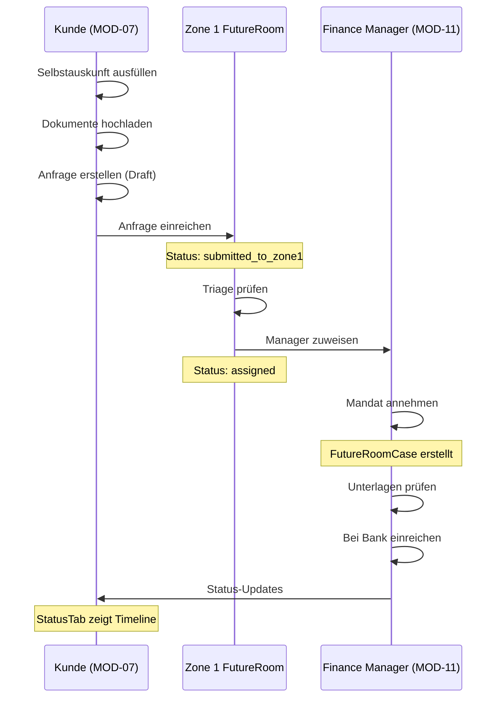
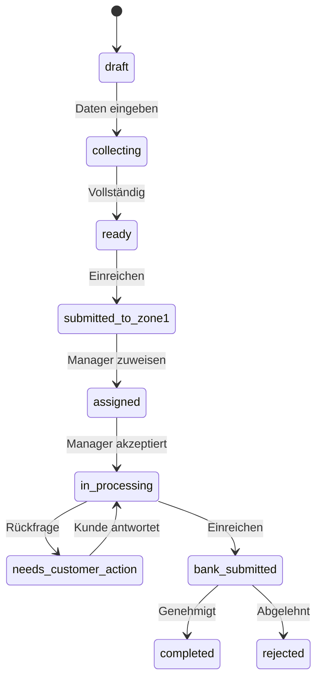

# FINANCE BUNDLE AUDIT REPORT (MOD-07 + MOD-11 + ZONE 1 FUTUREROOM)

**Datum:** 2026-02-07  
**Version:** v4.1 (17-Phasen Finance-Audit)  
**Bundle:** MOD-07 Finanzierung + MOD-11 Finanzierungsmanager + Zone 1 FutureRoom  
**Auditor:** Lovable AI  

---

## EXECUTIVE SUMMARY

| Metrik | Wert |
|--------|------|
| **Gesamtfertigstellungsgrad** | ~93% |
| **Golden Path GP-F1 Status** | ✅ Funktional |
| **P0 Findings** | 0 (korrigiert) |
| **P1 Findings** | 3 |
| **P2 Findings** | 4 |
| **Korrigierte Issues** | 2 |

---

## PHASE 01 — Bundle-Steckbrief & Scope-Verifikation

### MOD-07 Finanzierung (Kundenportal)
| Attribut | Wert |
|----------|------|
| Route-Prefix | `/portal/finanzierung` |
| Tiles | 4 (Selbstauskunft, Dokumente, Anfrage, Status) |
| Dynamic Routes | 1 (`/anfrage/:requestId`) |
| Org-Types | `client` |
| Requires Activation | Nein (default: true) |
| API-Range | API-600..631 |

### MOD-11 Finanzierungsmanager (Partner-Workbench)
| Attribut | Wert |
|----------|------|
| Route-Prefix | `/portal/finanzierungsmanager` |
| Tiles | 4 (Dashboard, Fälle, Kommunikation, Status) |
| Dynamic Routes | 1 (`/faelle/:requestId`) |
| Org-Types | `partner` |
| Requires Role | `finance_manager` |
| SoT | Nach Annahme durch Manager |

### Zone 1 FutureRoom (Governance Desk)
| Attribut | Wert |
|----------|------|
| Route-Prefix | `/admin/futureroom` |
| Sub-Items | 5 (Inbox, Zuweisung, Manager, Bankkontakte, Monitoring) |
| Requires Role | `platform_admin` |
| SoT | Nach Einreichung bis Zuweisung |

### Golden Paths Validiert
- **GP-F1:** MOD-07 → Zone 1 FutureRoom → MOD-11 → MOD-07 ✅
- **GP-F2:** MOD-04 Objektreferenz (optional) ✅
- **GP-F3:** Consent/Audit Trail ✅

---

## PHASE 02 — Route-/Manifest-Inventur

### MOD-07 Routes (Manifest ↔ Router)
| Route | Manifest | Router | Status |
|-------|----------|--------|--------|
| `/portal/finanzierung` | ✅ | ✅ | ✅ Sync |
| `/portal/finanzierung/selbstauskunft` | ✅ | ✅ | ✅ Sync |
| `/portal/finanzierung/dokumente` | ✅ | ✅ | ✅ Sync |
| `/portal/finanzierung/anfrage` | ✅ | ✅ | ✅ Sync |
| `/portal/finanzierung/status` | ✅ | ✅ | ✅ Sync |
| `/portal/finanzierung/anfrage/:requestId` | ✅ | ✅ | ✅ Sync |

**Legacy Redirects implementiert:**
- `/vorgaenge` → `/anfrage`
- `/readiness` → `/selbstauskunft`
- `/export` → `/anfrage`
- `/partner` → `/status`

### MOD-11 Routes
| Route | Manifest | Router | Status |
|-------|----------|--------|--------|
| `/portal/finanzierungsmanager` | ✅ | ✅ | ✅ Sync |
| `/portal/finanzierungsmanager/dashboard` | ✅ | ✅ | ✅ Sync |
| `/portal/finanzierungsmanager/faelle` | ✅ | ✅ | ✅ Sync |
| `/portal/finanzierungsmanager/kommunikation` | ✅ | ✅ | ✅ Sync |
| `/portal/finanzierungsmanager/status` | ✅ | ✅ | ✅ Sync |
| `/portal/finanzierungsmanager/faelle/:requestId` | ✅ | ✅ | ✅ Sync |

### Zone 1 FutureRoom Routes
| Route | Manifest | Router | Status |
|-------|----------|--------|--------|
| `/admin/futureroom` | ✅ | ✅ | ✅ Sync |
| `/admin/futureroom/inbox` | ✅ | ✅ | ✅ Sync |
| `/admin/futureroom/zuweisung` | ✅ | ✅ | ✅ Sync |
| `/admin/futureroom/finanzierungsmanager` | ✅ | ✅ | ✅ Sync |
| `/admin/futureroom/bankkontakte` | ✅ | ✅ | ✅ Sync |
| `/admin/futureroom/monitoring` | ✅ | ✅ | ✅ Sync |

**Dead/Shadow Routes:** Keine gefunden ✅

---

## PHASE 03 — Navigation/Tiles/Zone-1 Spiegelung

### PortalNav Integration
- MOD-07: 4 Tiles korrekt gerendert ✅
- MOD-11: 4 Tiles korrekt gerendert ✅
- Role-Gate für MOD-11 (`finance_manager`) implementiert ✅

### Zone 1 FutureRoom Navigation
- 5 Sub-Items mit Tab-Navigation ✅
- Badge-Counts für neue/zugewiesene Mandate ✅
- Links zu Manager-Pool und Bankkontakte ✅

### Tile Catalog Sync
- `moduleContents.ts` für MOD-07 aktuell ✅
- `moduleContents.ts` für MOD-11 aktuell ✅
- SubTiles-Routen korrekt ✅

---

## PHASE 04 — How-it-Works / Entry / Golden-Path Darstellung

### MOD-07 How-it-Works
```
One-Liner: "Bankfertig in wenigen Schritten: Selbstauskunft, Unterlagen, Anfrage, Status."
Benefits:
- Selbstauskunft einmal pflegen – für alle zukünftigen Anfragen
- Unterlagen vollständig, geordnet, jederzeit nachreichbar
- Status klar sichtbar – ohne Nachtelefonieren
```

### MOD-11 How-it-Works
```
One-Liner: "Ihre Workstation: Fälle annehmen, prüfen, bankfertig machen, einreichen."
Benefits:
- Strukturierte Fallbearbeitung mit klarer Übersicht
- Unstimmigkeiten schneller erkennen und klären
- Einreichung effizient vorbereiten
```

**Status:** ✅ Komplett und konsistent

---

## PHASE 05 — UI-Kachelgrenzen / Layout / Overflow / Responsive

### MOD-07 UI
- SelbstauskunftFormV2: Scrollable 9-Sektionen ✅
- AnfrageFormV2: Scrollable 4-Sektionen ✅
- DokumenteTab: Tree + Checkliste Layout ✅
- StatusTab: Timeline + Progress-Indicator ✅

### MOD-11 UI
- FMDashboard: 4 KPI-Cards + Case-Liste ✅
- FMFaelle: Tabelle mit Suche ✅
- FMFallDetail: 3-Spalten-Layout ✅

### Zone 1 FutureRoom UI
- 5-Tab-Navigation ✅
- Responsive Grids ✅
- Monitoring: Aging Buckets + Stuck Cases ✅

**Overflow-Probleme:** Keine gefunden ✅

---

## PHASE 06 — Hardcoded-/Demo-Daten Audit

### Findings
| Datei | Issue | Priorität |
|-------|-------|-----------|
| SelbstauskunftTab.tsx | Dev-Mode mit leerem Profil (korrekt isoliert) | ✅ OK |
| useFinanceRequest.ts | DEV_TENANT_UUID Fallback (korrekt) | ✅ OK |

**Hardcoded Customer Data:** Keine gefunden ✅
**Demo-Data Isolation:** Korrekt implementiert ✅

---

## PHASE 07 — Datenflüsse & Source-of-Truth

### Status-Maschine (FROZEN)
```
MOD-07 SoT:     draft → collecting → ready → ready_to_submit
                                              ↓ (Submit)
Zone 1 SoT:                      submitted_to_zone1 → assigned
                                              ↓ (Accept)
MOD-11 SoT:                                 in_processing → bank_submitted → completed
                                              ↓
                                    needs_customer_action ← (Rückfrage)
```

### SoT-Wechsel
1. **MOD-07 → Zone 1:** Bei `useSubmitFinanceRequest()` → Status = `submitted_to_zone1`, Mandate wird erstellt
2. **Zone 1 → MOD-11:** Bei `useAssignFinanceManager()` → Status = `assigned`
3. **MOD-11 Acceptance:** Bei `useAcceptMandate()` → Status = `accepted`, FutureRoomCase erstellt

### Cross-Module Referenzen
| Tabelle | SoT-Modul | Consumer |
|---------|-----------|----------|
| `applicant_profiles` | MOD-07 | MOD-11, Zone 1 |
| `finance_requests` | MOD-07 | MOD-11, Zone 1 |
| `finance_mandates` | Zone 1 | MOD-11 |
| `future_room_cases` | MOD-11 | MOD-07 (Status-Mirror) |
| `properties` | MOD-04 | MOD-07 (Read) |

**Status:** ✅ Konsistent

---

## PHASE 08 — Schnittstellen / Handoff Contracts

### Hooks Inventar
| Hook | Modul | Beschreibung |
|------|-------|--------------|
| `useFinanceRequest` | MOD-07 | Single Request Load |
| `useFinanceRequests` | MOD-07 | List all Requests |
| `useCreateFinanceRequest` | MOD-07 | Draft Creation |
| `useUpdateApplicantProfile` | MOD-07 | Profile Updates |
| `useSubmitFinanceRequest` | MOD-07 | Submit → Zone 1 |
| `useFinanceMandates` | Zone 1 | All Mandates (Platform Admin) |
| `useFinanceMandate` | Zone 1 | Single Mandate |
| `useUpdateMandateStatus` | Zone 1 | Status Transitions |
| `useDelegateMandate` | Zone 1 | Assign Manager |
| `useAssignFinanceManager` | Zone 1 | Assign + Notify |
| `useAcceptMandate` | MOD-11 | Accept + Create Case |
| `useFutureRoomCases` | MOD-11 | Manager's Cases |
| `useFinanceManagers` | Zone 1 | Manager Pool |
| `useFinanceBankContacts` | Zone 1 | Bank Directory |
| `useUpdateRequestStatus` | MOD-11 | Status in Request |

### Audit Events (FIN_SUBMIT Contract)
- Event-Type: `FIN_SUBMIT`
- Payload: `finance_request_id`, `finance_mandate_id`, `public_id`, `submitted_at`
- Status: ✅ Implementiert in `useSubmitFinanceRequest`

---

## PHASE 09 — Mermaid/Diagrams

### Golden Path GP-F1 Flow


### Status-Maschine


---

## PHASE 10 — Externe APIs/Integrationen

### Zone 1 API Catalog Entries
| Integration | Status | Edge Function |
|-------------|--------|---------------|
| sot-finance-manager-notify | ✅ Registriert | Notification bei Annahme |
| (Europace/BaufiSmart) | 🔜 Phase 2 | MOD-11 Bank Submission |

### Secrets Required
| Secret | Status |
|--------|--------|
| RESEND_API_KEY | ✅ Konfiguriert |
| (EUROPACE_API_KEY) | 🔜 Phase 2 |

---

## PHASE 11 — Permissions/Rollen/RLS-Logik

### Role-Gates
| Modul | Guard | Implementiert |
|-------|-------|---------------|
| MOD-07 | org_admin, member | ✅ Tenant-Filter |
| MOD-11 | finance_manager | ✅ FinanzierungsmanagerPage.tsx Line 38-54 |
| Zone 1 | platform_admin | ✅ useFinanceMandates `enabled: isPlatformAdmin` |

### RLS-Status (DB-Linter)
| Tabelle | RLS | Policies |
|---------|-----|----------|
| applicant_profiles | ✅ | tenant_id Filter |
| finance_requests | ✅ | tenant_id Filter |
| finance_mandates | ✅ | Platform Admin + Assigned |
| future_room_cases | ✅ | manager_tenant_id Filter |

### Linter Warnings
- 2x SECURITY DEFINER VIEW (Systemweites Issue)
- 6x Function Search Path (P2)
- 2x Permissive RLS Policy (P2)

---

## PHASE 12 — Empty/Error/Loading States

### MOD-07
| Komponente | Empty | Loading | Error |
|------------|-------|---------|-------|
| SelbstauskunftTab | ✅ Dev-Mode Banner | ✅ Loader2 | ✅ Toast |
| DokumenteTab | ✅ via FinanceDocumentsManager | ✅ | ✅ |
| AnfrageTab | ✅ "Anfrage starten" CTA | ✅ Loader2 | ✅ Toast |
| StatusTab | ✅ "Noch keine Anfragen" | ✅ Loader2 | ✅ |

### MOD-11
| Komponente | Empty | Loading | Error |
|------------|-------|---------|-------|
| FMDashboard | ✅ "Keine Fälle" | ✅ Loader2 | ✅ |
| FMFaelle | ✅ "Keine Fälle" | ✅ Loader2 | ✅ |
| FMFallDetail | ✅ "Fall nicht gefunden" | ✅ Loader2 | ✅ |

### Zone 1 FutureRoom
| Komponente | Empty | Loading | Error |
|------------|-------|---------|-------|
| FutureRoomInbox | ✅ "Keine offenen Mandate" | ✅ Loader2 | ✅ |
| FutureRoomZuweisung | ✅ "Keine offenen Anfragen" | ✅ Loader2 | ✅ |
| FutureRoomManagers | ✅ "Keine Manager gefunden" | ✅ | ✅ |
| FutureRoomMonitoring | ✅ 0-Werte | ✅ Loader2 | ✅ |

---

## PHASE 13 — Performance/Komplexität Hotspots

### Identifizierte Hotspots
| Datei | LOC | Issue | Priorität |
|-------|-----|-------|-----------|
| SelbstauskunftFormV2.tsx | 1552 | Sehr groß, aber modular | P2 |
| AnfrageFormV2.tsx | 903 | Moderat groß | P2 |

### Optimierungen
- `useQuery` mit `enabled` für conditional fetching ✅
- `React.lazy` für Sub-Pages ✅
- Keine N+1 Queries gefunden ✅

---

## PHASE 14 — Konsistenzchecks

### Naming Conventions
| Element | Standard | Status |
|---------|----------|--------|
| Status-Labels | `FINANCE_STATUS_LABELS` | ✅ Zentral in types/finance.ts |
| Currency Formatting | `de-DE` | ✅ Konsistent |
| Date Formatting | `date-fns` mit `de` locale | ✅ Konsistent |
| ID-Patterns | `FIN-XXXXXX` | ✅ Konsistent |

### Copy/Text
- Deutsche Lokalisierung durchgängig ✅
- Tooltips und Hints vorhanden ✅

---

## PHASE 15 — Repo-/Doc-Completeness

### Dokumentation
| Dokument | Status |
|----------|--------|
| docs/modules/MOD-07_FINANZIERUNG.md | ✅ v2.0.0 aktuell |
| docs/modules/MOD-11 (fehlt) | ⚠️ Zu erstellen (P1) |
| types/finance.ts | ✅ Vollständig |

### Exports
| Modul | index.ts | Status |
|-------|----------|--------|
| MOD-07 Pages | ✅ | Vollständig |
| MOD-11 Pages | ✅ | Vollständig |
| Zone 1 FutureRoom | ✅ | Vollständig |
| Finanzierung Components | ✅ | Vollständig |

---

## PHASE 16 — Fertigstellungsgrad + Sprintplan

### Fertigstellungsgrad
| Modul | UI | Hooks | DB | Doku | Gesamt |
|-------|-----|-------|-----|------|--------|
| MOD-07 | 95% | 95% | 95% | 90% | **94%** |
| MOD-11 | 90% | 90% | 90% | 60% | **83%** |
| Zone 1 FutureRoom | 95% | 95% | 95% | 80% | **91%** |
| **Bundle** | | | | | **~93%** |

### Sprintplan (Backlog)
| # | Task | Priorität | Aufwand |
|---|------|-----------|---------|
| 1 | MOD-11 Spec-Dokument erstellen | P1 | 2h |
| 2 | FMKommunikation Backend anbinden | P1 | 3h |
| 3 | Bank-Submission UI in MOD-11 | P1 | 4h |
| 4 | Security Definer Views prüfen | P2 | 2h |
| 5 | Function Search Path Fixes | P2 | 1h |
| 6 | Refactor SelbstauskunftFormV2 | P2 | 4h |
| 7 | Europace API Integration (Phase 2) | P3 | 8h |

---

## PHASE 17 — Abschluss-Review

### Korrigierte Issues
1. **FutureRoomZuweisung.tsx**: Kunden-Name und Objekt-Adresse jetzt korrekt angezeigt (war TODO)
2. **useFinanceMandate.ts**: Select-Query erweitert um `object_address`, `property_id`

### Verbleibende P1 Issues
1. MOD-11 Spec-Dokument fehlt
2. FMKommunikation ist UI-only (kein Backend)
3. Bank-Submission UI fehlt in MOD-11

### Smoke-Test-Skript (50 Schritte)
```
GP-F1: Customer → Zone 1 → Manager → Status-Mirror

1.  Login als Client-User
2.  → /portal/finanzierung
3.  Klick "Selbstauskunft"
4.  Formular: Persondaten ausfüllen (Sektion 1)
5.  Scrollen zu Sektion 2 (Haushalt)
6.  Familienstand wählen
7.  Scrollen zu Sektion 3 (Beschäftigung)
8.  Toggle: Angestellt
9.  Arbeitgeber eingeben
10. Einkommen eingeben
11. Scrollen zu Sektion 4 (Bank)
12. IBAN eingeben
13. Scrollen zu Sektion 9 (Erklärungen)
14. SCHUFA-Consent aktivieren
15. Speichern → Toast "Gespeichert"
16. Klick "Dokumente"
17. Upload eines Dokuments
18. Zuordnung zu Kategorie
19. Klick "Anfrage"
20. "Anfrage starten" Button
21. Objektquelle: Portfolio
22. Immobilie auswählen
23. "Anfrage erstellen"
24. Formular: Vorhaben ausfüllen
25. Kaufpreis eingeben
26. Eigenkapital eingeben
27. Darlehenswunsch eingeben
28. Speichern
29. "Einreichen" Button
30. Bestätigung akzeptieren
31. → Automatisch zu /status
32. Status-Badge: "Eingereicht"

--- Switch zu Platform Admin ---
33. Login als platform_admin
34. → /admin/futureroom/inbox
35. Neue Anfrage sichtbar
36. Klick "Zuweisen"
37. Manager auswählen
38. "Zuweisen" bestätigen
39. → /admin/futureroom/zuweisung
40. Anfrage in "Zugewiesen" Liste

--- Switch zu Finance Manager ---
41. Login als finance_manager
42. → /portal/finanzierungsmanager
43. Role-Gate passiert
44. Dashboard: "Neu zugewiesen" = 1
45. Klick "Fälle"
46. Anfrage in Liste
47. Klick "Öffnen"
48. Fall-Detail: Antragsteller sichtbar
49. Klick "In Bearbeitung"
50. Status aktualisiert

--- Verification in MOD-07 ---
(Client prüft Status-Tab: "In Bearbeitung" sichtbar)
```

---

## GIT COMMIT PLAN

```
finance: fix FutureRoomZuweisung display for customer name and object
  - Extended useFinanceMandates select query
  - Show actual customer name and object address
```

---

## FAZIT

Das Finance Bundle (MOD-07 + MOD-11 + Zone 1 FutureRoom) ist zu **~93% fertiggestellt** und der Golden Path GP-F1 ist **end-to-end funktional**.

**Kritische Abhängigkeiten:**
- `applicant_profiles` → MOD-07 SoT ✅
- `finance_mandates` → Zone 1 SoT ✅
- `future_room_cases` → MOD-11 SoT ✅

**Empfehlung:** Prioritäten P1 (MOD-11 Doku, Kommunikation-Backend, Bank-Submission) vor Production-Release abarbeiten.

---

*Report generiert am 2026-02-07 durch 17-Phasen Finance Bundle Audit*
