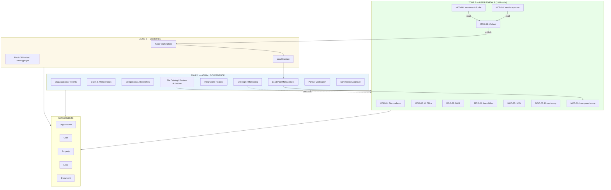

# ZONE OVERVIEW

**Version:** v1.0  
**Datum:** 2026-01-26

---

## 3-Zonen-Architektur

---

## Zone 1 — Admin/Governance

### Zweck
Zentrale Steuerung der Plattform, Tenant-Management, Integrations-Registry, Oversight.

### Funktionen

| Sektion | Route | Beschreibung |
|---------|-------|--------------|
| Dashboard | `/admin` | Plattform-KPIs |
| Organizations | `/admin/organizations` | Tenant CRUD |
| Users | `/admin/users` | User Management |
| Delegations | `/admin/delegations` | Org-to-Org Rechte |
| Tile Catalog | `/admin/tiles` | Module aktivieren |
| Integrations | `/admin/integrations` | API Registry |
| Oversight | `/admin/oversight` | Read-only Monitoring |
| Lead Pool | `/admin/leads` | Lead-Zuweisung |
| Partner Verification | `/admin/partners` | §34c/VSH Prüfung |
| Commissions | `/admin/commissions` | Provisions-Freigabe |
| Billing | `/admin/billing` | Abrechnung |
| Audit Log | `/admin/audit` | Event-Log |

### Zugriff
- Nur `platform_admin` Rolle
- Kein Tenant-Scoping

---

## Zone 2 — User Portals

### Zweck
Operative Arbeit für Tenants (Vermieter, Partner, Käufer).

### Module

| MOD | Name | Typ | Zielgruppe |
|-----|------|-----|------------|
| 01 | Stammdaten | Core | Alle |
| 02 | KI Office | Core | Alle |
| 03 | DMS | Core | Alle |
| 04 | Immobilien | Core | Vermieter |
| 05 | MSV | Freemium | Vermieter |
| 06 | Verkauf | Standard | Verkäufer |
| 07 | Finanzierung | Standard | Käufer/Verkäufer |
| 08 | Investment-Suche | Standard | Investoren |
| 09 | Vertriebspartner | Addon | Partner |
| 10 | Leadgenerierung | Addon | Partner |

### Zugriff
- `org_admin`, `internal_ops`, `sales_partner`, `renter_user`
- Strikte Tenant-Isolation via RLS

---

## Zone 3 — Websites

### Zweck
Öffentliche Präsenz, Lead-Generierung, Marktplatz.

### Komponenten

| Komponente | URL | Beschreibung |
|------------|-----|--------------|
| Kaufy Marketplace | kaufy.io | Immobilien-Marktplatz |
| Landingpages | *.kaufy.io | Marketing-Seiten |
| Lead Capture | Formulare | Lead-Erfassung → Zone 1 |

### Datenflüsse

1. **Favorites Sync**: Kaufy (anonym) → LocalStorage → Login → MOD-08 Import
2. **Lead Capture**: Formular → Zone 1 Lead Pool → MOD-10 Partner Inbox

---

## Zonen-Grenzen

### Regel 1: Zone 1 nutzt KEINE Zone-2-Module
Zone 1 ist Governance, nicht operativ.

### Regel 2: Zone 2 Module sind isoliert
Module kommunizieren über definierte Interfaces, nicht direkte DB-Zugriffe.

### Regel 3: Zone 3 ist read/lead-first
Keine Schreiboperationen auf Business-Daten, nur Lead-Erfassung.

### Regel 4: Kernobjekte sind zonen-übergreifend
Organization, User, Property, Lead, Document existieren in allen Zonen.

---

## Integration Points

### Zone 1 → Zone 2
- Tile Activation (welche Module sichtbar)
- Lead Assignment (Pool → Partner)
- Partner Verification Status
- Commission Approval

### Zone 2 → Zone 3
- Listing Publishing (MOD-06 → Kaufy)
- Investment Engine Results

### Zone 3 → Zone 1
- Lead Capture → Lead Pool
- Favorites (via Login-Sync zu Zone 2)

---

*Dieses Dokument definiert die 3-Zonen-Architektur.*
