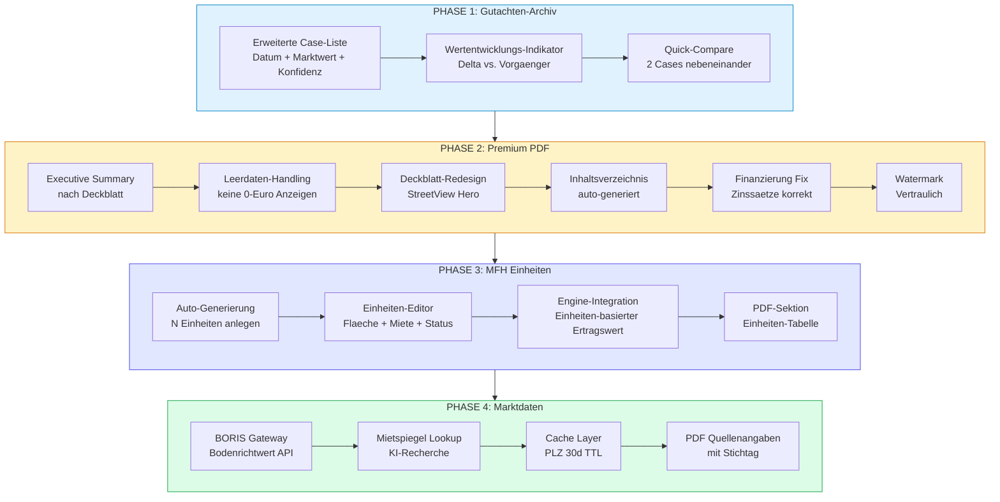
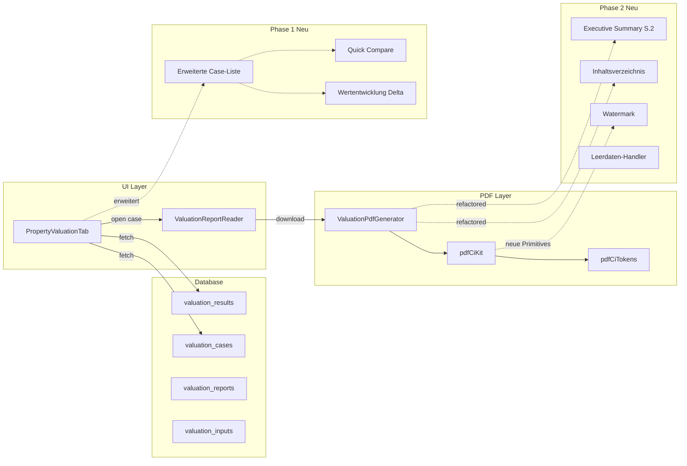
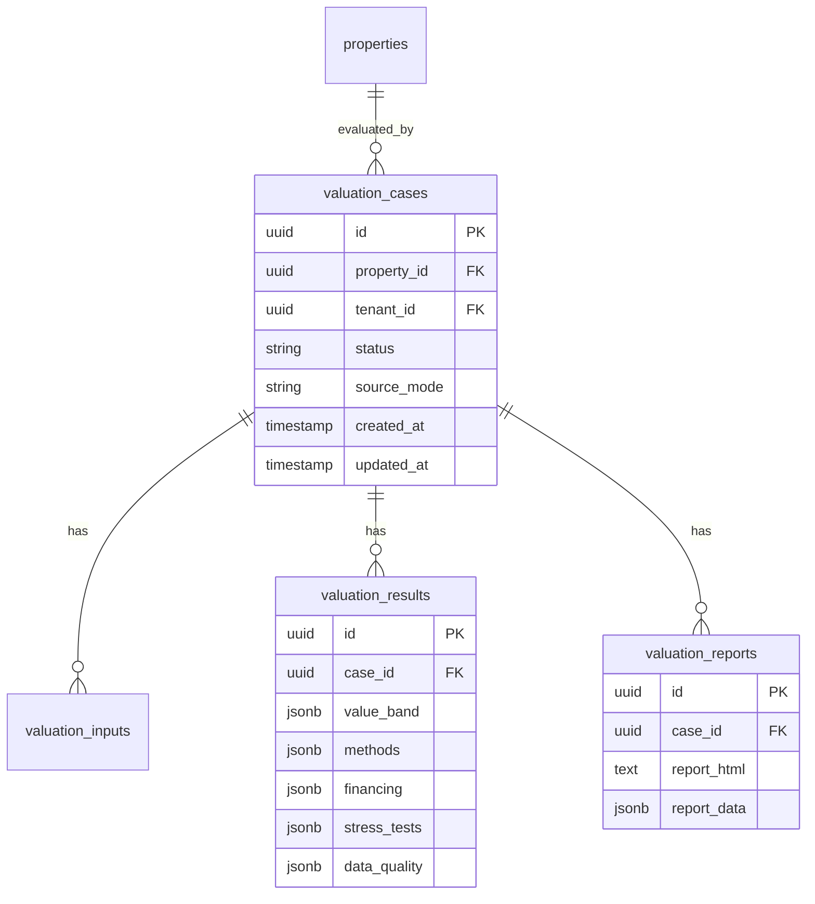

# Valuation Roadmap — Phasen-Diagramm

```mermaid
graph TB
    subgraph Phase1["PHASE 1: Gutachten-Archiv"]
        A1[Erweiterte Case-Liste<br>Datum + Marktwert + Konfidenz]
        A2[Wertentwicklungs-Indikator<br>Delta vs. Vorgaenger]
        A3[Quick-Compare<br>2 Cases nebeneinander]
        A1 --> A2 --> A3
    end

    subgraph Phase2["PHASE 2: Premium PDF"]
        B1[Executive Summary<br>nach Deckblatt]
        B2[Leerdaten-Handling<br>keine 0-Euro Anzeigen]
        B3[Deckblatt-Redesign<br>StreetView Hero]
        B4[Inhaltsverzeichnis<br>auto-generiert]
        B5[Finanzierung Fix<br>Zinssaetze korrekt]
        B6[Watermark<br>Vertraulich]
        B1 --> B2 --> B3 --> B4 --> B5 --> B6
    end

    subgraph Phase3["PHASE 3: MFH Einheiten"]
        C1[Auto-Generierung<br>N Einheiten anlegen]
        C2[Einheiten-Editor<br>Flaeche + Miete + Status]
        C3[Engine-Integration<br>Einheiten-basierter Ertragswert]
        C4[PDF-Sektion<br>Einheiten-Tabelle]
        C1 --> C2 --> C3 --> C4
    end

    subgraph Phase4["PHASE 4: Marktdaten"]
        D1[BORIS Gateway<br>Bodenrichtwert API]
        D2[Mietspiegel Lookup<br>KI-Recherche]
        D3[Cache Layer<br>PLZ 30d TTL]
        D4[PDF Quellenangaben<br>mit Stichtag]
        D1 --> D2 --> D3 --> D4
    end

    Phase1 --> Phase2
    Phase2 --> Phase3
    Phase3 --> Phase4

    style Phase1 fill:#e0f2fe,stroke:#0284c7
    style Phase2 fill:#fef3c7,stroke:#d97706
    style Phase3 fill:#e0e7ff,stroke:#4f46e5
    style Phase4 fill:#dcfce7,stroke:#16a34a
```

## Datenfluss

```mermaid
flowchart LR
    subgraph DB["Database"]
        VC[valuation_cases]
        VR[valuation_results]
        VRP[valuation_reports]
        VI[valuation_inputs]
    end

    subgraph UI["UI Layer"]
        VT[PropertyValuationTab]
        RR[ValuationReportReader]
    end

    subgraph PDF["PDF Layer"]
        PG[ValuationPdfGenerator]
        CK[pdfCiKit]
        CT[pdfCiTokens]
    end

    VT -->|fetch| VC
    VT -->|fetch| VR
    VT -->|open case| RR
    RR -->|download| PG
    PG --> CK
    CK --> CT

    subgraph Phase1New["Phase 1 Neu"]
        CL[Erweiterte Case-Liste]
        WE[Wertentwicklung Delta]
        QC[Quick Compare]
    end

    VT -.->|erweitert| CL
    CL -.-> WE
    CL -.-> QC

    subgraph Phase2New["Phase 2 Neu"]
        TOC[Inhaltsverzeichnis]
        ES2[Executive Summary S.2]
        WM[Watermark]
        LDH[Leerdaten-Handler]
    end

    PG -.->|refactored| TOC
    PG -.->|refactored| ES2
    CK -.->|neue Primitives| WM
```

## Datenbankschema (existierend)

```mermaid
erDiagram
    valuation_cases ||--o{ valuation_inputs : has
    valuation_cases ||--o{ valuation_results : has
    valuation_cases ||--o{ valuation_reports : has
    properties ||--o{ valuation_cases : evaluated_by

    valuation_cases {
        uuid id PK
        uuid property_id FK
        uuid tenant_id FK
        string status
        string source_mode
        timestamp created_at
        timestamp updated_at
    }

    valuation_results {
        uuid id PK
        uuid case_id FK
        jsonb value_band
        jsonb methods
        jsonb financing
        jsonb stress_tests
        jsonb data_quality
    }

    valuation_reports {
        uuid id PK
        uuid case_id FK
        text report_html
        jsonb report_data
    }
```
