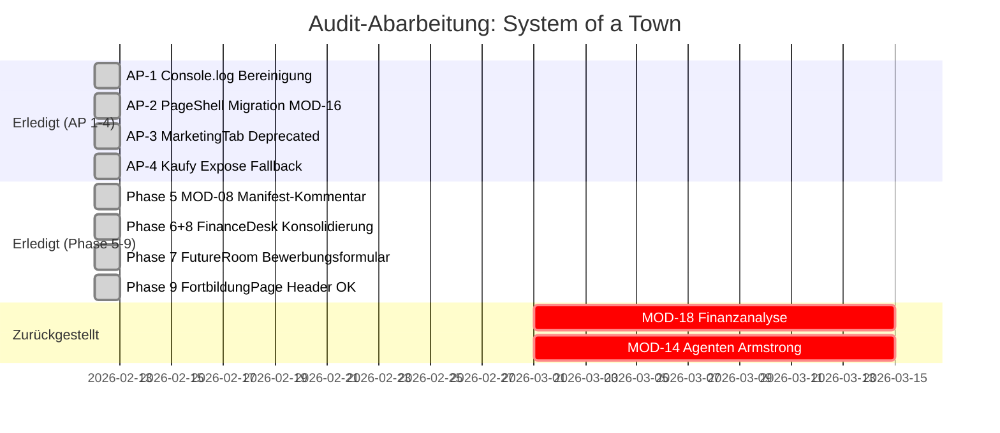

# Audit-Tracker: System of a Town Platform

> Stand: 12. Februar 2026

## Abgeschlossene Massnahmen

| Phase | Beschreibung | Status |
|-------|-------------|--------|
| AP-1 | Console.log → toast.info (6 Stellen) | ✅ Erledigt |
| AP-2 | ShopTab + BestellungenTab → PageShell/ModulePageHeader | ✅ Erledigt |
| AP-3 | MarketingTab.tsx als @deprecated markiert | ✅ Erledigt |
| AP-4 | Kaufy Expose Fallback-Ansicht verbessert | ✅ Erledigt |
| Phase 5 | MOD-08 Dynamic Routes Manifest-Kommentar | ✅ Erledigt (kein Bug, Doku ergänzt) |
| Phase 6+8 | FinanceDesk → FutureRoom Redirect, KPIs entfernt | ✅ Erledigt |
| Phase 7 | FutureRoom Karriere Bewerbungsformular | ✅ Erledigt |
| Phase 9 | FortbildungPage Header-Prüfung | ✅ Kein Problem (Header nur 1x) |

## Zurückgestellt (eigene Sprints)

| Thema | Begründung |
|-------|-----------|
| MOD-18 Finanzanalyse | Blueprint/Stub — erfordert eigene Architektur-Entscheidung |
| MOD-14 Agenten | Erfordert Armstrong-Agent-Integration |
| End-to-End Tests | Strategisch, eigener Sprint |
| Performance-Audit | 85+ Edge Functions, eigener Sprint |
| Mobile Deep-Test | Alle 21 Module auf 375px, eigener Sprint |
