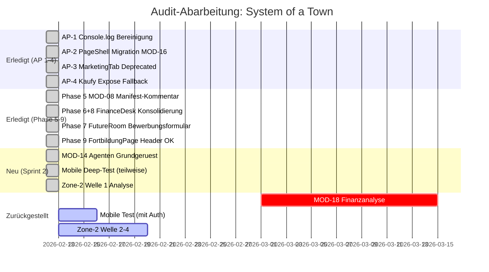

# Audit-Tracker: System of a Town Platform

> Stand: 12. Februar 2026

## Abgeschlossene Massnahmen

| Phase | Beschreibung | Status |
|-------|-------------|--------|
| AP-1 | Console.log → toast.info (6 Stellen) | ✅ Erledigt |
| AP-2 | ShopTab + BestellungenTab → PageShell/ModulePageHeader | ✅ Erledigt |
| AP-3 | MarketingTab.tsx als @deprecated markiert | ✅ Erledigt |
| AP-4 | Kaufy Expose Fallback-Ansicht verbessert | ✅ Erledigt |
| Phase 5 | MOD-08 Dynamic Routes Manifest-Kommentar | ✅ Erledigt (kein Bug, Doku ergänzt) |
| Phase 6+8 | FinanceDesk → FutureRoom Redirect, KPIs entfernt | ✅ Erledigt |
| Phase 7 | FutureRoom Karriere Bewerbungsformular | ✅ Erledigt |
| Phase 9 | FortbildungPage Header-Prüfung | ✅ Kein Problem (Header nur 1x) |
| MOD-14 | Agenten-Tab: 4 Sektionen (Katalog, Log, Kosten, Wissen) | ✅ Erledigt |

## Sprint 2 Erkenntnisse

### MOD-14 Agenten (Neu implementiert)
- 5 neue Dateien: AgentenPage.tsx + 4 Sub-Komponenten
- Aktions-Katalog: Liest alle 45+ Aktionen aus armstrongManifest.ts
- Ausführungs-Log: DB-Anbindung an armstrong_action_runs
- Kosten-Dashboard: DB-Anbindung an armstrong_billing_events
- Wissensbasis: DB-Anbindung an armstrong_knowledge_items

### Mobile Deep-Test (Teilweise)
- Login-Screen auf 375px: ✅ Layout korrekt
- Agenten-Tab auf Mobile: ✅ SubTabNav scrollbar, Tabs responsive
- Zone-3 Seiten: ⚠️ 404 im Browser-Tool (Auth-Problem, nicht Route-Problem)
- **Vollständiger Test erfordert eingeloggten User im Preview**

### Zone-2 Welle 1 Analyse (Dashboard)
- Dashboard: Architektonisch sauber, Widget-basiert mit DnD
- Keine hardcodierten Daten (Showcase Readiness ✅)
- DB-Anbindung: useTaskWidgets, useWidgetPreferences
- Custom Padding (px-2 py-3) statt PageShell (korrekt für Dashboard)

## Zurückgestellt (eigene Sprints)

| Thema | Begründung |
|-------|-----------|
| MOD-18 Finanzanalyse | Blueprint/Stub — erfordert eigene Architektur-Entscheidung |
| Mobile Test (vollständig) | Erfordert eingeloggten User für Portal-Bereiche |
| Zone-2 Welle 2-4 | 14 weitere Module zu analysieren |
| End-to-End Tests | Strategisch, eigener Sprint |
| Performance-Audit | 85+ Edge Functions, eigener Sprint |
